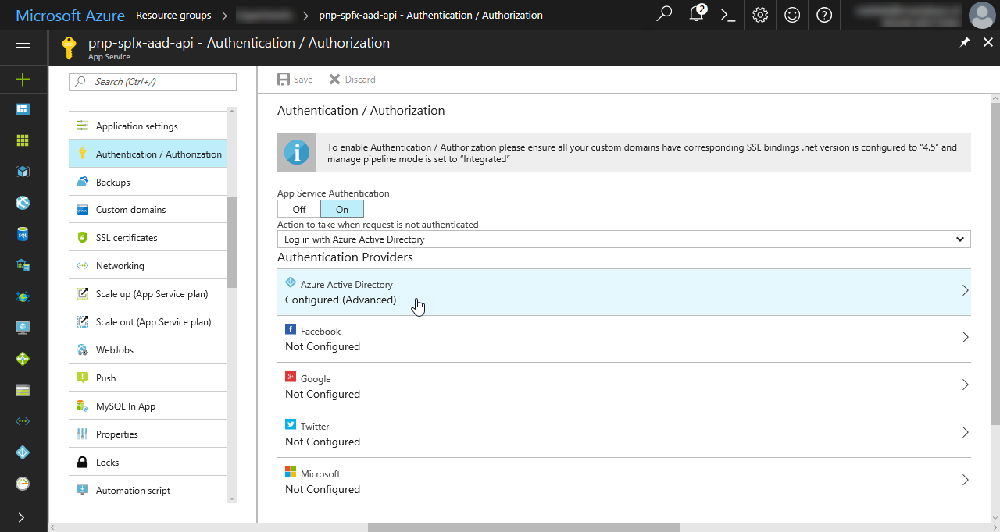
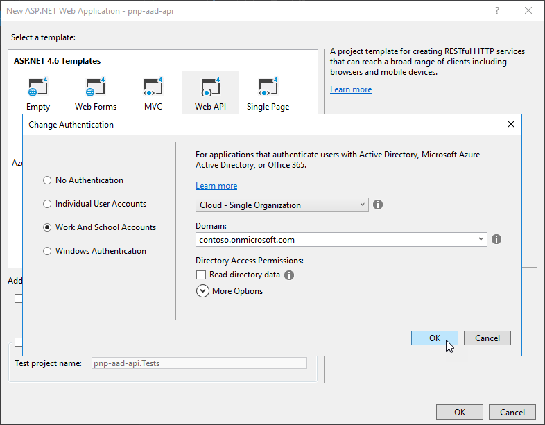

# Connect to API secured with Azure Active Directory

When building SharePoint Framework solutions, you might need to connect to your custom API to retrieve some data or to communicate with line of business applications. Securing custom APIs with Microsoft Azure Active Directory (Azure AD) offers you many benefits and can be done in a number of ways. After you have built the API, there are several ways in which you can access it. These ways vary in complexity and each have their specific considerations.

This article discusses the different approaches and describes the step-by-step process of securing and connecting to an API secured with Azure AD.

> [!IMPORTANT]
> When connecting to Azure AD-secured APIs, we recommend that you use the **MSGraphClient** and **AadHttpClient** classes, which are now generally available. For more information about the recommended models, see [Connect to Azure AD-secured APIs in SharePoint Framework solutions](../../use-aadhttpclient.md) and [Use the MSGraphClient to connect to Microsoft Graph](../../use-msgraph.md).

## Secure an API with Azure AD

If you're using Office 365, securing custom APIs using Azure AD is an architectural option that you should definitely consider. First and foremost, it allows you to secure the access to the API using existing organizational credentials that are already managed through Office 365 and Azure AD. Users with an active account can seamlessly work with applications that leverage APIs secured with Azure AD. Azure AD administrators can centrally manage access to the API, the same way they manage access to all other applications registered with Azure AD.

As the API developer, using Azure AD to secure your API frees you from managing a proprietary set of user credentials and implementing a custom security layer for your API. Additionally, Azure AD supports the OAuth protocol, which allows you to connect to the API from a range of application types varying from mobile apps to client-side solutions.

When building custom APIs, there are two main ways in which you can secure your API with Azure AD. If you host the API in Microsoft Azure App Service, you can benefit from the App Service Authentication option. If you look for more hosting flexibility for your API, such as hosting it on your own infrastructure or in Docker containers, you need to secure it in code. In such cases, the implementation depends on your programming language and framework.

In this article, when discussing this option, you will use C# and the [ASP.NET Web API](https://www.asp.net/web-api) as the framework.

### Secure the API using Azure App Service Authentication

When deploying custom APIs to Azure App Service, you can benefit from the App Service Authentication option to secure the API with Azure AD. The biggest benefit of using App Service Authentication is its simplicity: by following the configuration steps available in the [Azure portal](https://ms.portal.azure.com/), you can have the wizard set up the authentication configuration for you. If you choose the basic setup, the wizard creates a new Azure AD application in Azure AD associated with the current subscription. In the advanced configuration, you can choose which Azure AD application should be used to secure the access to the App Service hosting the API.



After App Service Authentication has been configured, users trying to access your API are prompted to sign in with their organizational account that belongs to the same Azure AD as the Azure AD application used to secure the API. After signing in, you are able to access the information about the current user through the `HttpContext.Current.User` property. When using Azure App Service Authentication, there is no additional configuration required in your application.

Azure App Service Authentication is a feature available only in Azure App Service. While this capability significantly simplifies implementing authentication in your API, it ties it to running inside Azure App Service. If you want to host the API with another cloud provider or inside a Docker container, you need to implement the authentication layer first.

### Secure the API using ASP.NET authentication

If you want to have the maximum flexibility with regards to where your API is hosted and how it is deployed, you should consider implementing the support for Azure AD authentication in ASP.NET. Visual Studio simplifies the implementation process significantly, and after completing the authentication setup wizard, your API requires users to sign in by using their organizational account.



During the configuration process, Visual Studio adds all the necessary references and settings to your ASP.NET Web API project, including registering a new Azure AD application to secure your API.

## Access an API secured with Azure AD from SharePoint Framework solutions

SharePoint Framework solutions are fully client-side and as such are incapable of securely storing secrets required to connect to secured APIs. To support secure communication with client-side solutions, Azure AD supports a number of mechanisms such as authentication cookies or the OAuth implicit flow.

Typically, when building SharePoint Framework solutions, you would use the [MSGraphClient](../../use-msgraph.md) to connect to the Microsoft Graph and the [AadHttpClient](../../use-aadhttpclient.md) to connect to an enterprise API secured with Azure AD. If you however work with a JavaScript framework that has its own service for executing web requests, such as AngularJS or jQuery or your solution is built on an older version of the SharePoint Framework, you might need to use other approaches to obtain an access token to APIs secured with Azure AD.

### Azure AD authorization flows

Office 365 uses Azure Active Directory (Azure AD) to secure its APIs, which are accessed through Microsoft Graph. Azure AD uses OAuth as the authorization protocol. When an application completes the OAuth authorization flow, it gets a temporary access token. The token provides access to specific resources on behalf of the user by using permissions granted to the application by that user.

There are different types of OAuth flows depending on the kind of application. Web applications use an OAuth flow where Azure AD redirects to the URL where the application is hosted. The redirect is an additional security measure to verify the authenticity of that application.

Client applications, such as Android and iOS apps, do not have a URL and cannot use a redirect. So they complete the OAuth flow without the redirect. Both web applications and client applications use a publicly known client ID and a privately held client secret known only to Azure AD and the application.

Client-side web applications are similar to web applications but are implemented using JavaScript and run in the context of a browser. These applications are incapable of using a client secret without revealing it to users. Therefore these applications use an authorization flow named **OAuth implicit flow** to access resources secured with Azure AD. In this flow, the contract between the application and Azure AD is established based on the publicly-known client ID and the URL where the application is hosted. This is the flow that SharePoint Framework client-side web parts must use in order to connect to resources secured with Azure AD.

### Use the AadTokenProvider to retrieve access token

When working with JavaScript libraries that have their own services for executing web requests, the recommended way to obtain an access token to an API secured with Azure AD is by using the **AadTokenProvider** available from SharePoint Framework v1.6.0. Compared to other solutions, the AadTokenProvider takes away all intricacies of implementing OAuth implicit flow in SharePoint Framework solutions, allowing you to focus on building your application.

> [!NOTE]
> It's recommended to regularly update your SharePoint Framework solutions to the most recent version of the SharePoint Framework to benefit of the improvements and new capabilities added by Microsoft.

#### Request permissions to API secured with Azure AD  

If your SharePoint Framework solution requires permissions to specific resources secured with Azure AD, such as enterprise API, you should specify these resources along with the necessary permissions in the configuration of your solution.

1. In your SharePoint Framework project, open the **config/package-solution.json** file.

2. To the **solution** property, add the **webApiPermissionRequests** property that lists all the resources and corresponding permissions that your solution needs.

  Following is an example of a SharePoint Framework solution requesting access to enterprise API:

  ```json
  {
    "$schema": "https://dev.office.com/json-schemas/spfx-build/package-solution.schema.json",
    "solution": {
      "name": "spfx-client-side-solution",
      "id": "5d16587c-5e87-44d7-b658-1148988f212a",
      "version": "1.0.0.0",
      "includeClientSideAssets": true,
      "skipFeatureDeployment": true,
      "webApiPermissionRequests": [
        {
          "resource": "Enterprise-API-Name",
          "scope": "user_impersonation"
        }
      ]
    },
    "paths": {
      "zippedPackage": "solution/spfx-api.sppkg"
    }
  }
  ```

  > [!NOTE]
  > For the value of the **resource** property, you can specify either the **displayName** or the **objectId** of the application to which you want to request permissions. Using the displayName not only is more readable but also allows you to build your solution once and reuse it across multiple tenants. While the objectId of an Azure AD application is different on each tenant, the displayName stays the same.

3. When this solution is deployed to the SharePoint app catalog, it prompts the administrator to verify the requested permissions and either grant or deny them. Read [Manage permission requests](../../use-aadhttpclient.md#manage-permission-requests) article to learn more about different ways of managing permission requests.

#### Acquire an access token

Following is how you would use the AadTokenProvider to retrieve an access token for an enterprise API secured with Azure AD and use it to perform a web request using jQuery:

```ts
// ...
import * as $ from 'jquery';
import { AadTokenProvider } from '@microsoft/sp-http';

export default class OrdersWebPart extends BaseClientSideWebPart<IOrdersWebPartProps> {
  // ...

  public render(): void {
    this.context.statusRenderer.displayLoadingIndicator(this.domElement, 'orders');

    this.context.aadTokenProviderFactory
      .getTokenProvider()
      .then((tokenProvider: AadTokenProvider): Promise<string> => {
        // retrieve access token for the enterprise API secured with Azure AD
        return tokenProvider.getToken('09c4b84d-13c4-4451-9350-3baedf70aab4');
      })
      .then((accessToken: string): void => {
        // call the enterprise API using jQuery passing the access token
        $.get({
          url: 'https://contoso.azurewebsites.net/api/Orders',
          headers: {
            authorization: `Bearer ${accessToken}`,
            accept: 'application/json'
          }
        })
        .done((orders: any): void => {
          this.context.statusRenderer.clearLoadingIndicator(this.domElement);
            this.domElement.innerHTML = `
            <div class="${ styles.orders}">
              <div class="${ styles.container}">
                <div class="${ styles.row}">
                  <div class="${ styles.column}">
                    <span class="${ styles.title}">Orders</span>
                    <p class="${ styles.description}">
                      <ul>
                        ${orders.map(o => `<li>${o.Rep} $${o.Total}</li>`).join('')}
                      </ul>
                    </p>
                    <a href="https://aka.ms/spfx" class="${ styles.button}">
                      <span class="${ styles.label}">Learn more</span>
                    </a>
                  </div>
                </div>
              </div>
            </div>`;
        });
      });
  }

  // ...
}
```

You start, by retrieving an instance of the AadTokenProvider using the `aadTokenProviderFactory`. Next, you use the AadTokenProvider to retrieve the access token for your API secured with Azure AD. Once you have obtained the access token, you execute the AJAX request to the enterprise API including the access token in the request headers.

### Use ADAL JS to handle authorization and retrieve access token

If you're using an older version of the SharePoint Framework that v1.6.0 and can't use the AadTokenProvider, you can use the [ADAL JS](https://github.com/AzureAD/azure-activedirectory-library-for-js) library to handle the OAuth implicit flow and retrieve the access token for the specific API secured with Azure AD. For applications built using AngularJS, ADAL JS offers an HTTP request interceptor that automatically adds required access tokens to headers of outgoing web requests. By using this requestor, developers don't need to modify web requests to APIs secured with Azure AD and can focus on building the application instead.

#### Limitations when using ADAL JS with client-side web parts

The ADAL JS library significantly simplifies implementing the OAuth flow for Azure AD in client-side web applications. But it has a number of limitations when used with SharePoint Framework client-side web parts. These limitations are due to the fact that ADAL JS is designed to be used by client-side web applications that own the whole page and do not share the page with other applications.

##### Shared storage

Depending on how you configured the ADAL JS library in your project, it stores its data either in the browser's local storage or in the session storage. Either way, the information stored by ADAL JS is accessible to any component on the same page. For example, if one web part retrieves an access token for Microsoft Graph, any other web part on the same page can reuse that token and call Microsoft Graph.

##### ADAL JS as a singleton

ADAL JS is designed to work as a singleton service registered in the global scope of the page. When processing OAuth flow callbacks in IFrames, ADAL JS code uses the registered singleton reference from the main window to resolve the token flow. Because each web part is registered with a different Azure AD application, reusing the same instance of ADAL JS leads to undesirable results where every web part uses the same configuration as the one registered by the first web part loaded on the page.

##### Resource-based storage

By default, the ADAL JS library stores information such as the current access token or its expiration time in a set of keys associated with the particular resource, for example Microsoft Graph or SharePoint. If there are multiple components on one page accessing the same resource with different permissions, the first retrieved token is served by ADAL JS to all components. If different components require access to the same resource, they might fail. To illustrate this limitation, consider the following example.

Imagine that there are two web parts on the page: one that lists upcoming meetings, and one that creates a new meeting. To get upcoming meetings, the upcoming meetings web part uses a Microsoft Graph access token with permissions to read users' calendars. The web part that creates new meetings, on the other hand, requires a Microsoft Graph access token with permissions to write to users' calendars.

If the upcoming meetings web part loads first, ADAL JS retrieves its token with only the read permission. The same token is then served by ADAL JS to the web part creating new meetings. As you can see, when the web part attempts to create a new meeting, the web part fails with an access denied error. Because of the resource-based storage, ADAL JS wouldn't retrieve a new token for Microsoft Graph until the previously retrieved token expired.

##### Processing authorization callbacks

OAuth implicit flow is based on redirects between Azure AD and the application participating in the flow. When the authentication process starts, the application redirects you to the Azure AD sign-in page. After the authentication completes, Azure AD redirects you back to the application, and sends the identity token in the URL hash for the application to process. From the perspective of a web part placed on a SharePoint page, this behavior has two drawbacks.

Even though you are signed in to SharePoint, you need to separately authenticate with Azure AD in order for your web part to be able to access resources secured with Azure AD. The web part is a small part of the overall page, but to complete the authentication process, you need to leave the whole page, which is a poor user experience.

After the authentication completes, Azure AD redirects you back to your application. In the URL hash, it includes the identity token that your application needs to process. Unfortunately, because the identity token doesn't contain any information about its origin, if you had multiple web parts on one page, all of them would try to process the identity token from the URL.

#### Considerations when using ADAL JS to communicate with APIs secured with Azure AD

Aside the limitations, there are some considerations that you should take into account before implementing ADAL JS in your SharePoint Framework solution yourself.

##### ADAL JS is meant to be used for single-page applications

ADAL JS has been designed to be used with single-page applications. As such, by default it doesn't work correctly when used with SharePoint Framework solutions. By applying a patch however, it can be successfully used in SharePoint Framework projects.

##### Handle all possible authentication exceptions yourself

When using ADAL JS and OAuth to access APIs secured with Azure AD, the authentication flow is facilitated by Azure. Any errors are handled by the Azure sign-in page. After the user has signed-in with her organizational account, the application tries to retrieve a valid access token. All errors that occur at this stage have to be explicitly handled by the developer of the application because retrieving access tokens is non-interactive and doesn't present any UI to the user.

##### Register every client-side application in Azure AD

Every client-side application that wants to use ADAL JS needs to be registered as an Azure AD application. A part of the registration information is the URL where the application is located. Because the application is fully client-side and is not capable of securely storing a secret, the URL is a part of the contract between the application and Azure AD to establish security. This requirement is problematic for SharePoint Framework solutions because developers cannot simply know upfront all URLs where a particular web part will be used. Additionally, at this moment, Azure AD supports specifying up to 10 reply URLs, which might not be sufficient in some scenarios.

##### Implement authorization flow in each web part

Before a client-side application can retrieve an access token to a specific resource, it needs to authenticate the user to obtain the ID token which can then be exchanged for an access token. Even though SharePoint Framework solutions are hosted in SharePoint, where users are already signed in using their organizational accounts, the authentication information for the current user isn't available to SharePoint Framework solutions. Instead, each solution must explicitly request the user to sign in. This can be done either by redirecting the user to the Azure sign-in page or by showing a pop-up window with the sign-in page. The latter is less intrusive in the case of a web part, which is one of the many elements on a page. If there are multiple SharePoint Framework client-side web parts on the page, each of them manages its state separately and requires the user to explicitly sign in to that particular web part.

##### Configure Internet Explorer security zones

Retrieving access tokens required to communicate with APIs secured with Azure AD is facilitated by hidden iframes that handle redirects to Azure AD endpoints. There is a known limitation in Microsoft Internet Explorer where obtaining access tokens in OAuth implicit flow fails, if the Azure AD sign-in endpoints and the SharePoint Online URL are not in the same security zone. If your organization is using Internet Explorer, ensure that the Azure AD endpoint and SharePoint Online URLs are configured in the same security zone. To maintain consistency, some organizations choose to push these settings to end-users using group policies.

##### Add access token to all AJAX requests to APIs secured with Azure AD

APIs secured with Azure AD cannot be accessed anonymously. Instead they require a valid credential to be presented by the application calling them. When using the OAuth implicit flow with client-side applications, this credential is the bearer access token obtained using ADAL JS. If you have built your SharePoint Framework solution using AngularJS, ADAL JS automatically ensures that you have a valid access token for the particular resource, and adds it to all outgoing requests executed by using the AngularJS `$http` service. When using other JavaScript libraries, you have to obtain a valid access token, and if necessary refresh it, and attach it to the outgoing web requests yourself.

#### Use ADAL JS with client-side web parts

You can overcome the limitations in ADAL JS to implement OAuth successfully in your SharePoint Framework client-side web part.

> [!IMPORTANT]
> The following guidance is based on ADAL JS v1.0.12. When adding ADAL JS to your SharePoint Framework projects, ensure that you're installing ADAL JS v1.0.12, or the guidance mentioned in this article will not work as expected.

##### Load ADAL JS in your web part

Web parts are built using TypeScript and distributed as AMD modules. Their modular architecture allows you to isolate the different resources used by the web part. ADAL JS is designed to register itself in the global scope, but you can load it in a web part by using the following code:

```typescript
import * as AuthenticationContext from 'adal-angular';
```

This statement imports the `AuthenticationContext` class that exposes the ADAL JS functionality for use in web parts. Despite the name of the module, the `AuthenticationContext` class works with every JavaScript library.

##### Make ADAL JS suitable for use with SharePoint Framework web parts

The current ADAL JS functionality is unsuitable for use in web parts. Use the following patch to make ADAL JS work in your web part.

**WebPartAuthenticationContext.js**

```js
const AuthenticationContext = require('adal-angular');

AuthenticationContext.prototype._getItemSuper = AuthenticationContext.prototype._getItem;
AuthenticationContext.prototype._saveItemSuper = AuthenticationContext.prototype._saveItem;
AuthenticationContext.prototype.handleWindowCallbackSuper = AuthenticationContext.prototype.handleWindowCallback;
AuthenticationContext.prototype._renewTokenSuper = AuthenticationContext.prototype._renewToken;
AuthenticationContext.prototype.getRequestInfoSuper = AuthenticationContext.prototype.getRequestInfo;
AuthenticationContext.prototype._addAdalFrameSuper = AuthenticationContext.prototype._addAdalFrame;

AuthenticationContext.prototype._getItem = function (key) {
  if (this.config.webPartId) {
    key = this.config.webPartId + '_' + key;
  }

  return this._getItemSuper(key);
};

AuthenticationContext.prototype._saveItem = function (key, object) {
  if (this.config.webPartId) {
    key = this.config.webPartId + '_' + key;
  }

  return this._saveItemSuper(key, object);
};

AuthenticationContext.prototype.handleWindowCallback = function (hash) {
  if (hash == null) {
    hash = window.location.hash;
  }

  if (!this.isCallback(hash)) {
    return;
  }

  var requestInfo = this.getRequestInfo(hash);
  if (requestInfo.requestType === this.REQUEST_TYPE.LOGIN) {
    return this.handleWindowCallbackSuper(hash);
  }

  var resource = this._getResourceFromState(requestInfo.stateResponse);
  if (!resource || resource.length === 0) {
    return;
  }

  if (this._getItem(this.CONSTANTS.STORAGE.RENEW_STATUS + resource) === this.CONSTANTS.TOKEN_RENEW_STATUS_IN_PROGRESS) {
    return this.handleWindowCallbackSuper(hash);
  }
}

AuthenticationContext.prototype._renewToken = function (resource, callback) {
  this._renewTokenSuper(resource, callback);
  var _renewStates = this._getItem('renewStates');
  if (_renewStates) {
    _renewStates = _renewStates.split(',');
  }
  else {
    _renewStates = [];
  }
  _renewStates.push(this.config.state);
  this._saveItem('renewStates', _renewStates);
}

AuthenticationContext.prototype.getRequestInfo = function (hash) {
  var requestInfo = this.getRequestInfoSuper(hash);
  var _renewStates = this._getItem('renewStates');
  if (!_renewStates) {
    return requestInfo;
  }

  _renewStates = _renewStates.split(';');
  for (var i = 0; i < _renewStates.length; i++) {
    if (_renewStates[i] === requestInfo.stateResponse) {
      requestInfo.requestType = this.REQUEST_TYPE.RENEW_TOKEN;
      requestInfo.stateMatch = true;
      break;
    }
  }

  return requestInfo;
}

AuthenticationContext.prototype._addAdalFrame = function (iframeId) {
  var adalFrame = this._addAdalFrameSuper(iframeId);
  adalFrame.style.width = adalFrame.style.height = '106px';
  return adalFrame;
}

window.AuthenticationContext = function() {
  return undefined;
}
```

The patch applies the following changes to ADAL JS:

- All information is stored in a key specific to the web part (see the override of the `_getItem` and `_saveItem` functions).
- Callbacks are processed only by web parts that initiated them (see the override of the `handleWindowCallback` function).
- When verifying data from callbacks, the instance of the `AuthenticationContext` class of the specific web part is used instead of the globally registered singleton (see `_renewToken`, `getRequestInfo` and the empty registration of the `window.AuthenticationContext` function).

##### Use the ADAL JS patch in SharePoint Framework web parts

For ADAL JS to work correctly in SharePoint Framework web parts, you have to configure it in a specific way.

1. Define a custom interface that extends the standard ADAL JS `Config` interface to expose additional properties on the configuration object.

  ```ts
  export interface IAdalConfig extends adal.Config {
    popUp?: boolean;
    callback?: (error: any, token: string) => void;
    webPartId?: string;
  }
  ```

  The `popUp` property and the `callback` function are both already implemented in ADAL JS but are not exposed in the TypeScript typings of the standard `Config` interface. You need them in order to allow users to sign in to your web parts by using a pop-up window instead of redirecting them to the Azure AD sign-in page.

2. Load the ADAL JS patch, the custom configuration interface, and your configuration object into the main component of your web part.

  ```ts
  import * as AuthenticationContext from 'adal-angular';
  import adalConfig from '../AdalConfig';
  import { IAdalConfig } from '../../IAdalConfig';
  import '../../WebPartAuthenticationContext';
  ```

3. In the constructor of your component, extend the ADAL JS configuration with additional properties and use it to create a new instance of the `AuthenticationContext` class.

  ```ts
  export default class UpcomingMeetings extends React.Component<IUpcomingMeetingsProps, IUpcomingMeetingsState> {
    private authCtx: adal.AuthenticationContext;

    constructor(props: IUpcomingMeetingsProps, state: IUpcomingMeetingsState) {
      super(props);

      this.state = {
        loading: false,
        error: null,
        upcomingMeetings: [],
        signedIn: false
      };

      const config: IAdalConfig = adalConfig;
      config.webPartId = this.props.webPartId;
      config.popUp = true;
      config.callback = (error: any, token: string): void => {
        this.setState((previousState: IUpcomingMeetingsState, currentProps: IUpcomingMeetingsProps): IUpcomingMeetingsState => {
          previousState.error = error;
          previousState.signedIn = !(!this.authCtx.getCachedUser());
          return previousState;
        });
      };

      this.authCtx = new AuthenticationContext(config);
      AuthenticationContext.prototype._singletonInstance = undefined;
    }
  }
  ```

The code first retrieves the standard ADAL JS configuration object and casts it to the type of the newly defined configuration interface.

It then passes the ID of the web part instance so that all ADAL JS values can be stored in a way that they won't collide with other web parts on the page.

Next, it enables the pop-up-based authentication and defines a callback function that runs when authentication completes to update the component.

Finally, it creates a new instance of the `AuthenticationContext` class and resets the `_singletonInstance` set in the constructor of the `AuthenticationContext` class. This is required in order to allow every web part to use its own version of the ADAL JS authentication context.

## Considerations when using OAuth implicit flow in client-side web parts

Before you build SharePoint Framework client-side web parts that communicate with resources secured by Azure AD, there are some constraints that you should consider. The following information helps you determine when OAuth authorization in web parts is the right choice for your solution and organization.

### SharePoint Framework web parts are highly trusted

Unlike SharePoint Add-ins, web parts run with the same permissions as the current user. Whatever the user can do, the web part can do as well. This is why web parts can be installed and deployed only by tenant administrators. The tenant administrator should verify that web parts they are deploying come from a trusted source and were approved for use in the tenant.

Web parts are a part of the page and, unlike SharePoint Add-ins, share DOM and resources with other elements on the page. Access tokens that grant access to resources secured with Azure AD, are retrieved through a callback to the same page where the web part is located. That callback can be processed by any element on the page. Also, after access tokens are processed from callbacks, they are stored in the browser's local storage or session storage from where they can be retrieved by any component on the page. A malicious web part could read the token and either expose the token or the data it retrieved using that token to an external service.

### URL is a part of the OAuth implicit flow contract

> [!IMPORTANT]
> Information in this section doesn't apply to you if you use the AadTokenProvider as it handles the OAuth implicit flow for you

Client-side applications are incapable of storing a client secret without revealing it to users. To verify the authenticity of the particular application, the URL where the application is hosted is used as a part of the trust contract between Azure AD and the application. The consequences of this are that the URL of every page with web parts using OAuth implicit flow must be registered with Azure AD. If a page is not registered, the OAuth flow fails, and the web part is denied access to the secured resource.

This necessary security measure is a significant limitation for organizations that allow users to add web parts to pages. We recommend that you limit the number of locations where web parts using OAuth implicit flow are used. Use a few well known locations such as the home page or specific landing pages, and have these locations registered with Azure AD.

### Internet Explorer security zones

Internet Explorer uses security zones to apply security policies to websites you visit. Websites assigned to different security zones run isolated and cannot cooperate. When using OAuth implicit flow in SharePoint Framework client-side web parts, the page with web parts that use OAuth and the Azure AD sign-in page (located at https://login.microsoftonline.com) must be in the same security zone. Without such configuration, the authentication process fails, and web parts won't be able to communicate with Azure AD-secured resources.

### User must sign in regularly

When using regular OAuth flow, web applications and client applications get a short-lived access token (60 minutes by default) and a refresh token that is valid for a longer period of time. When the access token expires, the refresh token is used to get a new access token. This approach reduces how often users need to sign in to Azure AD.

Because client-side applications are incapable of securely storing secrets, and disclosing a refresh token is a serious security threat, they only receive the access token as part of the OAuth implicit flow. After that token expires, the application must start a new OAuth flow, which could require the user to sign in again.

## See also

- [Connect to Azure AD-secured APIs in SharePoint Framework solutions](../../use-aadhttpclient.md)
- [Use the MSGraphClient to connect to Microsoft Graph](../../use-msgraph.md)
- [Call custom APIs secured with Azure Active Directory without ADAL JS (code sample)](https://github.com/SharePoint/sp-dev-fx-webparts/tree/master/samples/aad-api-spo-cookie)
- [Authentication scenarios for Azure AD](https://docs.microsoft.com/en-us/azure/active-directory/develop/active-directory-authentication-scenarios)
