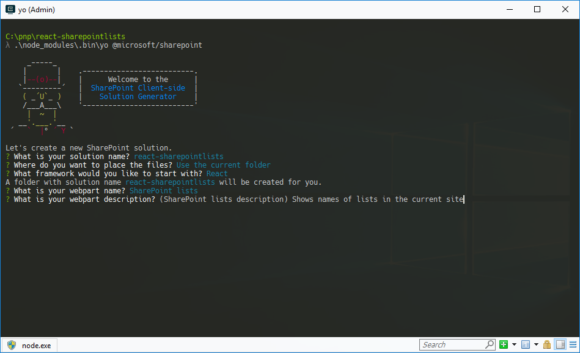
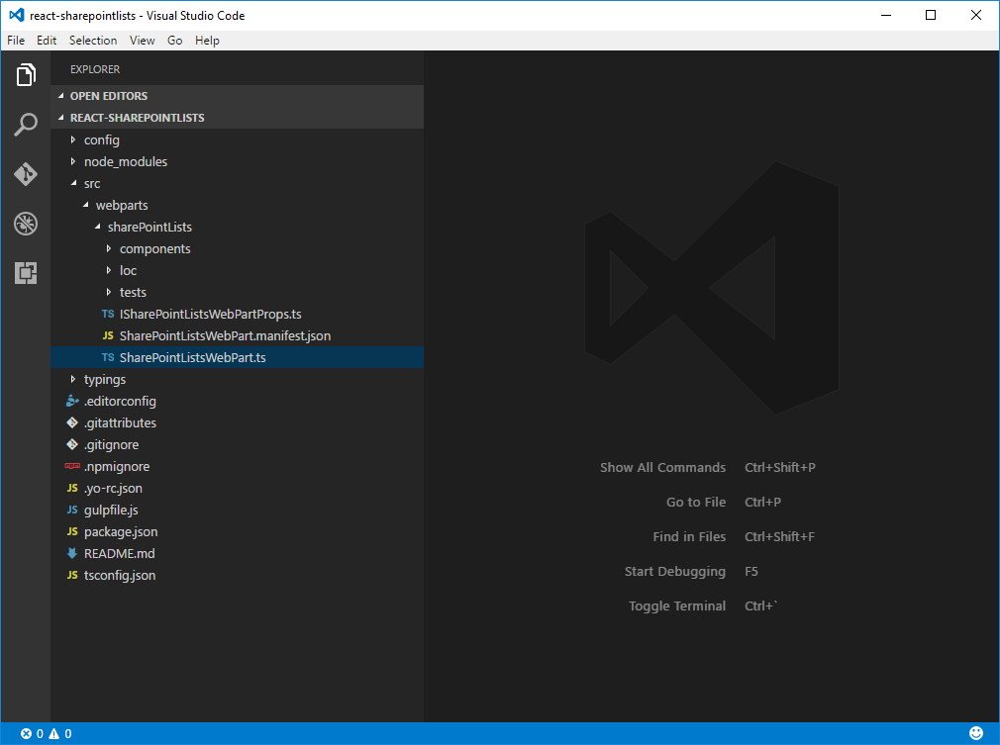
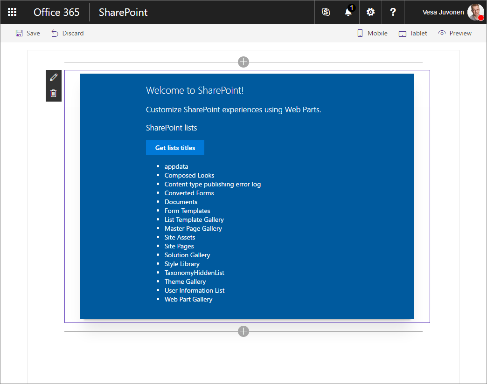

# Connect to SharePoint using the JavaScript Object Model (JSOM)

In the past, when building SharePoint customizations, you might have used the SharePoint JavaScript Object Model (JSOM) to communicate with SharePoint. This is no longer the recommended path (see [Considerations](#considerations) later in this article), but there are still valid use cases such as code migration. 

To use SharePoint JSOM in your SharePoint Framework component, you must first reference it. In the past it was already available on the page for you to use. In the SharePoint Framework, it has to be explicitly loaded.

There are two ways to reference SharePoint JSOM in the SharePoint Framework: 
- **Declarative** - through configuration
- **Imperative** - through code

Each of these approaches has advantages and disadvantages, and it's important for you to understand each of them.

> [!NOTE] 
> Before following the steps in this article, be sure to [set up your SharePoint Framework development environment](../../set-up-your-development-environment.md).

## Create a new project

1. From the console, create a new folder for your project:

  ```sh
  md react-sharepointlists
  ```

2. Go to the project folder:

  ```sh
  cd react-sharepointlists
  ```

3. In the project folder, run the SharePoint Framework Yeoman generator to scaffold a new SharePoint Framework project:

  ```sh
  yo @microsoft/sharepoint
  ```

4. When prompted, enter the following values:

  - **react-sharepointlists** as your solution name.
  - Select **Webpart** as the client-side component type to be created.
  - **Use the current folder** for the location to place the files.
  - **React** as the starting framework to build the web part.
  - **SharePoint lists** as your web part name.
  - **Shows names of lists in the current site** as your web part description.

  

5. After the scaffolding completes, lock down the version of the project dependencies by running the following command:

  ```sh
  npm shrinkwrap
  ```

6. Open your project folder in your code editor. This article uses Visual Studio Code in the steps and screenshots, but you can use any editor you prefer.

  

7. To open the directory in Visual Studio Code, from the console enter:

  ```sh
  code .
  ```


## Reference JSOM declaratively

### Register the SharePoint JSOM API as external scripts

When referencing JSOM declaratively, the first step is to register the SharePoint JSOM API as external scripts within your SharePoint Framework project.

1. In your code editor, open the **./config/config.json** file, and add the following to the **externals** section:

  ```json
  {
    // ...
    "externals": {
      "sp-init": {
        "path": "https://contoso.sharepoint.com/_layouts/15/init.js",
        "globalName": "$_global_init"
      },
      "microsoft-ajax": {
        "path": "https://contoso.sharepoint.com/_layouts/15/MicrosoftAjax.js",
        "globalName": "Sys",
        "globalDependencies": [
          "sp-init"
        ]
      },
      "sp-runtime": {
        "path": "https://contoso.sharepoint.com/_layouts/15/SP.Runtime.js",
        "globalName": "SP",
        "globalDependencies": [
          "microsoft-ajax"
        ]
      },
      "sharepoint": {
        "path": "https://contoso.sharepoint.com/_layouts/15/SP.js",
        "globalName": "SP",
        "globalDependencies": [
          "sp-runtime"
        ]
      }
    }
    // ...
  }
  ```

  <br/>

  Each of the entries points to different script files that together allow you to use SharePoint JSOM in your SPFx component. All of these scripts are distributed as non-module scripts. This is why each registration entry requires a URL, (specified using the `path` property) and the name used by the script (provided in the `globalName` property). To ensure that these scripts load in the right order, the dependencies between these scripts are specified by using the `globalDependencies` property.

  Additional scripts may need to be added depending on the JSOM functionality that you are using (e.g. sp.taxonomy.js).

### Install TypeScript typings for SharePoint JSOM

The next step is to install and configure TypeScript typings for SharePoint JSOM, which allows you to benefit from TypeScript's type safety features when working with SharePoint JSOM.

1. From the console, execute the following command within your project directory:

  ```sh
  npm install @types/microsoft-ajax @types/sharepoint --save-dev
  ```

  SharePoint JSOM is not distributed as a module, so you cannot import it directly in your code. Instead, you need to register its TypeScript typings globally. 

2. In the code editor, open the **./tsconfig.json** file, and in the `types` property, right after the **webpack-env** entry, add references to **microsoft-ajax** and **sharepoint**:

  ```json
  {
    "compilerOptions": {
      // ...
      "types": [
        "es6-promise",
        "es6-collections",
        "webpack-env",
        "microsoft-ajax",
        "sharepoint"
      ]
    }
  }
  ```

### Reference SharePoint JSOM scripts in a React component

To load the SharePoint JSOM scripts in your SPFx component, you have to reference them in the component's code. In this example, you add the references in a React component where JSOM is used to communicate with SharePoint.

In the code editor, open the **./src/webparts/sharePointLists/components/SharePointLists.tsx** file. After the last `import` statement, add the following code:

```typescript
  require('sp-init');
  require('microsoft-ajax');
  require('sp-runtime');
  require('sharepoint');
```

These names correspond to the external references that you added previously, so SharePoint Framework loads these scripts from the specified URLs.

To demonstrate using SharePoint JSOM for communicating with SharePoint, you need to retrieve and render the titles of all SharePoint lists located in the current site.

### Add _siteUrl_ to the React component's properties

To connect to SharePoint, the React component must know the URL of the current site. That URL is available in the parent web part and can be passed into the component through its properties.

1. In the code editor, open the **./src/webparts/sharePointLists/components/ISharePointListsProps.ts** file, and  add the `siteUrl` property to the `ISharePointListsProps` interface:

  ```typescript
  export interface ISharePointListsProps {
    description: string;
    siteUrl: string;
  }
  ```

2. To pass the URL of the current site into the component, open the **./src/webparts/sharePointLists/SharePointListsWebPart.ts** file in the code editor, and change the `render` method to:

  ```typescript
  export default class SharePointListsWebPart extends BaseClientSideWebPart<ISharePointListsWebPartProps> {
    public render(): void {
      const element: React.ReactElement<ISharePointListsProps > = React.createElement(
        SharePointLists,
        {
          description: this.properties.description,
          siteUrl: this.context.pageContext.web.absoluteUrl
        }
      );

      ReactDom.render(element, this.domElement);
    }

    // ...
  }
  ```

### Define the React component's state

The React component loads data from SharePoint and renders it to the user. The current state of the React component is modeled by using a state interface that we add.

In the code editor, in the **./src/webparts/sharePointLists/components** folder, create a new file named **ISharePointListsState.ts** and paste in the following contents:

```typescript
export interface ISharePointListsState {
    listTitles: string[];
    loadingLists: boolean;
    error: string;
}
```

### Add state to the React component

Having defined the interface describing the shape of the component's state, the next step is to have the React component use that state interface.

1. In the code editor, open the **./src/webparts/sharePointLists/components/SharePointLists.tsx** file. Under the existing `import` statements, add:

  ```typescript
  import { ISharePointListsState } from './ISharePointListsState';
  ```

2. Change the signature of the `SharePointLists` class to:

  ```typescript
  export default class SharePointLists extends React.Component<ISharePointListsProps, ISharePointListsState> {
    // ...
  }
  ```

3. In the `SharePointLists` class, add a constructor with the default state value:

  ```typescript
  export default class SharePointLists extends React.Component<ISharePointListsProps, ISharePointListsState> {
    constructor(props?: ISharePointListsProps, context?: any) {
      super();

      this.state = {
        listTitles: [],
        loadingLists: false,
        error: null
      };
    }

    // ...
  }
  ```

### Load information about SharePoint lists from the current site using JSOM

The sample client-side web part used in this article loads information about SharePoint lists in the current site after selecting a button.

  

1. In the code editor, open the **./src/webparts/sharePointLists/components/SharePointLists.tsx** file. In the `SharePointLists` class, add a new method named `getListsTitles`:

  ```typescript
  export default class SharePointLists extends React.Component<ISharePointListsProps, ISharePointListsState> {
    constructor(props?: ISharePointListsProps, context?: any) {
      super();

      this.state = {
        listTitles: [],
        loadingLists: false,
        error: null
      };

      this.getListsTitles = this.getListsTitles.bind(this);
    }

    // ...

    private getListsTitles(): void {
    }
  }
  ```

2. To ensure the correct scoping of the method, we bind it to the web part in the constructor. In the `getListsTitles` method, use SharePoint JSOM to load the titles of SharePoint lists in the current site:

  ```typescript
  export default class SharePointLists extends React.Component<ISharePointListsProps, ISharePointListsState> {
    // ...
    private getListsTitles(): void {
      this.setState({
        loadingLists: true,
        listTitles: [],
        error: null
      });

      const context: SP.ClientContext = new SP.ClientContext(this.props.siteUrl);
      const lists: SP.ListCollection = context.get_web().get_lists();
      context.load(lists, 'Include(Title)');
      context.executeQueryAsync((sender: any, args: SP.ClientRequestSucceededEventArgs): void => {
        const listEnumerator: IEnumerator<SP.List> = lists.getEnumerator();

        const titles: string[] = [];
        while (listEnumerator.moveNext()) {
          const list: SP.List = listEnumerator.get_current();
          titles.push(list.get_title());
        }

        this.setState((prevState: ISharePointListsState, props: ISharePointListsProps): ISharePointListsState => {
          prevState.listTitles = titles;
          prevState.loadingLists = false;
          return prevState;
        });
      }, (sender: any, args: SP.ClientRequestFailedEventArgs): void => {
        this.setState({
          loadingLists: false,
          listTitles: [],
          error: args.get_message()
        });
      });
    }
  }
  ```

  <br/>

We start by resetting the component's state to communicate to the user that the component is loading information from SharePoint. Using the URL of the current site passed to the component through its properties, we instantiate a new SharePoint context. Using SharePoint JSOM, we load lists from the current site. To optimize the request for performance, we specify that only the `Title` property should be loaded. 

Next, we execute the query by calling the `executeQueryAsync` method and passing two callback functions. After the query is completed, we enumerate through the collection of retrieved lists, store their titles in an array, and update the component's state.

### Render the titles of SharePoint lists in the current site

Having loaded the titles of SharePoint lists in the current site, the final step is to render them in the component. 

1. In the code editor, open the **./src/webparts/sharePointLists/components/SharePointLists.tsx** file, and update the `render` method:

  ```tsx
  export default class SharePointLists extends React.Component<ISharePointListsProps, ISharePointListsState> {
    // ...
    public render(): React.ReactElement<ISharePointListsProps> {
      const titles: JSX.Element[] = this.state.listTitles.map((listTitle: string, index: number, listTitles: string[]): JSX.Element => {
        return <li key={index}>{listTitle}</li>;
      });

      return (
        <div className={styles.sharePointLists}>
          <div className={styles.container}>
            <div className={`ms-Grid-row ms-bgColor-themeDark ms-fontColor-white ${styles.row}`}>
              <div className="ms-Grid-col ms-u-lg10 ms-u-xl8 ms-u-xlPush2 ms-u-lgPush1">
                <span className="ms-font-xl ms-fontColor-white">Welcome to SharePoint!</span>
                <p className="ms-font-l ms-fontColor-white">Customize SharePoint experiences using Web Parts.</p>
                <p className="ms-font-l ms-fontColor-white">{escape(this.props.description)}</p>
                <a className={styles.button} onClick={this.getListsTitles} role="button">
                  <span className={styles.label}>Get lists titles</span>
                </a><br />
                {this.state.loadingLists &&
                  <span>Loading lists...</span>}
                {this.state.error &&
                  <span>An error has occurred while loading lists: {this.state.error}</span>}
                {this.state.error === null && titles &&
                  <ul>
                    {titles}
                  </ul>}
              </div>
            </div>
          </div>
        </div>
      );
    }
    // ...
  }
  ```

2. At this point, you should be able to add your web part to the page and see the titles of SharePoint lists in the current site. To verify that the project is working correctly, run the following command from the console:

  ```sh
  gulp serve --nobrowser
  ```

3. As you are using SharePoint JSOM to communicate with SharePoint, you have to test the web part by using the hosted version of the SharePoint Workbench (which is why the `--nobrowser` parameter is specified to prevent the automatic loading of the local Workbench).

  

Referencing SharePoint JSOM scripts declaratively as external scripts is convenient and allows you to keep your code clean. One disadvantage, however, is that it requires specifying absolute URLs to the location from which SharePoint JSOM scripts should be loaded. If you're using separate SharePoint tenants for development, testing, and production, it requires some additional work to change these URLs for the different environments accordingly. In such cases, you may consider referencing JSOM imperatively by using the [SPComponentLoader](https://docs.microsoft.com/en-us/javascript/api/sp-application-base) to load the scripts in the SPFx component's code.

## Reference JSOM imperatively

Another way to load JavaScript libraries in SharePoint Framework projects is to use the `SPComponentLoader`, a utility class provided with the SharePoint Framework designed to help you load scripts and other resources in your components. One benefit of using the `SPComponentLoader` over loading scripts declaratively is that it allows you to use server-relative URLs, which is more convenient when using different SharePoint tenants for the different stages of your development process.

For this portion of the tutorial, we'll be adjusting the code we created previously in the Declarative section.

### Declarative reference cleanup

If you followed the steps in the declarative reference sections earlier, you need to remove those references.

1. Remove the existing external script references. In the code editor, open the **./config/config.json** file, and from the **externals** property, remove all entries:

  ```json
  {
    "$schema": "https://dev.office.com/json-schemas/spfx-build/config.2.0.schema.json",
    "version": "2.0",
    "bundles": {
      "share-point-lists-web-part": {
        "components": [
          {
            "entrypoint": "./lib/webparts/sharePointLists/SharePointListsWebPart.js",
            "manifest": "./src/webparts/sharePointLists/SharePointListsWebPart.manifest.json"
          }
        ]
      }
    },
    "externals": {},
    "localizedResources": {
      "SharePointListsWebPartStrings": "lib/webparts/sharePointLists/loc/{locale}.js"
    }
  }
  ```

  With the SharePoint JSOM scripts no longer being registered as external scripts, you cannot reference them directly in your code. 

2. In the code editor, open the **./src/webparts/sharePointLists/components/SharePointLists.tsx** file, and remove the `require` statements pointing to the different SharePoint JSOM scripts.

### Wait to load data until the JSOM scripts are loaded

The primary functionality of the client-side web part that we are building in this tutorial depends on SharePoint JSOM. Depending on a number of factors, loading these scripts could take a few moments. When building SPFx components that utilize JSOM, you should take that into account. When added to the page, the web part should communicate to the user that it's loading its prerequisites and should make it clear when it's ready to be used. 

To support this, extend the React component's state with an additional property to track the status of loading the JSOM scripts.

1. In the code editor, open the **./src/webparts/sharePointLists/components/ISharePointListsState.ts** file, and paste the following code:

  ```typescript
  export interface ISharePointListsState {
      listTitles: string[];
      loadingLists: boolean;
      error: string;
      loadingScripts: boolean;
  }
  ```

2. Add the newly added property to the state definitions in the React component. In the code editor, open the **./src/webparts/sharePointLists/components/SharePointLists.tsx** file. Update the constructor to the following code:

  ```typescript
  export default class SharePointLists extends React.Component<ISharePointListsProps, ISharePointListsState> {
    constructor(props?: ISharePointListsProps, context?: any) {
      super();

      this.state = {
        listTitles: [],
        loadingLists: false,
        error: null,
        loadingScripts: true
      };

      this.getListsTitles = this.getListsTitles.bind(this);
    }
    // ...
  }
  ```

3. In the same file, update the `getListsTitles` method to the following code:

  ```typescript
  export default class SharePointLists extends React.Component<ISharePointListsProps, ISharePointListsState> {
    // ...
    private getListsTitles(): void {
      this.setState({
        loadingLists: true,
        listTitles: [],
        error: null,
        loadingScripts: false
      });

      const context: SP.ClientContext = new SP.ClientContext(this.props.siteUrl);
      const lists: SP.ListCollection = context.get_web().get_lists();
      context.load(lists, 'Include(Title)');
      context.executeQueryAsync((sender: any, args: SP.ClientRequestSucceededEventArgs): void => {
        const listEnumerator: IEnumerator<SP.List> = lists.getEnumerator();

        const titles: string[] = [];
        while (listEnumerator.moveNext()) {
          const list: SP.List = listEnumerator.get_current();
          titles.push(list.get_title());
        }

        this.setState((prevState: ISharePointListsState, props: ISharePointListsProps): ISharePointListsState => {
          prevState.listTitles = titles;
          prevState.loadingLists = false;
          return prevState;
        });
      }, (sender: any, args: SP.ClientRequestFailedEventArgs): void => {
        this.setState({
          loadingLists: false,
          listTitles: [],
          error: args.get_message(),
          loadingScripts: false
        });
      });
    }
  }
  ```

4. To communicate the status of loading the SharePoint JSOM scripts to the user, update the `render` method to the following code:

  ```tsx
  export default class SharePointLists extends React.Component<ISharePointListsProps, ISharePointListsState> {
    // ...
    public render(): React.ReactElement<ISharePointListsProps> {
      const titles: JSX.Element[] = this.state.listTitles.map((listTitle: string, index: number, listTitles: string[]): JSX.Element => {
        return <li key={index}>{listTitle}</li>;
      });

      return (
        <div className={styles.sharePointLists}>
          <div className={styles.container}>
            {this.state.loadingScripts &&
              <div className="ms-Grid" style={{ color: "#666", backgroundColor: "#f4f4f4", padding: "80px 0", alignItems: "center", boxAlign: "center" }}>
                <div className="ms-Grid-row" style={{ color: "#333" }}>
                  <div className="ms-Grid-col ms-u-hiddenSm ms-u-md3"></div>
                  <div className="ms-Grid-col ms-u-sm12 ms-u-md6" style={{ height: "100%", whiteSpace: "nowrap", textAlign: "center" }}>
                    <i className="ms-fontSize-su ms-Icon ms-Icon--CustomList" style={{ display: "inline-block", verticalAlign: "middle", whiteSpace: "normal" }}></i><span className="ms-fontWeight-light ms-fontSize-xxl" style={{ paddingLeft: "20px", display: "inline-block", verticalAlign: "middle", whiteSpace: "normal" }}>SharePoint lists</span>
                  </div>
                  <div className="ms-Grid-col ms-u-hiddenSm ms-u-md3"></div>
                </div>
                <div className="ms-Grid-row" style={{ width: "65%", verticalAlign: "middle", margin: "0 auto", textAlign: "center" }}>
                  <span style={{ color: "#666", fontSize: "17px", display: "inline-block", margin: "24px 0", fontWeight: 100 }}>Loading SharePoint JSOM scripts...</span>
                </div>
                <div className="ms-Grid-row"></div>
              </div>}
            {this.state.loadingScripts === false &&
              <div className={`ms-Grid-row ms-bgColor-themeDark ms-fontColor-white ${styles.row}`}>
                <div className="ms-Grid-col ms-u-lg10 ms-u-xl8 ms-u-xlPush2 ms-u-lgPush1">
                  <span className="ms-font-xl ms-fontColor-white">Welcome to SharePoint!</span>
                  <p className="ms-font-l ms-fontColor-white">Customize SharePoint experiences using Web Parts.</p>
                  <p className="ms-font-l ms-fontColor-white">{escape(this.props.description)}</p>
                  <a className={styles.button} onClick={this.getListsTitles} role="button">
                    <span className={styles.label}>Get lists titles</span>
                  </a><br />
                  {this.state.loadingLists &&
                    <span>Loading lists...</span>}
                  {this.state.error &&
                    <span>An error has occurred while loading lists: {this.state.error}</span>}
                  {this.state.error === null && titles &&
                    <ul>
                      {titles}
                    </ul>}
                </div>
              </div>
            }
          </div>
        </div>
      );
    }
    // ...
  }
  ```

5. When the React component's state indicates that the SharePoint JSOM scripts are being loaded, it displays a placeholder. After the scripts have been loaded, the web part displays the expected content with the button allowing users to load the information about SharePoint lists in the current site.

### Load SharePoint JSOM scripts by using SPComponentLoader

SPFx components should load SharePoint JSOM scripts only once. In this example, given that the web part consists of a single React component, the best place to load SharePoint JSOM scripts is inside the React component's `componentDidMount` method, which executes only once after the component has been instantiated.

1. In the code editor, open the **./src/webparts/sharePointLists/components/SharePointLists.tsx** file. In the top section of the file, add an `import` statement referencing the `SPComponentLoader`. In the `SharePointLists` class, add the `componentDidMount` method:

  ```typescript
  import { SPComponentLoader } from '@microsoft/sp-loader';

  export default class SharePointLists extends React.Component<ISharePointListsProps, ISharePointListsState> {
    // ...
    public componentDidMount(): void {
      SPComponentLoader.loadScript('/_layouts/15/init.js', {
        globalExportsName: '$_global_init'
      })
      .then((): Promise<{}> => {
        return SPComponentLoader.loadScript('/_layouts/15/MicrosoftAjax.js', {
          globalExportsName: 'Sys'
        });
      })
      .then((): Promise<{}> => {
        return SPComponentLoader.loadScript('/_layouts/15/SP.Runtime.js', {
          globalExportsName: 'SP'
        });
      })
      .then((): Promise<{}> => {
        return SPComponentLoader.loadScript('/_layouts/15/SP.js', {
          globalExportsName: 'SP'
        });
      })
      .then((): void => {
        this.setState((prevState: ISharePointListsState, props: ISharePointListsProps): ISharePointListsState => {
          prevState.loadingScripts = false;
          return prevState;
        });
      });
    }
    // ...
  }
  ```

2. Using a series of chained promises, we load the different scripts that together enable using SharePoint JSOM in your SharePoint Framework component. Note that by using the `SPComponentLoader`, you can use server-relative URLs that load the scripts from the current SharePoint tenant. After all scripts have been loaded, you update the React component's state confirming that all prerequisites have been loaded and the web part is ready to use.

3. Confirm that the web part is working as expected by running the following command from the console:

  ```sh
  gulp serve --nobrowser
  ```

  Just as before, the web part should show the titles of SharePoint lists in the current site.

  

  
While using the `SPComponentLoader` requires some additional effort, it allows you to use server-relative URLs, which is beneficial in scenarios when you're using different tenants for development, testing, and production.

## Considerations

In the past, when building client-side customizations on SharePoint, you might have used SharePoint JSOM to communicate with SharePoint. However, the recommended approach is to use the SharePoint REST API either directly or through the [PnP JavaScript Core Library](https://github.com/SharePoint/PnP-JS-Core).

When SharePoint JSOM was introduced, it was the first step towards supporting client-side solutions on SharePoint. However, it is no longer being actively maintained and might not offer access to all capabilities available through the REST API. Additionally, whether using the SharePoint REST API directly or through the PnP JavaScript Core Library, you can use promises which significantly simplify writing asynchronous code (a common problem when utilizing JSOM).

Although there are still a limited number of cases where SharePoint JSOM provides access to data and methods not yet covered by the SharePoint REST API, where possible, the REST API should be preferred.

If you have existing customizations using SharePoint JSOM and are considering migrating them to the SharePoint Framework, this article should provide you with the necessary information about using SharePoint JSOM in SharePoint Framework solutions. Longer term, however, you should consider changing how you communicate with SharePoint to either using the SharePoint REST API directly or through the PnP JavaScript Core Library.
