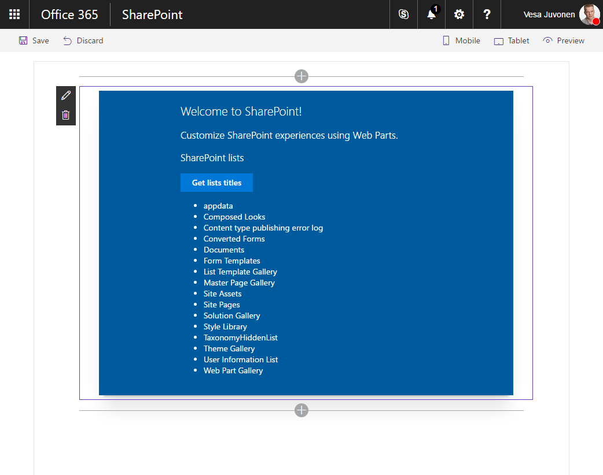

# Connect to SharePoint using the JavaScript Object Model (JSOM)

In the past, when building SharePoint customizations, you might have used the SharePoint JavaScript Object Model (JSOM) to communicate with SharePoint. This article illustrates how to use SharePoint JSOM when building solutions on the SharePoint Framework.

> **Note:** Before following the steps in this article, be sure to [set up your SharePoint client-side web part development environment](../../set-up-your-development-environment).

## Create a new project

Start by creating a new folder for your project.

```sh
md react-sharepointlists
```

Go to the project folder.

```sh
cd react-sharepointlists
```

In the project folder run the SharePoint Framework Yeoman generator to scaffold a new SharePoint Framework project.

```sh
yo @microsoft/sharepoint
```

When prompted, enter the following values:

- **react-sharepointlists** as your solution name.
- **Use the current folder** for the location to place the files.
- **React** as the starting point to build the web part.
- **SharePoint lists** as your web part name.
- **Shows names of lists in the current site** as your web part description.


Once the scaffolding completes, open your project folder in your code editor. This article uses Visual Studio Code in the steps and screenshots but you can use any editor you prefer.


## Reference JSOM declaratively

In order to use the SharePoint JSOM in your SharePoint Framework client-side web part, you have to reference it first. Where in the past it was already available on the page for you to use, in SharePoint Framework solutions, it has to be explicitly loaded.

There are two ways to reference the SharePoint JSOM in the SharePoint Framework: declarative, through configuration, and imperative in the web part's code. Each of these approaches have their advantages and disadvantages, and it's important for you to understand them.

### Register SharePoint JSOM API as external scripts

The first step, is to register the SharePoint JSOM API as external scripts in your SharePoint Framework project. In the code editor open the **./config/config.json** file and to the **externals** section add:

```json
{
  // ...
  "externals": {
    "sp-init": {
      "path": "https://contoso.sharepoint.com/_layouts/15/init.js",
      "globalName": "$_global_init"
    },
    "microsoft-ajax": {
      "path": "https://contoso.sharepoint.com/_layouts/15/MicrosoftAjax.js",
      "globalName": "Sys",
      "globalDependencies": [
        "sp-init"
      ]
    },
    "sp-runtime": {
      "path": "https://contoso.sharepoint.com/_layouts/15/SP.Runtime.js",
      "globalName": "SP",
      "globalDependencies": [
        "microsoft-ajax"
      ]
    },
    "sharepoint": {
      "path": "https://contoso.sharepoint.com/_layouts/15/SP.js",
      "globalName": "SP",
      "globalDependencies": [
        "sp-runtime"
      ]
    }
  }
  // ...
}
```

Each of the entries points to a different script file that together allow you to use the SharePoint JSOM in your client-side web part. All these scripts are distributed as non-module scripts, which is why each registration entry requires a URL, specified using the **path** property, and the name used by the script, provided in the **globalName** property. To ensure that these scripts load in the right order, the dependencies between these scripts are specified using the **globalDependencies** property.

### Install TypeScript typings for SharePoint JSOM

The next step is to install and configure TypeScript typings for SharePoint JSOM. This will allow you to benefit of the TypeScript's type safety features when working with SharePoint JSOM.

In the command line execute the following command:

```sh
npm install @types/microsoft-ajax @types/sharepoint --save-dev
```

Because SharePoint JSOM is not distributed as a module and you cannot import it directly in your code, you have to register its TypeScript typings globally. In the code editor, open the **./tsconfig.json** file, and in the **types** property, right after the **webpack-env** entry, add references to **microsoft-ajax** and **sharepoint**.

```json
{
  "compilerOptions": {
    // ...
    "types": [
      "es6-promise",
      "es6-collections",
      "webpack-env",
      "microsoft-ajax",
      "sharepoint"
    ]
  }
}
```

### Reference SharePoint JSOM scripts in the React component

To load the SharePoint JSOM scripts in the client-side web part, you have to reference them in the web part's code. In this example you will add the references in the React component, where JSOM will be used to communicate with SharePoint.

In the code editor, open the **./src/webparts/sharePointLists/components/SharePointLists.tsx** file. After the last **import** statement add the following code:

```ts
require('sp-init');
require('microsoft-ajax');
require('sp-runtime');
require('sharepoint');
```

As these names correspond to the external references you added previously, SharePoint Framework will load these script from the specified URLs.

### Show titles of SharePoint lists in the current site using JSOM

To illustrate using SharePoint JSOM for communicating with SharePoint, you will retrieve and render the titles of all SharePoint lists located in the current site.

#### Add siteUrl to component's properties

In order to connect to SharePoint, the React component must know the URL of the current site. That URL is available in the parent web part and can be passed into the component through its properties.

In the code editor, open the **./src/webparts/sharePointLists/components/ISharePointListsProps.ts** file and to the **ISharePointListsProps** interface add the **siteUrl** property:

```ts
export interface ISharePointListsProps {
  description: string;
  siteUrl: string;
}
```

To pass the URL of the current site into the component, in the code editor, open the **./src/webparts/sharePointLists/SharePointListsWebPart.ts** file and change the **render** method to:

```ts
export default class SharePointListsWebPart extends BaseClientSideWebPart<ISharePointListsWebPartProps> {
  public render(): void {
    const element: React.ReactElement<ISharePointListsProps > = React.createElement(
      SharePointLists,
      {
        description: this.properties.description,
        siteUrl: this.context.pageContext.web.absoluteUrl
      }
    );

    ReactDom.render(element, this.domElement);
  }

  // ...
}
```

#### Define component's state

The React component will load data from SharePoint and render it to the user. The current state of the React component is modeled using a state interface.

In the code editor, in the **./src/webparts/sharePointLists/components** folder, create a new file named **ISharePointListsState.ts** and paste the following contents:

```ts
export interface ISharePointListsState {
    listTitles: string[];
    loadingLists: boolean;
    error: string;
}
```

#### Add state to the React component

Having defined the interface describing the shape of the component's state, the next step is to have the React component use that state interface.

In the code editor, open the **./src/webparts/sharePointLists/components/SharePointLists.tsx** file. To the list of import statements add:

```ts
import { ISharePointListsState } from './ISharePointListsState';
```

Next, change the signature of the **SharePointLists** class to:

```ts
export default class SharePointLists extends React.Component<ISharePointListsProps, ISharePointListsState> {
  // ...
}
```

In the **SharePointLists** class add a constructor with the default state value.

```ts
export default class SharePointLists extends React.Component<ISharePointListsProps, ISharePointListsState> {
  constructor(props?: ISharePointListsProps, context?: any) {
    super();

    this.state = {
      listTitles: [],
      loadingLists: false,
      error: null
    };
  }

  // ...
}
```

#### Load information about SharePoint lists from the current site using JSOM

The sample client-side web part used in this article loads information about SharePoint lists in the current site after clicking a button.



In the code editor, open the **./src/webparts/sharePointLists/components/SharePointLists.tsx** file. In the **SharePointLists** class add a new method named **getListsTitles**:

```ts
export default class SharePointLists extends React.Component<ISharePointListsProps, ISharePointListsState> {
  constructor(props?: ISharePointListsProps, context?: any) {
    super();

    this.state = {
      listTitles: [],
      loadingLists: false,
      error: null
    };

    this.getListsTitles = this.getListsTitles.bind(this);
  }

  // ...

  private getListsTitles(): void {
  }
}
```

To ensure the correct scoping of the method, bind it to the web part in the constructor.

In the **getListsTitles** method, use SharePoint JSOM to load the titles of SharePoint lists in the current site:

```ts
export default class SharePointLists extends React.Component<ISharePointListsProps, ISharePointListsState> {
  // ...
  private getListsTitles(): void {
    this.setState({
      loadingLists: true,
      listTitles: [],
      error: null
    });

    const context: SP.ClientContext = new SP.ClientContext(this.props.siteUrl);
    const lists: SP.ListCollection = context.get_web().get_lists();
    context.load(lists, 'Include(Title)');
    context.executeQueryAsync((sender: any, args: SP.ClientRequestSucceededEventArgs): void => {
      const listEnumerator: IEnumerator<SP.List> = lists.getEnumerator();

      const titles: string[] = [];
      while (listEnumerator.moveNext()) {
        const list: SP.List = listEnumerator.get_current();
        titles.push(list.get_title());
      }

      this.setState((prevState: ISharePointListsState, props: ISharePointListsProps): ISharePointListsState => {
        prevState.listTitles = titles;
        prevState.loadingLists = false;
        return prevState;
      });
    }, (sender: any, args: SP.ClientRequestFailedEventArgs): void => {
      this.setState({
        loadingLists: false,
        listTitles: [],
        error: args.get_message()
      });
    });
  }
}
```

You start with resetting the component's state to communicate to the user that the component will be loading information from SharePoint. Then, using the URL of the current site passed to the component through its properties, you instantiate a new SharePoint context. Using the SharePoint JSOM you load lists from the current site, and to optimize the request for performance, you specify, that only the **Title** property should be loaded. Next, you execute the query by calling the **executeQueryAsync** method and passing two callback functions. Once the query is completed, you enumerate through the collection of retrieved lists, store their titles in an array and update the component's state.

#### Render the titles of SharePoint lists in the current site

Having loaded the titles of SharePoint lists in the current site, the last part left, is to render them in the component. In the code editor, open the **./src/webparts/sharePointLists/components/SharePointLists.tsx** file and update the **render** method:

```tsx
export default class SharePointLists extends React.Component<ISharePointListsProps, ISharePointListsState> {
  // ...
  public render(): React.ReactElement<ISharePointListsProps> {
    const titles: JSX.Element[] = this.state.listTitles.map((listTitle: string, index: number, listTitles: string[]): JSX.Element => {
      return <li key={index}>{listTitle}</li>;
    });

    return (
      <div className={styles.helloWorld}>
        <div className={styles.container}>
          <div className={`ms-Grid-row ms-bgColor-themeDark ms-fontColor-white ${styles.row}`}>
            <div className="ms-Grid-col ms-u-lg10 ms-u-xl8 ms-u-xlPush2 ms-u-lgPush1">
              <span className="ms-font-xl ms-fontColor-white">Welcome to SharePoint!</span>
              <p className="ms-font-l ms-fontColor-white">Customize SharePoint experiences using Web Parts.</p>
              <p className="ms-font-l ms-fontColor-white">{escape(this.props.description)}</p>
              <a className={styles.button} onClick={this.getListsTitles} role="button">
                <span className={styles.label}>Get lists titles</span>
              </a><br />
              {this.state.loadingLists &&
                <span>Loading lists...</span>}
              {this.state.error &&
                <span>An error has occurred while loading lists: {this.state.error}</span>}
              {this.state.error === null && titles &&
                <ul>
                  {titles}
                </ul>}
            </div>
          </div>
        </div>
      </div>
    );
  }
  // ...
}
```

At this point you should be able to add your web part to the page and see the titles of SharePoint lists in the current site. To verify that the project is working correctly, run the following command:

```sh
gulp serve --nobrowser
```

As you are using SharePoint JSOM to communicate with SharePoint, you have to test the web part using the hosted version of the SharePoint workbench.


Referencing SharePoint JSOM scripts declaratively as external scripts is convenient and allows you to keep your code clean. One disadvantage that it has, is that it requires specifying absolute URLs to the location from which SharePoint JSOM scripts should be loaded. If you're using separate SharePoint tenants for development, testing and production, then it would require some additional work from you to change these URLs for the different environments accordingly. In such cases you could also consider using the [SPComponentLoader](https://dev.office.com/sharepoint/reference/spfx/sp-loader/spcomponentloader) to load the scripts in the web part's code.

## Reference JSOM imperatively

Another way to load JavaScript libraries in SharePoint Framework projects, is by using the SPComponentLoader. SPComponentLoader is a utility class provided with the SharePoint Framework designed to help you load scripts and other resources in your components. One benefit of using the SPComponentLoader over loading scripts declaratively is, that it allows you to use server-relative URLs which is more convenient if you're using different SharePoint tenants for the different stages of your development process.

### Remove external references

Before you proceed, remove the existing external script references. In the code editor, open the **./config/config.json** file and from the **externals** property, remove all entries:

```json
{
  "entries": [
    {
      "entry": "./lib/webparts/sharePointLists/SharePointListsWebPart.js",
      "manifest": "./src/webparts/sharePointLists/SharePointListsWebPart.manifest.json",
      "outputPath": "./dist/share-point-lists.bundle.js"
    }
  ],
  "externals": {},
  "localizedResources": {
    "sharePointListsStrings": "webparts/sharePointLists/loc/{locale}.js"
  }
}
```

### Remove references in code

With the SharePoint JSOM scripts no longer being registered as external scripts, you cannot reference them directly in your code.

In the code editor, open the **./src/webparts/sharePointLists/components/SharePointLists.tsx** file and remove the **require** statements pointing to the different SharePoint JSOM scripts.

### Wait with loading data until the JSOM scripts are loaded

The primary functionality of the client-side web part that you are building, depends on SharePoint JSOM. Depending on a number of factors, loading these scripts could take a moment, and when building the web part you should take it into account. When added to the page, the web part should communicate to the user, that it's loading its prerequisites and should make it clear, when it's ready to use. To support this, extend the React component's state with an additional property to track the status of loading the JSOM scripts.

In the code editor, open the **./src/webparts/sharePointLists/components/ISharePointListsState.ts** file and paste the following code:

```ts
export interface ISharePointListsState {
    listTitles: string[];
    loadingLists: boolean;
    error: string;
    loadingScripts: boolean;
}
```

Next, add the newly added property to the state definitions in the React component. In the code editor, open the **./src/webparts/sharePointLists/components/SharePointLists.tsx** file. Update the constructor to the following code:

```ts
export default class SharePointLists extends React.Component<ISharePointListsProps, ISharePointListsState> {
  constructor(props?: ISharePointListsProps, context?: any) {
    super();

    this.state = {
      listTitles: [],
      loadingLists: false,
      error: null,
      loadingScripts: true
    };

    this.getListsTitles = this.getListsTitles.bind(this);
  }
  // ...
}
```

In the same file, update the **getListsTitles** method to the following code:

```ts
export default class SharePointLists extends React.Component<ISharePointListsProps, ISharePointListsState> {
  // ...
  private getListsTitles(): void {
    this.setState({
      loadingLists: true,
      listTitles: [],
      error: null,
      loadingScripts: false
    });

    const context: SP.ClientContext = new SP.ClientContext(this.props.siteUrl);
    const lists: SP.ListCollection = context.get_web().get_lists();
    context.load(lists, 'Include(Title)');
    context.executeQueryAsync((sender: any, args: SP.ClientRequestSucceededEventArgs): void => {
      const listEnumerator: IEnumerator<SP.List> = lists.getEnumerator();

      const titles: string[] = [];
      while (listEnumerator.moveNext()) {
        const list: SP.List = listEnumerator.get_current();
        titles.push(list.get_title());
      }

      this.setState((prevState: ISharePointListsState, props: ISharePointListsProps): ISharePointListsState => {
        prevState.listTitles = titles;
        prevState.loadingLists = false;
        return prevState;
      });
    }, (sender: any, args: SP.ClientRequestFailedEventArgs): void => {
      this.setState({
        loadingLists: false,
        listTitles: [],
        error: args.get_message(),
        loadingScripts: false
      });
    });
  }
}
```

To communicate the status of loading the SharePoint JSOM scripts to the user, add the **import** statement to reference the **Placeholder** component and update the **render** method to the following code:

```tsx
import { Placeholder } from '@microsoft/sp-webpart-base';

export default class SharePointLists extends React.Component<ISharePointListsProps, ISharePointListsState> {
  // ...
  public render(): React.ReactElement<ISharePointListsProps> {
    const titles: JSX.Element[] = this.state.listTitles.map((listTitle: string, index: number, listTitles: string[]): JSX.Element => {
      return <li key={index}>{listTitle}</li>;
    });

    return (
      <div className={styles.helloWorld}>
        <div className={styles.container}>
          {this.state.loadingScripts &&
            <Placeholder
              icon={'ms-Icon--CustomList'}
              iconText={'SharePoint lists'}
              description={'Loading SharePoint JSOM scripts...'} />}
          {this.state.loadingScripts === false &&
            <div className={`ms-Grid-row ms-bgColor-themeDark ms-fontColor-white ${styles.row}`}>
              <div className="ms-Grid-col ms-u-lg10 ms-u-xl8 ms-u-xlPush2 ms-u-lgPush1">
                <span className="ms-font-xl ms-fontColor-white">Welcome to SharePoint!</span>
                <p className="ms-font-l ms-fontColor-white">Customize SharePoint experiences using Web Parts.</p>
                <p className="ms-font-l ms-fontColor-white">{escape(this.props.description)}</p>
                <a className={styles.button} onClick={this.getListsTitles} role="button">
                  <span className={styles.label}>Get lists titles</span>
                </a><br />
                {this.state.loadingLists &&
                  <span>Loading lists...</span>}
                {this.state.error &&
                  <span>An error has occurred while loading lists: {this.state.error}</span>}
                {this.state.error === null && titles &&
                  <ul>
                    {titles}
                  </ul>}
              </div>
            </div>
          }
        </div>
      </div>
    );
  }
  // ...
}
```

When the React component's state will indicate, that the SharePoint JSOM scripts are being loaded, it will display the standard SharePoint Framework placeholder. Once the scripts have been loaded, the web part will display the standard content with the button allowing users to load the information about SharePoint lists in the current site.

### Load SharePoint JSOM scripts using SPComponentLoader

The client-side web part should load SharePoint JSOM scripts only once. In this example, given that the web part consists of a single React component, the best place to load SharePoint JSOM scripts, is inside the React component's **componentDidMount** method, which executes only once after the component has been instantiated.

In the code editor, open the **./src/webparts/sharePointLists/components/SharePointLists.tsx** file. In the top section of the file, add an **import** statement referencing the **SPComponentLoader**. Then, in the **SharePointLists** class, add the **componentDidMount** method:

```ts
import { SPComponentLoader } from '@microsoft/sp-loader';

export default class SharePointLists extends React.Component<ISharePointListsProps, ISharePointListsState> {
  // ...
  private componentDidMount(): void {
    SPComponentLoader.loadScript('/_layouts/15/init.js', {
      globalExportsName: '$_global_init'
    })
    .then((): Promise<{}> => {
      return SPComponentLoader.loadScript('/_layouts/15/MicrosoftAjax.js', {
        globalExportsName: 'Sys'
      });
    })
    .then((): Promise<{}> => {
      return SPComponentLoader.loadScript('/_layouts/15/SP.Runtime.js', {
        globalExportsName: 'SP'
      });
    })
    .then((): Promise<{}> => {
      return SPComponentLoader.loadScript('/_layouts/15/SP.js', {
        globalExportsName: 'SP'
      });
    })
    .then((): void => {
      this.setState((prevState: ISharePointListsState, props: ISharePointListsProps): ISharePointListsState => {
        prevState.loadingScripts = false;
        return prevState;
      });
    });
  }
  // ...
}
```

Using a number of chained promises, you load the different scripts, that together enable using SharePoint JSOM in your SharePoint Framework client-side web part. Note, how using the SPComponentLoader you can use server-relative URLs that will load the scripts from the current SharePoint tenant. Once all scripts have been loaded, you update the React component's state, confirming that all prerequisites have been loaded and the web part is ready to use.

Confirm, that the web part is working as expected by running the following command:

```sh
gulp serve --nobrowser
```

Just as previously, you should see the web part show the titles of SharePoint lists in the current site.


While using the SPComponentLoader requires some additional effort, it allows you to use server-relative URLs, which is beneficial in scenarios when you're using different tenants for development, testing and production.

## Considerations

In the past, when building client-side customizations on the SharePoint platforms, you might have used SharePoint JSOM to communicate with SharePoint. Currently, the recommended approach is, to use either the SharePoint REST API or the [PnP JavaScript Core Library](https://github.com/SharePoint/PnP-JS-Core).

SharePoint JSOM was introduced a few years back and was the first step towards supporting client-side solutions on the SharePoint platforms. Currently, it is not being actively maintained anymore and might not offer you the access to all capabilities available through REST or the PnP JavaScript Core Library.

Additional benefit of using the SharePoint REST API or the PnP JavaScript Core Library is, that in both cases you can use promises which significantly simplify writing asynchronous code.

If you have existing customizations using SharePoint JSOM and are considering migrating them to the SharePoint Framework, this article should provide you with the necessary information about using SharePoint JSOM in SharePoint Framework solutions. For the longer term, you should consider changing how you communicate with SharePoint to either using the SharePoint REST API or the PnP JavaScript Core Library.