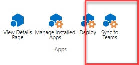

# Create Microsoft Teams manifest manually for a web part and deploy it to Microsoft Teams

You can create the Microsoft Teams app manifest file using the [Teams App Studio](https://docs.microsoft.com/microsoftteams/platform/get-started/get-started-app-studio) in Microsoft Teams or you can also download a sample file from the [sp-dev-docs GitHub repository](https://github.com/SharePoint/sp-dev-docs/blob/master/assets/teams-tab-manual.zip) and modify it based on your requirements.

> [!NOTE]
> You may notice a menu item **Sync to Teams** in the App Catalog ribbon:
>
> 
>
> This capability is ideal when you have a simple implementation which you want expose automatically in Microsoft Teams. However, Teams solutions can be complex and contain multiple capabilities such as tabs, bots, actionable cards etc. For such complex solutions, crafting the Teams manifest manually and deploying it in Microsoft Teams App Catalog directly is the only option.

## Create a Microsoft Teams app manifest

To side load a SharePoint Framework web part as a Microsoft Teams application, you must create a Microsoft Teams application manifest file with specific values. Use the following manifest file as a template:

```json
{
  "$schema": "https://developer.microsoft.com/json-schemas/teams/v1.5/MicrosoftTeams.schema.json",
  "manifestVersion": "1.5",
  "packageName": "{{SPFX_COMPONENT_ALIAS}}",
  "id": "{{SPFX_COMPONENT_ID}}",
  "version": "0.1",
  "developer": {
    "name": "Parker Porcupine",
    "websiteUrl": "https://{your-app-url}",
    "privacyUrl": "https://{your-company-url}/privacystatement",
    "termsOfUseUrl": "https://{your-company-url}/servicesagreement"
  },
  "name": {
    "short": "{{SPFX_COMPONENT_NAME}}"
  },
  "description": {
    "short": "{{SPFX_COMPONENT_SHORT_DESCRIPTION}}",
    "full": "{{SPFX_COMPONENT_LONG_DESCRIPTION}}"
  },
  "icons": {
    "outline": "{{SPFX_COMPONENT_ID}}_outline.png",
    "color": "{{SPFX_COMPONENT_ID}}_color.png"
  },
  "accentColor": "#004578",
  "staticTabs": [
    {
      "entityId": "com.contoso.personaltab.spfx",
      "name": "My SPFx Personal Tab",
      "contentUrl": "https://{teamSiteDomain}/_layouts/15/TeamsLogon.aspx?SPFX=true&dest=/_layouts/15/teamshostedapp.aspx%3Fteams%26personal%26componentId={{SPFX_COMPONENT_ID}}%26forceLocale={locale}",
      "scopes": [
        "personal"
      ]
    }
  ],
  "configurableTabs": [
    {
      "configurationUrl": "https://{teamSiteDomain}{teamSitePath}/_layouts/15/TeamsLogon.aspx?SPFX=true&dest={teamSitePath}/_layouts/15/teamshostedapp.aspx%3FopenPropertyPane=true%26teams%26componentId={{SPFX_COMPONENT_ID}}%26forceLocale={locale}",
      "canUpdateConfiguration": true,
      "scopes": [
        "team"
      ]
    }
  ],
  "validDomains": [
    "*.login.microsoftonline.com",
    "*.sharepoint.com",
    "spoprod-a.akamaihd.net",
    "resourceseng.blob.core.windows.net"
  ],
  "webApplicationInfo": {
    "resource": "https://{teamSiteDomain}",
    "id": "00000003-0000-0ff1-ce00-000000000000"
  }
}
```

You need to update the following important attributes in the manifest file:

- **packageName**: Technical name of the package
- **id**: Unique package id. Generate new GUID for this attribute
- **developer**: Update the URLs for the `websiteUrl`, `privacyUrl`, and `termsOfUseUrl`.
- **name:Short**: Name of your app

    > [!IMPORTANT]
    > The app's name must not exceed 30 characters.

- **description:Short**: Short description of your app
- **description:full**: Full description of your app
- **icons:outline**: The `outline` icon is used in these places: the app bar and messaging extensions the user has marked as a "favorite." This icon must be 32&times;32 pixels.
- **icons:color**: The `color` icon is used throughout Microsoft Teams (in app and tab galleries, bots, flyouts, and so on). This icon should be 192&times;192 pixels.
- **configurationUrl**: Modify the sample `configurationUrl` to include the manifest ID of your web part component by updating the GUID after `componentId` query parameter.
- **canUpdateConfiguration**: Setting this property to true will mean that you allow modification of the properties of the web part. Set this value to false to prevent this.

Notice in the template manifest file above, there are multiple placeholders that should be updated. Use the following values from the SharePoint Framework's web part manifest file (**./src/webparts/[webpartname]/[webpartname].manifest.json**) to update these values:

|          manifest.json string          |  Property in SPFx component manifest  |
| -------------------------------------- | ------------------------------------- |
| `{{SPFX_COMPONENT_ALIAS}}`             | `alias`                               |
| `{{SPFX_COMPONENT_NAME}}`              | `preconfiguredEntries[0].title`       |
| `{{SPFX_COMPONENT_SHORT_DESCRIPTION}}` | `preconfiguredEntries[0].description` |
| `{{SPFX_COMPONENT_LONG_DESCRIPTION}}`  | `preconfiguredEntries[0].description` |
| `{{SPFX_COMPONENT_ID}}`                | `id`                                  |

Notice the `componentId` query parameter in the `configurationUrl`. You shouldn't update any other sections of the URL as it's dynamically replaced when the tab is rendered from the context of SharePoint.

See more details around the Microsoft Teams manifest options from the [Microsoft Teams developer guidance](https://docs.microsoft.com/microsoftteams/platform/concepts/apps/apps-package).

> [!IMPORTANT]
> Every time `/_layouts/15/TeamsLogon.aspx` is specified in the manifest, the `dest` attribute value must be URL encoded. A non-encoded value might prevent the component from loading properly in Teams.

Below following JSON demonstrates a sample manifest file:

```json
{
  "$schema": "https://developer.microsoft.com/json-schemas/teams/v1.5/MicrosoftTeams.schema.json",
  "manifestVersion": "1.5",
  "packageName": "SpFxTeamsTogetherWebPart",
  "id": "b7771434-9587-4a79-9990-48c310f78a3d",
  "version": "0.1",
  "developer": {
    "name": "Parker Porcupine",
    "websiteUrl": "https://products.office.com/sharepoint/collaboration",
    "privacyUrl": "https://privacy.microsoft.com/privacystatement",
    "termsOfUseUrl": "https://www.microsoft.com/servicesagreement"
  },
  "name": {
    "short": "SPFx Teams Together"
  },
  "description": {
    "short": "SPFx Teams Together short description",
    "full": "SPFx Teams Together long description"
  },
  "icons": {
    "outline": "b7771434-9587-4a79-9990-48c310f78a3d_outline.png",
    "color": "b7771434-9587-4a79-9990-48c310f78a3d_color.png"
  },
  "accentColor": "#004578",
  "staticTabs": [
    {
      "entityId": "com.contoso.personaltab.spfx",
      "name": "My SPFx Personal Tab",
      "contentUrl": "https://{teamSiteDomain}/_layouts/15/TeamsLogon.aspx?SPFX=true&dest=/_layouts/15/teamshostedapp.aspx%3Fteams%26personal%26componentId=50ef7075-1c74-4b40-809b-6aad4b4e2445%26forceLocale={locale}",
      "scopes": [
        "personal"
      ]
    }
  ],
  "configurableTabs": [
    {
      "configurationUrl": "https://{teamSiteDomain}{teamSitePath}/_layouts/15/TeamsLogon.aspx?SPFX=true&dest={teamSitePath}/_layouts/15/teamshostedapp.aspx%3FopenPropertyPane=true%26teams%26componentId=b7771434-9587-4a79-9990-48c310f78a3d%26forceLocale={locale}",
      "canUpdateConfiguration": true,
      "scopes": [
        "team"
      ]
    }
  ],
  "validDomains": [
    "*.login.microsoftonline.com",
    "*.sharepoint.com",
    "*.sharepoint-df.com",
    "spoppe-a.akamaihd.net",
    "spoprod-a.akamaihd.net",
    "resourceseng.blob.core.windows.net",
    "msft.spoppe.com"
  ],
  "webApplicationInfo": {
    "resource": "https://{teamSiteDomain}",
    "id": "00000003-0000-0ff1-ce00-000000000000"
  }
}
```
