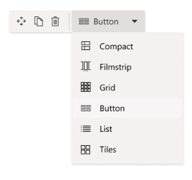

# Adding support for Top Actions

[!INCLUDE [spfx-release-beta](../../../../includes/snippets/spfx-release-beta.md)]

Today, users need to be aware of the web part property panels to find out the additional options each web part provides. This is a common piece of feedback where users want actions surfacing in context of where they are without having to rely on opening something to get to those options. Therefore, we are now allowing to surface most common configurations from a web part's property panel directly on to the web part's toolbar. These common configurations are referred to as the web part's Top Actions.



## Getting started

> [!TIP]
> These instructions assume you know [how to create a hello world web part](../get-started/build-a-hello-world-web-part.md).

### Define your Top Action configurations

In the example below we are defining the callback function that will be used to pull the configurations for our Top Action commands.

> [!NOTE]
> `getTopActionsConfiguration` must be defined as public on your web part's class.

```typescript
import { ITopActions } from '@microsoft/sp-top-actions';

public getTopActionsConfiguration(): ITopActions | undefined {
  return {
    topActions: [],
    onExecute: (actionName: string, newValue: any) => {}
  };
}
```

### Define your toolbar's user interface

The `topActions` array is an ordered list of controls to render in the web part toolbar. In the example below we are defining one top action as a button interface.

```typescript
import { PropertyPaneFieldType } from '@microsoft/sp-property-pane';

return {
  topActions: [
    {
      targetProperty: 'reset',
      properties: {
        icon: 'Reset'
      },
      type: PropertyPaneFieldType.Button
    }
  ]
  ...
}
```

### Execute the command when the user interacts

The previous step demonstrated how to get a button to display in the web part's toolbar. Now we will perform an action when the user selects the button. Note that `actionName` was defined as `targetProperty` in the last step and since this is a button we can ignore the `newValue` that comes in.

```typescript
return {
  ...
  onExecute: (actionName: string, newValue: any) => {
    if (actionName === 'reset') {
      // user defined logic to reset the web part
      this.reset();
    }
  }
}
```

> [!TIP]
> Common pitfall when implementing the `onExecute` command, is not syncing the new state with the web part properties and/or not refreshing or re-rendering the web part.

## Code Snippets

### Button command

The type interace for a button is similar to the property panel's button (`IPropertyPaneButtonProps`).

```typescript
import { ITopActions, TopActionsFieldType } from '@microsoft/sp-top-actions';
...
public getTopActionsConfiguration(): ITopActions | undefined {
  return {
    topActions: [
      {
        targetProperty: 'reset',
        type: TopActionsFieldType.Button,
        properties: {
          text: 'Reset',
          icon: 'Reset'
        }
      }
    ],
    onExecute: (actionName: string, newValue: any) => {
      if (actionName === 'reset') {
        // user defined logic to reset the web part
        this.reset();
      }
    }
  };
}
```

### Drop-down command

The type interface for a drop-down is similar to the property panel's choice group (`IPropertyPaneChoiceGroupOption`).

```typescript
import { ITopActions, TopActionsFieldType } from '@microsoft/sp-top-actions';
...
public getTopActionsConfiguration(): ITopActions | undefined {
  return {
    topActions: [{
      targetProperty: 'layout',
      type: TopActionsFieldType.ChoiceGroup,
      properties: {
        options: [
          {
            // key maps to newValue in onExecute
            key: 'card',
            text: 'Card Layout',
            imageSize: { width: 32, height: 32 },
            iconProps: { officeFabricIconFontName: 'ArticlesIcon' },
            checked: this.state.layout === 'card'
          },
          {
            key: 'list',
            text: 'List Layout',
            imageSize: { width: 32, height: 32 },
            // you can use iconProps, icon to define icons
            icon: 'List',
            checked: this.state.alignment === 'list'
          }
        ]
      }
    }],
    // for ChoiceGroup drop-down, the newValue tells us which option's key was selected
    onExecute: (actionName: string, newValue: any) => {
      if (actionName === 'layout') {
        this.setLayout(newValue);
        this.render();
      }
    }
  };
}
```

## Advanced configurations

For advanced configurations of your top action commands, checkout the type definitions from `@microsoft/sp-top-actions`.


```typescript
import { ITopActions, ITopActionsButtonProps, ITopActionsDropdownProps } from '@microsoft/sp-top-actions';
```

### See more

[Top Actions API](/javascript/api/sp-top-actions)
