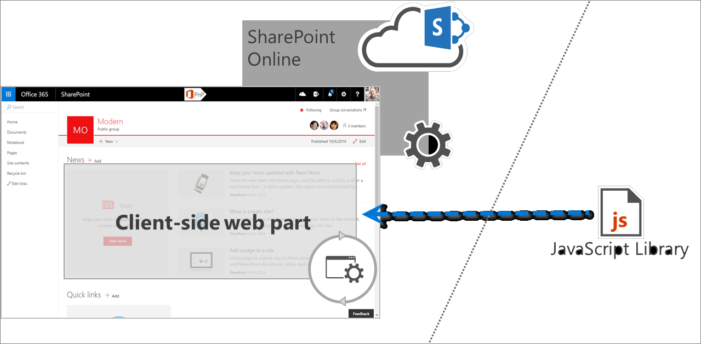

# SharePoint Framework solutions governance considerations

With the SharePoint Framework, your organization can easily build solutions that easily integrate the capabilities available in SharePoint and Office 365. SharePoint Framework solutions work across modern web technologies and different mobile devices so you can create productive experiences and apps that are responsive and mobile-ready from day one. To get the most benefit from SharePoint Framework solutions, your organization should have an actionable governance plan covering the most important project management considerations.

## Anatomy of SharePoint Framework solutions

SharePoint Framework solutions consist of two parts: code (often referred to as a web part bundle) deployed to a URL, and an .sppkg file that contains a web part manifest with a URL pointing to the location where the web part code is deployed. There are no particular restrictions to where the code is deployed, as long as users working with the web part can access the web part code. Organizations can choose, for example, to have their web parts deployed to the [Office 365 public CDN](https://dev.office.com/blogs/office-365-public-cdn-developer-preview-release), [Azure storage](../get-started/deploy-web-part-to-cdn.md), or a privately-owned web server.

## Web part code-hosting location considerations

The most important thing that organizations should know before deploying SharePoint Framework solutions is where the code of the solution is deployed. SharePoint Framework solutions are executed as a part of the page in the context of the current user. As a result, whatever the user can do, the web part's code can do as well. In contrast to SharePoint Add-ins, there is no separate permission scope applied to SharePoint Framework solutions. This is why SharePoint administrators should treat SharePoint Framework solutions as high-trust solutions, the same way they treat farm solutions on-premises. The location where the web part's code is deployed is important for a number of reasons. 

Consider the following location issues.

### Is the code-hosting location supported by the organization?

SharePoint Framework doesn't impose any restrictions regarding where the solution's code is deployed. As a result, developers and vendors can deploy the code to a range of locations within or outside the organization's IT department. Different organizations may have different server requirements ranging from access policies to SLAs. Before deploying a SharePoint Framework solution package, organizations should ensure that the server used to host the code is a known server approved to be used by the organization.

### Who manages the code-hosting location?

SharePoint Framework solutions execute as a part of the page in the context of the current user. While an organization could perform a code review before deploying a solution package, to verify that the code can be trusted, it also should ensure the integrity of the code as long as it's deployed to the tenant. Organizations should have a clear understanding of who manages the hosting location, who and under what circumstances they can modify the files, and what the update approval process looks like. Establishing this information upfront not only helps organizations control the update process, but also lowers the risk of deploying malicious code.

### What is the SLA for the hosting location?

When organizations use Office 365 and SharePoint Online, they rely on the SLA provided by Microsoft. SharePoint Framework solutions that extend the standard capabilities of SharePoint and Office 365 should be deployed to servers that meet or exceed the SLA provided by Microsoft. That way, organizations can ensure that they are able to truly benefit from the added values of their customizations.

### Is the hosting location optimized for performance?

Loading existing libraries from a URL instead of embedding them in the web part bundle is the first step to speed up the loading time of SharePoint Framework solutions. To get the most out of it, you want to ensure that the server hosting the different scripts is correctly configured for optimal performance. It should serve all files compressed, and the longer it allows proxies and clients to cache the files, the longer users will be able to load these scripts from their local cache, significantly speeding up loading SharePoint pages containing web parts.

## Tools and libraries

When building client-side solutions, developers can choose from a variety of libraries such as React, Angular, jQuery, or Knockout. Using an existing JavaScript library makes it easier for developers to build rich solutions. There are big differences between how the different libraries work, and often specific knowledge is required to fully understand how to build a solution using the particular library.

Once released to your production tenant, you should ensure that your support organization (either your own IT department or a contracted third party) is capable of supporting the solution. To do this, the support organization should have at least a basic understanding of the library used to build that solution. Also, as you increase the number of libraries that you use across your tenant, the harder it is to support the different solutions. Selecting one or two libraries to use in your organization helps you lower the operational costs. Before deploying a solution to your production tenant, you should ensure that the solution is using only libraries supported in your organization.

## Using external scripts

When using existing JavaScript libraries, developers can either choose to include them in the web part code bundle or load them from a URL. Loading libraries from URLs allows developers to optimize SharePoint Framework solutions for performance. Because libraries are loaded from a URL, they don't need to be included in the web part bundle, which decreases its size making it load faster. Additionally, by referencing the same libraries across the whole tenant, SharePoint Framework solutions load faster by reusing the previously downloaded scripts from the local cache.

There are no restrictions to where the existing libraries can be loaded from, and it's important to know from which servers the external scripts are loaded. Together with the web part code, these scripts run in the context of the current user and can do whatever the current user is capable of doing. Therefore, it's important that you trust these scripts and their integrity. Some organizations have strict policies relating to resources sourced from public CDNs, and you should ensure that the solution and its resources meet your organizational policies.

## Approving SharePoint Framework solutions for deployment

SharePoint Framework solutions are deployed to a tenant centrally through the app catalog. Your organization should have a plan in place describing who is allowed to deploy and approve SharePoint Framework packages. This is important, because this plan should include who is responsible to verify that the packages that are deployed are secure and meet the organizational policies. SharePoint Framework solutions run in the browser in the context of the current user and, unlike SharePoint Add-ins, always have the same permissions as the currently signed-in user. Before deploying and approving a SharePoint Framework solution for use in your organization, its origin and other criteria mentioned previously in this article should be carefully examined.

To verify that your SharePoint Framework solution meets your organization's policies, you should review the contents of the .sppkg package that you want to deploy and closely examine the contents of the referenced scripts and the location where they are hosted. This step can be performed manually, or it can be automated by using third-party tooling. [SharePoint Customization Analysis Framework](https://rencore.com/products/#spcaf) (SPCAF) is an example of a third-party solution that significantly simplifies the process of analyzing the contents of SharePoint Framework solutions and verifying that they meet your organizational security and governance requirements.

## SharePoint Framework solutions and no-script sites

In Office 365, organizations can use the no-script setting to disable script-based customizations in SharePoint Online. Organizations can configure the no-script setting either for the whole tenant or for a particular site collection. Based on the criteria from the organizational policies, administrators can use the no-script setting to disable customizations built, for example, by using the Script Editor web part or a user custom action.

The no-script setting is meant for organizations to apply an additional layer of control and security to either the whole tenant or specific site collections. Customizing SharePoint using script embedding and injecting is not without risks, and particularly on sites containing sensitive information, should be thoroughly evaluated.

In the past, developers used script embedding and injecting techniques for building powerful SharePoint customizations. In some cases, these customizations relied on specific page structure, and when the particular customization changed, it would stop working correctly. To guide developers to build more robust solutions, the SharePoint engineering team decided that all modern sites should have the no-script setting enabled. This means that embedding and injecting scripts on these sites is not possible, and using the SharePoint Framework is currently the only option to customize these sites. In the future, all modern sites will use the no-script setting, and alternatives to script embedding and injecting will become available for developers to support the different scenarios.
