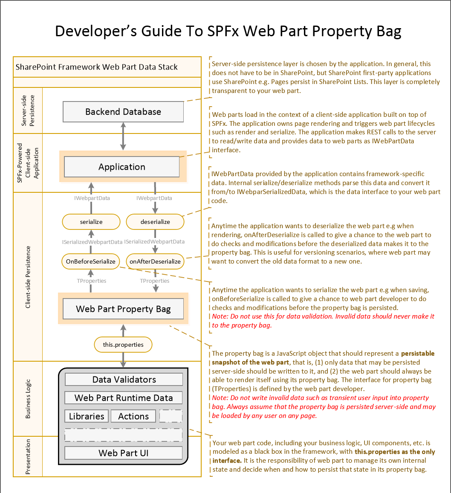

# Integrate web part properties with SharePoint

When building classic web parts, web part properties were isolated from SharePoint, and their values were managed by end-users. SharePoint Framework offers you a new set of capabilities that simplify managing web part properties' values and integrate them with SharePoint Search. This article explains how you can use these capabilities when building SharePoint Framework client-side web parts.

> [!IMPORTANT] 
> The following guide applies only to SharePoint Framework client-side web parts placed on modern SharePoint pages. Capabilities described in this article don't apply to classic web parts or SharePoint Framework client-side web parts placed on classic pages.

## Client-side web part properties

When building SharePoint Framework client-side web parts, you can define properties that can be configured by users. By using properties instead of fixed values, web parts are more flexible and suitable for many different scenarios.

Compared to classic web parts, there are some differences in how the SharePoint Framework handles web part properties. The following schema illustrates how web part property values flow through the different layers of SharePoint.



<br/>

Before accepting values for web part properties from end users, you should always [validate them](./validate-web-part-property-values.md). This not only allows you to ensure that your web parts are user-friendly, but also helps you prevent storing invalid data in the web part's configuration. 

Additionally, you should consider that the SharePoint Framework doesn't support personalization, and all users see the same configuration of the particular web part.

## Specify web part property value type

In classic SharePoint web parts, web part property values were isolated from SharePoint. If you had a web part property with a URL of a file stored in SharePoint, you had to manually ensure that this URL was valid and pointing to a correct document in case it was moved or renamed. Also, if you allowed users to enter some text to be displayed in the web part, that text wouldn't be indexed by SharePoint Search.

When building web parts, SharePoint Framework allows you to specify what kind of value the particular web part property holds. This configuration determines how SharePoint handles the value. Depending on the specified configuration, SharePoint can include the value of the particular property in the Search index, remove unsafe HTML, and even keep links to documents stored in SharePoint up to date in case a file gets moved or renamed.

To specify the configuration for your web part properties, in the web part class, override the **propertiesMetadata** getter:

```ts
import {
  BaseClientSideWebPart,
  IPropertyPaneConfiguration,
  PropertyPaneTextField,
  IWebPartPropertiesMetadata
} from '@microsoft/sp-webpart-base';

// ...

export default class ArticleLinkWebPart extends BaseClientSideWebPart<IArticleLinkWebPartProps> {
  // ...
  protected get propertiesMetadata(): IWebPartPropertiesMetadata {
    return {
      'title': { isSearchablePlainText: true },
      'intro': { isHtmlString: true },
      'image': { isImageSource: true },
      'url': { isLink: true }
    };
  }
  // ...
}
```

The **propertiesMetadata** method returns an object, where the property is a string and specifies the name of the web part property, and the value is an object specifying how SharePoint should handle that particular property. 

When overriding the **propertiesMetadata** method, you don't have to list all the web part properties. By default, web part properties' values are not processed by SharePoint, and you should include only those properties that you want to be processed.

Following is the list of possible values that can be set in the properties metadata and their impact on how the value of the web part property is processed by SharePoint.

<br/>

Metadata value|Searchable|Link fixup|Remove unsafe HTML
--------------|:--------:|:--------:|:----------------:
none (default)|no|no|no
`isSearchablePlainText`|yes|no|no
`isHtmlString`|yes|yes|yes
`isImageSource`|yes|yes|no
`isLink`|yes|yes|no

<br/>

> [!IMPORTANT] 
> When defining the configuration for your web part properties, you should use only one of the properties mentioned in the table for each web part property. Setting multiple properties will most likely lead to undesirable results, and you should avoid it.

By default the value of a web part property is not indexed by SharePoint Search and it's not processed by SharePoint in any way. It's passed to the web part exactly how it's been entered by the user configuring the web part.

If you specify the web part property as `isSearchablePlainText`, it is included in the full-text Search index. Whenever users search for any keywords included in the value of that property, SharePoint Search returns the page with the web part in the search results. If the value contains a link to a document stored in SharePoint, that link won't be updated if the referenced document is moved or renamed. Also, any HTML entered by users, is kept intact. When working with the value of such a property, you should treat it as plain-text and escape HTML that might be entered by users before rendering it on the page to avoid script injection.

When a web part property is defined as `isHtmlString`, SharePoint first of all removes any unsafe HTML, such as `script` tags, from the property value. The HTML that remains can be considered safe to render on a page. If the value contains any URLs pointing to files stored in SharePoint, as soon as one of these files is renamed or moved, SharePoint automatically updates the URL stored in the web part property. This significantly simplifies managing URLs across all web parts and pages in your tenant. HTML web part properties are also searchable, so users can look for any keywords included in the property value.

Property value types `isImageSource` and `isLink` are meant to be used for web part properties that include nothing else but a link to an image or a file stored in SharePoint. In both cases, SharePoint Search includes the content in the full-text index and keeps the specified URL up to date in case the referenced file is renamed or moved. Additionally, image sources may get additional processing to help images download faster. If the page has a title image, and the image is among the first five images on the page, or the image is in the first two rows on the page, the image is preloaded.
