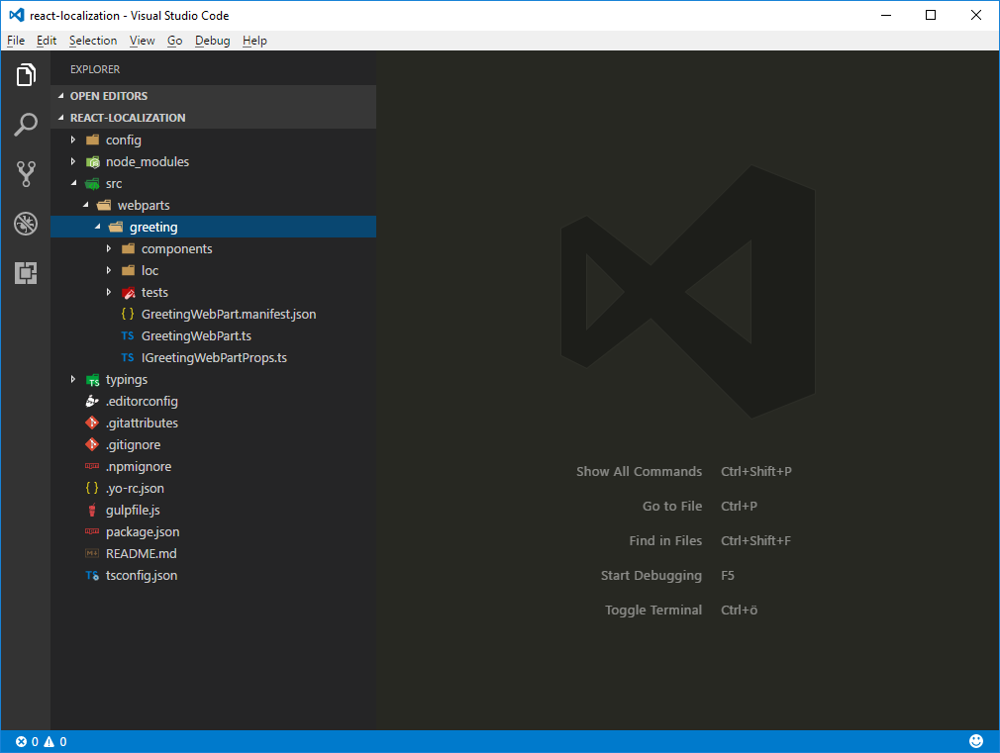
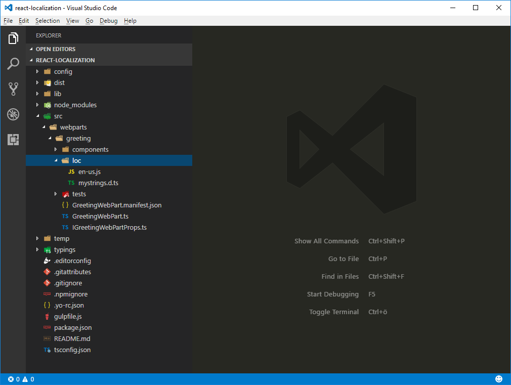
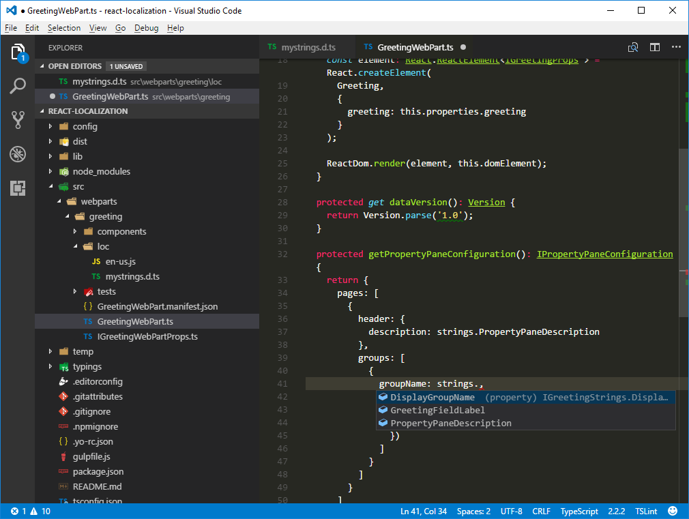
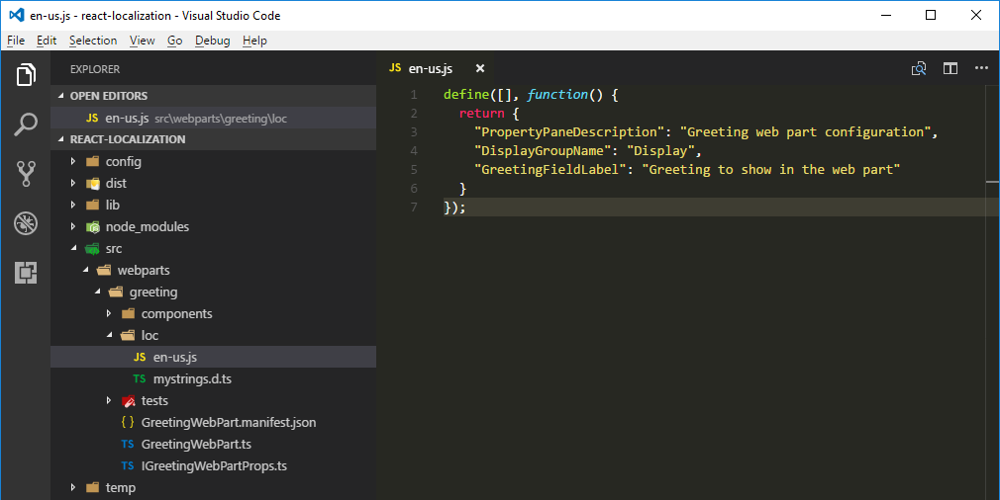
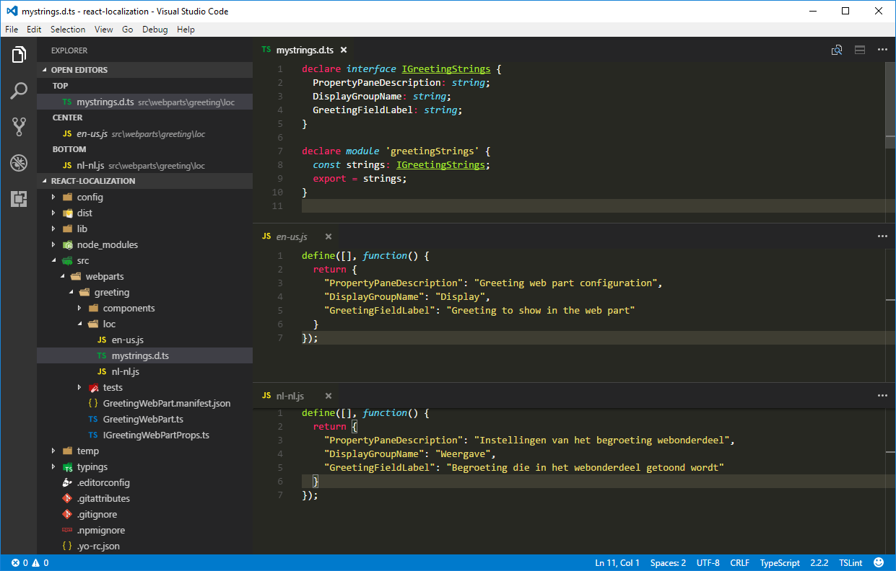
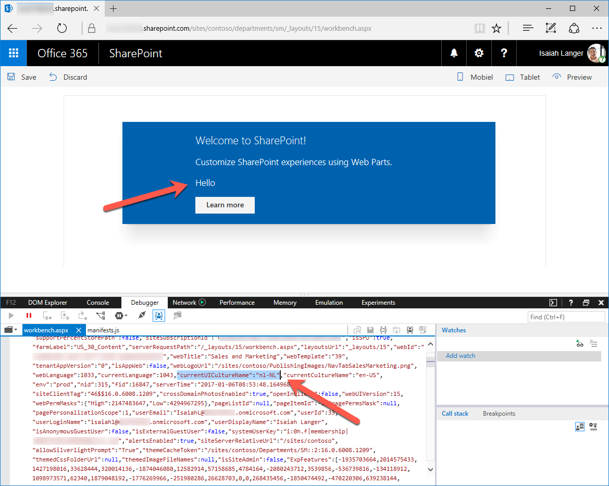
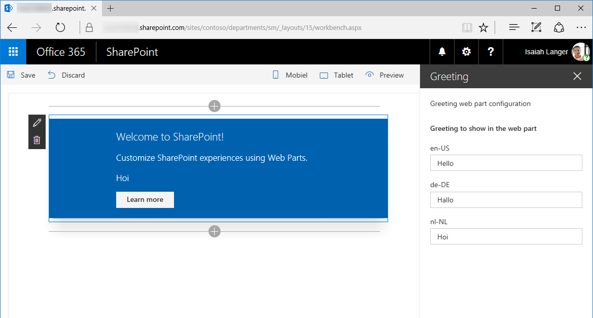

# Localize SharePoint Framework client-side web parts

> **Note:** The SharePoint Framework is currently in preview and is subject to change. SharePoint Framework client-side web parts are not currently supported for use in production environments.

When building web parts developers might need to localize them to different locales to support a broader group of users. This article illustrates how you can localize SharePoint Framework client-side web parts and verify that the localized values are displayed correctly. Following this tutorial you will localize a SharePoint Framework client-side web part to the Dutch (Netherlands) locale and verify that the localization is working correctly.

> **Note:** Before following the steps in this article, be sure to [set up your SharePoint client-side web part development environment](../../set-up-your-development-environment).

## Prepare the project

### Create a new project

Start by creating a new folder for your project.

```sh
md react-localization
```

Go to the project folder.

```sh
cd react-localization
```

In the project folder run the SharePoint Framework Yeoman generator to scaffold a new SharePoint Framework project.

```sh
yo @microsoft/sharepoint
```

When prompted, enter the following values:

- **react-localization** as your solution name
- **Use the current folder** for the location to place the files
- **Greeting** as your web part name
- **Greets the user** as your web part description
- **React** as the starting point to build the web part


Once the scaffolding completes, open your project folder in your code editor. This article uses Visual Studio Code in the steps and screenshots but you can use any editor you prefer.



### Replace the default code

In the code editor open the **./src/webparts/greeting/IGreetingWebPartProps.ts** file and paste the following code:

```ts
export interface IGreetingWebPartProps {
  greeting: string;
}
```

Next, open the **./src/webparts/greeting/GreetingWebPart.ts** file and change the **GreetingWebPart** class to:

```ts
export default class GreetingWebPart extends BaseClientSideWebPart<IGreetingWebPartProps> {

  public constructor(context: IWebPartContext) {
    super(context);
  }

  public render(): void {
    const element: React.ReactElement<IGreetingProps> = React.createElement(Greeting, {
      greeting: this.properties.greeting
    });

    ReactDom.render(element, this.domElement);
  }

  protected get propertyPaneSettings(): IPropertyPaneSettings {
    return {
      pages: [
        {
          header: {
            description: strings.PropertyPaneDescription
          },
          groups: [
            {
              groupName: strings.DisplayGroupName,
              groupFields: [
                PropertyPaneTextField('greeting', {
                  label: strings.GreetingFieldLabel
                })
              ]
            }
          ]
        }
      ]
    };
  }
}
```

Update the main React component by opening the **./src/webparts/greeting/components/Greeting.tsx** file and changing its code to:

```tsx
import * as React from 'react';
import { css } from 'office-ui-fabric-react';

import styles from '../Greeting.module.scss';
import { IGreetingWebPartProps } from '../IGreetingWebPartProps';

export interface IGreetingProps extends IGreetingWebPartProps {
}

export default class Greeting extends React.Component<IGreetingProps, {}> {
  public render(): JSX.Element {
    return (
      <div className={styles.greeting}>
        <div className={styles.container}>
          <div className={css('ms-Grid-row ms-bgColor-themeDark ms-fontColor-white', styles.row)}>
            <div className='ms-Grid-col ms-u-lg10 ms-u-xl8 ms-u-xlPush2 ms-u-lgPush1'>
              <span className='ms-font-xl ms-fontColor-white'>
                Welcome to SharePoint!
              </span>
              <p className='ms-font-l ms-fontColor-white'>
                Customize SharePoint experiences using Web Parts.
              </p>
              <p className='ms-font-l ms-fontColor-white'>
                {this.props.greeting}
              </p>
              <a
                className={css('ms-Button', styles.button)}
                href='https://github.com/SharePoint/sp-dev-docs/wiki'
              >
                <span className='ms-Button-label'>Learn more</span>
              </a>
            </div>
          </div>
        </div>
      </div>
    );
  }
}
```

Update the localization TypeScript type definition file by opening the **./src/webparts/greeting/loc/mystrings.d.ts** file and changing its code to:

```ts
declare interface IGreetingStrings {
  PropertyPaneDescription: string;
  DisplayGroupName: string;
  GreetingFieldLabel: string;
}

declare module 'greetingStrings' {
  const strings: IGreetingStrings;
  export = strings;
}
```

Update the US English locale file by opening the **./src/webparts/greeting/loc/en-us.js** file and changing its code to:

```js
define([], function() {
  return {
    "PropertyPaneDescription": "Greeting web part configuration",
    "DisplayGroupName": "Display",
    "GreetingFieldLabel": "Greeting to show in the web part"
  }
});
```

In the web part manifest update the default value of the **greeting** property by opening the **./src/webparts/greeting/GreetingWebPart.manifest.json** file and changing the **properties** section to:

```json
{
  // ...
  "preconfiguredEntries": [{
    "groupId": "edbc4e31-6085-4ffa-85f4-eeffcb0ea2d4",
    "group": { "default": "Under Development" },
    "title": { "default": "Greeting" },
    "description": { "default": "Greets the user" },
    "officeFabricIconFontName": "Page",
    "properties": {
      "greeting": "Hello"
    }
  }]
}
```

Verify that you have applied all changes correctly by running the following command:

```sh
gulp serve
```

In the SharePoint workbench add the web part to the page and open its configuration.


## Localize the web part manifest

Every SharePoint Framework client-side web part consists of code and a manifest, that provides information about the web part such as its title, description and icon. When adding a web part to the page, the information from the web part manifest is displayed to users. Using this information users decide if the particular web part is the one that they are looking for. Providing a descriptive title and description that correctly reflect the web part's functionality is essential if you want your web part to be used. If your web part will be used in non-English sites then localizing its metadata can help you improve the user experience even further.

Some properties defined in the web part manifest, such as title or description, support specifying localized values. For the complete list of all web part manifest properties that support localization read the [Simplify adding web parts with preconfigured entries](./simplify-adding-web-parts-with-preconfigured-entries#properties-of-a-preconfiguredentries-array-item) article. Properties that support localization are of type **ILocalizedString**. Each localized string must specify at least the default value and optionally values for other locales.

### Add localized values for title, description and group name

In the code editor op the **./src/webparts/greeting/GreetingWebPart.manifest.json** file. In the **preconfiguredEntries** array add translations for the **title**, **description** and **group** properties in Dutch (Netherlands), by changing the code to:

```json
{
  // ...
  "preconfiguredEntries": [{
    "groupId": "edbc4e31-6085-4ffa-85f4-eeffcb0ea2d4",
    "group": { "default": "Under Development", "nl-nl": "In ontwikkeling" },
    "title": { "default": "Greeting", "nl-nl": "Begroeting" },
    "description": { "default": "Greets the user", "nl-nl": "Begroet de gebruiker" },
    "officeFabricIconFontName": "Page",
    "properties": {
      "greeting": "Hello"
    }
  }]
}

```

Run the following command to verify that the project is working:

```sh
gulp serve
```

> Unfortunately at this moment moment, the SharePoint workbench doesn't support previewing the localized values from the web part manifest and it always uses the default translation.

## Localize web part property pane

When working with web parts users often need to configure it to their specific needs. Providing descriptive labels for the different configuration settings improves the usability of the web part and decreases the number of support cases required to help users to configure web parts.

Web part property pane consists of sections. Each section has a header and one or more controls allowing users to configure the web part. Each of these elements contains a label that describes its purpose. By default, SharePoint Framework client-side web parts load these strings from a JavaScript resource file, which, if you've built classic web parts with full-trust solutions, resembles .resx resource files. While it's not required to use these resource files and you could include the strings directly in code, it's highly recommended that you use resource files, because the little additional overhead they add, outweighs the effort required to extract all labels afterwards should you need to translate the web part later on.

The localization files used by the web part are stored in the **./src/webparts/greeting/loc** folder.



The **loc** folder contains a TypeScript type definition file (**./src/webpart/greeting/loc/mystrings.d.ts**) that informs TypeScript of the different strings included in the localized files. Using the information from this file your code editor can provide you with intellisense when working with strings in code. Additionally, while building your project, TypeScript can verify that you're not referring to a string that hasn't been defined.



For each locale supported by your web part, there is also a plain-JavaScript file (not TypeScript!) named in lowercase after the locale (for example **en-us.js**) containing the translated strings.



> **Important:** You should pay extra attention to verifying that all keys specified in the TypeScript type definition file for localization have translations in all localization JavaScript files.

en-US is the default locale used by the SharePoint Framework. If your web part is used on a site using a locale not supported by your web part, SharePoint Framework will fallback to the default locale, which by default is en-US. You can override this behavior by creating a locale file named **default.js** with the translations in your preferred language. While the name **default.js** doesn't follow the locale name convention, it is understood by the SharePoint Framework build process as a signal to use that particular locale file as the fallback locale instead of the standard US English locale.

### Add localized values for web part property pane strings

In the **./src/webparts/greetings/loc** folder create new file named **nl-nl.js** and paste the following code:

```js
define([], function() {
  return {
    "PropertyPaneDescription": "Instellingen van het begroeting webonderdeel",
    "DisplayGroupName": "Weergave",
    "GreetingFieldLabel": "Begroeting die in het webonderdeel getoond wordt"
  }
});
```

Verify that the keys in the TypeScript type definition file for localization match the contents of the locale files for US English and Dutch (Netherlands).



### Verify the localized web part property pane strings

When testing web parts using the hosted version of the SharePoint workbench or team sites on a developer tenant the locale of the context site expressed by the **spPageContextInfo.currentUICultureName** property is used as the default locale. When testing web parts using the local SharePoint workbench, SharePoint Framework uses by default the en-US locale to display web part property pane strings. There are two ways in which you can test the values from other locales supported by your web part.

#### Specify the locale to be tested in the project configuration

One way to specify the locale to be tested in the SharePoint workbench is by editing the project configuration. This approach is useful if you and your team members are working with the particular locale for a longer period of time or if you're building a web part that doesn't support US English. In the code editor open the **./config/write-manifests.json** file and change its code to:

```json
{
  "cdnBasePath": "<!-- PATH TO CDN -->",
  "debugLocale": "nl-nl"
}
```

Start the SharePoint workbench by running the following command:

```sh
gulp serve
```

When you add the web part to the page and open its configuration you will see the strings in the web part property pane displayed in Dutch (Netherlands).


#### Specify the locale to be tested using the command line argument

Another way to specify the locale to be used by the local SharePoint workbench is to specify it as an argument for the gulp task. Start the SharePoint workbench by running the following command:

```sh
gulp serve --locale=nl-nl
```

Once again, when you open your web part's configuration you will see that all property pane strings are displayed in Dutch (Netherlands) rather than the standard US English.


## Localize web part contents

The same way you localize web part property pane strings, you should localize all strings displayed by the web part in its body. In this process you can use exactly the same approach that you use when localizing web part property pane strings: for every string to be localized add a key in the localization TypeScript definition file and then translate the string to each of the supported locales in the corresponding locale JavaScript file.

### Globalize the web part strings

The default web part provided with the scaffolded SharePoint Framework project has its strings embedded in the code. Before you can localize these strings you have to replace them with references to the localized strings. This process is often referred to as **globalization** or **internationalization** (or **i18n** for short).

In the code editor open the **./src/webparts/greeting/components/Greetings.tsx** file. In the top section of the file, directly after the last `import` statement add reference to the localized strings:

```ts
import * as strings from 'greetingStrings';
```

Next, replace the contents of the **render** method with the following code:

```ts
// ...
export default class Greeting extends React.Component<IGreetingProps, {}> {
  public render(): JSX.Element {
    return (
      <div className={styles.greeting}>
        <div className={styles.container}>
          <div className={css('ms-Grid-row ms-bgColor-themeDark ms-fontColor-white', styles.row)}>
            <div className='ms-Grid-col ms-u-lg10 ms-u-xl8 ms-u-xlPush2 ms-u-lgPush1'>
              <span className='ms-font-xl ms-fontColor-white'>
                Welcome to SharePoint!
              </span>
              <p className='ms-font-l ms-fontColor-white'>
                Customize SharePoint experiences using Web Parts.
              </p>
              <p className='ms-font-l ms-fontColor-white'>
                {this.props.description}
              </p>
              <a
                className={css('ms-Button', styles.button)}
                href='https://github.com/SharePoint/sp-dev-docs/wiki'
              >
                <span className='ms-Button-label'>{strings.LearnMoreButtonLabel}</span>
              </a>
            </div>
          </div>
        </div>
      </div>
    );
  }
}
```

### Add new string to the localization TypeScript type definition file

Having replaced the string with a reference, the next step is to add that string to the localization files used by the web part. In the code editor open the **./src/webparts/greetings/loc/mystrings.d.ts** file and change its code to:

```ts
declare interface IGreetingStrings {
  PropertyPaneDescription: string;
  DisplayGroupName: string;
  DescriptionFieldLabel: string;
  LearnMoreButtonLabel: string;
}

declare module 'greetingStrings' {
  const strings: IGreetingStrings;
  export = strings;
}
```

### Add localized values for the new string

The last step is to provide localized versions for the new string in all locales supported by the web part. In the code editor open the **./src/webparts/greeting/loc/en-us.js** file and change its code to:

```js
define([], function() {
  return {
    "PropertyPaneDescription": "Greeting web part configuration",
    "DisplayGroupName": "Display",
    "GreetingFieldLabel": "Greeting to show in the web part",
    "LearnMoreButtonLabel": "Learn more"
  }
});
```

Next, open the **./src/webparts/greeting/loc/nl-nl.js** file and change its code to:

```js
define([], function() {
  return {
    "PropertyPaneDescription": "Instellingen van het begroeting webonderdeel",
    "DisplayGroupName": "Weergave",
    "GreetingFieldLabel": "Begroeting die in het webonderdeel getoond wordt",
    "LearnMoreButtonLabel": "Meer informatie"
  }
});
```

Confirm that the translated string is correctly displayed by running the following command:

```sh
gulp serve --locale=nl-nl
```


## Improve globalizing and localizing web parts using pseudo locales

Using localization when building web parts offers clear benefits but is also something that developers overlook easily. Often, translations to other locales are provided later in the project and it's hard for testers to verify that all code will properly support the different locales.

The same words in different locales have different lengths. For example, the same sentence translated from English to German or Dutch can become 35% longer. Without all translations available upfront it's hard for developers and designers to ensure that the user interface can properly accommodate longer strings.

Some languages use special characters beyond the standard ASCII character set. If designers chose to use a non-standard font it could happen, that this font doesn't properly support some special characters.

Finding out about all these issues late in the project will likely lead to delays and costly fixes. SharePoint Framework allows developers to use pseudo locales to address these issues while building web parts.

> **What are pseudo locales?** Pseudo locales are locales designed to test software for proper support of the different aspects of the localization process such as support for special characters, right-to-left languages or accommodating longer strings in the user interface.

### Add the base pseudo locale

In the **./src/webparts/greeting/loc** folder add a new file named **qps-ploc.js** and paste the following code:

```js
define([], function() {
  return {
    "PropertyPaneDescription": "[!!! Gřèèƭïñϱ ωèβ ƥářƭ çôñƒïϱúřáƭïôñ ℓôřè₥ ïƥƨú !!!]",
    "DisplayGroupName": "[!!! Ðïƨƥℓᥠℓ !!!]",
    "GreetingFieldLabel": "[!!! Gřèèƭïñϱ ƭô ƨλôω ïñ ƭλè ωèβ ƥářƭ ℓôřè₥ ïƥƨú !!!]",
    "LearnMoreButtonLabel": "[!!! £èářñ ₥ôřè ℓôř !!!]"
  }
});
```

> **Tip:** you can convert US English strings to their base pseudo locale equivalent at [http://www.pseudolocalize.com](http://www.pseudolocalize.com). By increasing the length of the generated string with 35% you should be able to simulate the length of strings translated to longer locales such as German or Dutch. Additionally, by surrounding the translations with brackets and exclamation marks you can more easily see if the whole string is displayed on the screen.

Test the project using the base pseudo locale by running the following command:

```sh
gulp serve --locale=qps-ploc
```

After adding the web part to the page you can quickly see that there are two strings in the web part body that have not been internationalized and are still displayed in US English rather than in the base pseudo locale.


If you open the web part property pane you can confirm that all strings and their special characters are displayed properly and that they fit in the available space correctly.


## Localize web part settings values

Microsoft SharePoint supports Multilingual User Interface (MUI) where site administrator can enable multiple languages for the user interface. When the user visits the site, its UI will automatically be displayed using the preferred language based on that user's preferences.

Web parts used on multilingual sites should automatically detect the currently used language and display their contents in that language. SharePoint Framework simplifies this process by automatically loading the resource file corresponding to the currently used language. Additionally, when testing SharePoint Framework web parts using the hosted version of the SharePoint workbench, the workbench also automatically uses the language preferred by the user.

Values configured through web part properties are not stored in resource files. By default the configured value is used as-is which might lead to inconsistencies such as greeting the user in English while her preferred language is Dutch.



Using the building blocks provided with the SharePoint Framework, you can extend your web part with support for storing web part configuration values in multiple languages. For each of the supported languages the property pane will display a separate text field in which the user can enter the translated value for that property.



> SharePoint site used to test the web part in this tutorial is a multilingual site with the US English, Dutch and German languages enabled. For more information about enabling additional languages in SharePoint sites see the [Choose the languages you want to make available for a site’s user interface](https://support.office.com/en-us/article/Choose-the-languages-you-want-to-make-available-for-a-site-s-user-interface-16d3a83c-05ab-4b50-8fbb-ff576a3351e8) support article.

### Add list of languages supported by SharePoint Online

The list of languages enabled on a multilingual SharePoint site is returned as an array of locale identifiers (LCID number, for example **1033** for US English). The currently used language is however returned as a string, for example **en-US** for US English. As JavaScript doesn't have a native way of converting the LCID number to the locale name and vice versa, you have to do it yourself.

In the code editor open the **./src/webparts/greeting/GreetingWebPart.ts** file and add a new class variable named **locales** with the following code:

```ts
export default class GreetingWebPart extends BaseClientSideWebPart<IGreetingWebPartProps> {
  private locales = {
    1025: 'ar-SA',
    1026: 'bg-BG',
    1027: 'ca-ES',
    1028: 'zh-TW',
    1029: 'cs-CZ',
    1030: 'da-DK',
    1031: 'de-DE',
    1032: 'el-GR',
    1033: 'en-US',
    1035: 'fi-FI',
    1036: 'fr-FR',
    1037: 'he-IL',
    1038: 'hu-HU',
    1040: 'it-IT',
    1041: 'ja-JP',
    1042: 'ko-KR',
    1043: 'nl-NL',
    1044: 'nb-NO',
    1045: 'pl-PL',
    1046: 'pt-BR',
    1048: 'ro-RO',
    1049: 'ru-RU',
    1050: 'hr-HR',
    1051: 'sk-SK',
    1053: 'sv-SE',
    1054: 'th-TH',
    1055: 'tr-TR',
    1057: 'id-ID',
    1058: 'uk-UA',
    1060: 'sl-SI',
    1061: 'et-EE',
    1062: 'lv-LV',
    1063: 'lt-LT',
    1066: 'vi-VN',
    1068: 'az-Latn-AZ',
    1069: 'eu-ES',
    1071: 'mk-MK',
    1081: 'hi-IN',
    1086: 'ms-MY',
    1087: 'kk-KZ',
    1106: 'cy-GB',
    1110: 'gl-ES',
    1164: 'prs-AF',
    2052: 'zh-CN',
    2070: 'pt-PT',
    2074: 'sr-Latn-CS',
    2108: 'ga-IE',
    3082: 'es-ES',
    5146: 'bs-Latn-BA',
    9242: 'sr-Latn-RS',
    10266: 'sr-Cyrl-RS',
  };

  // ...
}
```

The **locales** variable lists all languages supported by SharePoint Online.

Next, add two class methods that will allow you to get the LCID from the locale name and the locale name from the LCID:

```ts
export default class GreetingWebPart extends BaseClientSideWebPart<IGreetingWebPartProps> {
  // ...

  private getLocaleId(localeName: string): number {
    const pos: number = (Object as any).values(this.locales).indexOf(localeName);
    if (pos > -1) {
      return parseInt(Object.keys(this.locales)[pos]);
    }
    else {
      return 0;
    }
  }

  private getLocaleName(localeId: number): string {
    const pos: number = Object.keys(this.locales).indexOf(localeId.toString());
    if (pos > -1) {
      return (Object as any).values(this.locales)[pos];
    }
    else {
      return '';
    }
  }
}
```

### Remove the standard greeting web part property

Originally, the Greeting web part had the **greeting** property defined where the user could specify the greeting to be displayed on the screen. While adapting the web part to support multilingual SharePoint sites, you need to store multiple values - one for each language. Because you cannot know upfront which languages will be enabled on the particular site, rather than using one static web part property you will dynamically generate web part properties on runtime.

In the code editor open the **./src/webparts/greeting/GreetingWebPart.manifest.json** file and from the **properties** property remove the **greeting** property:

```json
{
  // ...

  "preconfiguredEntries": [{
    "groupId": "edbc4e31-6085-4ffa-85f4-eeffcb0ea2d4",
    "group": { "default": "Under Development", "nl-nl": "In ontwikkeling" },
    "title": { "default": "Greeting", "nl-nl": "Begroeting" },
    "description": { "default": "Greets the user", "nl-nl": "Begroet de gebruiker" },
    "officeFabricIconFontName": "Page",
    "properties": {
    }
  }]
}
```

Next, open the **./src/webparts/greeting/IGreetingWebPartProps.ts** file and remove the **greeting** property from the interface definition:

```ts
export interface IGreetingWebPartProps {
}
```

Because the main React component should display a greeting, open the **./src/webparts/greeting/components/Greeting.tsx** file and change the **IGreetingProps** interface to:

```ts
export interface IGreetingProps extends IGreetingWebPartProps {
  greeting: string;
}
```

With this modification you can pass the greeting to be displayed from the web part to the React component.

### Display property pane text fields for all enabled languages

Initially, using the web part configuration the user could configure a welcome message. The web part allowed the user to configure a single value which was displayed to all users no matter their language preference. By retrieving the list of languages enabled in the current site, you can dynamically display text fields to allow the user to provide translations for all the languages enabled in the particular site.

#### Load information about languages enabled in the current site

The first step is to load the information about all languages enabled in the current site. In the code editor open the **./src/webparts/greeting/GreetingWebPart.ts** file and add a new class variable named **supportedLanguageIds**:

```ts
export default class GreetingWebPart extends BaseClientSideWebPart<IGreetingWebPartProps> {
  // ...
  private supportedLanguageIds: number[];
  // ...
}
```

Next, in the **GreetingWebPart** class add a new method named **getSupportedLanguageIds**:

```ts
export default class GreetingWebPart extends BaseClientSideWebPart<IGreetingWebPartProps> {
  // ...

  private getSupportedLanguageIds(): Promise<number[]> {
    return new Promise<number[]>((resolve: (supportedLanguageIds: number[]) => void, reject: (error: any) => void): void => {
      if (this.supportedLanguageIds) {
        resolve(this.supportedLanguageIds);
        return;
      }

      this.context.httpClient.get(this.context.pageContext.web.absoluteUrl + '/_api/web?$select=SupportedUILanguageIds', {
        headers: {
          'Accept': 'application/json;odata=nometadata',
          'odata-version': ''
        }
      }).then((response: Response): Promise<{ SupportedUILanguageIds: number[] }> => {
        return response.json();
      }).then((siteInfo: { SupportedUILanguageIds: number[] }): void => {
        this.supportedLanguageIds = siteInfo.SupportedUILanguageIds;
        resolve(siteInfo.SupportedUILanguageIds);
      }, (error: any): void => {
        reject(error);
      });
    });
  }
}
```

The list of languages enabled in the current site should be loaded only once. If the information about the languages hasn't been loaded yet, the method uses the standard SharePoint Framework HTTP Client to call the SharePoint REST API and retrieve the information about languages enabled on the current site.

#### Dynamically render text fields for all languages

Now that you can retrieve the information about the languages enabled on the current site, you will display text fields for each of these languages so that the user can specify translated values for the greeting message.

In the code editor open the **./src/webparts/greeting/GreetingWebPart.ts** file and to the **GreetingWebPart** class add a new class variable named **greetingFields**:

```ts
export default class GreetingWebPart extends BaseClientSideWebPart<IGreetingWebPartProps> {
  // ...
  private greetingFields: IPropertyPaneField<any>[] = [];
  // ...
}
```

Change the **import** statement for the **@microsoft/sp-webpart-base** package to:

```ts
import {
  BaseClientSideWebPart,
  IPropertyPaneSettings,
  IWebPartContext,
  PropertyPaneTextField,
  IPropertyPaneField
} from '@microsoft/sp-webpart-base';
```

Change the **propertyPaneSettings** getter to get the list of text fields from the newly added **greetingFields** class variable:

```ts
export default class GreetingWebPart extends BaseClientSideWebPart<IGreetingWebPartProps> {
  // ...

  protected get propertyPaneSettings(): IPropertyPaneSettings {
    return {
      pages: [
        {
          header: {
            description: strings.PropertyPaneDescription
          },
          groups: [
            {
              groupName: strings.GreetingGroupName,
              groupFields: this.greetingFields
            }
          ]
        }
      ]
    };
  }

  // ...
}
```

If the particular site has multiple languages enabled, the web part will render multiple fields for the user to enter the greeting message. To make it clear that these fields belong together put them in a separate group. In the code editor open the **./src/webparts/greeting/loc/mystrings.d.ts** file and change its code to:

```ts
declare interface IGreetingStrings {
  PropertyPaneDescription: string;
  GreetingGroupName: string;
  LearnMoreButtonLabel: string;
}

declare module 'greetingStrings' {
  const strings: IGreetingStrings;
  export = strings;
}
```

Update the resource files accordingly to provide values for the **GreetingGroupName** string.

**./src/webparts/greeting/loc/en-us.js**:

```js
define([], function() {
  return {
    "PropertyPaneDescription": "Greeting web part configuration",
    "GreetingGroupName": "Greeting to show in the web part",
    "LearnMoreButtonLabel": "Learn more"
  }
});
```

**./src/webparts/greeting/loc/nl-nl.js**:

```js
define([], function() {
  return {
    "PropertyPaneDescription": "Instellingen van het begroeting webonderdeel",
    "GreetingGroupName": "Begroeting die in het webonderdeel getoond wordt",
    "LearnMoreButtonLabel": "Meer informatie"
  }
});
```

**./src/webparts/greeting/loc/qps-ploc.js**:

```js
define([], function() {
  return {
    "PropertyPaneDescription": "[!!! Gřèèƭïñϱ ωèβ ƥářƭ çôñƒïϱúřáƭïôñ ℓôřè₥ ïƥƨú !!!]",
    "GreetingGroupName": "[!!! Gřèèƭïñϱ ƭô ƨλôω ïñ ƭλè ωèβ ƥářƭ ℓôřè₥ ïƥƨú !!!]",
    "LearnMoreButtonLabel": "[!!! £èářñ ₥ôřè ℓôř !!!]"
  }
});
```

In the **./src/webparts/greeting/GreetingWebPart.ts** file override the **onPropertyPaneConfigurationStart** method using the code:

```ts
export default class GreetingWebPart extends BaseClientSideWebPart<IGreetingWebPartProps> {
  // ... 
  protected onPropertyPaneConfigurationStart(): void {
    this.context.statusRenderer.displayLoadingIndicator(this.domElement, 'languages');

    this.getSupportedLanguageIds()
      .then((supportedLanguageIds: number[]): void => {
        this.greetingFields = [];
        supportedLanguageIds.forEach(localeId => {
          this.greetingFields.push(PropertyPaneTextField(`greeting_${localeId}`, {
            label: this.getLocaleName(localeId)
          }));
        });

        this.refreshPropertyPane();
        this.context.statusRenderer.clearLoadingIndicator(this.domElement);
        this.render();
      });
  }
}
```

When the user opens the web part property pane, the method will load the information about the languages enabled in the current site. Because loading this information might take a moment, the method displays a loading indicator communicating its status to the user. Once the information about the enabled languages is loaded, the method creates a new property pane text field linked to a dynamic web part property named **greeting__lcid_**, for example **greeting_1033** for US English.

Once text fields for all enabled languages are constructed, the method refreshes the property pane by calling the **refreshPropertyPane** method. Finally, the method clears the web part loading indicator and re-renders the web part body.


### Show the greeting for the preferred user language

Originally the web part showed the same greeting for all users no matter their preferred language. Now that the web part has different translations of the welcome message stored, it should display the greeting using the language preferred by the current user.

In the **./src/webparts/greeting/GreetingWebPart.ts** file, change the web part's **render** method to:

```ts
export default class GreetingWebPart extends BaseClientSideWebPart<IGreetingWebPartProps> {
  // ...

  public render(): void {
    const element: React.ReactElement<IGreetingProps> = React.createElement(Greeting, {
      greeting: this.getGreeting()
    });

    ReactDom.render(element, this.domElement);
  }
}
```

Next, in the **GreetingWebPart** add a new method named **getGreeting**:

```ts
export default class GreetingWebPart extends BaseClientSideWebPart<IGreetingWebPartProps> {
  // ...

  private getGreeting(): string {
    let localeId: number = this.getLocaleId(this.context.pageContext.cultureInfo.currentUICultureName);
    if (localeId === 0) {
      localeId = 1033;
    }

    return this.properties[`greeting_${localeId}`];
  }

  // ...
}
```

This method gets the currently used language and converts it to a locale ID. Then it returns the value of the greeting property translated to that particular language.

## Localization in different build types

Depending on the selected build mode, the SharePoint Framework handles localization files differently. Following are some of the differences between the files generated in a debug and a release build.

### Localization files in the debug build

When building SharePoint Framework projects in debug mode, only the information about the default locale is included in the generated web part manifest. In debug mode SharePoint Framework either uses the default en-US locale or the locale that has been specified in the project configuration or using the **locale** argument in command line. Resource files with translated strings are not included in the output **dist** folder. Instead they are loaded on runtime from the intermediate **lib** folder using the path in the generated web part manifest.

Looking at the information about the **greetingStrings** module in the web part manifest generated during a debug build you can see that despite the different locales supported by the web part (en-US, nl-NL and qps-ploc) the path to the en-US resource file stored in the intermediate location has been assigned as the default path of the localization module.

```json
{
  "id": "edbc4e31-6085-4ffa-85f4-eeffcb0ea2d4",
  "alias": "GreetingWebPart",
  "componentType": "WebPart",
  "version": "0.0.1",
  "manifestVersion": 2,
  // ...
  "loaderConfig": {
    "entryModuleId": "greeting.bundle",
    "internalModuleBaseUrls": [
      "https://localhost:4321/"
    ],
    "scriptResources": {
      "greeting.bundle": {
        "type": "internal",
        "path": "dist/greeting.bundle.js"
      },
      "greetingStrings": {
        "defaultPath": "lib/webparts/greeting/loc/en-us.js",
        "type": "localized"
      },
      // ...
    }
  }
}
```

### Localization files in the release build

When building SharePoint Framework projects in release mode, the information about all available locales is included in the generated web part manifest. Additionally, resources for each locale are stored in a separate file. These resource files are copied, along with the web part manifest and the web part bundle to the **./temp/deploy** folder.

> **Important:** In release builds resource files are copied only to the **./temp/deploy** folder and not to the **./dist** folder. When deploying your web part to production you should therefore always use files from the **./temp/deploy** folder to ensure that you are deploying all files required by your web part.

Comparing the web part manifest generated in a release build you can see that now the **greetingStrings** module contains references to all supported locales.

```json
{
  "id": "edbc4e31-6085-4ffa-85f4-eeffcb0ea2d4",
  "alias": "GreetingWebPart",
  "componentType": "WebPart",
  "version": "0.0.1",
  "manifestVersion": 2,
  // ...
  "loaderConfig": {
    "entryModuleId": "greeting.bundle",
    "internalModuleBaseUrls": [
      "https://cdn.contoso.com/"
    ],
    "scriptResources": {
      "greeting.bundle": {
        "type": "internal",
        "path": "greeting.bundle_734e78a24ec5779bbc7a5a10603d4904.js"
      },
      "greetingStrings": {
        "defaultPath": "react-localization-greetingstrings_en-us_60a6b3dba7cc244bcc28781a2e292f85.js",
        "type": "localized",
        "paths": {
          "en-US": "react-localization-greetingstrings_en-us_60a6b3dba7cc244bcc28781a2e292f85.js",
          "nl-NL": "react-localization-greetingstrings_nl-nl_ecae5f3385f9e9bef23817b91d1a0bf1.js",
          "qps-ploc": "react-localization-greetingstrings_qps-ploc_dc97c611a9edc88818c84871f3749afb.js"
        }
      },
      // ...
    }
  }
}
```

When loading the web part on the page, using the information from the context site, the SharePoint Framework will automatically load the resource file for the corresponding locale. If no matching resource file is found, the SharePoint Framework will load the file specified in the **defaultPath** property. By keeping the resource files separate, the SharePoint Framework minimizes the amount of data loaded on the page to the locale that is actually being used in the particular site.