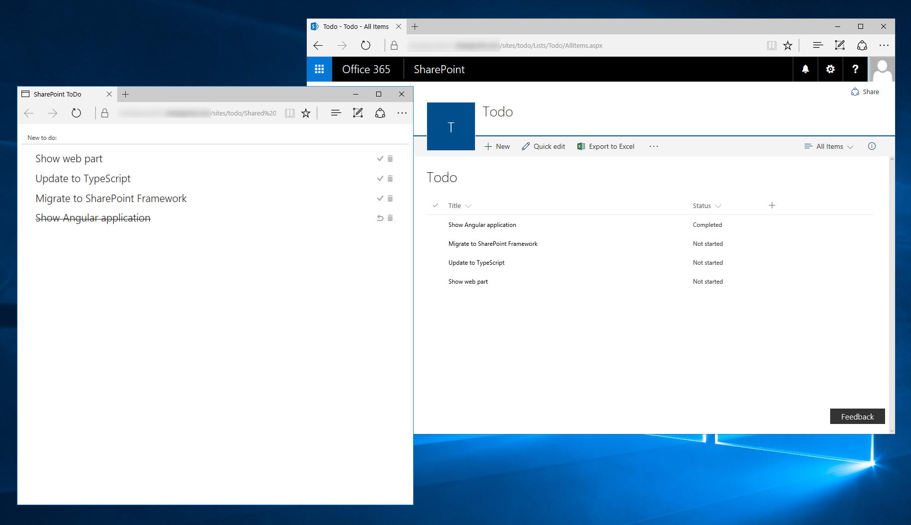
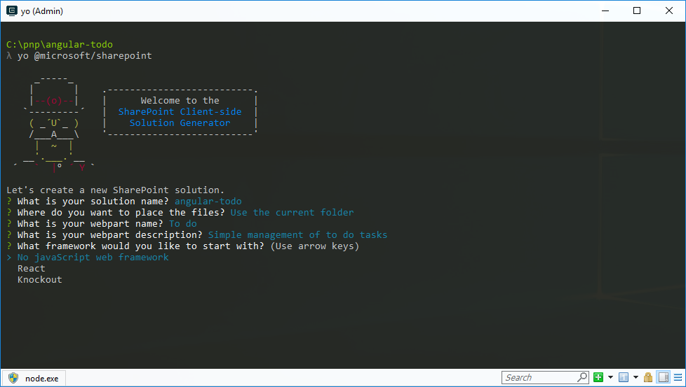
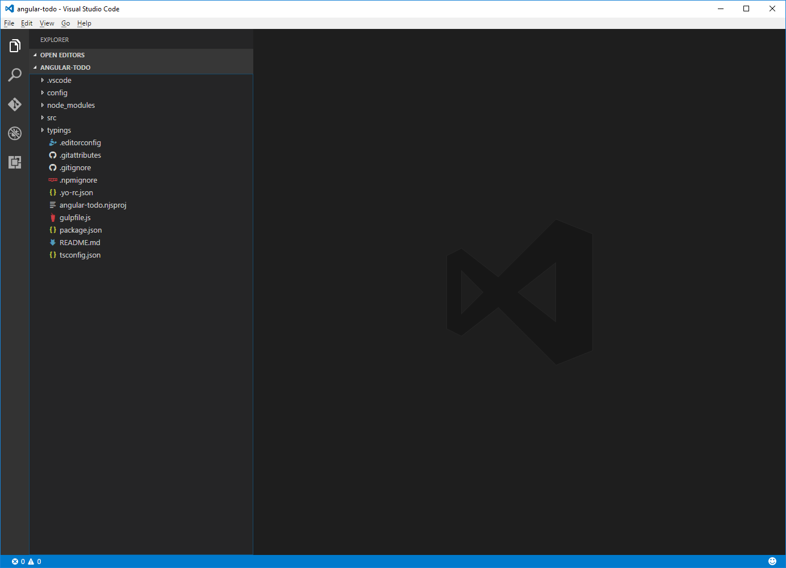
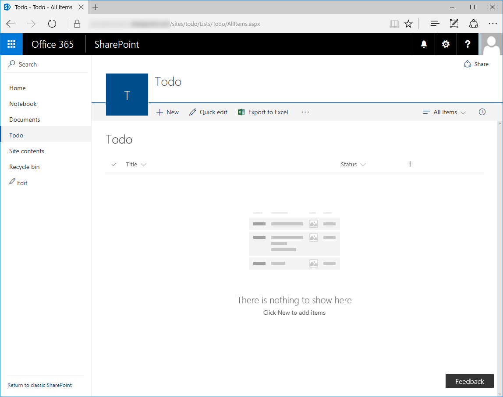
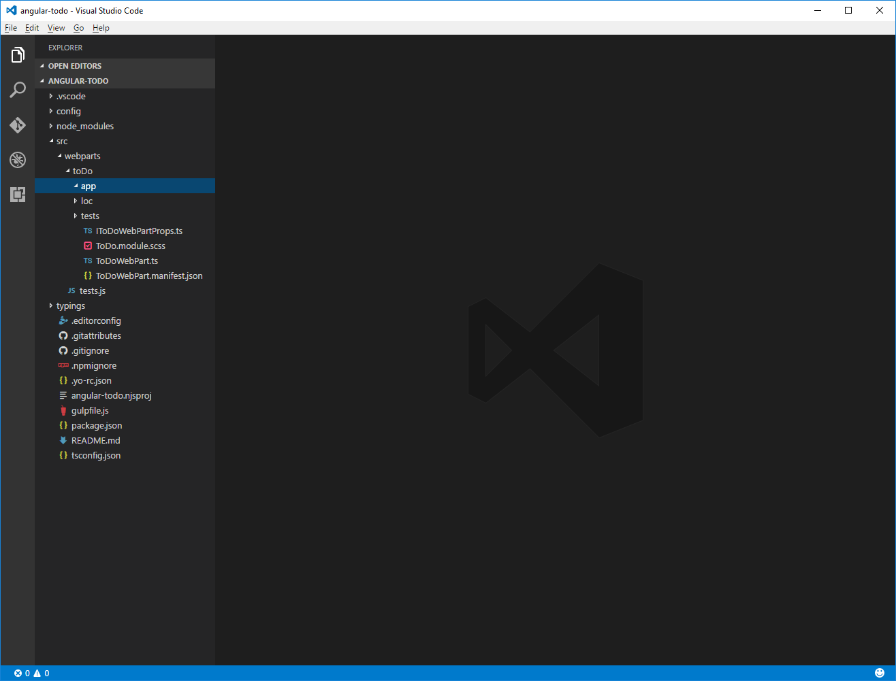
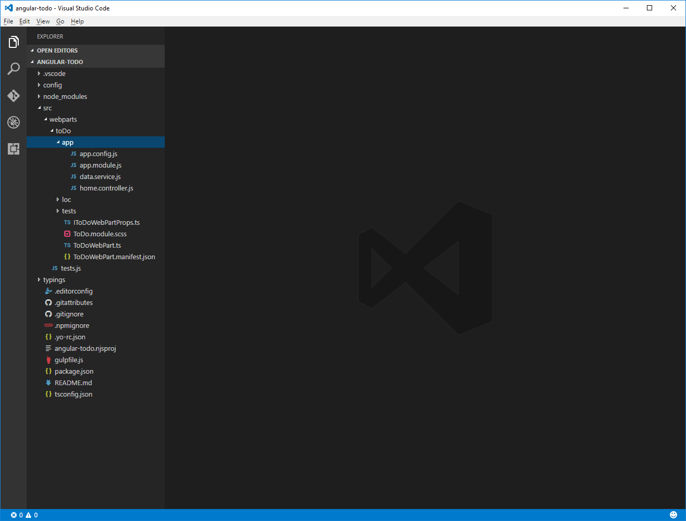
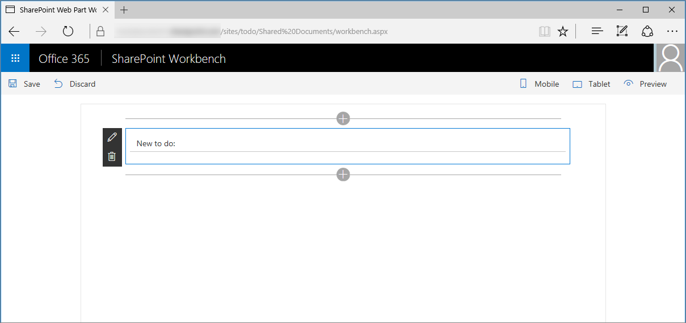
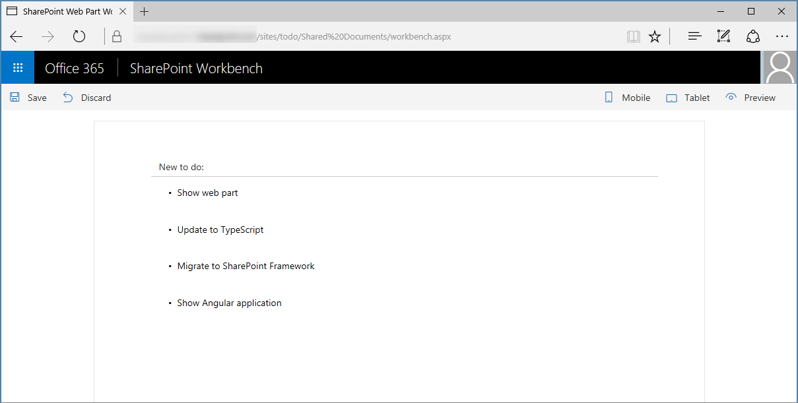
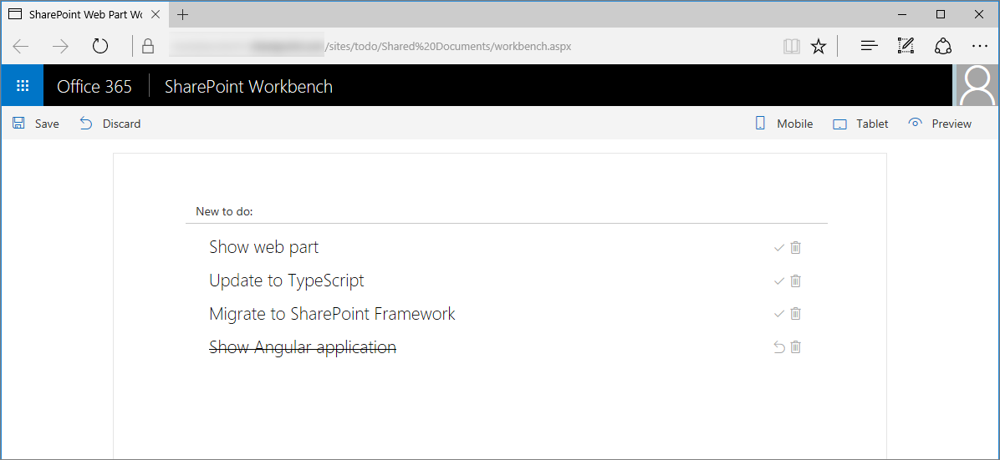
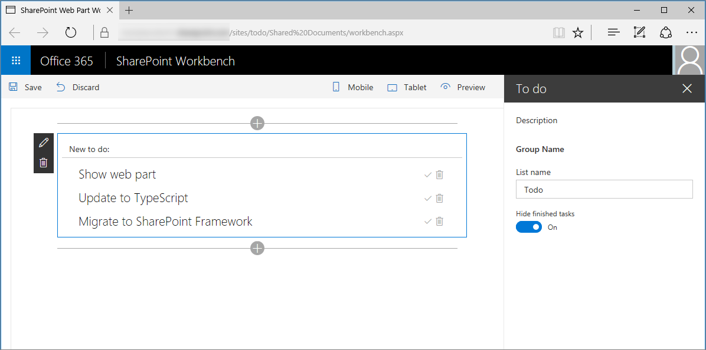

# Migrate AngularJS applications to SharePoint Framework

Many organizations have been using AngularJS for building SharePoint solutions in the past. This article shows how to migrate an existing AngularJS application styled using [ngOfficeUIFabric](http://ngofficeuifabric.com) - AngularJS directives for Office UI Fabric, to a SharePoint Framework client-side web part. The sample application used for this tutorial manages To Do items stored in a SharePoint list.



The source of the AngularJS application is available on GitHub at [angular-migration/angular-todo](https://github.com/SharePoint/sp-dev-fx-webparts/tree/dev/samples/angular-migration/angular-todo).

The source of the AngularJS application migrated to SharePoint Framework is available on GitHub at [samples/angular-todo](https://github.com/SharePoint/sp-dev-fx-webparts/tree/master/samples/angular-todo).

> [!NOTE] 
> Before following the steps in this article, be sure to [set up your development environment](../../set-up-your-development-environment.md) for building SharePoint Framework solutions.

## Set up project

Before you start migrating your AngularJS application, create and set up a new SharePoint Framework project to host the AngularJS application.

### Create new project

1. Create a new folder for your project:

  ```sh
  md angular-todo
  ```

2. Go to the project folder:

  ```sh
  cd angular-todo
  ```

3. In the project folder, run the SharePoint Framework Yeoman generator to scaffold a new SharePoint Framework project:

  ```sh
  yo @microsoft/sharepoint
  ```

4. When prompted, define values as follows:

  - **angular-todo** as your solution name
  - **Use the current folder** for the location to place the files
  - **To do** as your web part name
  - **Simple management of to do tasks** as your web part description
  - **No JavaScript web framework** as the starting point to build the web part

  

5. After the scaffolding completes, lock down the version of the project dependencies by running the following command:

  ```sh
  npm shrinkwrap
  ```

6. Open your project folder in your code editor. In this tutorial, you will use Visual Studio Code.

  

### Add AngularJS and ngOfficeUIFabric

In this tutorial you load both AngularJS and ngOfficeUIFabric from CDN. 

In the code editor, open the **config/config.json** file, and in the **externals** property, add the following lines:

```json
"angular": {
  "path": "https://cdnjs.cloudflare.com/ajax/libs/angular.js/1.6.6/angular.min.js",
  "globalName": "angular"
},
"ng-office-ui-fabric": "https://cdnjs.cloudflare.com/ajax/libs/ngOfficeUiFabric/0.12.3/ngOfficeUiFabric.js"
```

### Add AngularJS typings for TypeScript

Because you are referencing AngularJS in your web part's code, you also need AngularJS typings for TypeScript. To install them run the following in the command line:

```sh
  npm install @types/angular --save-dev
```

## Migrate the AngularJS application as-is

Start with migrating the AngularJS application with only the minimal code changes. Later, you will upgrade the application's plain JavaScript code to TypeScript and improve its integration with the client-side web part.

### Create SharePoint list

In your SharePoint site, create a new list called **Todo**. In the list, add a new choice column called **Status**. As available choices enter:

```text
  Not started
  In progress
  Completed
```

<br/>



### Copy AngularJS application files to the web part project

1. In the web part project, in the **src/webparts/toDo** folder, create a new folder called `app`.

  

2. From the source application, copy the contents of the **app** folder to the newly created **app** folder in the web part project.

  


### Load the AngularJS application in the client-side web part

1. In the code editor, open the **./src/webparts/toDo/ToDoWebPart.ts** file. After the last `import` statement, add the following code:

  ```ts
  import * as angular from 'angular';
  import 'ng-office-ui-fabric';
  ```

2. Change the contents of the **render** method to:

  ```ts
  export default class ToDoWebPart extends BaseClientSideWebPart<IToDoWebPartProps> {
    // ...
    public render(): void {
      if (this.renderedOnce === false) {
        require('./app/app.module');
        require('./app/app.config');
        require('./app/data.service');
        require('./app/home.controller');

        this.domElement.innerHTML = `
          <div class="${styles.toDo}">
            <div data-ng-controller="homeController as vm">
              <div class="${styles.loading}" ng-show="vm.isLoading">
                <uif-spinner>Loading...</uif-spinner>
              </div>
              <div class="entryform" ng-show="vm.isLoading === false">
                <uif-textfield uif-label="New to do:" uif-underlined ng-model="vm.newItem" ng-keydown="vm.todoKeyDown($event)"></uif-textfield>
              </div>
              <uif-list class="items" ng-show="vm.isLoading === false" >
                <uif-list-item ng-repeat="todo in vm.todoCollection" uif-item="todo" ng-class="{'done': todo.done}">
                  <uif-list-item-primary-text>{{todo.title}}</uif-list-item-primary-text>
                  <uif-list-item-actions>
                    <uif-list-item-action ng-click="vm.completeTodo(todo)" ng-show="todo.done === false">
                      <uif-icon uif-type="check"></uif-icon>
                    </uif-list-item-action>
                    <uif-list-item-action ng-click="vm.undoTodo(todo)" ng-show="todo.done">
                      <uif-icon uif-type="reactivate"></uif-icon>
                    </uif-list-item-action>
                    <uif-list-item-action ng-click="vm.deleteTodo(todo)">
                      <uif-icon uif-type="trash"></uif-icon>
                    </uif-list-item-action>
                  </uif-list-item-actions>
                </uif-list-item>
              </uif-list>
            </div>
          </div>`;

        angular.bootstrap(this.domElement, ['todoapp']);
      }
    }
    // ...
  }
  ```

### Update site path

In the code editor, open the **./src/webparts/toDo/app/app.config.js** file. Change the value of the **sharepointApi** constant to the server-relative URL of the SharePoint site where you created the Todo list, followed by `/_api/`.

### Add CSS styles

You also need to implement CSS styles that you are using the template. In the code editor, open the **ToDoWebPart.module.scss** file and replace its contents with:

```scss
.toDo {
  .loading {
    margin: 0 auto;
    width: 6em;
  }
}
```

### Trust the development certificate

By default, the development certificate required to load SharePoint Workbench and its resources over HTTPS is not trusted, and causes the web browser to show a warning when navigating to the SharePoint Workbench. In situations when you want to run SharePoint Workbench in the context of SharePoint, some web browsers prevent the Workbench from loading if the SSL certificate isn't trusted. To avoid this issue, you should trust the development certificate provided with the SharePoint Framework.

In the command line, execute:

```sh
gulp trust-dev-cert
```

### Preview web part in the hosted Workbench

1. In the command line, execute:

  ```sh
  gulp serve --nobrowser
  ```

2. To the URL of your SharePoint site, add `/_layouts/workbench.aspx`, for example, `https://contoso.sharepoint.com/_layouts/workbench.aspx`, and navigate to it in the web browser.

  If you followed all steps correctly, you should see the web part in the browser showing the form to add To Do items.

  

3. Add a few To Do items to verify that the web part is working as expected.

  

### Fix web part styling

Although the web part is working correctly, it doesn't look the same as the AngularJS application you started with. This is caused because ngOfficeUIFabric uses an older version of Office UI Fabric than the one available in the SharePoint Workbench. The easy fix would be to load the CSS styles used by ngOfficeUIFabric. The problem with that is that these styles would collide with the Office UI Fabric styles used by the SharePoint Workbench, breaking its user interface. A better solution is to add the styles required by the specific components to the web part styles.

1. In the code editor, open the **./src/webparts/toDo/ToDoWebPart.module.scss** file. Change its contents to:

  ```scss
  .toDo {
    .loading {
      margin: 0 auto;
      width: 6em;
    }

    .done :global .ms-ListItem-primaryText {
      text-decoration: line-through;
    }

    ul, li {
      margin: 0;
      padding: 0;
    }

    :global {
      .ms-Spinner{position:relative;height:20px}.ms-Spinner.ms-Spinner--large{height:28px}.ms-Spinner.ms-Spinner--large .ms-Spinner-label{left:34px;top:6px}.ms-Spinner-circle{position:absolute;border-radius:100px;background-color:#0078d7;opacity:0}@media screen and (-ms-high-contrast:active){.ms-Spinner-circle{background-color:#fff}}@media screen and (-ms-high-contrast:black-on-white){.ms-Spinner-circle{background-color:#000}}.ms-Spinner-label{position:relative;color:#333;font-family:Segoe UI Regular WestEuropean,Segoe UI,Tahoma,Arial,sans-serif;font-size:12px;font-weight:400;color:#0078d7;left:28px;top:2px}
      .ms-TextField{color:#333;font-family:Segoe UI Regular WestEuropean,Segoe UI,Tahoma,Arial,sans-serif;font-size:14px;font-weight:400;box-sizing:border-box;margin:0;padding:0;box-shadow:none;margin-bottom:8px}.ms-TextField.is-disabled .ms-TextField-field{background-color:#f4f4f4;border-color:#f4f4f4;pointer-events:none;cursor:default}.ms-TextField.is-disabled:-moz-placeholder,.ms-TextField.is-disabled:-ms-input-placeholder,.ms-TextField.is-disabled::-moz-placeholder,.ms-TextField.is-disabled::-webkit-input-placeholder{color:#a6a6a6}.ms-TextField.is-required .ms-Label:after{content:' *';color:#a80000}.ms-TextField.is-required:-moz-placeholder:after,.ms-TextField.is-required:-ms-input-placeholder:after,.ms-TextField.is-required::-moz-placeholder:after,.ms-TextField.is-required::-webkit-input-placeholder:after{content:' *';color:#a80000}.ms-TextField.is-active{border-color:#0078d7}.ms-TextField-field{box-sizing:border-box;margin:0;padding:0;box-shadow:none;border:1px solid #c8c8c8;border-radius:0;font-family:Segoe UI Semilight WestEuropean,Segoe UI Semilight,Segoe UI,Tahoma,Arial,sans-serif;font-size:12px;color:#333;height:32px;padding:6px 10px 8px;width:100%;min-width:180px;outline:0}.ms-TextField-field:hover{border-color:#767676}.ms-TextField-field:focus{border-color:#0078d7}@media screen and (-ms-high-contrast:active){.ms-TextField-field:focus,.ms-TextField-field:hover{border-color:#1aebff}}@media screen and (-ms-high-contrast:black-on-white){.ms-TextField-field:focus,.ms-TextField-field:hover{border-color:#37006e}}.ms-TextField-field:-moz-placeholder,.ms-TextField-field:-ms-input-placeholder,.ms-TextField-field::-moz-placeholder,.ms-TextField-field::-webkit-input-placeholder{color:#666}.ms-TextField-description{color:#767676;font-size:11px}.ms-TextField.ms-TextField--placeholder{position:relative}.ms-TextField.ms-TextField--placeholder .ms-Label{position:absolute;font-family:Segoe UI Semilight WestEuropean,Segoe UI Semilight,Segoe UI,Tahoma,Arial,sans-serif;font-size:12px;color:#666;padding:7px 0 7px 10px}.ms-TextField.ms-TextField--placeholder.is-disabled,.ms-TextField.ms-TextField--placeholder.is-disabled .ms-Label{color:#a6a6a6}@media screen and (-ms-high-contrast:active){.ms-TextField.ms-TextField--placeholder.is-disabled .ms-Label{color:#0f0}}@media screen and (-ms-high-contrast:black-on-white){.ms-TextField.ms-TextField--placeholder.is-disabled .ms-Label{color:#600000}}.ms-TextField.ms-TextField--underlined{border-bottom:1px solid #c8c8c8;display:table;width:100%;min-width:180px}.ms-TextField.ms-TextField--underlined:hover{border-color:#767676}@media screen and (-ms-high-contrast:active){.ms-TextField.ms-TextField--underlined:hover{border-color:#1aebff}}@media screen and (-ms-high-contrast:black-on-white){.ms-TextField.ms-TextField--underlined:hover{border-color:#37006e}}.ms-TextField.ms-TextField--underlined:active,.ms-TextField.ms-TextField--underlined:focus{border-color:#0078d7}.ms-TextField.ms-TextField--underlined .ms-Label{font-size:12px;margin-right:8px;display:table-cell;vertical-align:bottom;padding-left:12px;padding-bottom:5px;height:32px;width:1%;white-space:nowrap}.ms-TextField.ms-TextField--underlined .ms-TextField-field{border:0;float:left;display:table-cell;text-align:left;padding-top:8px;padding-bottom:2px}.ms-TextField.ms-TextField--underlined .ms-TextField-field:active,.ms-TextField.ms-TextField--underlined .ms-TextField-field:focus,.ms-TextField.ms-TextField--underlined .ms-TextField-field:hover{outline:0}.ms-TextField.ms-TextField--underlined.is-disabled{border-bottom-color:#eaeaea}.ms-TextField.ms-TextField--underlined.is-disabled .ms-Label{color:#a6a6a6}@media screen and (-ms-high-contrast:active){.ms-TextField.ms-TextField--underlined.is-disabled .ms-Label{color:#0f0}}@media screen and (-ms-high-contrast:black-on-white){.ms-TextField.ms-TextField--underlined.is-disabled .ms-Label{color:#600000}}.ms-TextField.ms-TextField--underlined.is-disabled .ms-TextField-field{background-color:transparent;color:#a6a6a6}.ms-TextField.ms-TextField--underlined.is-active{border-color:#0078d7}@media screen and (-ms-high-contrast:active){.ms-TextField.ms-TextField--underlined.is-active{border-color:#1aebff}}@media screen and (-ms-high-contrast:black-on-white){.ms-TextField.ms-TextField--underlined.is-active{border-color:#37006e}}.ms-TextField.ms-TextField--multiline .ms-TextField-field{line-height:17px;min-height:60px;min-width:260px;padding-top:6px;overflow:auto}.ms-Label,.ms-TextField.ms-TextField--multiline .ms-TextField-field{color:#333;font-family:Segoe UI Regular WestEuropean,Segoe UI,Tahoma,Arial,sans-serif;font-size:12px;font-weight:400}
      .ms-Label{margin:0;padding:0;box-shadow:none;box-sizing:border-box;display:block;padding:5px 0}.ms-Label.is-required:after{content:' *';color:#a80000}.ms-Label.is-disabled{color:#a6a6a6}@media screen and (-ms-high-contrast:active){.ms-Label.is-disabled{color:#0f0}}@media screen and (-ms-high-contrast:black-on-white){.ms-Label.is-disabled{color:#600000}}.is-disabled .ms-Label{color:#a6a6a6}@media screen and (-ms-high-contrast:active){.is-disabled .ms-Label{color:#0f0}}@media screen and (-ms-high-contrast:black-on-white){.is-disabled .ms-Label{color:#600000}}.ms-Toggle{color:#333;font-family:Segoe UI Regular WestEuropean,Segoe UI,Tahoma,Arial,sans-serif;font-size:14px;font-weight:400;box-sizing:border-box;margin:0;padding:0;box-shadow:none;position:relative;display:block;margin-bottom:26px}.ms-Toggle .ms-Label{position:relative;padding:0 0 0 62px;font-size:12px}.ms-Toggle:hover .ms-Label{color:#000}.ms-Toggle:active .ms-Label{color:#333}.ms-Toggle.is-disabled .ms-Label{color:#a6a6a6}@media screen and (-ms-high-contrast:active){.ms-Toggle.is-disabled .ms-Label{color:#0f0}}@media screen and (-ms-high-contrast:black-on-white){.ms-Toggle.is-disabled .ms-Label{color:#600000}}
      .ms-ListItem{font-family:"Segoe UI WestEuropean","Segoe UI",-apple-system,BlinkMacSystemFont,Roboto,"Helvetica Neue",sans-serif;-webkit-font-smoothing:antialiased;font-size:14px;font-weight:400;box-sizing:border-box;margin:0;padding:0;box-shadow:none;padding:9px 28px 3px;position:relative;display:block}.ms-ListItem::after,.ms-ListItem::before{display:table;content:"";line-height:0}.ms-ListItem::after{clear:both}.ms-ListItem-primaryText,.ms-ListItem-secondaryText,.ms-ListItem-tertiaryText{display:block;overflow:hidden;text-overflow:ellipsis;white-space:nowrap;display:block}.ms-ListItem-primaryText{font-family:"Segoe UI WestEuropean","Segoe UI",-apple-system,BlinkMacSystemFont,Roboto,"Helvetica Neue",sans-serif;-webkit-font-smoothing:antialiased;font-size:21px;font-weight:100;padding-right:80px;position:relative;top:-4px}.ms-ListItem-secondaryText{font-family:"Segoe UI WestEuropean","Segoe UI",-apple-system,BlinkMacSystemFont,Roboto,"Helvetica Neue",sans-serif;-webkit-font-smoothing:antialiased;font-size:14px;font-weight:400;line-height:25px;position:relative;top:-7px;padding-right:30px}.ms-ListItem-tertiaryText{font-family:"Segoe UI WestEuropean","Segoe UI",-apple-system,BlinkMacSystemFont,Roboto,"Helvetica Neue",sans-serif;-webkit-font-smoothing:antialiased;font-size:14px;font-weight:400;position:relative;top:-9px;margin-bottom:-4px;padding-right:30px}.ms-ListItem-metaText{font-family:"Segoe UI WestEuropean","Segoe UI",-apple-system,BlinkMacSystemFont,Roboto,"Helvetica Neue",sans-serif;-webkit-font-smoothing:antialiased;font-size:11px;font-weight:400;position:absolute;right:30px;top:39px}.ms-ListItem-image{float:left;height:70px;margin-left:-8px;margin-right:10px;width:70px}.ms-ListItem-selectionTarget{display:none}.ms-ListItem-actions{max-width:80px;position:absolute;right:30px;text-align:right;top:10px}.ms-ListItem-action{color:#a6a6a6;display:inline-block;font-size:15px;position:relative;text-align:center;top:3px;cursor:pointer;height:16px;width:16px}.ms-ListItem-action .ms-Icon{vertical-align:top}.ms-ListItem-action:hover{color:#666666;outline:1px solid transparent}.ms-ListItem.is-unread{border-left:3px solid #0078d7;padding-left:27px}.ms-ListItem.is-unread .ms-ListItem-metaText,.ms-ListItem.is-unread .ms-ListItem-secondaryText{color:#0078d7;font-weight:600}.ms-ListItem.is-unseen:after{border-right:10px solid transparent;border-top:10px solid #0078d7;left:0;position:absolute;top:0}.ms-ListItem.is-selectable .ms-ListItem-selectionTarget{display:block;height:20px;left:6px;position:absolute;top:13px;width:20px}.ms-ListItem.is-selectable .ms-ListItem-image{margin-left:0}.ms-ListItem.is-selectable:hover{background-color:#eaeaea;cursor:pointer;outline:1px solid transparent}.ms-ListItem.is-selectable:hover:before{-moz-osx-font-smoothing:grayscale;-webkit-font-smoothing:antialiased;display:inline-block;font-family:FabricMDL2Icons;font-style:normal;font-weight:400;speak:none;position:absolute;top:12px;left:6px;height:15px;width:15px;border:1px solid #767676}.ms-ListItem.is-selected:before{border:1px solid transparent}.ms-ListItem.is-selected:before,.ms-ListItem.is-selected:hover:before{-moz-osx-font-smoothing:grayscale;-webkit-font-smoothing:antialiased;display:inline-block;font-family:FabricMDL2Icons;font-style:normal;font-weight:400;speak:none;content:'\e041';font-size:15px;color:#767676;position:absolute;top:12px;left:6px}.ms-ListItem.is-selected:hover{background-color:#c7e0f4;outline:1px solid transparent}.ms-ListItem.ms-ListItem--document{padding:0}.ms-ListItem.ms-ListItem--document .ms-ListItem-itemIcon{width:70px;height:70px;float:left;text-align:center}.ms-ListItem.ms-ListItem--document .ms-ListItem-itemIcon .ms-Icon{font-size:38px;line-height:70px;color:#666666}.ms-ListItem.ms-ListItem--document .ms-ListItem-primaryText{display:block;overflow:hidden;text-overflow:ellipsis;white-space:nowrap;font-size:14px;padding-top:15px;padding-right:0;position:static}.ms-ListItem.ms-ListItem--document .ms-ListItem-secondaryText{display:block;overflow:hidden;text-overflow:ellipsis;white-space:nowrap;font-family:"Segoe UI WestEuropean","Segoe UI",-apple-system,BlinkMacSystemFont,Roboto,"Helvetica Neue",sans-serif;-webkit-font-smoothing:antialiased;font-size:11px;font-weight:400;padding-top:6px}.MailList{overflow-y:auto;-webkit-overflow-scrolling:touch;max-height:500px}.MailTile{margin-bottom:5px;padding:10px;background:red}
    }
  }
  ```

2. In the **./src/webparts/toDo/ToDoWebPart.ts** file, in the **render** method, change the application rendering template to use new Office UI Fabric icons.

  ```ts
  export default class ToDoWebPart extends BaseClientSideWebPart<IToDoWebPartProps> {
    // ...
    public render(): void {
      if (this.renderedOnce === false) {
        require('./app/app.module');
        require('./app/app.config');
        require('./app/data.service');
        require('./app/home.controller');

        this.domElement.innerHTML = `
          <div class="${styles.toDo}">
            <div data-ng-controller="homeController as vm">
              <div class="${styles.loading}" ng-show="vm.isLoading">
                <uif-spinner>Loading...</uif-spinner>
              </div>
              <div id="entryform" ng-show="vm.isLoading === false">
                <uif-textfield uif-label="New to do:" uif-underlined ng-model="vm.newItem" ng-keydown="vm.todoKeyDown($event)"></uif-textfield>
              </div>
              <uif-list id="items" ng-show="vm.isLoading === false" >
                <uif-list-item ng-repeat="todo in vm.todoCollection" uif-item="todo" ng-class="{'${styles.done}': todo.done}">
                  <uif-list-item-primary-text>{{todo.title}}</uif-list-item-primary-text>
                  <uif-list-item-actions>
                    <uif-list-item-action ng-click="vm.completeTodo(todo)" ng-show="todo.done === false">
                      <i class="ms-Icon ms-Icon--CheckMark" aria-hidden="true"></i>
                    </uif-list-item-action>
                    <uif-list-item-action ng-click="vm.undoTodo(todo)" ng-show="todo.done">
                      <i class="ms-Icon ms-Icon--RevToggleKey" aria-hidden="true"></i>
                    </uif-list-item-action>
                    <uif-list-item-action ng-click="vm.deleteTodo(todo)">
                      <i class="ms-Icon ms-Icon--Delete" aria-hidden="true"></i>
                    </uif-list-item-action>
                  </uif-list-item-actions>
                </uif-list-item>
              </uif-list>
            </div>
        </div>`;

      angular.bootstrap(this.domElement, ['todoapp']);
    }
  }
  // ...
}
```

<br/>

If you refresh the web part in the web browser, you see that it is now correctly styled.



## Upgrade the AngularJS application to TypeScript

The original AngularJS application is written in plain JavaScript, which makes maintaining it error-prone. When building SharePoint Framework client-side web parts, you can use TypeScript and benefit from its design-time type safety features. In the next section, you will migrate the plain JavaScript AngularJS code to TypeScript.

### Upgrade application configuration

In your project, rename the **./src/webparts/toDo/app/app.config.js** file to `app.config.ts`. Change its contents to:

```ts
import * as angular from 'angular';

export default function() {
  const todoapp: ng.IModule = angular.module('todoapp');
  todoapp.constant('sharepointApi', '/todo/_api/');
  todoapp.constant('todoListName', 'Todo');
  todoapp.constant('hideFinishedTasks', false);
}
```

### Upgrade data service

In your project, rename the **./src/webparts/toDo/app/data.service.js** file to `DataService.ts`. Change its contents to:

```ts
import * as angular from 'angular';

export interface ITodo {
  id: number;
  title: string;
  done: boolean;
}

interface ITodoItem {
  Id: number;
  Title: string;
  Status: string;
}

export interface IDataService {
  getTodos: () => angular.IPromise<ITodo[]>;
  addTodo: (todo: string) => angular.IPromise<{}>;
  deleteTodo: (todo: ITodo) => angular.IPromise<{}>;
  setTodoStatus: (todo: ITodo, done: boolean) => angular.IPromise<{}>;
}

export default class DataService implements IDataService {
  public static $inject: string[] = ['$q', '$http', 'sharepointApi', 'todoListName', 'hideFinishedTasks'];

  constructor(private $q: angular.IQService,
    private $http: angular.IHttpService,
    private sharepointApi: string,
    private todoListName: string,
    private hideFinishedTasks: boolean) {
  }

  public getTodos(): angular.IPromise<ITodo[]> {
    const deferred: angular.IDeferred<ITodo[]> = this.$q.defer();

    let url: string = `${this.sharepointApi}web/lists/getbytitle('${this.todoListName}')/items?$select=Id,Title,Status&$orderby=ID desc`;

    if (this.hideFinishedTasks === true) {
      url += "&$filter=Status ne 'Completed'";
    }

    this.$http({
      url: url,
      method: 'GET',
      headers: {
        'Accept': 'application/json;odata=nometadata'
      }
    }).then((result: angular.IHttpPromiseCallbackArg<{ value: ITodoItem[] }>): void => {
      const todos: ITodo[] = [];
      for (let i: number = 0; i < result.data.value.length; i++) {
        const todo: ITodoItem = result.data.value[i];
        todos.push({
          id: todo.Id,
          title: todo.Title,
          done: todo.Status === 'Completed'
        });
      }
      deferred.resolve(todos);
    });

    return deferred.promise;
  }

  public addTodo(todo: string): angular.IPromise<{}> {
    const deferred: angular.IDeferred<{}> = this.$q.defer();

    let listItemEntityTypeFullName: string = undefined;
    this.getListItemEntityTypeFullName()
      .then((entityTypeName: string): angular.IPromise<string> => {
        listItemEntityTypeFullName = entityTypeName;
        return this.getRequestDigest();
      })
      .then((requestDigest: string): void => {
        const body: string = JSON.stringify({
          '__metadata': { 'type': listItemEntityTypeFullName },
          'Title': todo
        });
        this.$http({
          url: `${this.sharepointApi}web/lists/getbytitle('${this.todoListName}')/items`,
          method: 'POST',
          headers: {
            'Accept': 'application/json;odata=nometadata',
            'Content-type': 'application/json;odata=verbose',
            'X-RequestDigest': requestDigest
          },
          data: body
        }).then((result: angular.IHttpPromiseCallbackArg<{}>): void => {
          deferred.resolve();
        });
      });

    return deferred.promise;
  }

  public deleteTodo(todo: ITodo): angular.IPromise<{}> {
    const deferred: angular.IDeferred<{}> = this.$q.defer();

    this.getRequestDigest()
      .then((requestDigest: string): void => {
        this.$http({
          url: `${this.sharepointApi}web/lists/getbytitle('${this.todoListName}')/items(${todo.id})`,
          method: 'POST',
          headers: {
            'Accept': 'application/json;odata=nometadata',
            'X-RequestDigest': requestDigest,
            'IF-MATCH': '*',
            'X-HTTP-Method': 'DELETE'
          }
        }).then((result: angular.IHttpPromiseCallbackArg<{}>): void => {
          deferred.resolve();
        });
      });

    return deferred.promise;
  }

  public setTodoStatus(todo: ITodo, done: boolean): angular.IPromise<{}> {
    const deferred: angular.IDeferred<{}> = this.$q.defer();

    let listItemEntityTypeFullName: string = undefined;
    this.getListItemEntityTypeFullName()
      .then((entityTypeName: string): angular.IPromise<string> => {
        listItemEntityTypeFullName = entityTypeName;
        return this.getRequestDigest();
      })
      .then((requestDigest: string): void => {
        const body: string = JSON.stringify({
          '__metadata': { 'type': listItemEntityTypeFullName },
          'Status': done ? 'Completed' : 'Not started'
        });
        this.$http({
          url: `${this.sharepointApi}web/lists/getbytitle('${this.todoListName}')/items(${todo.id})`,
          method: 'POST',
          headers: {
            'Accept': 'application/json;odata=nometadata',
            'Content-type': 'application/json;odata=verbose',
            'X-RequestDigest': requestDigest,
            'IF-MATCH': '*',
            'X-HTTP-Method': 'MERGE'
          },
          data: body
        }).then((result: angular.IHttpPromiseCallbackArg<{}>): void => {
          deferred.resolve();
        });
      });

    return deferred.promise;
  }

  private getRequestDigest(): angular.IPromise<string> {
    const deferred: angular.IDeferred<string> = this.$q.defer();

    this.$http({
      url: this.sharepointApi + 'contextinfo',
      method: 'POST',
      headers: {
        'Accept': 'application/json;odata=nometadata'
      }
    }).then((result: angular.IHttpPromiseCallbackArg<{ FormDigestValue: string }>): void => {
      deferred.resolve(result.data.FormDigestValue);
    }, (err: any): void => {
      deferred.reject(err);
    });

    return deferred.promise;
  }

  private getListItemEntityTypeFullName(): angular.IPromise<string> {
    const deferred: angular.IDeferred<string> = this.$q.defer();

    this.$http({
      url: `${this.sharepointApi}web/lists/getbytitle('${this.todoListName}')?$select=ListItemEntityTypeFullName`,
      method: 'GET',
      headers: {
        'Accept': 'application/json;odata=nometadata'
      }
    }).then((result: angular.IHttpPromiseCallbackArg<{ ListItemEntityTypeFullName: string }>): void => {
      deferred.resolve(result.data.ListItemEntityTypeFullName);
    }, (err: any): void => {
      deferred.reject(err);
    });

    return deferred.promise;
  }
}
```

### Upgrade home controller

In your project, rename the **./src/webparts/toDo/app/home.controller.js** file to `HomeController.ts`. Change its contents to:

```ts
import * as angular from 'angular';
import { IDataService, ITodo } from './DataService';

export default class HomeController {
  public isLoading: boolean = false;
  public newItem: string = null;
  public todoCollection: ITodo[] = [];

  public static $inject: string[] = ['DataService', '$window'];

  constructor(private dataService: IDataService, private $window: angular.IWindowService) {
    this.loadTodos();
  }

  private loadTodos(): void {
    this.isLoading = true;
    this.dataService.getTodos()
      .then((todos: ITodo[]): void => {
        this.todoCollection = todos;
      })
      .finally((): void => {
        this.isLoading = false;
      });
  }

  public todoKeyDown($event: KeyboardEvent): void {
    if ($event.keyCode === 13 && this.newItem.length > 0) {
      $event.preventDefault();

      this.todoCollection.unshift({ id: -1, title: this.newItem, done: false });

      this.dataService.addTodo(this.newItem)
        .then((): void => {
          this.newItem = null;
          this.dataService.getTodos()
            .then((todos: ITodo[]): void => {
              this.todoCollection = todos;
            });
        });
    }
  }

  public deleteTodo(todo: ITodo): void {
    if (this.$window.confirm('Are you sure you want to delete this todo item?')) {
      let index: number = -1;
      for (let i: number = 0; i < this.todoCollection.length; i++) {
        if (this.todoCollection[i].id === todo.id) {
          index = i;
          break;
        }
      }

      if (index > -1) {
        this.todoCollection.splice(index, 1);
      }

      this.dataService.deleteTodo(todo)
        .then((): void => {
          this.dataService.getTodos()
            .then((todos: ITodo[]): void => {
              this.todoCollection = todos;
            });
        });
    }
  }

  public completeTodo(todo: ITodo): void {
    todo.done = true;

    this.dataService.setTodoStatus(todo, true)
      .then((): void => {
        this.dataService.getTodos()
          .then((todos: ITodo[]): void => {
            this.todoCollection = todos;
          });
      });
  }

  public undoTodo(todo: ITodo): void {
    todo.done = false;

    this.dataService.setTodoStatus(todo, false)
      .then((): void => {
        this.dataService.getTodos()
          .then((todos: ITodo[]): void => {
            this.todoCollection = todos;
          });
      });
  }
}
```

### Upgrade application module

In your project, rename the **./src/webparts/toDo/app/app.module.js** file to `app.module.ts`. Change its contents to:

```ts
import * as angular from 'angular';
import config from './app.config';
import HomeController from './HomeController';
import DataService from './DataService';

import 'ng-office-ui-fabric';

const todoapp: angular.IModule = angular.module('todoapp', [
  'officeuifabric.core',
  'officeuifabric.components'
]);

config();

todoapp
  .controller('HomeController', HomeController)
  .service('DataService', DataService);
```

### Update reference to AngularJS application in the web part

Now that the AngularJS application is built using TypeScript, and its different pieces reference each other, it's no longer necessary for the web part to reference all pieces of the application. Instead, it only needs to load the main module, which in turn loads all other elements that build up the AngularJS application.

1. In the code editor, open the **./src/webparts/toDo/ToDoWebPart.ts** file. Change the **render** method to:

  ```ts
  export default class ToDoWebPart extends BaseClientSideWebPart<IToDoWebPartProps> {
    // ...
    public render(): void {
      if (this.renderedOnce === false) {
        require('./app/app.module');

        this.domElement.innerHTML = `
          <div class="${styles.toDo}">
            <div data-ng-controller="HomeController as vm">
              <div class="${styles.loading}" ng-show="vm.isLoading">
                <uif-spinner>Loading...</uif-spinner>
              </div>
              <div id="entryform" ng-show="vm.isLoading === false">
                <uif-textfield uif-label="New to do:" uif-underlined ng-model="vm.newItem" ng-keydown="vm.todoKeyDown($event)"></uif-textfield>
              </div>
              <uif-list id="items" ng-show="vm.isLoading === false" >
                <uif-list-item ng-repeat="todo in vm.todoCollection" uif-item="todo" ng-class="{'${styles.done}': todo.done}">
                  <uif-list-item-primary-text>{{todo.title}}</uif-list-item-primary-text>
                  <uif-list-item-actions>
                    <uif-list-item-action ng-click="vm.completeTodo(todo)" ng-show="todo.done === false">
                      <i class="ms-Icon ms-Icon--CheckMark" aria-hidden="true"></i>
                    </uif-list-item-action>
                    <uif-list-item-action ng-click="vm.undoTodo(todo)" ng-show="todo.done">
                      <i class="ms-Icon ms-Icon--RevToggleKey" aria-hidden="true"></i>
                    </uif-list-item-action>
                    <uif-list-item-action ng-click="vm.deleteTodo(todo)">
                      <i class="ms-Icon ms-Icon--Delete" aria-hidden="true"></i>
                    </uif-list-item-action>
                  </uif-list-item-actions>
                </uif-list-item>
              </uif-list>
            </div>
          </div>`;

        angular.bootstrap(this.domElement, ['todoapp']);
      }
    }
    // ...
  }
  ```

2. To verify that the upgrade to TypeScript has been successful, in the command line, run:

  ```sh
  gulp serve --nobrowser
  ```

3. In the web browser, refresh the SharePoint Workbench, which should display your web part as previously.

  

Even though the way the web part works hasn't changed, your code is improved. In case of a future update, you can more easily verify the correctness and integrity of your code already during development.

## Improve integration of the AngularJS application with the SharePoint Framework

At this point the AngularJS application works correctly and is wrapped in a SharePoint Framework client-side web part. While users can add the web part to the page, they cannot however configure how the web part should work. All of the configuration is embedded in the AngularJS application's code. In this section, you will extend the web part to allow configuration of the name of the list where the To Do items are stored and whether the web part should show finished tasks or not.

### Define web part properties

1. In the code editor, open the **./src/webparts/toDo/ToDoWebPart.manifest.json** file. Change the **properties** section to:

  ```json
  "properties": {
    "todoListName": "Todo",
    "hideFinishedTasks": false
  }
  ```

2. In the **./src/webparts/toDo/ToDoWebPart.ts** file, change the definition of the `IToDoWebPartProps` interface to:

  ```ts
  export interface IToDoWebPartProps {
    todoListName: string;
    hideFinishedTasks: boolean;
  }
  ```

3. In the **./src/webparts/toDo/ToDoWebPart.ts** file, change the first import statement to:

  ```ts
  import {
    BaseClientSideWebPart,
    IPropertyPaneSettings,
    PropertyPaneTextField,
    PropertyPaneToggle
  } from '@microsoft/sp-webpart-base';
  ```

4. In the same file, change the **getPropertyPaneConfiguration** method to:

  ```ts
  export default class ToDoWebPart extends BaseClientSideWebPart<IToDoWebPartProps> {
    // ...
    protected getPropertyPaneConfiguration(): IPropertyPaneConfiguration {
      return {
        pages: [
          {
            header: {
              description: strings.PropertyPaneDescription
            },
            groups: [
              {
                groupName: strings.BasicGroupName,
                groupFields: [
                  PropertyPaneTextField('todoListName', {
                    label: strings.ListNameFieldLabel
                  }),
                  PropertyPaneToggle('hideFinishedTasks', {
                    label: strings.HideFinishedTasksFieldLabel
                  })
                ]
              }
            ]
          }
        ]
      };
    }
    // ...
  }
  ```

5. Add the missing resource strings by changing the **./src/webparts/toDo/loc/mystrings.d.ts** file contents to:

  ```ts
  declare interface IToDoWebPartStrings {
    PropertyPaneDescription: string;
    BasicGroupName: string;
    ListNameFieldLabel: string;
    HideFinishedTasksFieldLabel: string;
  }

  declare module 'ToDoWebPartStrings' {
    const strings: IToDoWebPartStrings;
    export = strings;
  }
  ```

6. In the **./src/webparts/toDo/loc/en-us.js** file, add translations for the newly added strings:

  ```js
  define([], function() {
    return {
      "PropertyPaneDescription": "Description",
      "BasicGroupName": "Group Name",
      "ListNameFieldLabel": "List name",
      "HideFinishedTasksFieldLabel": "Hide finished tasks"
    }
  });
  ```

### Pass web part properties values to the AngularJS application

At this moment users can configure how the web part should work, but the AngularJS application isn't using these values. In this section, you will extend the AngularJS application to use the configuration values provided by users through the web part property pane. One way to do that is to broadcast an AngularJS event in the **render** method and subscribe to this event in the controller used in the web part.

#### Delete AngularJS configuration file

In your project, delete the **./src/webparts/toDo/app/app.config.ts** file. In the following steps you will update the application to get the configuration values from web part properties.

#### Remove reference to configuration

In the **./src/webparts/toDo/app/app.module.ts** file, remove the reference to the AngularJS configuration by changing its contents to:

```ts
import * as angular from 'angular';
import HomeController from './HomeController';
import DataService from './DataService';

import 'ng-office-ui-fabric';

const todoapp: angular.IModule = angular.module('todoapp', [
  'officeuifabric.core',
  'officeuifabric.components'
]);

todoapp
  .controller('HomeController', HomeController)
  .service('DataService', DataService);
```

#### Update data service to accept configuration value in method parameters

Originally the data service retrieved its configuration from the constants defined in the **app.config.ts** file. To use the configuration values configured in the web part properties instead, the specific methods must accept parameters.

In the code editor, open the **./src/webparts/toDo/app/DataService.ts** file, and change its contents to:

```ts
import * as angular from 'angular';

export interface ITodo {
  id: number;
  title: string;
  done: boolean;
}

interface ITodoItem {
  Id: number;
  Title: string;
  Status: string;
}

export interface IDataService {
  getTodos: (sharePointApi: string, todoListName: string, hideFinishedTasks: boolean) => angular.IPromise<ITodo[]>;
  addTodo: (todo: string, sharePointApi: string, todoListName: string) => angular.IPromise<{}>;
  deleteTodo: (todo: ITodo, sharePointApi: string, todoListName: string) => angular.IPromise<{}>;
  setTodoStatus: (todo: ITodo, done: boolean, sharePointApi: string, todoListName: string) => angular.IPromise<{}>;
}

export default class DataService implements IDataService {
  public static $inject: string[] = ['$q', '$http'];

  constructor(private $q: angular.IQService, private $http: angular.IHttpService) {
  }

  public getTodos(sharePointApi: string, todoListName: string, hideFinishedTasks: boolean): angular.IPromise<ITodo[]> {
    const deferred: angular.IDeferred<ITodo[]> = this.$q.defer();

    let url: string = `${sharePointApi}web/lists/getbytitle('${todoListName}')/items?$select=Id,Title,Status&$orderby=ID desc`;

    if (hideFinishedTasks === true) {
      url += "&$filter=Status ne 'Completed'";
    }

    this.$http({
      url: url,
      method: 'GET',
      headers: {
        'Accept': 'application/json;odata=nometadata'
      }
    }).then((result: angular.IHttpPromiseCallbackArg<{ value: ITodoItem[] }>): void => {
      const todos: ITodo[] = [];
      for (let i: number = 0; i < result.data.value.length; i++) {
        const todo: ITodoItem = result.data.value[i];
        todos.push({
          id: todo.Id,
          title: todo.Title,
          done: todo.Status === 'Completed'
        });
      }
      deferred.resolve(todos);
    });

    return deferred.promise;
  }

  public addTodo(todo: string, sharePointApi: string, todoListName: string): angular.IPromise<{}> {
    const deferred: angular.IDeferred<{}> = this.$q.defer();

    let listItemEntityTypeFullName: string = undefined;
    this.getListItemEntityTypeFullName(sharePointApi, todoListName)
      .then((entityTypeName: string): angular.IPromise<string> => {
        listItemEntityTypeFullName = entityTypeName;
        return this.getRequestDigest(sharePointApi);
      })
      .then((requestDigest: string): void => {
        const body: string = JSON.stringify({
          '__metadata': { 'type': listItemEntityTypeFullName },
          'Title': todo
        });
        this.$http({
          url: `${sharePointApi}web/lists/getbytitle('${todoListName}')/items`,
          method: 'POST',
          headers: {
            'Accept': 'application/json;odata=nometadata',
            'Content-type': 'application/json;odata=verbose',
            'X-RequestDigest': requestDigest
          },
          data: body
        }).then((result: angular.IHttpPromiseCallbackArg<{}>): void => {
          deferred.resolve();
        });
      });

    return deferred.promise;
  }

  public deleteTodo(todo: ITodo, sharePointApi: string, todoListName: string): angular.IPromise<{}> {
    const deferred: angular.IDeferred<{}> = this.$q.defer();

    this.getRequestDigest(sharePointApi)
      .then((requestDigest: string): void => {
        this.$http({
          url: `${sharePointApi}web/lists/getbytitle('${todoListName}')/items(${todo.id})`,
          method: 'POST',
          headers: {
            'Accept': 'application/json;odata=nometadata',
            'X-RequestDigest': requestDigest,
            'IF-MATCH': '*',
            'X-HTTP-Method': 'DELETE'
          }
        }).then((result: angular.IHttpPromiseCallbackArg<{}>): void => {
          deferred.resolve();
        });
      });

    return deferred.promise;
  }

  public setTodoStatus(todo: ITodo, done: boolean, sharePointApi: string, todoListName: string): angular.IPromise<{}> {
    const deferred: angular.IDeferred<{}> = this.$q.defer();

    let listItemEntityTypeFullName: string = undefined;
    this.getListItemEntityTypeFullName(sharePointApi, todoListName)
      .then((entityTypeName: string): angular.IPromise<string> => {
        listItemEntityTypeFullName = entityTypeName;
        return this.getRequestDigest(sharePointApi);
      })
      .then((requestDigest: string): void => {
        const body: string = JSON.stringify({
          '__metadata': { 'type': listItemEntityTypeFullName },
          'Status': done ? 'Completed' : 'Not started'
        });
        this.$http({
          url: `${sharePointApi}web/lists/getbytitle('${todoListName}')/items(${todo.id})`,
          method: 'POST',
          headers: {
            'Accept': 'application/json;odata=nometadata',
            'Content-type': 'application/json;odata=verbose',
            'X-RequestDigest': requestDigest,
            'IF-MATCH': '*',
            'X-HTTP-Method': 'MERGE'
          },
          data: body
        }).then((result: angular.IHttpPromiseCallbackArg<{}>): void => {
          deferred.resolve();
        });
      });

    return deferred.promise;
  }

  private getRequestDigest(sharePointApi: string): angular.IPromise<string> {
    const deferred: angular.IDeferred<string> = this.$q.defer();

    this.$http({
      url: sharePointApi + 'contextinfo',
      method: 'POST',
      headers: {
        'Accept': 'application/json;odata=nometadata'
      }
    }).then((result: angular.IHttpPromiseCallbackArg<{ FormDigestValue: string }>): void => {
      deferred.resolve(result.data.FormDigestValue);
    }, (err: any): void => {
      deferred.reject(err);
    });

    return deferred.promise;
  }

  private getListItemEntityTypeFullName(sharePointApi: string, todoListName: string): angular.IPromise<string> {
    const deferred: angular.IDeferred<string> = this.$q.defer();

    this.$http({
      url: `${sharePointApi}web/lists/getbytitle('${todoListName}')?$select=ListItemEntityTypeFullName`,
      method: 'GET',
      headers: {
        'Accept': 'application/json;odata=nometadata'
      }
    }).then((result: angular.IHttpPromiseCallbackArg<{ ListItemEntityTypeFullName: string }>): void => {
      deferred.resolve(result.data.ListItemEntityTypeFullName);
    }, (err: any): void => {
      deferred.reject(err);
    });

    return deferred.promise;
  }
}
```

<br/>

#### Broadcast properties change event

1. In the **./src/webparts/toDo/ToDoWebPart.ts** file, to the **ToDoWebPart** class, add a new property called `$injector`:

  ```ts
  export default class ToDoWebPart extends BaseClientSideWebPart<IToDoWebPartProps> {
    private $injector: angular.auto.IInjectorService;
    // ...
  }
  ```

2. In the same file, update the **render** method to:

  ```ts
  export default class ToDoWebPart extends BaseClientSideWebPart<IToDoWebPartProps> {
    // ...
    public render(): void {
      if (this.renderedOnce === false) {
        require('./app/app.module');

        this.domElement.innerHTML = `
          <div class="${styles.toDo}">
            <div data-ng-controller="HomeController as vm">
              <div class="${styles.configurationNeeded}" ng-show="vm.configurationNeeded">
                Please configure the web part
              </div>
              <div ng-show="vm.configurationNeeded === false">
                <div id="loading" ng-show="vm.isLoading">
                  <uif-spinner>Loading...</uif-spinner>
                </div>
                <div id="entryform" ng-show="vm.isLoading === false">
                  <uif-textfield uif-label="New to do:" uif-underlined ng-model="vm.newItem" ng-keydown="vm.todoKeyDown($event)"></uif-textfield>
                </div>
                <uif-list id="items" ng-show="vm.isLoading === false" >
                  <uif-list-item ng-repeat="todo in vm.todoCollection" uif-item="todo" ng-class="{'${styles.done}': todo.done}">
                    <uif-list-item-primary-text>{{todo.title}}</uif-list-item-primary-text>
                    <uif-list-item-actions>
                      <uif-list-item-action ng-click="vm.completeTodo(todo)" ng-show="todo.done === false">
                        <i class="ms-Icon ms-Icon--CheckMark" aria-hidden="true"></i>
                      </uif-list-item-action>
                      <uif-list-item-action ng-click="vm.undoTodo(todo)" ng-show="todo.done">
                        <i class="ms-Icon ms-Icon--RevToggleKey" aria-hidden="true"></i>
                      </uif-list-item-action>
                      <uif-list-item-action ng-click="vm.deleteTodo(todo)">
                        <i class="ms-Icon ms-Icon--Delete" aria-hidden="true"></i>
                      </uif-list-item-action>
                    </uif-list-item-actions>
                  </uif-list-item>
                </uif-list>
              </div>
            </div>
          </div>`;

        this.$injector = angular.bootstrap(this.domElement, ['todoapp']);
      }

      this.$injector.get('$rootScope').$broadcast('configurationChanged', {
        sharePointApi: this.context.pageContext.web.absoluteUrl + '/_api/',
        todoListName: this.properties.todoListName,
        hideFinishedTasks: this.properties.hideFinishedTasks
      });
    }
    // ...
  }
  ```

3. In the **./src/webparts/toDo/ToDoWebPart.module.scss** file, add the missing styles for the **.configurationNeeded** class:

  ```scss
  .toDo {
    /* ... */
    .configurationNeeded {
      margin: 0 auto;
      width: 100%;
      text-align: center;
    }
    /* ... */
  }
  ```

#### Subscribe to the properties changed event

1. In the code editor, open the **./src/webparts/toDo/app/HomeController.ts** file. In the **HomeController** class, add the following properties:

  ```ts
  export default class HomeController {
    // ...
    private sharePointApi: string = undefined;
    private todoListName: string = undefined;
    private hideFinishedTasks: boolean = false;
    private configurationNeeded: boolean = true;
    // ...
  }
  ```

2. Extend the constructor of the **HomeController** class with injecting the root scope service, and change its contents to:

  ```ts
  export default class HomeController {
    // ...
    public static $inject: string[] = ['DataService', '$window', '$rootScope'];

    constructor(private dataService: IDataService,
      private $window: angular.IWindowService,
      $rootScope: angular.IRootScopeService) {
      const vm: HomeController = this;
      this.init(undefined, undefined);

      $rootScope.$on('configurationChanged',
        (event: angular.IAngularEvent,
        args: {
          sharePointApi: string;
          todoListName: string;
          hideFinishedTasks: boolean;
          }): void => {
        vm.init(args.sharePointApi, args.todoListName, args.hideFinishedTasks);
      });
    }

    // ...
  }
  ```

3. To the **HomeController** class, add the **init** method:

  ```ts
  export default class HomeController {
    // ...
    private init(sharePointApi: string, todoListName: string, hideFinishedTasks?: boolean): void {
      if (sharePointApi !== undefined && sharePointApi.length > 0 &&
        todoListName !== undefined && todoListName.length > 0) {
        this.sharePointApi = sharePointApi;
        this.todoListName = todoListName;
        this.hideFinishedTasks = hideFinishedTasks;
        this.loadTodos();
        this.configurationNeeded = false;
      }
      else {
        this.configurationNeeded = true;
      }
    }
    // ...
  }
  ```

4. Update all remaining methods in the **HomeController** class to use the configuration values from the class properties:

  ```ts
  export default class HomeController {
    // ...
    private loadTodos(): void {
      this.isLoading = true;
      this.dataService.getTodos(this.sharePointApi, this.todoListName, this.hideFinishedTasks)
        .then((todos: ITodo[]): void => {
          this.todoCollection = todos;
        })
        .finally((): void => {
          this.isLoading = false;
        });
    }

    public todoKeyDown($event: KeyboardEvent): void {
      if ($event.keyCode === 13 && this.newItem.length > 0) {
        $event.preventDefault();

        this.todoCollection.unshift({ id: -1, title: this.newItem, done: false });

        this.dataService.addTodo(this.newItem, this.sharePointApi, this.todoListName)
          .then((): void => {
            this.newItem = null;
            this.dataService.getTodos(this.sharePointApi, this.todoListName, this.hideFinishedTasks)
              .then((todos: ITodo[]): void => {
                this.todoCollection = todos;
              });
          });
      }
    }

    public deleteTodo(todo: ITodo): void {
      if (this.$window.confirm('Are you sure you want to delete this todo item?')) {
        let index: number = -1;
        for (let i: number = 0; i < this.todoCollection.length; i++) {
          if (this.todoCollection[i].id === todo.id) {
            index = i;
            break;
          }
        }

        if (index > -1) {
          this.todoCollection.splice(index, 1);
        }

        this.dataService.deleteTodo(todo, this.sharePointApi, this.todoListName)
          .then((): void => {
            this.dataService.getTodos(this.sharePointApi, this.todoListName, this.hideFinishedTasks)
              .then((todos: ITodo[]): void => {
                this.todoCollection = todos;
              });
          });
      }
    }

    public completeTodo(todo: ITodo): void {
      todo.done = true;

      this.dataService.setTodoStatus(todo, true, this.sharePointApi, this.todoListName)
        .then((): void => {
          this.dataService.getTodos(this.sharePointApi, this.todoListName, this.hideFinishedTasks)
            .then((todos: ITodo[]): void => {
              this.todoCollection = todos;
            });
        });
    }

    public undoTodo(todo: ITodo): void {
      todo.done = false;

      this.dataService.setTodoStatus(todo, false, this.sharePointApi, this.todoListName)
        .then((): void => {
          this.dataService.getTodos(this.sharePointApi, this.todoListName, this.hideFinishedTasks)
            .then((todos: ITodo[]): void => {
              this.todoCollection = todos;
            });
        });
    }
  }
  ```

5. Verify that the web part is working correctly by executing the following in the command line:

  ```sh
  gulp serve --nobrowser
  ```

6. In your web browser, go to the SharePoint Workbench and add the web part to canvas. If you toggle the **Hide finished tasks** option, you should see completed tasks being displayed or hidden accordingly.

  
