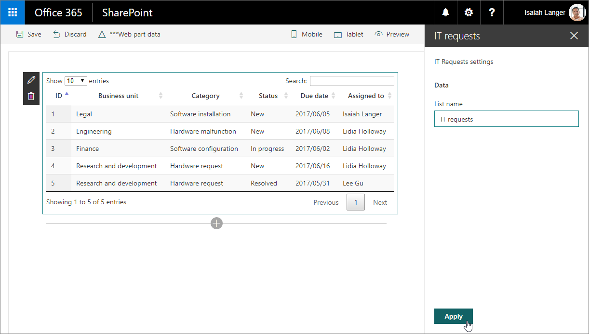

# Migrate jQuery and DataTables solution built using Script Editor web part to SharePoint Framework

One of the frequently used jQuery plug-ins is [DataTables](https://datatables.net/). With DataTables, you can easily build powerful data overviews of data coming from both SharePoint and external APIs.

## List of IT requests built using the Script Editor web part

To illustrate the process of migrating a SharePoint customization using DataTables to the SharePoint Framework, use the following solution that shows an overview of IT support requests retrieved from a SharePoint list.


The solution is built by using the standard SharePoint Script Editor web part. Following is the code used by the customization.

```html
<script src="https://code.jquery.com/jquery-1.12.4.js"></script>
<script src="https://cdn.datatables.net/1.10.15/js/jquery.dataTables.js"></script>
<script src="https://momentjs.com/downloads/moment.min.js"></script>
<link rel="stylesheet" type="text/css" href="https://cdn.datatables.net/1.10.15/css/jquery.dataTables.min.css" />
<table id="requests" class="display" cellspacing="0" width="100%">
  <thead>
    <tr>
      <th>ID</th>
      <th>Business unit</th>
      <th>Category</th>
      <th>Status</th>
      <th>Due date</th>
      <th>Assigned to</th>
    </tr>
  </thead>
</table>
<script>
  // UMD
  (function(factory) {
    "use strict";

    if (typeof define === 'function' && define.amd) {
      // AMD
      define(['jquery'], function ($) {
        return factory( $, window, document );
      });
    }
    else if (typeof exports === 'object') {
      // CommonJS
      module.exports = function (root, $) {
        if (!root) {
          root = window;
        }

        if (!$) {
          $ = typeof window !== 'undefined'
            ? require('jquery')
            : require('jquery')( root );
        }

        return factory($, root, root.document);
      };
    } else {
      // Browser
      factory(jQuery, window, document);
    }
  }
  (function($, window, document) {
    $.fn.dataTable.render.moment = function (from, to, locale) {
      // Argument shifting
      if (arguments.length === 1) {
        locale = 'en';
        to = from;
        from = 'YYYY-MM-DD';
      } else if (arguments.length === 2) {
        locale = 'en';
      }

      return function (d, type, row) {
        var m = window.moment(d, from, locale, true);

        // Order and type get a number value from Moment, everything else
          // sees the rendered value
          return m.format(type === 'sort' || type === 'type' ? 'x' : to);
        };
      };
    }));
</script>
<script>
$(document).ready(function() {
  $('#requests').DataTable({
    'ajax': {
      'url': "../_api/web/lists/getbytitle('IT Requests')/items?$select=ID,BusinessUnit,Category,Status,DueDate,AssignedTo/Title&$expand=AssignedTo/Title",
      'headers': { 'Accept': 'application/json;odata=nometadata' },
      'dataSrc': function(data) {
        return data.value.map(function(item) {
          return [
            item.ID,
            item.BusinessUnit,
            item.Category,
            item.Status,
            new Date(item.DueDate),
            item.AssignedTo.Title
          ];
        });
      }
    },
    columnDefs: [{
      targets: 4,
      render: $.fn.dataTable.render.moment('YYYY/MM/DD')
    }]
  });
});
</script>
```

First, the customization loads the libraries it uses: jQuery, DataTables, and Moment.js.

Next, it specifies the structure of the table used to present the data.

After creating the table, it wraps Moment.js into a DataTables plug-in so that dates displayed in the table can be formatted.

Finally, the customization uses DataTables to load and present the list of IT support requests. The data is loaded by using AJAX from a SharePoint list.

Thanks to using DataTables, end users get a powerful solution where they can easily filter, sort, and page through the results without any additional development effort.


## Migrate the IT requests overview solution from the Script Editor web part to the SharePoint Framework

Transforming this customization to the SharePoint Framework offers a number of benefits such as more user-friendly configuration and centralized management of the solution. Following is a step-by-step description of how you would migrate the solution to the SharePoint Framework. First, you'll migrate the solution to the SharePoint Framework with as few changes to the original code as possible. Later, you'll transform the solution's code to TypeScript to benefit from its development-time type safety features.

> [!NOTE]
> The source code of the project in the different stages of migration is available at [Tutorial: Migrate jQuery and DataTables solution built using Script Editor web part to SharePoint Framework](https://github.com/SharePoint/sp-dev-fx-webparts/tree/master/tutorials/tutorial-migrate-datatables).

### Create new SharePoint Framework project

1. Start by creating a new folder for your project:

    ```console
    md datatables-itrequests
    ```

1. Navigate to the project folder:

    ```console
    cd datatables-itrequests
    ```

1. In the project folder, run the SharePoint Framework Yeoman generator to scaffold a new SharePoint Framework project:

    ```console
    yo @microsoft/sharepoint
    ```

1. When prompted, enter the following values (*select the default option for all prompts omitted below*):

    - **What is your solution name?**: datatables-itrequests
    - **Which type of client-side component to create?**: Web Part
    - **What is your Web part name?**: IT requests
    - **What is your Web part description?**: Shows overview of IT support requests
    - **Which framework would you like to use?**: No JavaScript framework

1. Open your project folder in your code editor. In this tutorial, you'll use Visual Studio Code.

### Load JavaScript libraries

Similar to the original solution built using the Script Editor web part, first you need to load the JavaScript libraries required by the solution. In SharePoint Framework this usually consists of two steps: specifying the URL from which the library should be loaded, and referencing the library in the code.

1. Specify the URLs from which libraries should be loaded. In the code editor, open the **./config/config.json** file, and change the `externals` section to:

    ```json
    {
      // ..
      "externals": {
        "jquery": {
          "path": "https://code.jquery.com/jquery-1.12.4.min.js",
          "globalName": "jQuery"
        },
        "datatables.net": {
          "path": "https://cdn.datatables.net/1.10.15/js/jquery.dataTables.min.js",
          "globalName": "jQuery",
          "globalDependencies": [
            "jquery"
          ]
        },
        "moment": "https://cdnjs.cloudflare.com/ajax/libs/moment.js/2.27.0/moment.min.js"
      },
      // ..
    }
    ```

    This serves two purposes:

      1. When the SharePoint Framework build toolchain creates the bundle for the web part, it will ignore any `import` or `require` statements for these three packages and not include their source in the bundle. Without these, webpack (the tool used to create the bundle) would import these JavaScript libraries in the resulting SPFx component bundle.
      1. The SharePoint Framework build toolchain will add these three packages as dependencies in the component's manifest. This tells the SharePoint Framework's module loader to ensure these libraries have been loaded on the page before loading the component's bundle.

    > [!NOTE]
    > For more information on referencing external libraries in SharePoint Framework projects, see [Add an external library to your SharePoint client-side web part](../basics/add-an-external-library.md).

1. Open the **./src/webparts/itRequests/ItRequestsWebPart.ts** file, and after the last `import` statement add:

    ```typescript
    import 'jquery';
    import 'datatables.net';
    import 'moment';
    ```

### Define data table

As in the original solution, the next step is to define the structure of the table used to display the data.

In the code editor, open the **./src/webparts/itRequests/ItRequestsWebPart.ts** file, and change the `render()` method to:

```typescript
export default class ItRequestsWebPart extends BaseClientSideWebPart<IItRequestsWebPartProps> {
  public render(): void {
    this.domElement.innerHTML = `
      <link rel="stylesheet" type="text/css" href="https://cdn.datatables.net/1.10.15/css/jquery.dataTables.min.css" />
      <table id="requests" class="display ${styles.itRequests}" cellspacing="0" width="100%">
        <thead>
          <tr>
            <th>ID</th>
            <th>Business unit</th>
            <th>Category</th>
            <th>Status</th>
            <th>Due date</th>
            <th>Assigned to</th>
          </tr>
        </thead>
      </table>`;
  }
  // ...
}
```

### Register Moment.js plugin for DataTables

The next step is to define the Moment.js plug-in for DataTables so that dates in the table can be formatted.

1. In the **./src/webparts/itRequests** folder, create a new file named **moment-plugin.js**, and paste the following code:

    ```javascript
    // UMD
    (
      function (factory) {
        "use strict";

        if (typeof define === 'function' && define.amd) {
          // AMD
          define(['jquery'], function ($) {
            return factory($, window, document);
          });
        } else if (typeof exports === 'object') {
          // CommonJS
          module.exports = function (root, $) {
            if (!root) {
              root = window;
            }

            if (!$) {
              $ = typeof window !== 'undefined'
                ? require('jquery')
                : require('jquery')(root);
            }

            return factory($, root, root.document);
          };
        } else {
          // Browser
          factory(jQuery, window, document);
        }
      }

      (function ($, window, document) {
        $.fn.dataTable.render.moment = function (from, to, locale) {
          // Argument shifting
          if (arguments.length === 1) {
            locale = 'en';
            to = from;
            from = 'YYYY-MM-DD';
          } else if (arguments.length === 2) {
            locale = 'en';
          }

          return function (d, type, row) {
            var moment = require('moment');
            var m = moment(d, from, locale, true);

            // Order and type get a number value from Moment, everything else
            // sees the rendered value
            return m.format(type === 'sort' || type === 'type' ? 'x' : to);
          };
        };
      })
    );
    ```

1. For the web part to load the plug-in, it has to reference the newly created **moment-plugin.js** file. In the code editor, open the **./src/webparts/itRequests/ItRequestsWebPart.ts** file, and after the last `import` statement add:

    ```typescript
    import './moment-plugin';
    ```

### Initialize DataTables and load data

The last step is to include the code that initializes the data table and loads the data from SharePoint.

1. In the **./src/webparts/itRequests** folder, create a new file named **script.js**, and paste the following code:

    ```javascript
    $(document).ready(function () {
      $('#requests').DataTable({
        'ajax': {
          'url': "../../_api/web/lists/getbytitle('IT Requests')/items?$select=ID,BusinessUnit,Category,Status,DueDate,AssignedTo/Title&$expand=AssignedTo/Title",
          'headers': { 'Accept': 'application/json;odata=nometadata' },
          'dataSrc': function (data) {
            return data.value.map(function (item) {
              return [
                item.ID,
                item.BusinessUnit,
                item.Category,
                item.Status,
                new Date(item.DueDate),
                item.AssignedTo.Title
              ];
            });
          }
        },
        columnDefs: [{
          targets: 4,
          render: $.fn.dataTable.render.moment('YYYY/MM/DD')
        }]
      });
    });
    ```

> [!NOTE]
> Make sure to use internal name (or static name) of columns in `$select` and `$expend` parameters.

1. To reference this file in the web part, in the code editor, open the **./src/webparts/itRequests/ItRequestsWebPart.ts** file, and add `require('./script');` to the end of the `render()` method. The `render()` method should look like the following:

    ```typescript
    export default class ItRequestsWebPart extends BaseClientSideWebPart<IItRequestsWebPartProps> {
      public render(): void {
        this.domElement.innerHTML = `
          <link rel="stylesheet" type="text/css" href="https://cdn.datatables.net/1.10.15/css/jquery.dataTables.min.css" />
          <table id="requests" class="display ${styles.itRequests}" cellspacing="0" width="100%">
            <thead>
              <tr>
                <th>ID</th>
                <th>Business unit</th>
                <th>Category</th>
                <th>Status</th>
                <th>Due date</th>
                <th>Assigned to</th>
              </tr>
            </thead>
          </table>`;

        require('./script');
      }
      // ...
    }
    ```

1. Verify that the web part is working as expected in the command line by executing:

    ```console
    gulp serve --nobrowser
    ```

Because the web part loads its data from SharePoint, you've to test the web part by using the hosted SharePoint Framework Workbench. Navigate to **https://{your-tenant-name}.sharepoint.com/_layouts/workbench.aspx** and add the web part to the canvas. You should now see the IT requests displayed by using the DataTables jQuery plug-in.


## Add support for configuring the web part through web part properties

In the previous steps, you migrated the IT requests solutions from the Script Editor web part to the SharePoint Framework. While the solution already works as expected, it doesn't use any of the SharePoint Framework benefits. The name of the list from which IT requests are loaded is included in the code, and the code itself is plain JavaScript, which is harder to refactor than TypeScript.

The following steps illustrate how to extend the existing solution to allow users to specify the name of the list to load the data from. Later, you transform the code to TypeScript to benefit from its type safety features.

### Define web part property for storing the name of the list

1. Define a web part property to store the name of the list from which IT requests should be loaded. In the code editor, open the **./src/webparts/itRequests/ItRequestsWebPart.manifest.json** file, and rename the default `description` property to `listName` and clear its value.

    

1. Update the web part properties interface to reflect the changes in the manifest. In the code editor, open the **./src/webparts/itRequests/IItRequestsWebPartProps.ts** file, and change its contents to:

    ```typescript
    export interface IItRequestsWebPartProps {
      listName: string;
    }
    ```

1. Update the display labels for the `listName` property. Open the **./src/webparts/itRequests/loc/mystrings.d.ts** file, and change its contents to:

    ```typescript
    declare interface IItRequestsStrings {
      PropertyPaneDescription: string;
      BasicGroupName: string;
      ListNameFieldLabel: string;
    }

    declare module 'itRequestsStrings' {
      const strings: IItRequestsStrings;
      export = strings;
    }
    ```

1. Open the **./src/webparts/itRequests/loc/en-us.js** file, and change its contents to:

    ```javascript
    define([], function() {
      return {
        "PropertyPaneDescription": "IT Requests settings",
        "BasicGroupName": "Data",
        "ListNameFieldLabel": "List name"
      }
    });
    ```

1. Update the web part to use the newly defined property. In the code editor, open the **./src/webparts/itRequests/ItRequestsWebPart.ts** file, and change the `getPropertyPaneConfiguration()` method to:

    ```typescript
    export default class ItRequestsWebPart extends BaseClientSideWebPart<IItRequestsWebPartProps> {
    // ...
      protected getPropertyPaneConfiguration(): IPropertyPaneConfiguration {
        return {
          pages: [{
            header: {
              description: strings.PropertyPaneDescription
            },
            groups: [{
              groupName: strings.BasicGroupName,
              groupFields: [
                PropertyPaneTextField('listName', {
                  label: strings.ListNameFieldLabel
                })
              ]
            }]
          }]
        };
      }

      protected get disableReactivePropertyChanges(): boolean {
        return true;
      }
    }
    ```

To prevent the web part from reloading as users type the name of the list, you also configured the web part to use the non-reactive property pane by adding the `disableReactivePropertyChanges()` method and setting its return value to `true`.

### Use the configured name of the list to load the data from

Initially, the name of the list from which the data should be loaded was embedded in the REST query. Now that users can configure this name, the configured value should be injected into the REST query before loading the data. The easiest way to do that is by moving the contents of the **script.js** file to the main web part file.

1. In the code editor, open the **./src/webparts/itRequests/ItRequestsWebPart.ts** file, and change the `render()` method to:

    ```typescript
    var $: any = (window as any).$;

    export default class ItRequestsWebPart extends BaseClientSideWebPart<IItRequestsWebPartProps> {
      public render(): void {
        this.domElement.innerHTML = `
          <link rel="stylesheet" type="text/css" href="https://cdn.datatables.net/1.10.15/css/jquery.dataTables.min.css" />
          <table class="display ${styles.itRequests}" cellspacing="0" width="100%">
            <thead>
              <tr>
                <th>ID</th>
                <th>Business unit</th>
                <th>Category</th>
                <th>Status</th>
                <th>Due date</th>
                <th>Assigned to</th>
              </tr>
            </thead>
          </table>`;

        $(document).ready(() => {
          $('table', this.domElement).DataTable({
            'ajax': {
              'url': `../../_api/web/lists/getbytitle('${escape(this.properties.listName)}')/items?$select=ID,BusinessUnit,Category,Status,DueDate,AssignedTo/Title&$expand=AssignedTo/Title`,
              'headers': { 'Accept': 'application/json;odata=nometadata' },
              'dataSrc': function (data) {
                return data.value.map(function (item) {
                  return [
                    item.ID,
                    item.BusinessUnit,
                    item.Category,
                    item.Status,
                    new Date(item.DueDate),
                    item.AssignedTo.Title
                  ];
                });
              }
            },
            columnDefs: [{
              targets: 4,
              render: $.fn.dataTable.render.moment('YYYY/MM/DD')
            }]
          });
        });
      }

      // ...
    }
    ```

1. Instead of referencing the code from the **script.js** file, all of its contents are a part of the web part's `render` method. In the REST query, you can now replace the fixed name of the list with the value of the `listName` property that holds the name of the list as configured by the user. Before using the value, it's being escaped by using the lodash's `escape` function to disallow script injection.

    At this point, the bulk of the code is still written using plain JavaScript. To avoid build issues with the `$` jQuery variable, you had to define it as `any` type before the class definition. Later, when transforming the code to TypeScript, you replace it with a proper type definition.

    As you've moved the contents of the **script.js** file into the main web part file, the **script.js** is no longer necessary, and you can delete it from the project.

1. To verify that the web part is working as expected, run the following in the command line:

    ```console
    gulp serve --nobrowser
    ```

1. Navigate to the hosted Workbench and add the web part to the canvas. Open the web part property pane, specify the name of the list with IT requests, and select the **Apply** button to confirm the changes.

    You should now see IT requests displayed in the web part.

    

## Transform the plain JavaScript code to TypeScript

Using TypeScript over plain JavaScript offers a number of benefits. Not only is TypeScript easier to maintain and refactor, but it also allows you to catch errors earlier. The following steps describe how you would transform the original JavaScript code to TypeScript.

### Add type definitions for used libraries

To function properly, TypeScript requires type definitions for the different libraries used in the project. Type definitions are often distributed as npm packages in the @types namespace.

1. Install type definitions for jQuery and DataTables by executing the following in the command line:

    ```console
    npm install @types/jquery@1.10.34 @types/datatables.net@1.10.15 --save-dev --save-exact
    ```

    > [!TIP]
    > In this example, we are specifying the exact version of the NPM package we want to install. This will ensure that NPM installs a type declaration package that matches the version of jQuery and the datatables library we are using in our project.
    >
    > The `--save-dev` argument tells NPM to save the references to these two packages in the `devDependencies` collection in the **package.json** file. TypeScript declarations are only needed in development, which is why we don't want them in the `dependencies` collection.
    >
    > The `--save-exact` argument tells NPM to add references to the specific version in the **package.json** file and not add the notation to enable automatic upgrades to a more recent version.

    Type definitions for Moment.js are distributed together with the Moment.js package. Even though you're loading Moment.js from a URL, to use its typings, you still need to install the Moment.js package in the project.

1. Install the Moment.js package by executing the following in the command line:

    ```console
    npm install moment@2.27.0 --save-exact
    ```

### Update package references

To use types from the installed type definitions, you've to change how you reference libraries.

1. In the code editor, open the **./src/webparts/itRequests/ItRequestsWebPart.ts** file, and change the `import 'jquery';` statement to:

    ```typescript
    import * as $ from 'jquery';
    ```

1. Having defined `$` as jQuery, you can now remove the local definition of `$` that you added previously:

    ```typescript
    var $: any = (window as any).$;
    ```

### Update main web part files to TypeScript

Now that you've type definitions for all libraries installed in the project, you can start transforming the plain JavaScript code to TypeScript.

1. Define an interface for the IT request information that you retrieve from the SharePoint list. In the code editor, open the **./src/webparts/itRequests/ItRequestsWebPart.ts** file, and just above the web part class, add the following code snippet:

    ```typescript
    interface IRequestItem {
      ID: number;
      BusinessUnit: string;
      Category: string;
      Status: string;
      DueDate: string;
      AssignedTo: { Title: string; };
    }
    ```

1. Next, in the web part class, change the `render()` method to:

    ```typescript
    export default class ItRequestsWebPart extends BaseClientSideWebPart<IItRequestsWebPartProps> {
      public render(): void {
        this.domElement.innerHTML = `
          <link rel="stylesheet" type="text/css" href="https://cdn.datatables.net/1.10.15/css/jquery.dataTables.min.css" />
          <table class="display ${styles.itRequests}" cellspacing="0" width="100%">
            <thead>
              <tr>
                <th>ID</th>
                <th>Business unit</th>
                <th>Category</th>
                <th>Status</th>
                <th>Due date</th>
                <th>Assigned to</th>
              </tr>
            </thead>
          </table>`;

          $('table', this.domElement).DataTable({
            'ajax': {
              'url': `../../_api/web/lists/getbytitle('${escape(this.properties.listName)}')/items?$select=ID,BusinessUnit,Category,Status,DueDate,AssignedTo/Title&$expand=AssignedTo/Title`,
              'headers': { 'Accept': 'application/json;odata=nometadata' },
              'dataSrc': (data: { value: IRequestItem[] }): any[][] => {
                return data.value.map((item: IRequestItem): any[] => {
                  return [
                    item.ID,
                    item.BusinessUnit,
                    item.Category,
                    item.Status,
                    new Date(item.DueDate),
                    item.AssignedTo.Title
                  ];
                });
              }
            },
            columnDefs: [{
              targets: 4,
              render: ($.fn.dataTable.render as any).moment('YYYY/MM/DD')
            }]
          });
      }

      // ...
    }
    ```

1. Notice how the AJAX request, to retrieve the data from the SharePoint list, is now typed and helps you ensure you're referring to correct properties when passing them into an array to DataTables. The data structure used by DataTables to represent a row in the table is an array of mixed types, so for simplicity it was defined as `any[]`. Using the `any` type in this context isn't bad, because the data returned inside the `dataSrc` property is used internally by DataTables.

    As you're updating the `render()` method, you've also added two more changes. First, you removed the `id` attribute from the table. This allows you to place multiple instances of the same web part on the page. Also, you removed the reference to the `$(document).ready()` function, which isn't necessary because the DOM of the element where the data table is rendered is set before the DataTables initiation code.

### Update the Moment.js DataTables plugin to TypeScript

The last piece of the solution that needs to be transformed to TypeScript is the Moment.js DataTables plug-in.

1. Rename the **./src/webparts/itRequests/moment-plugin.js** file to **./src/webparts/itRequests/moment-plugin.ts** so that it's processed by the TypeScript compiler.
1. Open the **moment-plugin.ts** file in the code editor, and replace its contents with:

    ```typescript
    import * as $ from 'jquery';
    import * as moment from 'moment';

    /* tslint:disable:no-function-expression */
    ($.fn.dataTable.render as any).moment = function (from: string, to: string, locale: string): (d: any, type: string, row: any) => string {
    /* tslint:enable */
      // Argument shifting
      if (arguments.length === 1) {
        locale = 'en';
        to = from;
        from = 'YYYY-MM-DD';
      } else if (arguments.length === 2) {
        locale = 'en';
      }

      return (d: any, type: string, row: any): string => {
        let m: moment.Moment = moment(d, from, locale, true);

        // Order and type get a number value from Moment, everything else
        // sees the rendered value
        return m.format(type === 'sort' || type === 'type' ? 'x' : to);
      };
    };
    ```

1. You start with loading references to jQuery and Moment.js to let TypeScript know what the corresponding variables refer to. Next, you define the plug-in function. Usually in TypeScript you use the arrow notation for functions (`=>`). In this case, however, because you need access to the `arguments` property, you've to use the regular function definition. To prevent tslint from reporting a warning about not using the arrow notation, you can explicitly disable the `no-function-expression` rule around the function definition.
1. To confirm that everything is working as expected, in the command line, execute:

    ```console
    gulp serve --nobrowser
    ```

1. Navigate to the hosted Workbench and add the web part to the canvas. Although visually nothing has changed, the new code base uses TypeScript and its type definitions to help you maintain the solution.
