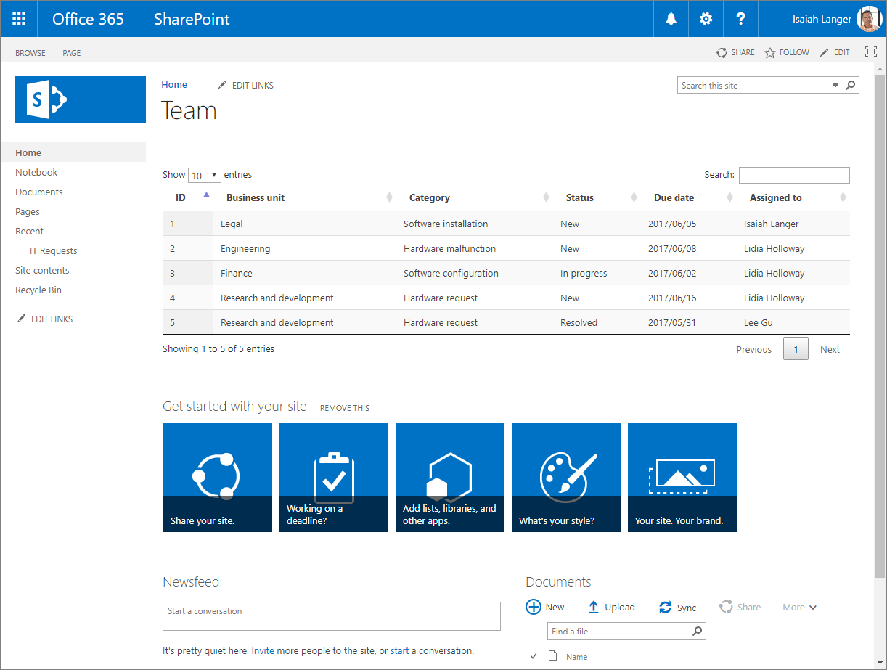
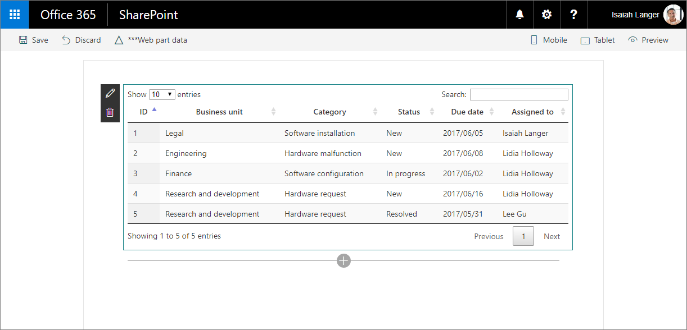

# Migrate jQuery and DataTables solution built using Script Editor web part to SharePoint Framework

One of the frequently used jQuery plug-ins is [DataTables](https://datatables.net/). With DataTables, you can easily build powerful data overviews of data coming from both SharePoint and external APIs.

## List of IT requests built using the Script Editor web part

To illustrate the process of migrating a SharePoint customization using DataTables to the SharePoint Framework, use the following solution that shows an overview of IT support requests retrieved from a SharePoint list.



<br/>

The solution is built by using the standard SharePoint Script Editor web part. Following is the code used by the customization.

```html
<script src="https://code.jquery.com/jquery-1.12.4.js"></script>
<script src="https://cdn.datatables.net/1.10.15/js/jquery.dataTables.js"></script>
<script src="https://momentjs.com/downloads/moment.min.js"></script>
<link rel="stylesheet" type="text/css" href="https://cdn.datatables.net/1.10.15/css/jquery.dataTables.min.css" />
<table id="requests" class="display" cellspacing="0" width="100%">
    <thead>
        <tr>
            <th>ID</th>
            <th>Business unit</th>
            <th>Category</th>
            <th>Status</th>
            <th>Due date</th>
            <th>Assigned to</th>
        </tr>
    </thead>
</table>
<script>
// UMD
(function(factory) {
    "use strict";

    if (typeof define === 'function' && define.amd) {
        // AMD
        define(['jquery'], function ($) {
            return factory( $, window, document );
        });
    }
    else if (typeof exports === 'object') {
        // CommonJS
        module.exports = function (root, $) {
            if (!root) {
                root = window;
            }

            if (!$) {
                $ = typeof window !== 'undefined' ?
                    require('jquery') :
                    require('jquery')( root );
            }

            return factory($, root, root.document);
        };
    }
    else {
        // Browser
        factory(jQuery, window, document);
    }
}
(function($, window, document) {
    $.fn.dataTable.render.moment = function (from, to, locale) {
        // Argument shifting
        if (arguments.length === 1) {
            locale = 'en';
            to = from;
            from = 'YYYY-MM-DD';
        }
        else if (arguments.length === 2) {
            locale = 'en';
        }

        return function (d, type, row) {
            var m = window.moment(d, from, locale, true);

            // Order and type get a number value from Moment, everything else
            // sees the rendered value
            return m.format(type === 'sort' || type === 'type' ? 'x' : to);
        };
    };
}));
</script>
<script>
$(document).ready(function() {
    $('#requests').DataTable({
        'ajax': {
		'url': "../_api/web/lists/getbytitle('IT Requests')/items?$select=ID,BusinessUnit,Category,Status,DueDate,AssignedTo/Title&$expand=AssignedTo/Title",
		'headers': { 'Accept': 'application/json;odata=nometadata' },
		'dataSrc': function(data) {
			return data.value.map(function(item) {
				return [
					item.ID,
					item.BusinessUnit,
					item.Category,
					item.Status,
					new Date(item.DueDate),
					item.AssignedTo.Title
				];
			});
		}
	},
	columnDefs: [{
		targets: 4,
		render: $.fn.dataTable.render.moment('YYYY/MM/DD')
	}]
    });
});
</script>
```

First, the customization loads the libraries it uses: jQuery, DataTables, and Moment.js (lines 1-4). 

Next, it specifies the structure of the table used to present the data (lines 5-16). 

After creating the table, it wraps Moment.js into a DataTables plug-in so that dates displayed in the table can be formatted (first script block on lines 17-70). 

Finally, the customization uses DataTables to load and present the list of IT support requests. The data is loaded by using AJAX from a SharePoint list (lines 71-96).

Thanks to using DataTables, end users get a powerful solution where they can easily filter, sort, and page through the results without any additional development effort.


## Migrate the IT requests overview solution from the Script Editor web part to the SharePoint Framework

> [!NOTE] 
> Before following the steps in this article, be sure to [set up your development environment](../../set-up-your-development-environment.md) for building SharePoint Framework solutions.

Transforming this customization to the SharePoint Framework offers a number of benefits such as more user-friendly configuration and centralized management of the solution. Following is a step-by-step description of how you would migrate the solution to the SharePoint Framework. First, you will migrate the solution to the SharePoint Framework with as few changes to the original code as possible. Later, you will transform the solution's code to TypeScript to benefit from its development-time type safety features.

> [!NOTE] 
> The source code of the project in the different stages of migration is available at [Tutorial: Migrate jQuery and DataTables solution built using Script Editor web part to SharePoint Framework](https://github.com/SharePoint/sp-dev-fx-webparts/tree/master/tutorials/tutorial-migrate-datatables).

### Create new SharePoint Framework project

1. Start by creating a new folder for your project:

    ```sh
    md datatables-itrequests
    ```

2. Navigate to the project folder:

    ```sh
    cd datatables-itrequests
    ```

3. In the project folder, run the SharePoint Framework Yeoman generator to scaffold a new SharePoint Framework project:

    ```sh
    yo @microsoft/sharepoint
    ```

4. When prompted, define values as follows:

    - **datatables-itrequests** as your solution name
    - **Use the current folder** for the location to place the files
    - **No javaScript web framework** as the starting point to build the web part
    - **IT requests** as your web part name
    - **Shows overview of IT support requests** as your web part description

    

5. After the scaffolding completes, lock down the version of the project dependencies by running the following command:

    ```sh
    npm shrinkwrap
    ```

6. Open your project folder in your code editor. In this tutorial, you will use Visual Studio Code.

    

### Load JavaScript libraries

Similar to the original solution built using the Script Editor web part, first you need to load the JavaScript libraries required by the solution. In SharePoint Framework this usually consists of two steps: specifying the URL from which the library should be loaded, and referencing the library in the code.

1. Specify the URLs from which libraries should be loaded. In the code editor, open the **./config/config.json** file, and change the **externals** section to:

    ```json
    {
    "externals": {
        "jquery": "https://code.jquery.com/jquery-1.12.4.min.js",
        "datatables.net": "https://cdn.datatables.net/1.10.15/js/jquery.dataTables.min.js",
        "moment": "https://momentjs.com/downloads/moment.min.js"
    }
    }
    ```

2. Open the **./src/webparts/itRequests/ItRequestsWebPart.ts** file, and after the last **import** statement add:

    ```typescript
    import 'jquery';
    import 'datatables.net';
    import 'moment';
    ```

### Define data table

Just as in the original solution, the next step is to define the structure of the table used to display the data. 

In the code editor, open the **./src/webparts/itRequests/ItRequestsWebPart.ts** file, and change the **render** method to:

```typescript
    export default class ItRequestsWebPart extends BaseClientSideWebPart<IItRequestsWebPartProps> {
    public render(): void {
        this.domElement.innerHTML = `
        <link rel="stylesheet" type="text/css" href="https://cdn.datatables.net/1.10.15/css/jquery.dataTables.min.css" />
        <table id="requests" class="display ${styles.helloWorld}" cellspacing="0" width="100%">
            <thead>
                <tr>
                    <th>ID</th>
                    <th>Business unit</th>
                    <th>Category</th>
                    <th>Status</th>
                    <th>Due date</th>
                    <th>Assigned to</th>
                </tr>
            </thead>
        </table>`;
    }
    // ...
    }
```

### Register Moment.js plugin for DataTables

The next step is to define the Moment.js plug-in for DataTables so that dates in the table can be formatted. 

1. In the **./src/webparts/itRequests** folder, create a new file named **moment-plugin.js**, and paste the following code:

    ```js
    // UMD
    (function (factory) {
        "use strict";

        if (typeof define === 'function' && define.amd) {
            // AMD
            define(['jquery'], function ($) {
                return factory($, window, document);
            });
        }
        else if (typeof exports === 'object') {
            // CommonJS
            module.exports = function (root, $) {
                if (!root) {
                    root = window;
                }

                if (!$) {
                    $ = typeof window !== 'undefined' ?
                        require('jquery') :
                        require('jquery')(root);
                }

                return factory($, root, root.document);
            };
        }
        else {
            // Browser
            factory(jQuery, window, document);
        }
    }

    (function ($, window, document) {
        $.fn.dataTable.render.moment = function (from, to, locale) {
            // Argument shifting
            if (arguments.length === 1) {
                locale = 'en';
                to = from;
                from = 'YYYY-MM-DD';
            }
            else if (arguments.length === 2) {
                locale = 'en';
            }

            return function (d, type, row) {
                var moment = require('moment');
                var m = moment(d, from, locale, true);

                // Order and type get a number value from Moment, everything else
                // sees the rendered value
                return m.format(type === 'sort' || type === 'type' ? 'x' : to);
            };
        };
    }));
    ```

2. For the web part to load the plug-in, it has to reference the newly created **moment-plugin.js** file. In the code editor, open the **./src/webparts/itRequests/ItRequestsWebPart.ts** file, and after the last **import** statement add:

    ```typescript
    import './moment-plugin';
    ```

> [!NOTE] 
> You don't need to include the **.js** extension when referencing other files. SharePoint Framework automatically resolves the extension for you.

### Initiate DataTables and load data

The last step is to include the code that initiates the data table and loads the data from SharePoint. 

1. In the **./src/webparts/itRequests** folder, create a new file named **script.js**, and paste the following code:

    ```js
    $(document).ready(function () {
        $('#requests').DataTable({
            'ajax': {
                'url': "../../_api/web/lists/getbytitle('IT Requests')/items?$select=ID,BusinessUnit,Category,Status,DueDate,AssignedTo/Title&$expand=AssignedTo/Title",
                'headers': { 'Accept': 'application/json;odata=nometadata' },
                'dataSrc': function (data) {
                    return data.value.map(function (item) {
                        return [
                            item.ID,
                            item.BusinessUnit,
                            item.Category,
                            item.Status,
                            new Date(item.DueDate),
                            item.AssignedTo.Title
                        ];
                    });
                }
            },
            columnDefs: [{
                targets: 4,
                render: $.fn.dataTable.render.moment('YYYY/MM/DD')
            }]
        });
    });
    ```

2. To reference this file in the web part, in the code editor, open the **./src/webparts/itRequests/ItRequestsWebPart.ts** file, and change the **render** method to:

    ```typescript
    export default class ItRequestsWebPart extends BaseClientSideWebPart<IItRequestsWebPartProps> {
    public render(): void {
        this.domElement.innerHTML = `
        <link rel="stylesheet" type="text/css" href="https://cdn.datatables.net/1.10.15/css/jquery.dataTables.min.css" />
        <table id="requests" class="display ${styles.helloWorld}" cellspacing="0" width="100%">
            <thead>
                <tr>
                    <th>ID</th>
                    <th>Business unit</th>
                    <th>Category</th>
                    <th>Status</th>
                    <th>Due date</th>
                    <th>Assigned to</th>
                </tr>
            </thead>
        </table>`;

        require('./script');
    }
    // ...
    }
    ```

3. Verify that the web part is working as expected in the command line by executing:

    ```sh
    gulp serve --nobrowser
    ```

Because the web part loads its data from SharePoint, you have to test the web part by using the hosted SharePoint Framework Workbench. Navigate to `https://yourtenant.sharepoint.com/_layouts/workbench.aspx` and add the web part to the canvas. You should now see the IT requests displayed by using the DataTables jQuery plug-in.



## Add support for configuring the web part through web part properties

In the previous steps, you migrated the IT requests solutions from the Script Editor web part to the SharePoint Framework. While the solution already works as expected, it doesn't use any of the SharePoint Framework benefits. The name of the list from which IT requests are loaded is included in the code, and the code itself is plain JavaScript, which is harder to refactor than TypeScript. 

The following steps illustrate how to extend the existing solution to allow users to specify the name of the list to load the data from. Later, you transform the code to TypeScript to benefit from its type safety features.

### Define web part property for storing the name of the list

1. Define a web part property to store the name of the list from which IT requests should be loaded. In the code editor, open the **./src/webparts/itRequests/ItRequestsWebPart.manifest.json** file, and rename the default **description** property to **listName** and clear its value.

    

2. Update the web part properties interface to reflect the changes in the manifest. In the code editor, open the **./src/webparts/itRequests/IItRequestsWebPartProps.ts** file, and change its contents to:

    ```typescript
    export interface IItRequestsWebPartProps {
    listName: string;
    }
    ```

3. Update the display labels for the **listName** property. Open the **./src/webparts/itRequests/loc/mystrings.d.ts** file, and change its contents to:

    ```typescript
    declare interface IItRequestsStrings {
    PropertyPaneDescription: string;
    BasicGroupName: string;
    ListNameFieldLabel: string;
    }

    declare module 'itRequestsStrings' {
    const strings: IItRequestsStrings;
    export = strings;
    }
    ```

4. Open the **./src/webparts/itRequests/loc/en-us.js** file, and change its contents to:

    ```js
    define([], function() {
    return {
        "PropertyPaneDescription": "IT Requests settings",
        "BasicGroupName": "Data",
        "ListNameFieldLabel": "List name"
    }
    });
    ```

5. Update the web part to use the newly defined property. In the code editor, open the **./src/webparts/itRequests/ItRequestsWebPart.ts** file, and change the **getPropertyPaneConfiguration** method to:

    ```typescript
    export default class ItRequestsWebPart extends BaseClientSideWebPart<IItRequestsWebPartProps> {
    // ...
    protected getPropertyPaneConfiguration(): IPropertyPaneConfiguration {
        return {
        pages: [
            {
            header: {
                description: strings.PropertyPaneDescription
            },
            groups: [
                {
                groupName: strings.BasicGroupName,
                groupFields: [
                    PropertyPaneTextField('listName', {
                    label: strings.ListNameFieldLabel
                    })
                ]
                }
            ]
            }
        ]
        };
    }

    protected get disableReactivePropertyChanges(): boolean {
        return true;
    }
    }
    ```

To prevent the web part from reloading as users type the name of the list, you also configured the web part to use the non-reactive property pane by adding the **disableReactivePropertyChanges** method and setting its return value to **true**.

### Use the configured name of the list to load the data from

Initially, the name of the list from which the data should be loaded was embedded in the REST query. Now that users can configure this name, the configured value should be injected into the REST query before loading the data. The easiest way to do that is by moving the contents of the **script.js** file to the main web part file.

1. In the code editor, open the **./src/webparts/itRequests/ItRequestsWebPart.ts** file, and change the **render** method to:

    ```typescript
    var $: any = (window as any).$;

    export default class ItRequestsWebPart extends BaseClientSideWebPart<IItRequestsWebPartProps> {
    public render(): void {
        this.domElement.innerHTML = `
        <link rel="stylesheet" type="text/css" href="https://cdn.datatables.net/1.10.15/css/jquery.dataTables.min.css" />
        <table class="display ${styles.helloWorld}" cellspacing="0" width="100%">
            <thead>
                <tr>
                    <th>ID</th>
                    <th>Business unit</th>
                    <th>Category</th>
                    <th>Status</th>
                    <th>Due date</th>
                    <th>Assigned to</th>
                </tr>
            </thead>
        </table>`;

        $(document).ready(() => {
        $('table', this.domElement).DataTable({
            'ajax': {
            'url': `../../_api/web/lists/getbytitle('${escape(this.properties.listName)}')/items?$select=ID,BusinessUnit,Category,Status,DueDate,AssignedTo/Title&$expand=AssignedTo/Title`,
            'headers': { 'Accept': 'application/json;odata=nometadata' },
            'dataSrc': function (data) {
                return data.value.map(function (item) {
                return [
                    item.ID,
                    item.BusinessUnit,
                    item.Category,
                    item.Status,
                    new Date(item.DueDate),
                    item.AssignedTo.Title
                ];
                });
            }
            },
            columnDefs: [{
            targets: 4,
            render: $.fn.dataTable.render.moment('YYYY/MM/DD')
            }]
        });
        });
    }

    // ...
    }
    ```

2. Instead of referencing the code from the **script.js** file, all of its contents are a part of the web part's **render** method. In the REST query, in line 40, you can now replace the fixed name of the list with the value of the **listName** property which holds the name of the list as configured by the user. Before using the value, it's being escaped by using the lodash's **escape** function to disallow script injection.

    At this point, the bulk of the code is still written using plain JavaScript. To avoid build issues with the **$** jQuery variable, you had to define it as **any** type in line 18. Later, when transforming the code to TypeScript, you replace it with a proper type definition.

    As you have just moved the contents of the **script.js** file into the main web part file, the **script.js** is no longer necessary, and you can delete it from the project.

3. To verify that the web part is working as expected, run the following in the command line:

    ```sh
    gulp serve --nobrowser
    ```

4. Navigate to the hosted Workbench and add the web part to the canvas. Open the web part property pane, specify the name of the list with IT requests, and select the **Apply** button to confirm the changes. 

    You should now see IT requests displayed in the web part.

    

## Transform the plain JavaScript code to TypeScript

Using TypeScript over plain JavaScript offers a number of benefits. Not only is TypeScript easier to maintain and refactor, but it also allows you to catch errors earlier. The following steps describe how you would transform the original JavaScript code to TypeScript.

### Add type definitions for used libraries

To function properly, TypeScript requires type definitions for the different libraries used in the project. Type definitions are often distributed as npm packages in the @types namespace.

1. Install type definitions for jQuery and DataTables by executing the following in the command line:

    ```sh
    npm install --save-dev @types/jquery @types/jquery.datatables
    ```

    Type definitions for Moment.js are distributed together with the Moment.js package. Even though you're loading Moment.js from a URL, in order to use its typings, you still need to install the Moment.js package in the project.

2. Install the Moment.js package by executing the following in the command line:

    ```sh
    npm install --save moment
    ```

### Update package references

To use types from the installed type definitions, you have to change how you reference libraries. 

1. In the code editor, open the **./src/webparts/itRequests/ItRequestsWebPart.ts** file, and change the `import 'jquery';` statement to:

    ```typescript
    import * as $ from 'jquery';
    ```

2. Having defined **$** as jQuery, you can now remove the local definition of **$** that you added previously:

    ```typescript
    var $: any = (window as any).$;
    ```

3. Because DataTables is a jQuery plug-in that attaches itself to jQuery, you cannot load its type definition directly. Instead, you have to add it to the list of types loaded globally. In the code editor, open the **./tsconfig.json** file, and to the **types** array, add **jquery.datatables**:

    ```json
    {
    "compilerOptions": {
        "target": "es5",
        "forceConsistentCasingInFileNames": true,
        "module": "commonjs",
        "jsx": "react",
        "declaration": true,
        "sourceMap": true,
        "types": [
        "es6-promise",
        "es6-collections",
        "jquery.datatables",
        "webpack-env"
        ]
    }
    }
    ```

### Update main web part files to TypeScript

Now that you have type definitions for all libraries installed in the project, you can start transforming the plain JavaScript code to TypeScript.

1. Define an interface for the IT request information that you retrieve from the SharePoint list. In the code editor, open the **./src/webparts/itRequests/ItRequestsWebPart.ts** file, and just above the web part class, add the following code snippet:

    ```typescript
    interface IRequestItem {
    ID: number;
    BusinessUnit: string;
    Category: string;
    Status: string;
    DueDate: string;
    AssignedTo: { Title: string; };
    }
    ```

2. Next, in the web part class, change the **render** method to:

    ```typescript
    export default class ItRequestsWebPart extends BaseClientSideWebPart<IItRequestsWebPartProps> {
    public render(): void {
        this.domElement.innerHTML = `
        <link rel="stylesheet" type="text/css" href="https://cdn.datatables.net/1.10.15/css/jquery.dataTables.min.css" />
        <table class="display ${styles.helloWorld}" cellspacing="0" width="100%">
            <thead>
                <tr>
                    <th>ID</th>
                    <th>Business unit</th>
                    <th>Category</th>
                    <th>Status</th>
                    <th>Due date</th>
                    <th>Assigned to</th>
                </tr>
            </thead>
        </table>`;

        $('table', this.domElement).DataTable({
        'ajax': {
            'url': `../../_api/web/lists/getbytitle('${escape(this.properties.listName)}')/items?$select=ID,BusinessUnit,Category,Status,DueDate,AssignedTo/Title&$expand=AssignedTo/Title`,
            'headers': { 'Accept': 'application/json;odata=nometadata' },
            'dataSrc': (data: { value: IRequestItem[] }): any[][] => {
            return data.value.map((item: IRequestItem): any[] => {
                return [
                item.ID,
                item.BusinessUnit,
                item.Category,
                item.Status,
                new Date(item.DueDate),
                item.AssignedTo.Title
                ];
            });
            }
        },
        columnDefs: [{
            targets: 4,
            render: $.fn.dataTable.render.moment('YYYY/MM/DD')
        }]
        });
    }

    // ...
    }
    ```

3. Notice how the AJAX request, to retrieve the data from the SharePoint list, is now typed and helps you ensure you're referring to correct properties when passing them into an array to DataTables. The data structure used by DataTables to represent a row in the table is an array of mixed types, so for simplicity it was defined as **any[]**. Using the **any** type in this context is not bad, because the data returned inside the **dataSrc** property is used internally by DataTables.

    As you're updating the **render** method, you have also added two more changes. First, you removed the **id** attribute from the table. This allows you to place multiple instances of the same web part on the page. Also, you removed the reference to the `$(document).ready()` function, which isn't necessary because the DOM of the element where the data table is rendered is set before the DataTables initiation code.

### Update the Moment.js DataTables plugin to TypeScript

The last piece of the solution that needs to be transformed to TypeScript is the Moment.js DataTables plug-in. 

1. Rename the **./src/webparts/itRequests/moment-plugin.js** file to **./src/webparts/itRequests/moment-plugin.ts** so that it is processed by the TypeScript compiler. 

2. Open the **moment-plugin.ts** file in the code editor, and replace its contents with:

    ```typescript
    import * as $ from 'jquery';
    import * as moment from 'moment';

    /* tslint:disable:no-function-expression */
    $.fn.dataTable.render.moment = function (from: string, to: string, locale: string): (d: any, type: string, row: any) => string {
    /* tslint:enable */
        // Argument shifting
        if (arguments.length === 1) {
            locale = 'en';
            to = from;
            from = 'YYYY-MM-DD';
        }
        else if (arguments.length === 2) {
            locale = 'en';
        }

        return (d: any, type: string, row: any): string => {
            let m: moment.Moment = moment(d, from, locale, true);

            // Order and type get a number value from Moment, everything else
            // sees the rendered value
            return m.format(type === 'sort' || type === 'type' ? 'x' : to);
        };
    };
    ```

3. You start with loading references to jQuery and Moment.js to let TypeScript know what the corresponding variables refer to. Next, you define the plug-in function. Usually in TypeScript you use the arrow notation for functions (`=>`). In this case, however, because you need access to the **arguments** property, you have to use the regular function definition. To prevent tslint from reporting a warning about not using the arrow notation, you can explicitly disable the **no-function-expression** rule around the function definition.

4. To confirm that everything is working as expected, in the command line, execute:

    ```sh
    gulp serve --nobrowser
```

5. Navigate to the hosted Workbench and add the web part to the canvas. Although visually nothing has changed, the new code base uses TypeScript and its type definitions to help you maintain the solution.
