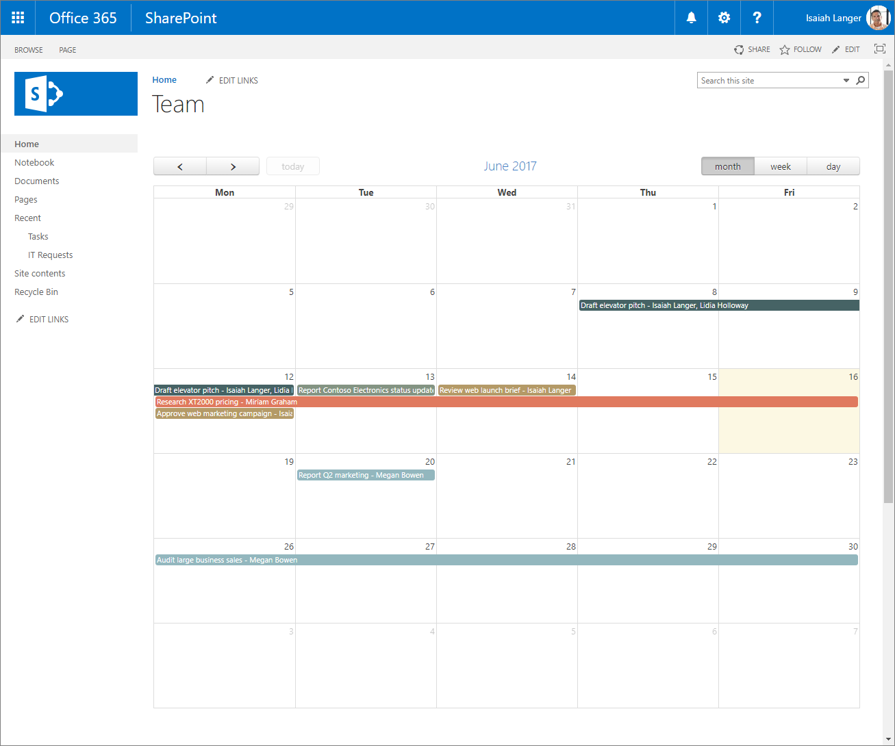
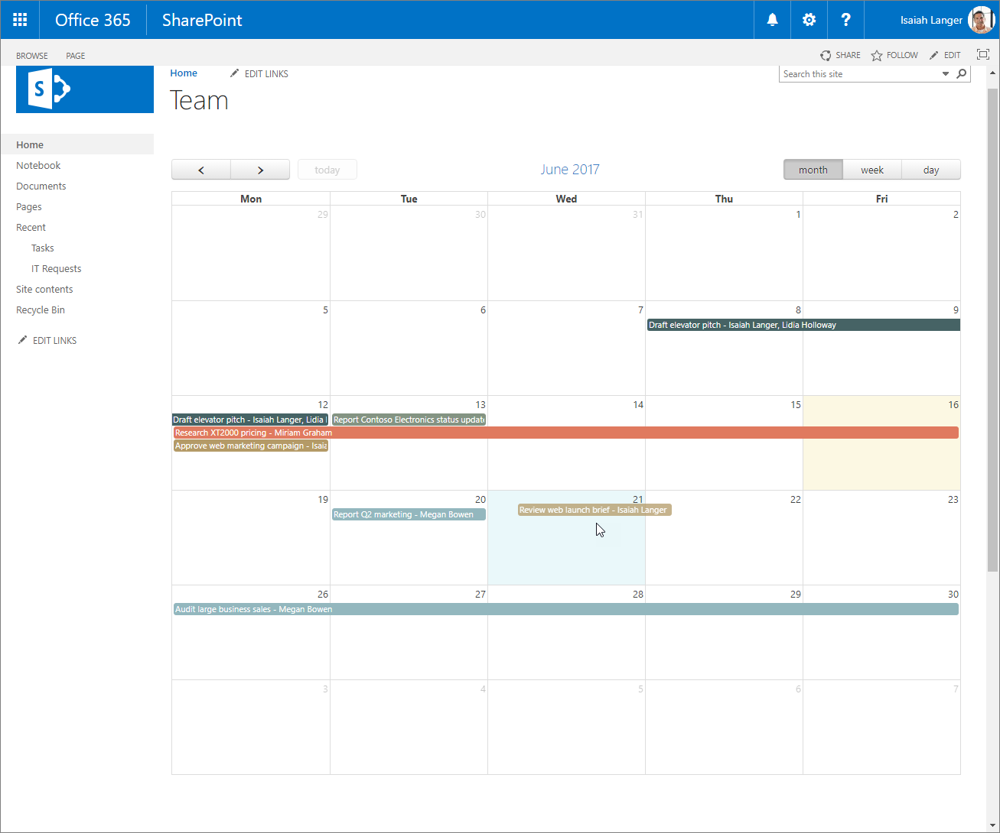
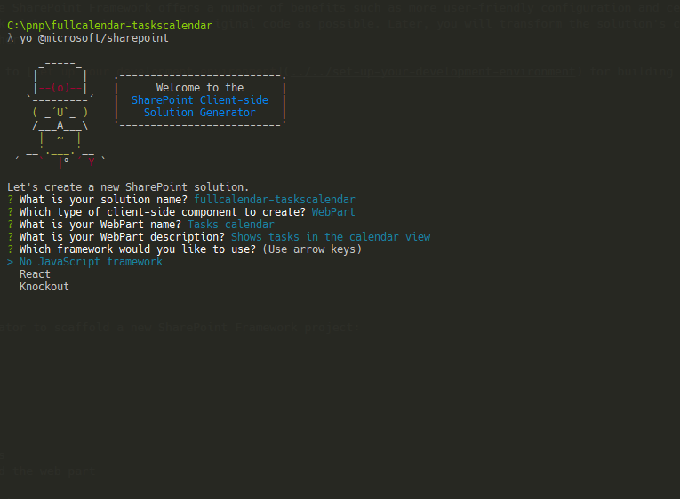
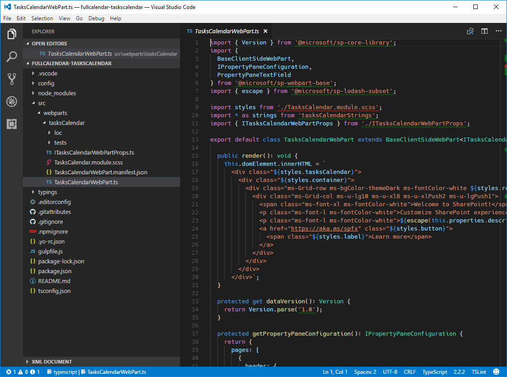
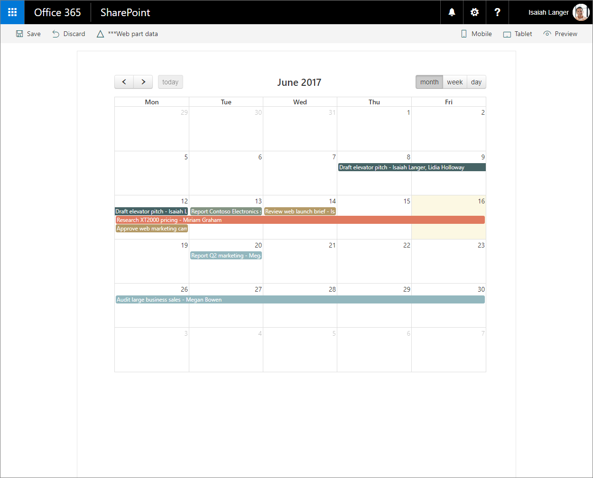
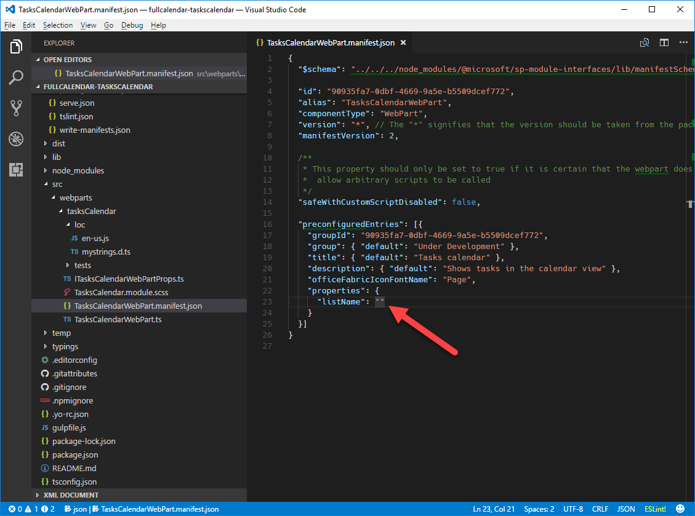
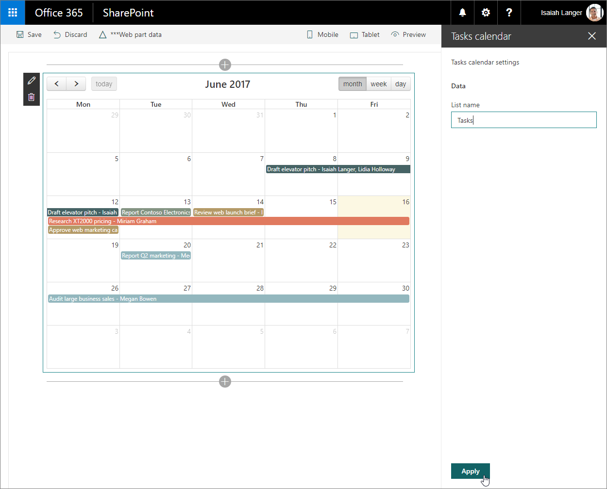

# Migrate jQuery and FullCalendar solution built using Script Editor Web Part to SharePoint Framework

When building SharePoint solutions, SharePoint developers often use the [FullCalendar](https://fullcalendar.io) jQuery plugin to display data in calendar view. FullCalendar is a great alternative to the standard SharePoint calendar view, as it allows you to render as calendar data from multiple calendar lists, data from non-calendar lists or even data from outside of SharePoint. This article illustrates how you would migrate a SharePoint customization using FullCalendar built with the Script Editor Web Part to the SharePoint Framework.

## List of tasks displayed as a calendar built using the Script Editor Web Part

To illustrate the process of migrating a SharePoint customization using FullCalendar to the SharePoint Framework you will use the following solution that shows a calendar view of tasks retrieved from a SharePoint list.



The solution is built using the standard SharePoint Script Editor Web Part. Following is the code used by the customization.

```html
<script src="//code.jquery.com/jquery-1.11.1.min.js"></script>
<script src="//cdnjs.cloudflare.com/ajax/libs/moment.js/2.10.6/moment.min.js"></script>
<script src="//cdnjs.cloudflare.com/ajax/libs/fullcalendar/3.4.0/fullcalendar.min.js"></script>
<link type="text/css" rel="stylesheet" href="//cdnjs.cloudflare.com/ajax/libs/fullcalendar/3.4.0/fullcalendar.min.css" />
<div id="calendar"></div>

<script>
  var PATH_TO_DISPFORM = _spPageContextInfo.webAbsoluteUrl + "/Lists/Tasks/DispForm.aspx";
  var TASK_LIST = "Tasks";
  var COLORS = ['#466365', '#B49A67', '#93B7BE', '#E07A5F', '#849483', '#084C61', '#DB3A34'];

  displayTasks();

  function displayTasks() {
    $('#calendar').fullCalendar('destroy');
    $('#calendar').fullCalendar({
      weekends: false,
      header: {
        left: 'prev,next today',
        center: 'title',
        right: 'month,basicWeek,basicDay'
      },
      displayEventTime: false,
      // open up the display form when a user clicks on an event
      eventClick: function (calEvent, jsEvent, view) {
        window.location = PATH_TO_DISPFORM + "?ID=" + calEvent.id;
      },
      editable: true,
      timezone: "UTC",
      droppable: true, // this allows things to be dropped onto the calendar
      // update the end date when a user drags and drops an event 
      eventDrop: function (event, delta, revertFunc) {
        updateTask(event.id, event.start, event.end);
      },
      // put the events on the calendar 
      events: function (start, end, timezone, callback) {
        var startDate = start.format('YYYY-MM-DD');
        var endDate = end.format('YYYY-MM-DD');

        var restQuery = "/_api/Web/Lists/GetByTitle('" + TASK_LIST + "')/items?$select=ID,Title,\
Status,StartDate,DueDate,AssignedTo/Title&$expand=AssignedTo&\
$filter=((DueDate ge '" + startDate + "' and DueDate le '" + endDate + "')or(StartDate ge '" + startDate + "' and StartDate le '" + endDate + "'))";

        $.ajax({
          url: _spPageContextInfo.webAbsoluteUrl + restQuery,
          type: "GET",
          dataType: "json",
          headers: {
            Accept: "application/json;odata=nometadata"
          }
        })
          .done(function (data, textStatus, jqXHR) {
            var personColors = {};
            var colorNo = 0;

            var events = data.value.map(function (task) {
              var assignedTo = task.AssignedTo.map(function (person) {
                return person.Title;
              }).join(', ');

              var color = personColors[assignedTo];
              if (!color) {
                color = COLORS[colorNo++];
                personColors[assignedTo] = color;
              }
              if (colorNo >= COLORS.length) {
                colorNo = 0;
              }

              return {
                title: task.Title + " - " + assignedTo,
                id: task.ID,
                color: color, // specify the background color and border color can also create a class and use className parameter. 
                start: moment.utc(task.StartDate).add("1", "days"),
                end: moment.utc(task.DueDate).add("1", "days") // add one day to end date so that calendar properly shows event ending on that day
              };
            });

            callback(events);
          });
      }
    });
  }

  function updateTask(id, startDate, dueDate) {
    // subtract the previously added day to the date to store correct date
    var sDate = moment.utc(startDate).add("-1", "days").format('YYYY-MM-DD') + "T" +
      startDate.format("hh:mm") + ":00Z";
    if (!dueDate) {
      dueDate = startDate;
    }
    var dDate = moment.utc(dueDate).add("-1", "days").format('YYYY-MM-DD') + "T" +
      dueDate.format("hh:mm") + ":00Z";

    $.ajax({
      url: _spPageContextInfo.webAbsoluteUrl + '/_api/contextinfo',
      type: 'POST',
      headers: {
        'Accept': 'application/json;odata=nometadata'
      }
    })
      .then(function (data, textStatus, jqXHR) {
        return $.ajax({
          url: _spPageContextInfo.webAbsoluteUrl +
          "/_api/Web/Lists/getByTitle('" + TASK_LIST + "')/Items(" + id + ")",
          type: 'POST',
          data: JSON.stringify({
            StartDate: sDate,
            DueDate: dDate,
          }),
          headers: {
            Accept: "application/json;odata=nometadata",
            "Content-Type": "application/json;odata=nometadata",
            "X-RequestDigest": data.FormDigestValue,
            "IF-MATCH": "*",
            "X-Http-Method": "PATCH"
          }
        });
      })
      .done(function (data, textStatus, jqXHR) {
        alert("Update Successful");
      })
      .fail(function (jqXHR, textStatus, errorThrown) {
        alert("Update Failed");
      })
      .always(function () {
        displayTasks();
      });
  }
</script>
```

> This solution is based on the work of Mark Rackley, Office Servers and Services MVP and Chief Strategy Officer at PAIT Group. For more information about the original solution visit [http://www.markrackley.net/2017/06/07/using-fullcalendar-io-to-create-custom-calendars-in-sharepoint/](http://www.markrackley.net/2017/06/07/using-fullcalendar-io-to-create-custom-calendars-in-sharepoint/).

First, the customization loads the libraries it uses: jQuery, Moment.js and FullCalendar (lines 1-4). Next, it defines the div into which the generated calendar view will be injected (line 5). Then, it defines two functions: **displayTasks** - used to display tasks in the calendar view, and **updateTask** which is triggered after dragging and dropping a task to a different date and which updates the dates on the underlying list item. Each function defines its own REST query which is then used to communicate with the SharePoint List REST API to retrieve or update list items.

Using the FullCalendar jQuery plugin, with little effort users get rich solutions capable of things such as using different colors to mark different events or using drag and drop to reorganize events.



## Migrate the Tasks calendar solution from the Script Editor Web Part to the SharePoint Framework

> **Note:** Before following the steps in this article, be sure to [set up your development environment](../../set-up-your-development-environment.md) for building SharePoint Framework solutions.

Transforming a Script Editor Web Part-based customization to the SharePoint Framework offers a number of benefits such as more user-friendly configuration and centralized management of the solution. Following is a step-by-step description of how you would migrate the solution to the SharePoint Framework. First, you will migrate the solution to the SharePoint Framework with as few changes to the original code as possible. Later, you will transform the solution's code to TypeScript to benefit of its development-time type safety features and replace some of the code with the SharePoint Framework API to fully benefit of its capabilities and simplify the solution even further.

> The source code of the project in the different stages of migration is available at [https://github.com/SharePoint/sp-dev-fx-webparts/tree/master/tutorials/tutorial-migrate-fullcalendar](https://github.com/SharePoint/sp-dev-fx-webparts/tree/master/tutorials/tutorial-migrate-fullcalendar).

### Create new SharePoint Framework project

Start by creating a new folder for your project

```sh
md fullcalendar-taskscalendar
```

Navigate to the project folder:

```sh
cd fullcalendar-taskscalendar
```

In the project folder run the SharePoint Framework Yeoman generator to scaffold a new SharePoint Framework project:

```sh
yo @microsoft/sharepoint
```

When prompted, define values as follows:
- **fullcalendar-taskscalendar** as your solution name
- **Use the current folder** for the location to place the files
- **WebPart** as the client-side component to create
- **Tasks calendar** as your web part name
- **Shows tasks in the calendar view** as your web part description
- **No javaScript web framework** as the starting point to build the web part



Once the scaffolding completes, lock down the version of the project dependencies by running the following command:

```sh
npm shrinkwrap
```

Next, open your project folder in your code editor. In this tutorial, you will use Visual Studio Code.



### Load JavaScript libraries

Similarly to the original solution built using the Script Editor Web Part, first you need to load the JavaScript libraries required by the solution. In SharePoint Framework this usually consists of two steps: specifying the URL from which the library should be loaded, and referencing the library in the code.

Start, with specifying the URLs from which libraries should be loaded. In the code editor, open the **./config/config.json** file and change the **externals** section to:

```json
{
  "externals": {
    "jquery": "https://code.jquery.com/jquery-1.11.1.min.js",
    "moment": "https://cdnjs.cloudflare.com/ajax/libs/moment.js/2.10.6/moment.min.js",
    "fullcalendar": "https://cdnjs.cloudflare.com/ajax/libs/fullcalendar/3.4.0/fullcalendar.min.js"
  }
}
```

Next, open the **./src/webparts/tasksCalendar/TasksCalendarWebPart.ts** file, and after the last **import** statement add:

```ts
import 'jquery';
import 'moment';
import 'fullcalendar';
```

### Define container div

Just as in the original solution, the next step is to define the location where the calendar should be rendered. In the code editor, open the **./src/webparts/tasksCalendar/TasksCalendarWebPart.ts** file and change the **render** method to:

```ts
export default class ItRequestsWebPart extends BaseClientSideWebPart<IItRequestsWebPartProps> {
  public render(): void {
    this.domElement.innerHTML = `
      <div class="${styles.tasksCalendar}">
        <link type="text/css" rel="stylesheet" href="//cdnjs.cloudflare.com/ajax/libs/fullcalendar/3.4.0/fullcalendar.min.css" />
        <div id="calendar"></div>
      </div>`;
  }
  // ...
}
```

### Initiate FullCalendar and load data

The last step is to include the code that initiates the FullCalendar jQuery plugin and loads the data from SharePoint. In the **./src/webparts/tasksCalendar** folder, create a new file named **script.js** and paste the following code:

```js
var moment = require('moment');

var PATH_TO_DISPFORM = window.webAbsoluteUrl + "/Lists/Tasks/DispForm.aspx";
var TASK_LIST = "Tasks";
var COLORS = ['#466365', '#B49A67', '#93B7BE', '#E07A5F', '#849483', '#084C61', '#DB3A34'];

displayTasks();

function displayTasks() {
  $('#calendar').fullCalendar('destroy');
  $('#calendar').fullCalendar({
    weekends: false,
    header: {
      left: 'prev,next today',
      center: 'title',
      right: 'month,basicWeek,basicDay'
    },
    displayEventTime: false,
    // open up the display form when a user clicks on an event
    eventClick: function (calEvent, jsEvent, view) {
      window.location = PATH_TO_DISPFORM + "?ID=" + calEvent.id;
    },
    editable: true,
    timezone: "UTC",
    droppable: true, // this allows things to be dropped onto the calendar
    // update the end date when a user drags and drops an event 
    eventDrop: function (event, delta, revertFunc) {
      updateTask(event.id, event.start, event.end);
    },
    // put the events on the calendar 
    events: function (start, end, timezone, callback) {
      var startDate = start.format('YYYY-MM-DD');
      var endDate = end.format('YYYY-MM-DD');

      var restQuery = "/_api/Web/Lists/GetByTitle('" + TASK_LIST + "')/items?$select=ID,Title,\
Status,StartDate,DueDate,AssignedTo/Title&$expand=AssignedTo&\
$filter=((DueDate ge '" + startDate + "' and DueDate le '" + endDate + "')or(StartDate ge '" + startDate + "' and StartDate le '" + endDate + "'))";

      $.ajax({
        url: window.webAbsoluteUrl + restQuery,
        type: "GET",
        dataType: "json",
        headers: {
          Accept: "application/json;odata=nometadata"
        }
      })
        .done(function (data, textStatus, jqXHR) {
          var personColors = {};
          var colorNo = 0;

          var events = data.value.map(function (task) {
            var assignedTo = task.AssignedTo.map(function (person) {
              return person.Title;
            }).join(', ');

            var color = personColors[assignedTo];
            if (!color) {
              color = COLORS[colorNo++];
              personColors[assignedTo] = color;
            }
            if (colorNo >= COLORS.length) {
              colorNo = 0;
            }

            return {
              title: task.Title + " - " + assignedTo,
              id: task.ID,
              color: color, // specify the background color and border color can also create a class and use className parameter. 
              start: moment.utc(task.StartDate).add("1", "days"),
              end: moment.utc(task.DueDate).add("1", "days") // add one day to end date so that calendar properly shows event ending on that day
            };
          });

          callback(events);
        });
    }
  });
}

function updateTask(id, startDate, dueDate) {
  // subtract the previously added day to the date to store correct date
  var sDate = moment.utc(startDate).add("-1", "days").format('YYYY-MM-DD') + "T" +
    startDate.format("hh:mm") + ":00Z";
  if (!dueDate) {
    dueDate = startDate;
  }
  var dDate = moment.utc(dueDate).add("-1", "days").format('YYYY-MM-DD') + "T" +
    dueDate.format("hh:mm") + ":00Z";

  $.ajax({
    url: window.webAbsoluteUrl + '/_api/contextinfo',
    type: 'POST',
    headers: {
      'Accept': 'application/json;odata=nometadata'
    }
  })
    .then(function (data, textStatus, jqXHR) {
      return $.ajax({
        url: window.webAbsoluteUrl +
        "/_api/Web/Lists/getByTitle('" + TASK_LIST + "')/Items(" + id + ")",
        type: 'POST',
        data: JSON.stringify({
          StartDate: sDate,
          DueDate: dDate,
        }),
        headers: {
          Accept: "application/json;odata=nometadata",
          "Content-Type": "application/json;odata=nometadata",
          "X-RequestDigest": data.FormDigestValue,
          "IF-MATCH": "*",
          "X-Http-Method": "PATCH"
        }
      });
    })
    .done(function (data, textStatus, jqXHR) {
      alert("Update Successful");
    })
    .fail(function (jqXHR, textStatus, errorThrown) {
      alert("Update Failed");
    })
    .always(function () {
      displayTasks();
    });
}
```

This code is almost identical with the original code of the Script Editor Web Part customization. The only difference is that where the original code retrieved the URL of the current web from the global **\_spPageContextInfo** variable set by SharePoint (lines 8, 45, 96 and 104), the code in the SharePoint Framework uses a custom variable that you will have to set in the web part. SharePoint Framework client-side web parts can be used both on classic and modern pages. While the **_spPageContextInfo** variable is present on classic pages, it's not available on modern pages which is why you can't rely on it and need a custom property that you can control yourself instead.

In order to reference this file in the web part, in the code editor, open the **./src/webparts/tasksCalendar/TasksCalendarWebPart.ts** file and change the **render** method to:

```ts
export default class ItRequestsWebPart extends BaseClientSideWebPart<IItRequestsWebPartProps> {
  public render(): void {
    this.domElement.innerHTML = `
      <div class="${styles.tasksCalendar}">
        <link type="text/css" rel="stylesheet" href="//cdnjs.cloudflare.com/ajax/libs/fullcalendar/3.4.0/fullcalendar.min.css" />
        <div id="calendar"></div>
      </div>`;

    (window as any).webAbsoluteUrl = this.context.pageContext.web.absoluteUrl;
    require('./script');
  }
  // ...
}
```

Verify, that the web part is working as expected by in the command line executing:

```sh
gulp serve --nobrowser
```

Because the web part loads its data from SharePoint, you have to test the web part using the hosted SharePoint Framework workbench. Navigate to **https://yourtenant.sharepoint.com/_layouts/workbench.aspx** and add the web part to the canvas. You should now see the tasks displayed in a calendar view using the FullCalendar jQuery plugin.



## Add support for configuring the web part through web part properties

In the previous steps you migrated the Tasks calendar solutions from Script Editor Web Part to the SharePoint Framework. While the solution already works as expected, it doesn't use any of the SharePoint Framework benefits. The name of the list from which tasks are loaded is included in the code and the code itself is plain JavaScript which is harder to refactor than TypeScript. The following steps illustrate how to extend the existing solution to allow users to specify the name of the list to load the data from. Later, you will transform the code to TypeScript to benefit of its type safety features.

### Define web part property for storing the name of the list

Start with defining a web part property to store the name of the list from which tasks should be loaded. In the code editor, open the **./src/webparts/tasksCalendar/TasksCalendarWebPart.manifest.json** file and rename the default **description** property to **listName** and clear its value.



Next, update the web part properties interface to reflect the changes in the manifest. In the code editor, open the **./src/webparts/tasksCalendar/ITasksCalendarWebPartProps.ts** file and change its contents to:

```ts
export interface ITasksCalendarWebPartProps {
  listName: string;
}
```

Then, update the display labels for the **listName** property. Open the **./src/webparts/tasksCalendar/loc/mystrings.d.ts** file and change its contents to:

```ts
declare interface ITasksCalendarStrings {
  PropertyPaneDescription: string;
  BasicGroupName: string;
  ListNameFieldLabel: string;
}

declare module 'tasksCalendarStrings' {
  const strings: ITasksCalendarStrings;
  export = strings;
}
```

Next, open the **./src/webparts/tasksCalendar/loc/en-us.js** file and change its contents to:

```js
define([], function() {
  return {
    "PropertyPaneDescription": "Tasks calendar settings",
    "BasicGroupName": "Data",
    "ListNameFieldLabel": "List name"
  }
});
```

Finally, update the web part to use the newly defined property. In the code editor, open the **./src/webparts/tasksCalendar/TasksCalendarWebPart.ts** file and change the **getPropertyPaneConfiguration** method to:

```ts
export default class TasksCalendarWebPart extends BaseClientSideWebPart<ITasksCalendarWebPartProps> {
  // ...
  protected getPropertyPaneConfiguration(): IPropertyPaneConfiguration {
    return {
      pages: [
        {
          header: {
            description: strings.PropertyPaneDescription
          },
          groups: [
            {
              groupName: strings.BasicGroupName,
              groupFields: [
                PropertyPaneTextField('listName', {
                  label: strings.ListNameFieldLabel
                })
              ]
            }
          ]
        }
      ]
    };
  }

  protected get disableReactivePropertyChanges(): boolean {
    return true;
  }
}
```

To prevent the web part from reloading as users type the name of the list, you've also configured the web part to use the non-reactive property pane by adding the **disableReactivePropertyChanges** method and settings its return value to **true**.

### Use the configured name of the list to load the data from

Initially, the name of the list from which the data should be loaded was embedded in the REST queries. Now that users can configure this name, the configured value should be injected into the REST queries before executing them. The easiest way to do that, is by moving the contents of the **script.js** file to the main web part file.

In the code editor, open the **./src/webparts/tasksCalendar/TasksCalendarWebPart.ts** file.

Start, by changing the import statement to load the required libraries to:

```ts
var $: any = require('jquery');
var moment: any = require('moment');

import 'fullcalendar';

var COLORS = ['#466365', '#B49A67', '#93B7BE', '#E07A5F', '#849483', '#084C61', '#DB3A34'];
```

Because Moment.js is referenced in the code that you will be using later, its name must be known to TypeScript or building the project will fail. The same applies to jQuery. Because FullCalendar is a jQuery plugin that attaches itself to the jQuery object, it can be imported the same way as previously.
The last part, includes copying the list of colors to use for marking the different events.

Next, copy the **displayTasks** and **updateTask** functions from the **script.js** file and paste them as follows inside the **TasksCalendarWebPart** class:

```ts
export default class TasksCalendarWebPart extends BaseClientSideWebPart<ITasksCalendarWebPartProps> {
  // ...

  private displayTasks() {
    $('#calendar').fullCalendar('destroy');
    $('#calendar').fullCalendar({
      weekends: false,
      header: {
        left: 'prev,next today',
        center: 'title',
        right: 'month,basicWeek,basicDay'
      },
      displayEventTime: false,
      // open up the display form when a user clicks on an event
      eventClick: (calEvent, jsEvent, view) => {
        (window as any).location = this.context.pageContext.web.absoluteUrl +
          "/Lists/" + escape(this.properties.listName) + "/DispForm.aspx?ID=" + calEvent.id;
      },
      editable: true,
      timezone: "UTC",
      droppable: true, // this allows things to be dropped onto the calendar
      // update the end date when a user drags and drops an event 
      eventDrop: (event, delta, revertFunc) => {
        this.updateTask(event.id, event.start, event.end);
      },
      // put the events on the calendar 
      events: (start, end, timezone, callback) => {
        var startDate = start.format('YYYY-MM-DD');
        var endDate = end.format('YYYY-MM-DD');

        var restQuery = "/_api/Web/Lists/GetByTitle('" + escape(this.properties.listName) + "')/items?$select=ID,Title,\
Status,StartDate,DueDate,AssignedTo/Title&$expand=AssignedTo&\
$filter=((DueDate ge '" + startDate + "' and DueDate le '" + endDate + "')or(StartDate ge '" + startDate + "' and StartDate le '" + endDate + "'))";

        $.ajax({
          url: this.context.pageContext.web.absoluteUrl + restQuery,
          type: "GET",
          dataType: "json",
          headers: {
            Accept: "application/json;odata=nometadata"
          }
        })
          .done((data, textStatus, jqXHR) => {
            var personColors = {};
            var colorNo = 0;

            var events = data.value.map((task) => {
              var assignedTo = task.AssignedTo.map((person) => {
                return person.Title;
              }).join(', ');

              var color = personColors[assignedTo];
              if (!color) {
                color = COLORS[colorNo++];
                personColors[assignedTo] = color;
              }
              if (colorNo >= COLORS.length) {
                colorNo = 0;
              }

              return {
                title: task.Title + " - " + assignedTo,
                id: task.ID,
                color: color, // specify the background color and border color can also create a class and use className parameter. 
                start: moment.utc(task.StartDate).add("1", "days"),
                end: moment.utc(task.DueDate).add("1", "days") // add one day to end date so that calendar properly shows event ending on that day
              };
            });

            callback(events);
          });
      }
    });
  }

  private updateTask(id, startDate, dueDate) {
    // subtract the previously added day to the date to store correct date
    var sDate = moment.utc(startDate).add("-1", "days").format('YYYY-MM-DD') + "T" +
      startDate.format("hh:mm") + ":00Z";
    if (!dueDate) {
      dueDate = startDate;
    }
    var dDate = moment.utc(dueDate).add("-1", "days").format('YYYY-MM-DD') + "T" +
      dueDate.format("hh:mm") + ":00Z";

    $.ajax({
      url: this.context.pageContext.web.absoluteUrl + '/_api/contextinfo',
      type: 'POST',
      headers: {
        'Accept': 'application/json;odata=nometadata'
      }
    })
      .then((data, textStatus, jqXHR) => {
        return $.ajax({
          url: this.context.pageContext.web.absoluteUrl +
          "/_api/Web/Lists/getByTitle('" + escape(this.properties.listName) + "')/Items(" + id + ")",
          type: 'POST',
          data: JSON.stringify({
            StartDate: sDate,
            DueDate: dDate,
          }),
          headers: {
            Accept: "application/json;odata=nometadata",
            "Content-Type": "application/json;odata=nometadata",
            "X-RequestDigest": data.FormDigestValue,
            "IF-MATCH": "*",
            "X-Http-Method": "PATCH"
          }
        });
      })
      .done((data, textStatus, jqXHR) => {
        alert("Update Successful");
      })
      .fail((jqXHR, textStatus, errorThrown) => {
        alert("Update Failed");
      })
      .always(() => {
        this.displayTasks();
      });
  }

  // ...
}
```

There are a few changes in the code comparing to the previous situation. Plain JavaScript functions are now changed into TypeScript methods by replacing the **function** keyword with the **private** modifier. This is required to be able to add them to the **TaskCalendarWebPart** class. Because both methods are now in the same file as the web part, instead of defining a global variable to hold the URL of the current site, you can access it directly from the web part context using the `this.context.pageContext.web.absoluteUrl` property. Additionally, in all REST queries, the fixed list name is replaced with the value of the **listName** property which holds the name of the list as configured by the user. Before using the value, it's being escaped using the lodash's **escape** function to disallow script injection.

As the last step, change the **render** method to call the newly added **displayTasks** method:

```ts
export default class TasksCalendarWebPart extends BaseClientSideWebPart<ITasksCalendarWebPartProps> {
  public render(): void {
    this.domElement.innerHTML = `
      <div class="${styles.tasksCalendar}">
        <link type="text/css" rel="stylesheet" href="//cdnjs.cloudflare.com/ajax/libs/fullcalendar/3.4.0/fullcalendar.min.css" />
        <div id="calendar"></div>
      </div>`;

    this.displayTasks();
  }
  // ...
}
```

As you have just moved the contents of the **script.js** file into the main web part file, the **script.js** is no longer necessary and you can delete it from the project.

To verify that the web part is working as expected, run in the command line:

```sh
gulp serve --nobrowser
```

Navigate to the hosted workbench and add the web part to the canvas. Open the web part property pane, specify the name of the list with tasks and click the **Apply** button to confirm the changes. You should now see tasks displayed in a calendar view in the web part.



## Transform the plain JavaScript code to TypeScript

Using TypeScript over plain JavaScript offers a number of benefits. Not only is TypeScript easier to maintain and refactor but it also allows you to catch errors earlier. Following steps describe how you would transform the original JavaScript code to TypeScript.

### Add type definitions for used libraries

To function properly, TypeScript requires type definitions for the different libraries used in the project. Type definitions are often distributed as npm packages in the @types namespace.

Start by installing type definitions for jQuery and FullCalendar by executing in the command line:

```sh
npm install --save-dev @types/jquery@1 @types/fullcalendar
```

Type definitions for Moment.js are distributed together with the Moment.js package. Even though, you're loading Moment.js from a URL, in order to use its typings, you still need to install the Moment.js package in the project.

Install the Moment.js package by executing in the command line:

```sh
npm install --save moment
```

### Update package references

In order to use types from the installed type definitions, you have to change how you reference libraries. In the code editor, open the **./src/webparts/tasksCalendar/TasksCalendarWebPart.ts** file and change the import statements to:

```ts
import * as $ from 'jquery';
import 'fullcalendar';
import * as moment from 'moment';
```

### Update main web part files to TypeScript

Now that you have type definitions for all libraries installed in the project, you can start transforming the plain JavaScript code to TypeScript.

Start, with defining an interface for a task that you retrieve from the SharePoint list. In the code editor, open the **./src/webparts/tasksCalendar/TasksCalendarWebPart.ts** file and just above the web part class, add the following code snippet:

```ts
interface ITask {
  ID: number;
  Title: string;
  StartDate: string;
  DueDate: string;
  AssignedTo: [{ Title: string }];
}
```

Next, in the web part class, change the **displayTasks** and **updateTask** methods to:

```ts
export default class TasksCalendarWebPart extends BaseClientSideWebPart<ITasksCalendarWebPartProps> {
  private readonly colors: string[] = ['#466365', '#B49A67', '#93B7BE', '#E07A5F', '#849483', '#084C61', '#DB3A34'];

  // ...

  private displayTasks(): void {
    $('#calendar').fullCalendar('destroy');
    $('#calendar').fullCalendar({
      weekends: false,
      header: {
        left: 'prev,next today',
        center: 'title',
        right: 'month,basicWeek,basicDay'
      },
      displayEventTime: false,
      // open up the display form when a user clicks on an event
      eventClick: (calEvent: FC.EventObject, jsEvent: MouseEvent, view: FC.ViewObject): void => {
        (window as any).location = `${this.context.pageContext.web.absoluteUrl}\
/Lists/${escape(this.properties.listName)}/DispForm.aspx?ID=${calEvent.id}`;
      },
      editable: true,
      timezone: "UTC",
      droppable: true, // this allows things to be dropped onto the calendar
      // update the end date when a user drags and drops an event 
      eventDrop: (event: FC.EventObject, delta: moment.Duration, revertFunc: Function): void => {
        this.updateTask(event.id, <moment.Moment>event.start, <moment.Moment>event.end);
      },
      // put the events on the calendar 
      events: (start: moment.Moment, end: moment.Moment, timezone: string, callback: Function): void => {
        const startDate: string = start.format('YYYY-MM-DD');
        const endDate: string = end.format('YYYY-MM-DD');

        const restQuery: string = `/_api/Web/Lists/GetByTitle('${escape(this.properties.listName)}')/items?$select=ID,Title,\
Status,StartDate,DueDate,AssignedTo/Title&$expand=AssignedTo&\
$filter=((DueDate ge '${startDate}' and DueDate le '${endDate}')or(StartDate ge '${startDate}' and StartDate le '${endDate}'))`;

        $.ajax({
          url: this.context.pageContext.web.absoluteUrl + restQuery,
          type: "GET",
          dataType: "json",
          headers: {
            Accept: "application/json;odata=nometadata"
          }
        })
          .done((data: { value: ITask[] }, textStatus: string, jqXHR: JQueryXHR): void => {
            let personColors: { [person: string]: string; } = {};
            let colorNo: number = 0;

            const events: FC.EventObject[] = data.value.map((task: ITask): FC.EventObject => {
              const assignedTo: string = task.AssignedTo.map((person: { Title: string }): string => {
                return person.Title;
              }).join(', ');

              let color: string = personColors[assignedTo];
              if (!color) {
                color = this.colors[colorNo++];
                personColors[assignedTo] = color;
              }
              if (colorNo >= this.colors.length) {
                colorNo = 0;
              }

              return {
                title: `${task.Title} - ${assignedTo}`,
                id: task.ID,
                // specify the background color and border color can also create a class and use className parameter
                color: color,
                start: moment.utc(task.StartDate).add("1", "days"),
                // add one day to end date so that calendar properly shows event ending on that day
                end: moment.utc(task.DueDate).add("1", "days")
              };
            });

            callback(events);
          });
      }
    });
  }

  private updateTask(id: number, startDate: moment.Moment, dueDate: moment.Moment): void {
    // subtract the previously added day to the date to store correct date
    const sDate: string = moment.utc(startDate).add("-1", "days").format('YYYY-MM-DD') + "T" +
      startDate.format("hh:mm") + ":00Z";
    if (!dueDate) {
      dueDate = startDate;
    }
    const dDate: string = moment.utc(dueDate).add("-1", "days").format('YYYY-MM-DD') + "T" +
      dueDate.format("hh:mm") + ":00Z";

    $.ajax({
      url: this.context.pageContext.web.absoluteUrl + '/_api/contextinfo',
      type: 'POST',
      headers: {
        'Accept': 'application/json;odata=nometadata'
      }
    })
      .then((data: { FormDigestValue: string }, textStatus: string, jqXHR: JQueryXHR): JQueryXHR => {
        return $.ajax({
          url: `${this.context.pageContext.web.absoluteUrl}\
/_api/Web/Lists/getByTitle('${escape(this.properties.listName)}')/Items(${id})`,
          type: 'POST',
          data: JSON.stringify({
            StartDate: sDate,
            DueDate: dDate,
          }),
          headers: {
            Accept: "application/json;odata=nometadata",
            "Content-Type": "application/json;odata=nometadata",
            "X-RequestDigest": data.FormDigestValue,
            "IF-MATCH": "*",
            "X-Http-Method": "PATCH"
          }
        });
      })
      .done((data: {}, textStatus: string, jqXHR: JQueryXHR): void => {
        alert("Update Successful");
      })
      .fail((jqXHR: JQueryXHR, textStatus: string, errorThrown: string): void => {
        alert("Update Failed");
      })
      .always((): void => {
        this.displayTasks();
      });
  }

  // ...
}
```

First, and the most obvious, change when transforming plain JavaScript to TypeScript are explicit types. While they are not required, they make it clear which type of data is expected where. Any deviation from the specified contract is immediately caught by TypeScript helping you find possible issues as soon as possible during the development process. This is particularly useful when working with AJAX responses and their data.

Another change, that you might have noticed already, is TypeScript string interpolation. Using string interpolation simplifies dynamic string composition and increases the readability of your code. Compare plain JavaScript:

```js
var restQuery = "/_api/Web/Lists/GetByTitle('" + TASK_LIST + "')/items?$select=ID,Title,\
Status,StartDate,DueDate,AssignedTo/Title&$expand=AssignedTo&\
$filter=((DueDate ge '" + startDate + "' and DueDate le '" + endDate + "')or(StartDate ge '" + startDate + "' and StartDate le '" + endDate + "'))";
```

to:

```ts
const restQuery: string = `/_api/Web/Lists/GetByTitle('${escape(this.properties.listName)}')/items?$select=ID,Title,\
Status,StartDate,DueDate,AssignedTo/Title&$expand=AssignedTo&\
$filter=((DueDate ge '${startDate}' and DueDate le '${endDate}')or(StartDate ge '${startDate}' and StartDate le '${endDate}'))`;
```

Additional benefit of using TypeScript string interpolation is, that you don't need to escape quotes, which also simplifies composing REST queries.

To confirm that everything is working as expected, in the command line execute:

```sh
gulp serve --nobrowser
```

Navigate to the hosted workbench and add the web part to the canvas. Although visually nothing has changed, the new code base uses TypeScript and its type definitions to help you maintain the solution.

### Replace jQuery AJAX calls with SharePoint Framework API

At this moment, the solution uses jQuery AJAX calls to communicate with the SharePoint REST API. For regular GET requests, the jQuery AJAX API is just as convenient as using the SharePoint Framework SPHttpClient. The real difference is when performing POST requests such as the one for updating the event:

```ts
$.ajax({
  url: this.context.pageContext.web.absoluteUrl + '/_api/contextinfo',
  type: 'POST',
  headers: {
    'Accept': 'application/json;odata=nometadata'
  }
})
  .then((data: { FormDigestValue: string }, textStatus: string, jqXHR: JQueryXHR): JQueryXHR => {
    return $.ajax({
      url: `${this.context.pageContext.web.absoluteUrl}\
/_api/Web/Lists/getByTitle('${escape(this.properties.listName)}')/Items(${id})`,
      type: 'POST',
      data: JSON.stringify({
        StartDate: sDate,
        DueDate: dDate,
      }),
      headers: {
        Accept: "application/json;odata=nometadata",
        "Content-Type": "application/json;odata=nometadata",
        "X-RequestDigest": data.FormDigestValue,
        "IF-MATCH": "*",
        "X-Http-Method": "PATCH"
      }
    });
  })
  .done((data: {}, textStatus: string, jqXHR: JQueryXHR): void => {
    alert("Update Successful");
  })
  // ...
```

Because you want to update a list item, you need to provide SharePoint with a valid request digest token. While it's available on classic pages, it's valid for 3 minutes, so it's always the safest to retrieve a valid token yourself before performing an update operation. Once you obtained the request digest, you have to add it to request headers of the update request. If you don't, the request will fail.

SharePoint Framework SPHttpClient simplifies communicating with SharePoint as it automatically detects if the request is a POST request and needs a valid request digest. If it does, the SPHttpClient automatically retrieves it from SharePoint and adds it to the request. By comparison, the same request issued using the SPHttpClient would look like this:

```ts
this.context.spHttpClient.post(`${this.context.pageContext.web.absoluteUrl}\
/_api/Web/Lists/getByTitle('${escape(this.properties.listName)}')/Items(${id})`, SPHttpClient.configurations.v1, {
  body: JSON.stringify({
    StartDate: sDate,
    DueDate: dDate,
  }),
  headers: {
    Accept: "application/json;odata=nometadata",
    "Content-Type": "application/json;odata=nometadata",
    "IF-MATCH": "*",
    "X-Http-Method": "PATCH"
  }
})
.then((response: SPHttpClientResponse): void => {
  // ...
});
```

To replace the original jQuery AJAX calls with the SharePoint Framework SPHttpClient API, in the code editor open the **./src/webparts/tasksCalendar/TasksCalendarWebPart.ts** file. To the list of imports add:

```ts
import { SPHttpClient, SPHttpClientResponse } from '@microsoft/sp-http';
```

In the **TasksCalendarWebPart** class replace the **displayTasks** and **updateTask** methods with the following code:

```ts
export default class TasksCalendarWebPart extends BaseClientSideWebPart<ITasksCalendarWebPartProps> {
  // ...

  private displayTasks(): void {
    $('#calendar').fullCalendar('destroy');
    $('#calendar').fullCalendar({
      weekends: false,
      header: {
        left: 'prev,next today',
        center: 'title',
        right: 'month,basicWeek,basicDay'
      },
      displayEventTime: false,
      // open up the display form when a user clicks on an event
      eventClick: (calEvent: FC.EventObject, jsEvent: MouseEvent, view: FC.ViewObject): void => {
        (window as any).location = `${this.context.pageContext.web.absoluteUrl}\
/Lists/${escape(this.properties.listName)}/DispForm.aspx?ID=${calEvent.id}`;
      },
      editable: true,
      timezone: "UTC",
      droppable: true, // this allows things to be dropped onto the calendar
      // update the end date when a user drags and drops an event 
      eventDrop: (event: FC.EventObject, delta: moment.Duration, revertFunc: Function): void => {
        this.updateTask(event.id, <moment.Moment>event.start, <moment.Moment>event.end);
      },
      // put the events on the calendar 
      events: (start: moment.Moment, end: moment.Moment, timezone: string, callback: Function): void => {
        const startDate: string = start.format('YYYY-MM-DD');
        const endDate: string = end.format('YYYY-MM-DD');

        const restQuery: string = `/_api/Web/Lists/GetByTitle('${escape(this.properties.listName)}')/items?$select=ID,Title,\
Status,StartDate,DueDate,AssignedTo/Title&$expand=AssignedTo&\
$filter=((DueDate ge '${startDate}' and DueDate le '${endDate}')or(StartDate ge '${startDate}' and StartDate le '${endDate}'))`;

        this.context.spHttpClient.get(this.context.pageContext.web.absoluteUrl + restQuery, SPHttpClient.configurations.v1, {
          headers: {
            'Accept': "application/json;odata.metadata=none"
          }
        })
          .then((response: SPHttpClientResponse): Promise<{ value: ITask[] }> => {
            return response.json();
          })
          .then((data: { value: ITask[] }): void => {
            let personColors: { [person: string]: string; } = {};
            let colorNo: number = 0;

            const events: FC.EventObject[] = data.value.map((task: ITask): FC.EventObject => {
              const assignedTo: string = task.AssignedTo.map((person: { Title: string }): string => {
                return person.Title;
              }).join(', ');

              let color: string = personColors[assignedTo];
              if (!color) {
                color = this.colors[colorNo++];
                personColors[assignedTo] = color;
              }
              if (colorNo >= this.colors.length) {
                colorNo = 0;
              }

              return {
                title: `${task.Title} - ${assignedTo}`,
                id: task.ID,
                // specify the background color and border color can also create a class and use className paramter
                color: color,
                start: moment.utc(task.StartDate).add("1", "days"),
                // add one day to end date so that calendar properly shows event ending on that day
                end: moment.utc(task.DueDate).add("1", "days")
              };
            });

            callback(events);
          });
      }
    });
  }

  private updateTask(id: number, startDate: moment.Moment, dueDate: moment.Moment): void {
    // subtract the previously added day to the date to store correct date
    const sDate: string = moment.utc(startDate).add("-1", "days").format('YYYY-MM-DD') + "T" +
      startDate.format("hh:mm") + ":00Z";
    if (!dueDate) {
      dueDate = startDate;
    }
    const dDate: string = moment.utc(dueDate).add("-1", "days").format('YYYY-MM-DD') + "T" +
      dueDate.format("hh:mm") + ":00Z";

    this.context.spHttpClient.post(`${this.context.pageContext.web.absoluteUrl}\
/_api/Web/Lists/getByTitle('${escape(this.properties.listName)}')/Items(${id})`, SPHttpClient.configurations.v1, {
        body: JSON.stringify({
          StartDate: sDate,
          DueDate: dDate,
        }),
        headers: {
          Accept: "application/json;odata=nometadata",
          "Content-Type": "application/json;odata=nometadata",
          "IF-MATCH": "*",
          "X-Http-Method": "PATCH"
        }
      })
      .then((response: SPHttpClientResponse): void => {
        if (response.ok) {
          alert("Update Successful");
        }
        else {
          alert("Update Failed");
        }

        this.displayTasks();
      });
  }

  // ...
}
```

> **Important:** If you're suppressing metadata in the responses of the SharePoint REST API, when using the SharePoint Framework SPHttpClient you have to ensure that you're using `application/json;odata.metadata=none` and not `application/json;odata=nometadata` as the value of the **Accept** header. SPHttpClient uses OData 4.0 and requires the first value. If you use the latter instead, the request will fail with a **406 Not Acceptable** response.

To confirm that everything is working as expected, in the command line execute:

```sh
gulp serve --nobrowser
```

Navigate to the hosted workbench and add the web part to the canvas. Although there are still no visual changes, the new code uses the SharePoint Framework SPHttpClient which simplifies your code and maintaining your solution.
