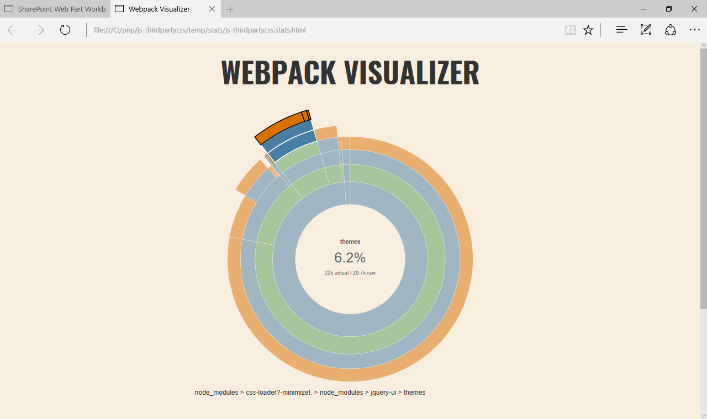
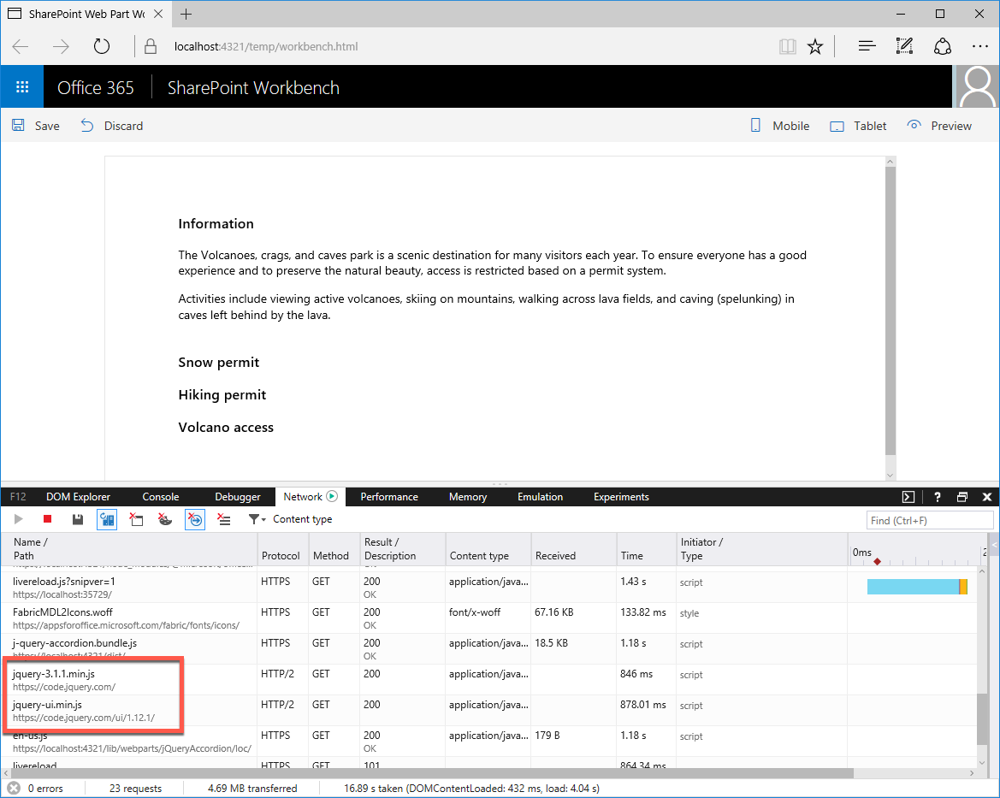

# Reference third party CSS styles in SharePoint Framework web parts

> **Note:** The SharePoint Framework is currently in preview and is subject to change. SharePoint Framework client-side web parts are not currently supported for use in production environments.

When building SharePoint Framework web parts there are many third party libraries that you can leverage to build rich solutions. Often this libraries consist not only of scripts but also of additional assets such as stylesheets. This article illustrates the different ways in which you can reference third party CSS styles in SharePoint Framework client-side web parts and their impact on the produced web part bundle. The sample web part discussed in this article uses jQuery and jQuery UI to display an accordion.


> **Note:** Before following the steps in this article, be sure to [set up your development environment](../../set-up-your-development-environment) for building SharePoint Framework solutions.

## Prepare project

### Create project

Start by creating a new folder for your project.

```sh
md js-thirdpartycss
```

Go to the project folder.

```sh
cd js-thirdpartycss
```

In the project folder run the SharePoint Framework Yeoman generator to scaffold a new SharePoint Framework project.

```sh
yo @microsoft/sharepoint
```

When prompted, enter the following values:

- **js-thirdpartycss** as your solution name
- **Use the current folder** for the location to place the files
- **jQuery accordion** as your web part name
- **Shows jQuery accordion** as your web part description
- **no javaScript web framework** as the starting point to build the web part


Once the scaffolding completes, open your project folder in your code editor. This article uses Visual Studio Code in the steps and screenshots but you can use any editor you prefer.


### Add test content

In the code editor open the **./src/webparts/jQueryAccordion/JQueryAccordionWebPart.ts** file. Change the **render** method to:

```ts
export default class JQueryAccordionWebPart extends BaseClientSideWebPart<IJQueryAccordionWebPartProps> {
  // ...
  public render(): void {
    this.domElement.innerHTML = `
      <div class="${styles.jQueryAccordion}">
        <div class="accordion">
          <h3>Section 1</h3>
          <div>
            <p>
            Mauris mauris ante, blandit et, ultrices a, suscipit eget, quam. Integer
            ut neque. Vivamus nisi metus, molestie vel, gravida in, condimentum sit
            amet, nunc. Nam a nibh. Donec suscipit eros. Nam mi. Proin viverra leo ut
            odio. Curabitur malesuada. Vestibulum a velit eu ante scelerisque vulputate.
            </p>
          </div>
          <h3>Section 2</h3>
          <div>
            <p>
            Sed non urna. Donec et ante. Phasellus eu ligula. Vestibulum sit amet
            purus. Vivamus hendrerit, dolor at aliquet laoreet, mauris turpis porttitor
            velit, faucibus interdum tellus libero ac justo. Vivamus non quam. In
            suscipit faucibus urna.
            </p>
          </div>
          <h3>Section 3</h3>
          <div>
            <p>
            Nam enim risus, molestie et, porta ac, aliquam ac, risus. Quisque lobortis.
            Phasellus pellentesque purus in massa. Aenean in pede. Phasellus ac libero
            ac tellus pellentesque semper. Sed ac felis. Sed commodo, magna quis
            lacinia ornare, quam ante aliquam nisi, eu iaculis leo purus venenatis dui.
            </p>
            <ul>
              <li>List item one</li>
              <li>List item two</li>
              <li>List item three</li>
            </ul>
          </div>
          <h3>Section 4</h3>
          <div>
            <p>
            Cras dictum. Pellentesque habitant morbi tristique senectus et netus
            et malesuada fames ac turpis egestas. Vestibulum ante ipsum primis in
            faucibus orci luctus et ultrices posuere cubilia Curae; Aenean lacinia
            mauris vel est.
            </p>
            <p>
            Suspendisse eu nisl. Nullam ut libero. Integer dignissim consequat lectus.
            Class aptent taciti sociosqu ad litora torquent per conubia nostra, per
            inceptos himenaeos.
            </p>
          </div>
        </div>
      </div>`;

      ($('.accordion', this.domElement) as any).accordion();
  }
  // ...
}
```

If you would try to build the project at this point, you would get an error stating that **$** is undefined. This is caused by the fact that you're referring to jQuery without having loaded it first. You added the reference to jQuery and jQuery UI accordion at this point already, because the approach you choose to load third party libraries in the SharePoint Framework doesn't impact how you use these scripts in code.

## Approach 1: Include third party libraries in the bundle

The easiest way to reference a third party library in SharePoint Framework projects is to include it in the generated bundle. The library is installed as a package and referenced in the project. When bundling the project, Webpack will pick up the reference to the library and include it in the generated bundle.

### Install libraries

Install jQuery and jQuery UI by executing in the command line:

```sh
npm install jquery jquery-ui --save
```

Because you are building your web part in TypeScript you also need TypeScript typings for jQuery which you can install from the command line by executing:

```sh
npm install @types/jquery --save-dev
```

### Reference libraries in the web part

After installing libraries, the next step is to reference them in the project. In the code editor open the **./src/webparts/jQueryAccordion/JQueryAccordionWebPart.ts** file. In its top section, just below the last **import** statement, add references to jQuery and jQuery UI:

```ts
import * as $ from 'jquery';
require('../../../node_modules/jquery-ui/ui/widgets/accordion');
```

jQuery is a package for which you have installed TypeScript typings which is why you can reference it using an **import** statement. jQuery UI is built differently: there is no main entry point with a reference to all components that you could use the way many modules are structured. Instead you refer directly to the specific component that you want to use. The entrypoint of that component contains all references to dependencies that it needs to work correctly.

Confirm that the project is building by executing in the command line:

```sh
gulp serve
```

After adding the web part to the canvas you should see the accordion working.


At this point you have referenced only the jQuery UI scripts which explains why the accordion is unstyled. Next you will add the missing CSS stylesheets to brand the accordion.

### Reference third party CSS stylesheets in the web part

Adding references to third party CSS stylesheets that are a part of packages installed in the project is as simple as adding referenced to the packages themselves. SharePoint Framework offers standard support for loading CSS files through Webpack.

In the code editor open the **./src/webparts/jQueryAccordion/JQueryAccordionWebPart.ts** file. Just below the last **require** statement, add references to jQuery UI accordion CSS files:

```ts
require('../../../node_modules/jquery-ui/themes/base/core.css');
require('../../../node_modules/jquery-ui/themes/base/accordion.css');
require('../../../node_modules/jquery-ui/themes/base/theme.css');
```

Similarly to adding references to JavaScript files, to reference CSS files that are a part of a package installed in the project, all you need to do is to specify relative path to the CSS file that you want to load including the **.css** extension. When bundling the project, Webpack will process these references and include the files in the generated web part bundle.

Confirm that the project is building by in the command line executing:

```sh
gulp serve
```

The accordion should be displayed correctly and branded using the standard jQuery UI Theme.


### Analyze the contents of the generated web part bundle

The easiest way to use third party libraries and their resources is by including them in the generated web part bundle. In this approach Webpack will automatically resolve all dependencies between the different libraries and will ensure that all scripts are loaded in the correct order. The downside of this approach is that all referenced resources are loaded separately with every web part. So if you have multiple web parts in your project, all using jQuery UI, each web part would load its own copy of jQuery UI unnecessarily slowing down the page.

To see the impact of the libraries included in the generated web part bundle, after bundling the project open the **./dist/js-thirdpartycss.stats.html** file in the web browser. Moving your mouse over the chart you can see for example that the jQuery UI CSS files referenced by the web part make up over 6% of the total web part bundle size.



As mentioned in the disclaimer below the chart, the sizes are indicative and reflect the size of the debug version of the bundle. The release version of the bundle would be significantly smaller. Still it's good to realize which different pieces compose the web part bundle and what's their relative size comparing to other elements in the bundle.

## Approach 2: Load third party libraries from URL

Another way to reference third party libraries in the SharePoint Framework is by referencing them from a URL such as a public CDN or a privately managed location. The biggest benefit is that if you're loading a frequently used library from a public location, there is a chance that users might already have the particular script downloaded on their computer. In this case SharePoint Framework will reuse the cached library loading your web part faster.

Even if you cannot use public CDN loading libraries from a centralized location is a good practice from the performance point of view. Pointing to a URL allows you to have your users download the script only once and reuse across the whole portal, significantly speeding up loading pages and improving the user experience.

When loading third party libraries from public URLs you should keep in mind that there is a risk involved in using that library. Since you don't manage the hosting location of the particular script you can't be sure of its contents. Scripts loaded by the SharePoint Framework execute under the context of the current user and are allowed to do whatever the particular user can. Also, if the particular hosting location is offline, your web part won't work.

### Install typings for libraries

When you reference third party libraries from a URL, you don't need to install them as packages in your project. You do have to install their TypeScript typings if you want to benefit of typesafety checks during development.

Assuming you start with an empty project created as described previously in this article, install TypeScript typings for jQuery by in the command line executing:

```sh
npm install @types/jquery --save-dev
```

### Specify URLs of libraries

To load third party libraries from a URL, you have to specify the URL where they are located in the configuration of your project. In the code editor open the **./config/config.json** file. In the **externals** section add:

```json
{
  //...
  "externals": {
    //...
    "jquery": "https://code.jquery.com/jquery-3.1.1.min.js",
    "jquery-ui": "https://code.jquery.com/ui/1.12.1/jquery-ui.min.js"
    //...
  }
  //...
}
```

### Reference libraries from the URL in the web part

Having specified the URL that the SharePoint Framework should use to load jQuery and jQuery UI from, the next step is to reference them in the project. In the code editor open the **./src/webparts/jQueryAccordion/JQueryAccordionWebPart.ts** file. In its top section, just below the last **import** statement, add references to jQuery and jQuery UI:

```ts
import * as $ from 'jquery';
require('jquery-ui');
```

Comparing to how you were referencing both libraries when they were installed as packages in your project, referencing them from the URL is very similar. Because jQuery has its TypeScript typings installed it can be referenced using an **import** statement. For jQuery UI all you want is to load the script on the page.

Because you registered **jquery** and **jquery-ui** in the project configuration as external resources, when you reference any of these libraries SharePoint Framework will use the specified URLs to load them from on runtime. When bundling the project, these resources will be marked as externals and will therefore be excluded from the bundle.

One difference to keep in mind is that when previously you specifically loaded accordion from the jQuery UI package, now you're referring to jQuery UI from CDN which contains all jQuery UI components.

Confirm that the project is building by executing in the command line:

```sh
gulp serve
```

After adding the web part to the canvas you should see the accordion working.


In your web browser, open the developer tools, switch to the tab showing the network requests and reload the page. You should see how both jQuery and jQuery UI are loaded from the CDN.



At this point you have referenced only the jQuery UI scripts which explains why the accordion is unstyled. Next you will add the missing CSS stylesheets to brand the accordion.

### Reference third party CSS stylesheets from URL in the web part

Adding references to third party CSS stylesheets from a URL is different than referencing resources from project packages. While the project configuration in the **config.json** file allows you to specify external resources, it applies only to scripts. To reference CSS stylesheets from a URL you have to use the **SPModuleLoader** instead.

#### Define SPModuleLoader as external resource

In the code editor open the **./config/config.json** file. In the **externals** section add:

```json
{
  // ...
  "externals": {
    // ...
    "@microsoft/sp-module-loader": "node_modules/@microsoft/sp-module-loader/dist/sp-module-loader.js"
  }
  // ...
}
```

This line specifies that the **@microsoft/sp-module-loader** package is an external package and shouldn't be included in the bundle. **sp-module-loader** is a part of the SharePoint Framework and doesn't need to be loaded by your web part. Without including this line, you would get errors when trying to build the project.

#### Load CSS from URL using the SPModuleLoader

In the code editor open the **./src/webparts/jQueryAccordion/JQueryAccordionWebPart.ts** file. In the top section of the file, just after the last **import** statement add:

```ts
import SPModuleLoader from '@microsoft/sp-module-loader';
```

In the same file change the web part constructor to:

```ts
export default class JQueryAccordionWebPart extends BaseClientSideWebPart<IJQueryAccordionWebPartProps> {
  public constructor(context: IWebPartContext) {
    super(context);

    SPModuleLoader.loadCss('https://code.jquery.com/ui/1.12.1/themes/base/jquery-ui.min.css');
  }

  // ...
}
```

When the web part is instantiated on the page, it will load the jQuery UI CSS from the specified URL. This CSS stylesheet is the combined and optimized version of the jQuery UI CSS that contains the basic styles, theme and styling for all components.

Confirm that the project is building by executing in the command line:

```sh
gulp serve
```

The accordion should be displayed correctly and branded using the standard jQuery UI Theme.


### Analyze the contents of the generated web part bundle loading resources from URL

After building the project in the web browser open the **./dist/js-thirdpartycss.stats.html** file. Notice how the overall bundle is significantly smaller (19KB compared to over 300KB when including jQuery and jQuery UI in the bundle) and how jQuery and jQuery UI are not listed in the chart as they are loaded on runtime.