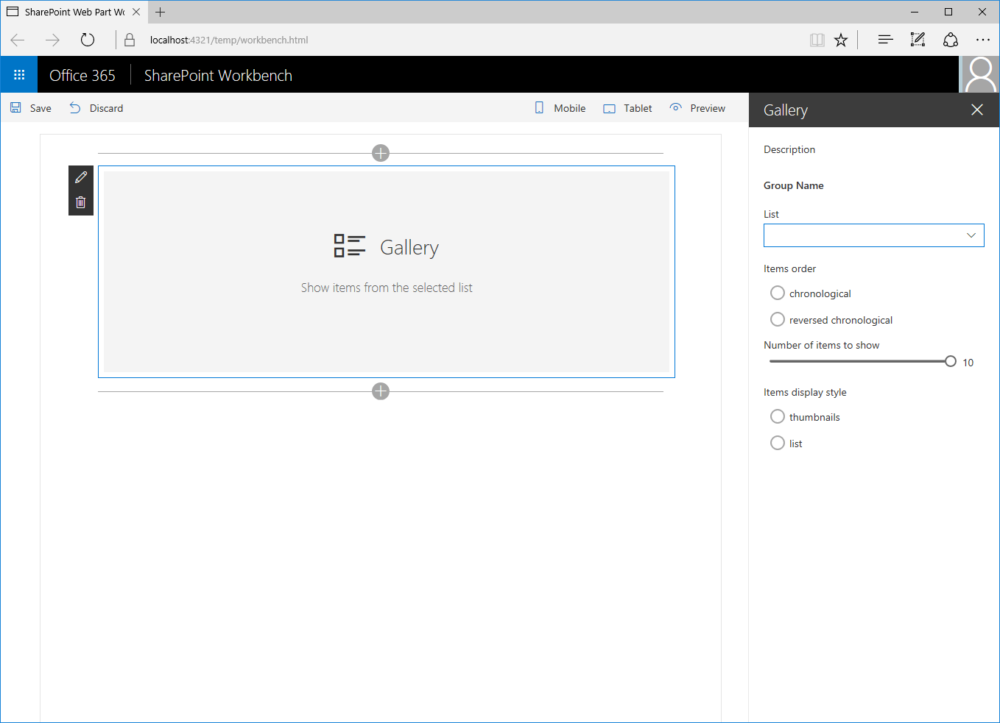
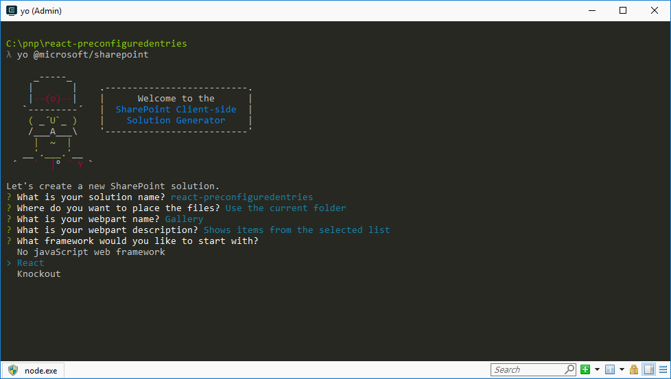
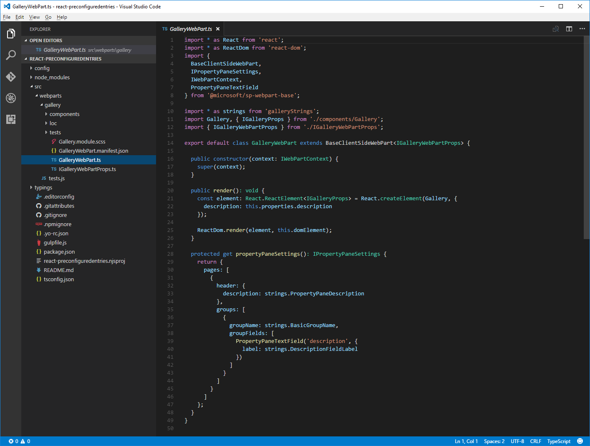
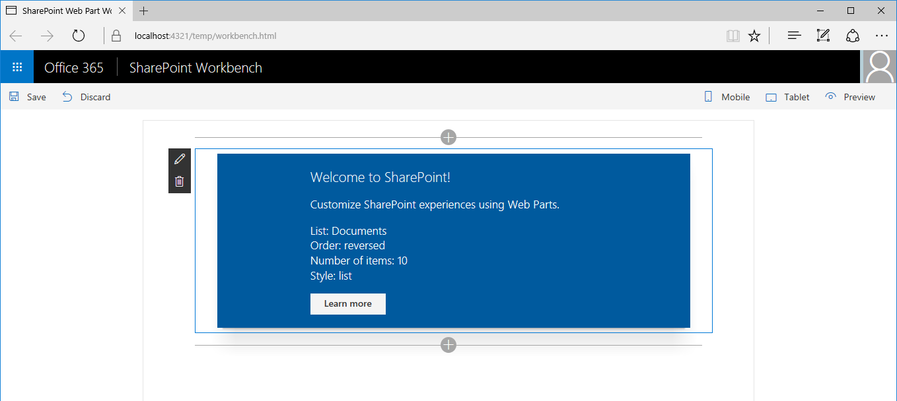
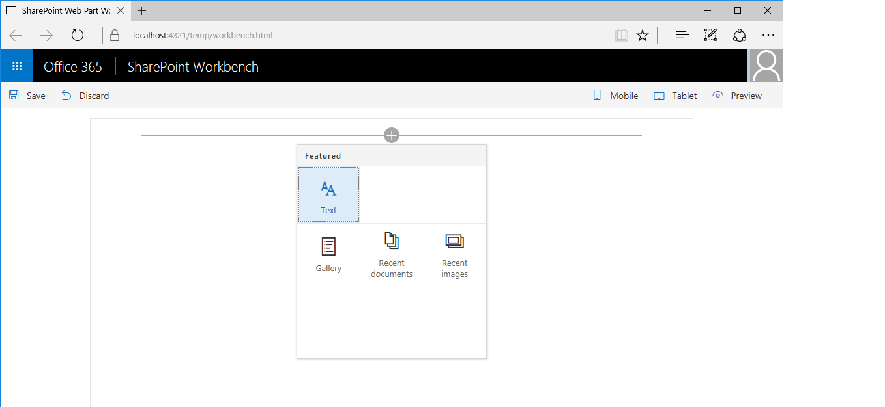

# Simplify adding web parts with preconfigured entries

> **Note:** The SharePoint Framework is currently in preview and is subject to change. SharePoint Framework client-side web parts are not currently supported for use in production environments.

The added value of using web parts above other types of SharePoint customizations, is the ability for users to configure them to their specific needs. Using configuration properties exposed by developers, users can change how the particular web part behaves. The more configuration properties the web part exposes the more flexible it is. But all that configuration requires additional work from users after adding a web part to the page. In this article you will learn how you can use SharePoint Framework client-side web parts preconfigured entries to provide users with preconfigured versions of your web part.

> **Note:** Before following the steps in this article, be sure to [set up your development environment](../../set-up-your-development-environment) for building SharePoint Framework solutions.

## What are web part preconfigured entries

Each SharePoint Framework client-side web part consists of two pieces: the manifest, that describes the web part, and the web part code.

One of the properties specified in the web part manifest is the **preconfiguredEntries** property.

```json
{
  "$schema": "../../../node_modules/@microsoft/sp-module-interfaces/lib/manifestSchemas/jsonSchemas/clientSideComponentManifestSchema.json",

  "id": "6737645a-4443-4210-a70e-e5e2a219133a",
  "alias": "GalleryWebPart",
  "componentType": "WebPart",
  "version": "0.0.1",
  "manifestVersion": 2,

  "preconfiguredEntries": [{
    "groupId": "6737645a-4443-4210-a70e-e5e2a219133a",
    "group": { "default": "Under Development" },
    "title": { "default": "Gallery" },
    "description": { "default": "Shows items from the selected list" },
    "officeFabricIconFontName": "Page",
    "properties": {
      "description": "Gallery"
    }
  }]
}
```

The **preconfiguredEntries** property provides information about your web part for use in the web part toolbox. When users add web parts to the page, the information from the **preconfiguredEntries** property is used to display the web part in the toolbox and define its default settings when it's added to the page.

Comparing it to classic web parts you built with full-trust solutions, each entry in the **preconfiguredEntries** array corresponds to a **.webpart** file. Just like a **.webpart** file, each entry in the **preconfiguredEntries** property is linked to the web part code and specifies basic information about the web part such as its title or description as well as default values for its properties.

### Properties of a **preconfiguredEntries** array item

Each item in the **preconfiguredEntries** array consists of a number of properties. Following is an overview of what these properties are and what their purpose is.

Property name           |Value type      |Required|Purpose                                               |Sample value
------------------------|----------------|:------:|------------------------------------------------------|------------
title                   |ILocalizedString|yes     |Web part title in the toolbox                         |`"title": { "default": "Weather", "nl-nl": "Weerbericht" }`
description             |ILocalizedString|yes     |Web part description displayed in the toolbox tooltips|`"description": { "default": "Shows weather in the given location", "nl-nl": "Toont weerbericht voor de opgegeven locatie" } `
officeFabricIconFontName|string          |no      |The icon for the web part to be displayed in the toolbox. Its value must be one of the [Office UI Fabric icon names](https://dev.office.com/fabric#/styles/icons). If this property has a value, the **iconImageUrl** property will be ignored.|`"officeFabricIconFontName": "Sunny"`
iconImageUrl            |string          |no      |The icon for the web part to be displayed in the toolbox, represented by an image URL. The image at the URL must be exactly 38x38px. If the **officeFabricIconName** property does not have a value, this property must have a value.|`"iconImageUrl": "https://cdn.contoso.com/weather.png"`
groupId                 |string          |yes     |This group id should be used to decide which toolbox group the web part should be placed into. The client side framework has reserved group ids for default groups. The developer can pick one of those groups. In that case the group field will be ignored. Alternatively, the developer can pick a completely unique id and a group name. The toolbox will then show the web part in its own group.|`"groupId": "6737645a-4443-4210-a70e-e5e2a219133a"`
group                   |ILocalizedString|no      |Name of the group in the toolbox in which the web part should be displayed. If no value is provided web part will be displayed in the **Custom** group|`"group": { "default": "Content", "nl-nl": "Inhoud" }`
properties              |TProperties     |yes     |Key-value pair object with default values for web part properties.|`"properties": { "location": "Redmond", "numberOfDays": 3, "showIcon": true }`

Some web part properties have value of type **ILocalizedString**. This type is a key-value pair object that allows developers to specify strings for the different locales. At minimum a value of type **ILocalizedString** must contain the **default** value. Optionally developers can provide the translations of that value to the different locales their web part supports. If the web part is placed on a page in a locale that isn't listed in the particular value, the default value is used instead.

Valid **ILocalizedString** values:

```json
"title": {
  "default": "Weather",
  "nl-nl": "Weerbericht"
}
```

```json
"title": {
  "default": "Weather"
}
```

Invalid **ILocalizedString** value (**default** key missing in the value):

```json
"title": {
  "en-us": "Weather"
}
```

## Using preconfigured entries in web parts

To see how you can use preconfigured entries when building web parts you will build a sample gallery web part. Using a number of properties users can configure this web part to show items from a selected list in a specific way. For brevity you will omit the actual implementation of the web part logic and will focus on using the **preconfiguredEntries** property to provide preconfigured versions of your web part.



### Create new project

Start by creating a new folder for your project.

```sh
md react-preconfiguredentries
```

Go to the project folder.

```sh
cd react-preconfiguredentries
```

In the project folder run the SharePoint Framework Yeoman generator to scaffold a new SharePoint Framework project.

```sh
yo @microsoft/sharepoint
```

When prompted, enter the following values:

- **react-preconfiguredentries** as your solution name
- **Use the current folder** for the location to place the files
- **Gallery** as your web part name
- **Shows items from the selected list** as your web part description
- **React** as the starting point to build the web part



Once the scaffolding completes, open your project folder in your code editor. This article uses Visual Studio Code in the steps and screenshots but you can use any editor you prefer.



### Add web part properties

In the web part manifest add web part properties that users can use to configure the gallery web part. In the code editor open the **./src/webparts/gallery/GalleryWebPart.manifest.json** file. Replace the **properties** section with:

```json
{
  //...
  "preconfiguredEntries": [{
    //...
    "properties": {
      "listName": "",
      "order": "",
      "numberOfItems": 10,
      "style": ""
    }
  }]
}
```

The **listName** property specifies the name of the list from which list items should be displayed. The **order** property specifies the order in which items should be shown (ie. chronological or reversed-chronological). The **numberOfItems** property specifies how many items should be displayed. Finally the **style** property specifies how the items should be displayed (ie. as thumbnails, which is useful for showing images, or as a list which is more suitable for documents).

Web part properties specified in the manifest must also be added to the web part properties interface. In the code editor open the **./src/webparts/gallery/IGalleryWebPartProps.ts** file. Change its code to:

```ts
export interface IGalleryWebPartProps {
  listName: string;
  order: string;
  numberOfItems: number;
  style: string;
}
```

When building SharePoint Framework client-side web parts using React, after changing the web part properties interface, you need to update the web part's **render** method that uses that interface to create an instance of the main React component. In the code editor open the **./src/webparts/gallery/GalleryWebPart.ts** file. Change the web part **render** method to:

```ts
export default class GalleryWebPart extends BaseClientSideWebPart<IGalleryWebPartProps> {
  // ...
  public render(): void {
    const element: React.ReactElement<IGalleryProps> = React.createElement(Gallery, {
      listName: this.properties.listName,
      order: this.properties.order,
      numberOfItems: this.properties.numberOfItems,
      style: this.properties.style
    });

    ReactDom.render(element, this.domElement);
  }
  // ...
}
```

Update the main React component to display the values of the properties. If the web part hasn't been configured show the standard web part placeholder. In the code editor open the **./src/webparts/gallery/components/Gallery.tsx** file and change its code to:

```ts
import * as React from 'react';
import { css } from 'office-ui-fabric-react';
import { Placeholder } from '@microsoft/sp-webpart-base';

import styles from '../Gallery.module.scss';
import { IGalleryWebPartProps } from '../IGalleryWebPartProps';

export interface IGalleryProps extends IGalleryWebPartProps {
}

export default class Gallery extends React.Component<IGalleryProps, {}> {
  public render(): JSX.Element {
    if (this.needsConfiguration()) {
      return <Placeholder
        icon="ms-Icon--ThumbnailView"
        iconText="Gallery"
        description="Show items from the selected list" />;
    }
    else {
      return (
        <div className={styles.gallery}>
          <div className={styles.container}>
            <div className={css('ms-Grid-row ms-bgColor-themeDark ms-fontColor-white', styles.row)}>
              <div className='ms-Grid-col ms-u-lg10 ms-u-xl8 ms-u-xlPush2 ms-u-lgPush1'>
                <span className='ms-font-xl ms-fontColor-white'>
                  Welcome to SharePoint!
              </span>
                <p className='ms-font-l ms-fontColor-white'>
                  Customize SharePoint experiences using Web Parts.
              </p>
                <p className='ms-font-l ms-fontColor-white'>
                  List: {this.props.listName}<br />
                  Order: {this.props.order}<br />
                  Number of items: {this.props.numberOfItems}<br />
                  Style: {this.props.style}
                </p>
                <a
                  className={css('ms-Button', styles.button)}
                  href='https://github.com/SharePoint/sp-dev-docs/wiki'
                  >
                  <span className='ms-Button-label'>Learn more</span>
                </a>
              </div>
            </div>
          </div>
        </div>
      );
    }
  }

  private needsConfiguration(): boolean {
    return Gallery.isEmpty(this.props.listName) ||
      Gallery.isEmpty(this.props.order) ||
      Gallery.isEmpty(this.props.style);
  }

  private static isEmpty(value: string): boolean {
    return value === undefined ||
      value === null ||
      value.length === 0;
  }
}
```

### Render web part properties in the property pane

For users to be able to use the newly defined properties to configure the web part, they have to be displayed in the web part property pane. In the code editor open the **./src/webparts/gallery/GalleryWebPart.ts** file. In the top section of the file change the **@microsoft/sp-webpart-base** import statement to:

```ts
import {
  BaseClientSideWebPart,
  IPropertyPaneSettings,
  IWebPartContext,
  PropertyPaneDropdown,
  PropertyPaneSlider,
  PropertyPaneChoiceGroup
} from '@microsoft/sp-webpart-base';
```

Next, change the **propertyPaneSettings** getter to:

```ts
export default class GalleryWebPart extends BaseClientSideWebPart<IGalleryWebPartProps> {
  // ...
  protected get propertyPaneSettings(): IPropertyPaneSettings {
    return {
      pages: [
        {
          header: {
            description: strings.PropertyPaneDescription
          },
          groups: [
            {
              groupName: strings.BasicGroupName,
              groupFields: [
                PropertyPaneDropdown('listName', {
                  label: strings.ListNameFieldLabel,
                  options: [{
                    key: 'Documents',
                    text: 'Documents'
                  },
                  {
                    key: 'Images',
                    text: 'Images'
                  }]
                }),
                PropertyPaneChoiceGroup('order', {
                  label: strings.OrderFieldLabel,
                  options: [{
                    key: 'chronological',
                    text: strings.OrderFieldChronologicalOptionLabel
                  },
                  {
                    key: 'reversed',
                    text: strings.OrderFieldReversedOptionLabel
                  }]
                }),
                PropertyPaneSlider('numberOfItems', {
                  label: strings.NumberOfItemsFieldLabel,
                  min: 1,
                  max: 10,
                  step: 1
                }),
                PropertyPaneChoiceGroup('style', {
                  label: strings.StyleFieldLabel,
                  options: [{
                    key: 'thumbnails',
                    text: strings.StyleFieldThumbnailsOptionLabel
                  },
                  {
                    key: 'list',
                    text: strings.StyleFieldListOptionLabel
                  }]
                })
              ]
            }
          ]
        }
      ]
    };
  }
}
```

In a real-life scenario you would retrieve the list of lists from the current SharePoint site. For brevity in this example you use a fixed list instead.

### Add localization labels

In the code editor open the **./src/webparts/gallery/loc/mystrings.d.ts** file. Change its code to:

```ts
declare interface IGalleryStrings {
  PropertyPaneDescription: string;
  BasicGroupName: string;
  ListNameFieldLabel: string;
  OrderFieldLabel: string;
  OrderFieldChronologicalOptionLabel: string;
  OrderFieldReversedOptionLabel: string;
  NumberOfItemsFieldLabel: string;
  StyleFieldLabel: string;
  StyleFieldThumbnailsOptionLabel: string;
  StyleFieldListOptionLabel: string;
}

declare module 'galleryStrings' {
  const strings: IGalleryStrings;
  export = strings;
}
```

Add the missing resource strings by opening in the code editor the **./src/webparts/gallery/loc/en-us.js** file and changing its code to:

```js
define([], function() {
  return {
    "PropertyPaneDescription": "Description",
    "BasicGroupName": "Group Name",
    "ListNameFieldLabel": "List",
    "OrderFieldLabel": "Items order",
    "OrderFieldChronologicalOptionLabel": "chronological",
    "OrderFieldReversedOptionLabel": "reversed chronological",
    "NumberOfItemsFieldLabel": "Number of items to show",
    "StyleFieldLabel": "Items display style",
    "StyleFieldThumbnailsOptionLabel": "thumbnails",
    "StyleFieldListOptionLabel": "list"
  }
});
```

Confirm that the project is building by in the command line executing:

```sh
gulp serve
```

In the web browser add the web part to the canvas and open its property pane. You should see all properties available for users to configure.


Because you didn't specify any default values for the web part, every time users would add that web part to the page they would have to configure it first. You can simplify this experience by providing default values for the most common scenarios.

### Specify default values for the web part

Imagine that users often use the gallery web part to show the five most recently added images. Rather than configuring the web part each time manually, you could provide them with a preconfigured version using correct settings.

In the code editor open the **./src/webparts/gallery/GalleryWebPart.manifest.json** file. Change the existing entry in the **preconfiguredEntries** property to:

```json
{
  // ...
  "preconfiguredEntries": [{
    "groupId": "6737645a-4443-4210-a70e-e5e2a219133a",
    "group": { "default": "Content" },
    "title": { "default": "Recent images" },
    "description": { "default": "Shows 5 most recent images" },
    "officeFabricIconFontName": "Picture",
    "properties": {
      "listName": "Images",
      "order": "reversed",
      "numberOfItems": 5,
      "style": "thumbnails"
    }
  }]
}
```

Start debugging the project by in the command line running:

```sh
gulp serve
```

> Note: if you have been debugging the project previously, stop debugging and start it again. Changes made to web part manifest are not automatically reflected in the workbench while debugging and you have to rebuild the project in order to see them.

When you open the web part toolbox to add the web part to canvas, you will see that its name and icon changed to reflect the preconfigured settings.


After adding the web part to the page it works immediately using the preconfigured settings.


### Specify multiple preconfigured web part entries

Imagine that another group of users often uses your gallery web part to show documents recently added to their site. To help them using your web part you can add another set of presets that addresses their configuration needs.

In the code editor open the **./src/webparts/gallery/GalleryWebPart.manifest.json** file. Change the **preconfiguredEntries** property to:

```json
{
  // ...
  "preconfiguredEntries": [{
    "groupId": "6737645a-4443-4210-a70e-e5e2a219133a",
    "group": { "default": "Content" },
    "title": { "default": "Recent images" },
    "description": { "default": "Shows 5 most recent images" },
    "officeFabricIconFontName": "Picture",
    "properties": {
      "listName": "Images",
      "order": "reversed",
      "numberOfItems": 5,
      "style": "thumbnails"
    }
  },
  {
    "groupId": "6737645a-4443-4210-a70e-e5e2a219133a",
    "group": { "default": "Content" },
    "title": { "default": "Recent documents" },
    "description": { "default": "Shows 10 most recent documents" },
    "officeFabricIconFontName": "Documentation",
    "properties": {
      "listName": "Documents",
      "order": "reversed",
      "numberOfItems": 10,
      "style": "list"
    }
  }]
}
```

Notice how you keep the previous preconfigured entry intact and add another one beside it using different values for properties.

To see the result start debugging the project by in the command line running:

```sh
gulp serve
```

When you open the web part toolbox to add the web part to canvas, you will see that there are two web parts for you to choose from.


After adding the **Recent documents** web part to the page it works immediately using its specific preconfigured settings.



### Specify unconfigured instance of the web part

When building web parts there are often specific scenarios that the particular web part should support. Providing preconfigured entries for those scenarios makes it easier for users to use the web part.

Depending how you build your web part, it could be possible that the web part is capable of supporting other, unforeseen scenarios as well. If you would only provide specific preconfigured entries, users might not think of using your web part for their scenario. In such cases it might be a good idea to provide a generic, unconfigured variant of your web part as well.

In the code editor open the **./src/webparts/gallery/GalleryWebPart.manifest.json** file. Change the **preconfiguredEntries** property to:

```json
{
  // ...
  "preconfiguredEntries": [{
    "groupId": "6737645a-4443-4210-a70e-e5e2a219133a",
    "group": { "default": "Content" },
    "title": { "default": "Recent images" },
    "description": { "default": "Shows 5 most recent images" },
    "officeFabricIconFontName": "Picture",
    "properties": {
      "listName": "Images",
      "order": "reversed",
      "numberOfItems": 5,
      "style": "thumbnails"
    }
  },
  {
    "groupId": "6737645a-4443-4210-a70e-e5e2a219133a",
    "group": { "default": "Content" },
    "title": { "default": "Recent documents" },
    "description": { "default": "Shows 10 most recent documents" },
    "officeFabricIconFontName": "Documentation",
    "properties": {
      "listName": "Documents",
      "order": "reversed",
      "numberOfItems": 10,
      "style": "list"
    }
  },
  {
    "groupId": "6737645a-4443-4210-a70e-e5e2a219133a",
    "group": { "default": "Content" },
    "title": { "default": "Gallery" },
    "description": { "default": "Shows items from the selected list" },
    "officeFabricIconFontName": "CustomList",
    "properties": {
      "listName": "",
      "order": "",
      "numberOfItems": 5,
      "style": ""
    }
  }]
}
```

The generic unconfigured version of the web part is added besides the configurations targeting specific scenarios. This way, if there is no specific configuration addressing users' needs, they can always use the generic version and configure it according to their requirements.

To see the result start debugging the project by in the command line running:

```sh
gulp serve
```

When you open the web part toolbox to add the web part to canvas, you will see that there are now three web parts that users can choose from.

