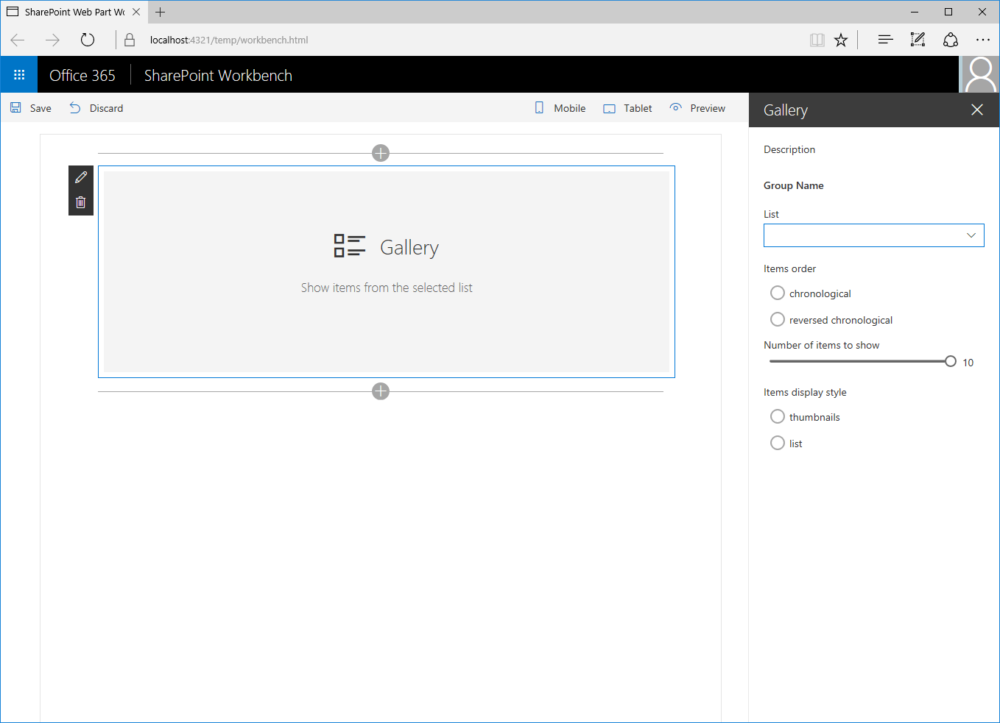
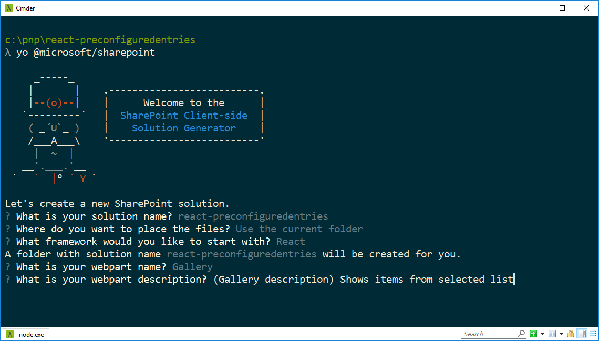
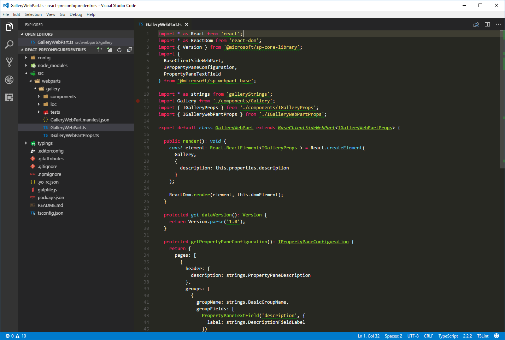
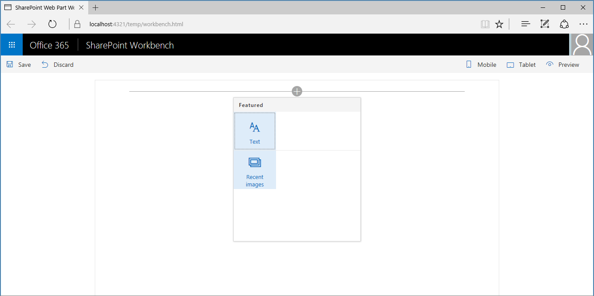
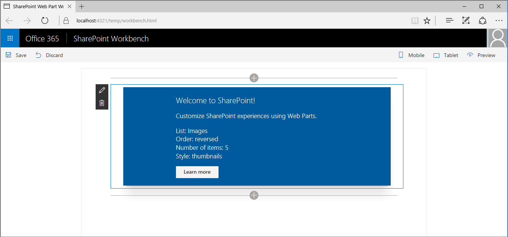
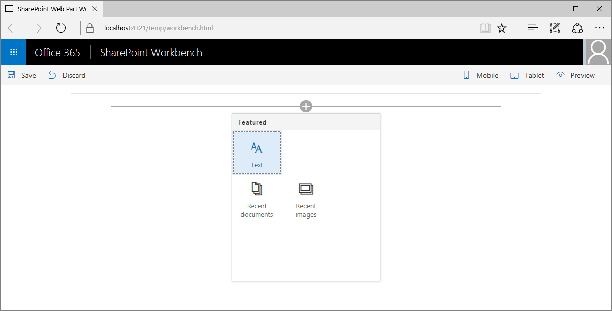
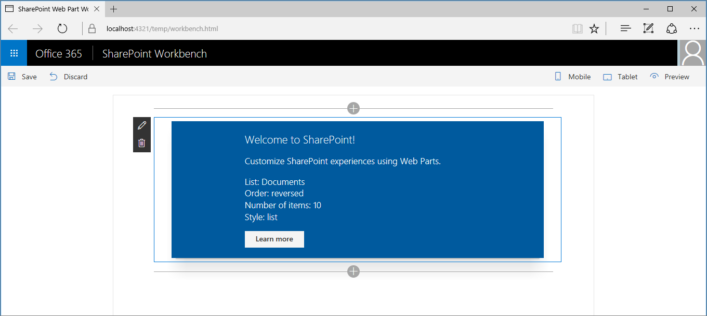
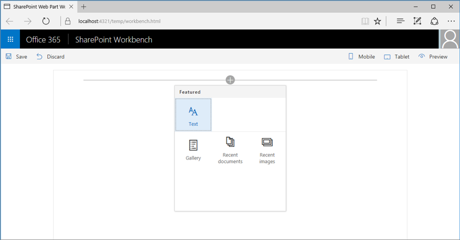

# Simplify adding web parts with preconfigured entries

More complex SharePoint Framework client-side web parts will likely have many properties that the user must configure. You can help users by adding preconfigured property entries for specific scenarios. A preconfigured entry will initialize the web part with preset values. In this article you will learn how you to use preconfigured entries in a SharePoint Framework client-side web part to provide users with preconfigured versions of your web part.

> **Note:** Before following the steps in this article, be sure to [set up your SharePoint client-side web part development environment](../../set-up-your-development-environment.md).

## What are web part preconfigured entries

Each SharePoint Framework client-side web part consists of two pieces: the manifest, that describes the web part, and the web part code.

One of the properties specified in the web part manifest is the **preconfiguredEntries** property.

```json
{
  "$schema": "../../../node_modules/@microsoft/sp-module-interfaces/lib/manifestSchemas/jsonSchemas/clientSideComponentManifestSchema.json",

  "id": "6737645a-4443-4210-a70e-e5e2a219133a",
  "alias": "GalleryWebPart",
  "componentType": "WebPart",
  "version": "0.0.1",
  "manifestVersion": 2,

  "preconfiguredEntries": [{
    "groupId": "1edbd9a8-0bfb-4aa2-9afd-14b8c45dd489", // Discover
    "group": { "default": "Under Development" },
    "title": { "default": "Gallery" },
    "description": { "default": "Shows items from the selected list" },
    "officeFabricIconFontName": "Page",
    "properties": {
      "description": "Gallery"
    }
  }]
}
```

The **preconfiguredEntries** property provides information about your web part for use in the web part toolbox. When users add web parts to the page, the information from the **preconfiguredEntries** property is used to display the web part in the toolbox and define its default settings when it's added to the page.

If you've built classic web parts with full-trust solutions, then you can think of each entry in the **preconfiguredEntries** array as corresponding to a **.webpart** file. Just like a **.webpart** file, each entry in the **preconfiguredEntries** property is linked to the web part code and specifies basic information about the web part such as its title or description as well as default values for its properties.

### Properties of a **preconfiguredEntries** array item

Each item in the **preconfiguredEntries** array consists of several properties. The following table explains the purpose of each property.

Property name           |Value type      |Required|Purpose                                               |Sample value
------------------------|----------------|:------:|------------------------------------------------------|------------
title                   |ILocalizedString|yes     |The web part title that is displayed in the toolbox.              |`"title": { "default": "Weather", "nl-nl": "Weerbericht" }`
description             |ILocalizedString|yes     |The web part description that is displayed in the toolbox tooltips.|`"description": { "default": "Shows weather in the given location", "nl-nl": "Toont weerbericht voor de opgegeven locatie" } `
officeFabricIconFontName|string          |no      |The icon for the web part that is displayed in the toolbox. Its value must be one of the [Office UI Fabric icon names](https://dev.office.com/fabric#/styles/icons). If this property has a value, the **iconImageUrl** property will be ignored.|`"officeFabricIconFontName": "Sunny"`
iconImageUrl            |string          |no      |The icon for the web part that is displayed in the toolbox and is represented by an image URL. The image at the URL must be exactly 40 x 28 px. If the **officeFabricIconName** property does not have a value, this property must have a value.|`"iconImageUrl": "https://cdn.contoso.com/weather.png"`
groupId                 |string          |yes     |The group id determines which toolbox group will contain the web part. The SharePoint Framework reserves group ids for default groups. The developer can pick one of those groups. If a group id is specified, then the **group** property will be ignored. Alternatively, the developer can pick a completely unique id and a group name. The toolbox will then show the web part in its own group.|`"groupId": "6737645a-4443-4210-a70e-e5e2a219133a"`
group                   |ILocalizedString|no      |The name of the group in the toolbox in which the web part will be displayed. If no value is provided, then the web part will be displayed in the **Custom** group.|`"group": { "default": "Content", "nl-nl": "Inhoud" }`
dataVersion             |string          |no      |Use this field to specify the data version of the pre-configured data provided to the web part. Note that data version is different from the version field in the manifest. The manifest version is used to control the versioning of the web part code, while data version is used to control the versioning of the serialized data of the web part. Refer to dataVersion field of your web part for more information. Supported values format: MAJOR.MINOR version|`"dataVersion": "1.0"`
properties              |TProperties     |yes     |A Key-value pair object with default values for web part properties.|`"properties": { "location": "Redmond", "numberOfDays": 3, "showIcon": true }`

Out of the box Categories are following, which can be used for the `groupId` property.

Category Name |Guid |Map to web part picker |Description        
--- |--- |--- |---
Text, media, and content | `cf066440-0614-43d6-98ae-0b31cf14c7c3`| Media and Content  |This category includes web parts that display text, multi-media, documents, information from the web, and other rich content.   
Discover | `1edbd9a8-0bfb-4aa2-9afd-14b8c45dd489`| Discovery  |This category includes web parts that organize, group, and filter content to help users discover information. 
Communication and collaboration | `75e22ed5-fa14-4829-850a-c890608aca2d`| Social Collaboration |This category includes web parts that facilitate information sharing, team work, and social interactions.
Planning and process | `1bc7927e-4a5e-4520-b540-71305c79c20a`| Business Data | This category includes web parts that empower team productivity with the use of planning and process tools. 
Business and intelligence | `4aca9e90-eff5-4fa1-bac7-728f5f157b66`| Business Data | This category includes web parts for tracking and analyzing data, and for integrating business flow with pages. 
Site tools | `070951d7-94da-4db8-b06e-9d581f1f55b1`| Site tools  |This category includes web parts for site information and management. 
Other | `5c03119e-3074-46fd-976b-c60198311f70`| Others | This category includes web parts not in other categories.            

Some web part properties have a value of type **ILocalizedString**. This type is a key-value pair object that allows developers to specify strings for the different locales. At a minimum, a value of type **ILocalizedString** must contain the **default** value. Optionally developers can provide the translations of that value to the different locales that their web part supports. If the web part is placed on a page in a locale that isn't listed in the localized string, the default value is used instead.

Valid **ILocalizedString** values:

```json
"title": {
  "default": "Weather",
  "nl-nl": "Weerbericht"
}
```

```json
"title": {
  "default": "Weather"
}
```

A **ILocalizedString** value that is not valid because the **default** key is missing:

```json
"title": {
  "en-us": "Weather"
}
```

## Using preconfigured entries in web parts

To see how you can use preconfigured entries when building web parts, you will build a sample gallery web part. Using several properties, users can configure this web part to show items from a selected list in a specific way. For brevity, you will omit the actual implementation of the web part logic and will focus on using the **preconfiguredEntries** property to provide preconfigured versions of the gallery web part.



### Create a new project

Start by creating a new folder for your project.

```sh
md react-preconfiguredentries
```

Go to the project folder.

```sh
cd react-preconfiguredentries
```

In the project folder run the SharePoint Framework Yeoman generator to scaffold a new SharePoint Framework project.

```sh
yo @microsoft/sharepoint
```

When prompted, enter the following values:

- **react-preconfiguredentries** as your solution name
- **Use the current folder** for the location to place the files
- **Gallery** as your web part name
- **Shows items from the selected list** as your web part description
- **React** as the starting point to build the web part



Once the scaffolding completes, lock down the version of the project dependencies by running the following command:

```sh
npm shrinkwrap
```

Next, open your project folder in your code editor. This article uses Visual Studio Code in the steps and screenshots but you can use any editor you prefer.



### Add web part properties

In the web part manifest, add web part properties so that users can configure the gallery web part. In the code editor, open the **./src/webparts/gallery/GalleryWebPart.manifest.json** file. Replace the **properties** section with the following JSON:

```json
{
  //...
  "preconfiguredEntries": [{
    //...
    "properties": {
      "listName": "",
      "order": "",
      "numberOfItems": 10,
      "style": ""
    }
  }]
}
```

The **listName** property specifies the name of the list from which list items should be displayed. The **order** property specifies the order in which items should be shown, that is chronological, or reverse chronological order. The **numberOfItems** property specifies how many items should be displayed. Finally, the **style** property specifies how the items should be displayed, such as thumbnails, which is useful for showing images, or as a list which is more suitable for documents.

Web part properties specified in the manifest must also be added to the web part properties interface. In the code editor, open the **./src/webparts/gallery/IGalleryWebPartProps.ts** file. Change its code to:

```ts
export interface IGalleryWebPartProps {
  listName: string;
  order: string;
  numberOfItems: number;
  style: string;
}
```

When building SharePoint Framework client-side web parts using React, after changing the web part properties interface, you need to update the web part's **render** method that uses that interface to create an instance of the main React component. In the code editor, open the **./src/webparts/gallery/GalleryWebPart.ts** file. Change the web part **render** method to:

```ts
export default class GalleryWebPart extends BaseClientSideWebPart<IGalleryWebPartProps> {
  // ...
  public render(): void {
    const element: React.ReactElement<IGalleryProps> = React.createElement(Gallery, {
      listName: this.properties.listName,
      order: this.properties.order,
      numberOfItems: this.properties.numberOfItems,
      style: this.properties.style
    });

    ReactDom.render(element, this.domElement);
  }
  // ...
}
```

Update the main React component to display the values of the properties. If the web part hasn't been configured, show the standard web part placeholder. In the code editor, open the **./src/webparts/gallery/components/Gallery.tsx** file and change its code to:

```ts
import * as React from 'react';
import styles from './Gallery.module.scss';
import { IGalleryProps } from './IGalleryProps';

export default class Gallery extends React.Component<IGalleryProps, void> {
  public render(): JSX.Element {
    if (this.needsConfiguration()) {
      return <div className="ms-Grid" style={{ color: "#666", backgroundColor: "#f4f4f4", padding: "80px 0", alignItems: "center", boxAlign: "center" }}>
        <div className="ms-Grid-row" style={{ color: "#333" }}>
          <div className="ms-Grid-col ms-u-hiddenSm ms-u-md3"></div>
          <div className="ms-Grid-col ms-u-sm12 ms-u-md6" style={{ height: "100%", whiteSpace: "nowrap", textAlign: "center" }}>
            <i className="ms-fontSize-su ms-Icon ms-Icon--ThumbnailView" style={{ display: "inline-block", verticalAlign: "middle", whiteSpace: "normal" }}></i><span className="ms-fontWeight-light ms-fontSize-xxl" style={{ paddingLeft: "20px", display: "inline-block", verticalAlign: "middle", whiteSpace: "normal" }}>Gallery</span>
          </div>
          <div className="ms-Grid-col ms-u-hiddenSm ms-u-md3"></div>
        </div>
        <div className="ms-Grid-row" style={{ width: "65%", verticalAlign: "middle", margin: "0 auto", textAlign: "center" }}>
          <span style={{ color: "#666", fontSize: "17px", display: "inline-block", margin: "24px 0", fontWeight: 100 }}>Show items from the selected list</span>
        </div>
        <div className="ms-Grid-row"></div>
      </div>;
    }
    else {
      return (
        <div className={styles.gallery}>
          <div className={styles.container}>
            <div className={`ms-Grid-row ms-bgColor-themeDark ms-fontColor-white ${styles.row}`}>
              <div className='ms-Grid-col ms-u-lg10 ms-u-xl8 ms-u-xlPush2 ms-u-lgPush1'>
                <span className="ms-font-xl ms-fontColor-white">
                  Welcome to SharePoint!
                </span>
                <p className='ms-font-l ms-fontColor-white'>
                  Customize SharePoint experiences using Web Parts.
                </p>
                <p className='ms-font-l ms-fontColor-white'>
                  List: {this.props.listName}<br />
                  Order: {this.props.order}<br />
                  Number of items: {this.props.numberOfItems}<br />
                  Style: {this.props.style}
                </p>
                <a href="https://aka.ms/spfx" className={styles.button}>
                  <span className={styles.label}>Learn more</span>
                </a>
              </div>
            </div>
          </div>
        </div>
      );
    }
  }

  private needsConfiguration(): boolean {
    return Gallery.isEmpty(this.props.listName) ||
      Gallery.isEmpty(this.props.order) ||
      Gallery.isEmpty(this.props.style);
  }

  private static isEmpty(value: string): boolean {
    return value === undefined ||
      value === null ||
      value.length === 0;
  }
}
```

Update the main React component Interface to match on the web part property Interface, since we are bypassing all the web part properties to this component. In the code editor, open the **./src/webparts/gallery/components/IGalleryProps.ts** file and change its code to:

```ts
import { IGalleryWebPartProps } from '../IGalleryWebPartProps';

export interface IGalleryProps extends IGalleryWebPartProps {
}
```

### Render web part properties in the property pane

For users to be able to use the newly defined properties to configure the web part, the properties must be displayed in the web part property pane. In the code editor, open the **./src/webparts/gallery/GalleryWebPart.ts** file. In the top section of the file change the **@microsoft/sp-webpart-base** import statement to:

```ts
import {
  BaseClientSideWebPart,
  IPropertyPaneConfiguration,
  PropertyPaneDropdown,
  PropertyPaneSlider,
  PropertyPaneChoiceGroup
} from '@microsoft/sp-webpart-base';
```

Next, change the **propertyPaneSettings** getter to:

```ts
export default class GalleryWebPart extends BaseClientSideWebPart<IGalleryWebPartProps> {
  // ...
  protected getPropertyPaneConfiguration(): IPropertyPaneConfiguration {
    return {
      pages: [
        {
          header: {
            description: strings.PropertyPaneDescription
          },
          groups: [
            {
              groupName: strings.BasicGroupName,
              groupFields: [
                PropertyPaneDropdown('listName', {
                  label: strings.ListNameFieldLabel,
                  options: [{
                    key: 'Documents',
                    text: 'Documents'
                  },
                  {
                    key: 'Images',
                    text: 'Images'
                  }]
                }),
                PropertyPaneChoiceGroup('order', {
                  label: strings.OrderFieldLabel,
                  options: [{
                    key: 'chronological',
                    text: strings.OrderFieldChronologicalOptionLabel
                  },
                  {
                    key: 'reversed',
                    text: strings.OrderFieldReversedOptionLabel
                  }]
                }),
                PropertyPaneSlider('numberOfItems', {
                  label: strings.NumberOfItemsFieldLabel,
                  min: 1,
                  max: 10,
                  step: 1
                }),
                PropertyPaneChoiceGroup('style', {
                  label: strings.StyleFieldLabel,
                  options: [{
                    key: 'thumbnails',
                    text: strings.StyleFieldThumbnailsOptionLabel
                  },
                  {
                    key: 'list',
                    text: strings.StyleFieldListOptionLabel
                  }]
                })
              ]
            }
          ]
        }
      ]
    };
  }
}
```

In a real-life scenario, you would retrieve the list of lists from the current SharePoint site. For brevity, in this example you use a fixed list instead.

### Add localization labels

In the code editor, open the **./src/webparts/gallery/loc/mystrings.d.ts** file. Change its code to:

```ts
declare interface IGalleryStrings {
  PropertyPaneDescription: string;
  BasicGroupName: string;
  ListNameFieldLabel: string;
  OrderFieldLabel: string;
  OrderFieldChronologicalOptionLabel: string;
  OrderFieldReversedOptionLabel: string;
  NumberOfItemsFieldLabel: string;
  StyleFieldLabel: string;
  StyleFieldThumbnailsOptionLabel: string;
  StyleFieldListOptionLabel: string;
}

declare module 'galleryStrings' {
  const strings: IGalleryStrings;
  export = strings;
}
```

Add the missing resource strings by opening in the code editor the **./src/webparts/gallery/loc/en-us.js** file and changing its code to:

```js
define([], function() {
  return {
    "PropertyPaneDescription": "Description",
    "BasicGroupName": "Group Name",
    "ListNameFieldLabel": "List",
    "OrderFieldLabel": "Items order",
    "OrderFieldChronologicalOptionLabel": "chronological",
    "OrderFieldReversedOptionLabel": "reversed chronological",
    "NumberOfItemsFieldLabel": "Number of items to show",
    "StyleFieldLabel": "Items display style",
    "StyleFieldThumbnailsOptionLabel": "thumbnails",
    "StyleFieldListOptionLabel": "list"
  }
});
```

Confirm that the project is building by running the following command:

```sh
gulp serve
```

In the web browser add the web part to the canvas and open its property pane. You should see all properties available for users to configure.


Because you didn't specify any default values for the web part, every time users add the web part to the page they have to configure it first. You can simplify this experience by providing default values for the most common scenarios.

### Specify default values for the web part

Imagine that users often use the gallery web part to show the five most recently added images. Rather than requiring users to configure the web part each time manually, you could provide them with a preconfigured version using correct settings.

In the code editor, open the **./src/webparts/gallery/GalleryWebPart.manifest.json** file. Change the existing entry in the **preconfiguredEntries** property to:

```json
{
  // ...
  "preconfiguredEntries": [{
    "groupId": "6737645a-4443-4210-a70e-e5e2a219133a",
    "group": { "default": "Content" },
    "title": { "default": "Recent images" },
    "description": { "default": "Shows 5 most recent images" },
    "officeFabricIconFontName": "Picture",
    "properties": {
      "listName": "Images",
      "order": "reversed",
      "numberOfItems": 5,
      "style": "thumbnails"
    }
  }]
}
```

Start debugging the project by running the following command:

```sh
gulp serve
```

> **Note**: If you were debugging the project previously, stop debugging and start it again. Changes made to the web part manifest are not automatically reflected in the workbench while debugging, and you have to rebuild the project in order to see them.

When you open the web part toolbox to add the web part to the canvas, you will see that its name and icon changed to reflect the preconfigured settings.



After adding the web part to the page, it works immediately using the preconfigured settings.



### Specify multiple preconfigured web part entries

Imagine that another group of users often uses your gallery web part to show documents recently added to their site. To help them use your web part, you can add another set of presets that addresses their configuration needs.

In the code editor, open the **./src/webparts/gallery/GalleryWebPart.manifest.json** file. Change the **preconfiguredEntries** property to:

```json
{
  // ...
  "preconfiguredEntries": [{
    "groupId": "6737645a-4443-4210-a70e-e5e2a219133a",
    "group": { "default": "Content" },
    "title": { "default": "Recent images" },
    "description": { "default": "Shows 5 most recent images" },
    "officeFabricIconFontName": "Picture",
    "properties": {
      "listName": "Images",
      "order": "reversed",
      "numberOfItems": 5,
      "style": "thumbnails"
    }
  },
  {
    "groupId": "6737645a-4443-4210-a70e-e5e2a219133a",
    "group": { "default": "Content" },
    "title": { "default": "Recent documents" },
    "description": { "default": "Shows 10 most recent documents" },
    "officeFabricIconFontName": "Documentation",
    "properties": {
      "listName": "Documents",
      "order": "reversed",
      "numberOfItems": 10,
      "style": "list"
    }
  }]
}
```

Notice how you keep the previous preconfigured entry intact and add another one beside it using different values for properties.

To see the result start debugging the project by running the following command:

```sh
gulp serve
```

When you open the web part toolbox to add the web part to the canvas, you will see that there are two web parts for you to choose from.



After adding the **Recent documents** web part to the page, it works immediately using its specific preconfigured settings.



### Specify an unconfigured instance of the web part

When building web parts there are often specific scenarios that the web part should support. Providing preconfigured entries for those scenarios makes it easier for users to use the web part.

Depending how you build your web part, it could be possible that the web part can support other unforeseen scenarios as well. If you only provide specific preconfigured entries, users might not realize they can use your web part for a different scenario. It might be a good idea to provide a generic unconfigured variant of your web part as well.

In the code editor, open the **./src/webparts/gallery/GalleryWebPart.manifest.json** file. Change the **preconfiguredEntries** property to:

```json
{
  // ...
  "preconfiguredEntries": [{
    "groupId": "6737645a-4443-4210-a70e-e5e2a219133a",
    "group": { "default": "Content" },
    "title": { "default": "Recent images" },
    "description": { "default": "Shows 5 most recent images" },
    "officeFabricIconFontName": "Picture",
    "properties": {
      "listName": "Images",
      "order": "reversed",
      "numberOfItems": 5,
      "style": "thumbnails"
    }
  },
  {
    "groupId": "6737645a-4443-4210-a70e-e5e2a219133a",
    "group": { "default": "Content" },
    "title": { "default": "Recent documents" },
    "description": { "default": "Shows 10 most recent documents" },
    "officeFabricIconFontName": "Documentation",
    "properties": {
      "listName": "Documents",
      "order": "reversed",
      "numberOfItems": 10,
      "style": "list"
    }
  },
  {
    "groupId": "6737645a-4443-4210-a70e-e5e2a219133a",
    "group": { "default": "Content" },
    "title": { "default": "Gallery" },
    "description": { "default": "Shows items from the selected list" },
    "officeFabricIconFontName": "CustomList",
    "properties": {
      "listName": "",
      "order": "",
      "numberOfItems": 5,
      "style": ""
    }
  }]
}
```

The generic unconfigured version of the web part is added beside the configurations that target specific scenarios. This way, if there is no specific configuration addressing users' needs, they can always use the generic version and configure it according to their requirements.

To see the result start debugging the project by running the following command:

```sh
gulp serve
```

When you open the web part toolbox to add the web part to the canvas, you will see that there are now three web parts that users can choose from.


