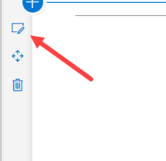
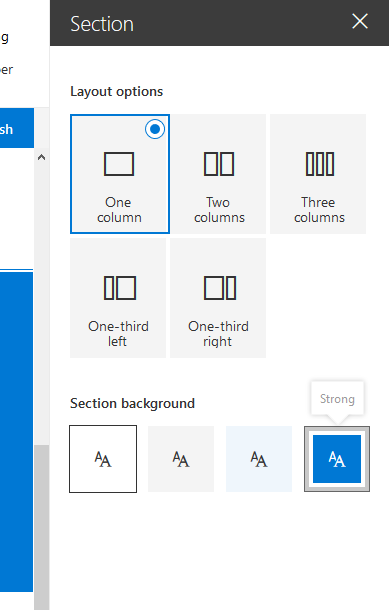

# Supporting section backgrounds

Starting with version 1.8 of the SharePoint Framework web parts can be made aware of any section backgrounds and use these colors to improve the appearance of a web part when hosted in a section with a different background.

## Configuring your section to use a different background

The section background color you can set is based upon the main color of the theme you applied. In order to set the background of a section open its properties:



In the properties you can define which type of section background you want to set:


 
## Making your web part theme aware

### Update the manifest

You will have to add a `supportsThemeVariants` property to the manifest of your webpart and set its value to `true`:

```json
{
  "$schema": "https://developer.microsoft.com/json-schemas/spfx/client-side-web-part-manifest.schema.json",
  "id": "30e558fb-1d1b-4c5d-9ee3-eb5fcdf2fe54",
  "alias": "BasicPlainSectionBackgroundExample",
  "componentType": "WebPart",

  "supportsThemeVariants": true,

  "version": "*",
  "manifestVersion": 2,

  "requiresCustomScript": false,

  "preconfiguredEntries": [{
    "groupId": "5c03119e-3074-46fd-976b-c60198311f70", 
    "group": { "default": "Other" },
    "title": { "default": "BasicPlainSectionBackgroundExample" },
    "description": { "default": "BasicPlainSectionBackgroundExample description" },
    "officeFabricIconFontName": "Page",
    "properties": {
    }
  }]
}
```

### Using the background color awareness in a basic web part

In order to make the web part aware of any theme changes you have to implement support for the ThemeProvider service which will raise an event in case a theme change has taken place.

```typescript
protected onInit(): Promise<void> {
    // Consume the new ThemeProvider service
    this._themeProvider = this.context.serviceScope.consume(ThemeProvider.serviceKey);

    // If it exists, get the theme variant
    this._themeVariant = this._themeProvider.tryGetTheme();

    // Register a handler to be notified if the theme variant changes
    this._themeProvider.themeChangedEvent.add(this, this._handleThemeChangedEvent);

    return super.onInit();
}

/**
 * Update the current theme variant reference and re-render.
 *
 * @param args The new theme
 */
private _handleThemeChangedEvent(args: ThemeChangedEventArgs): void {
    this._themeVariant = args.theme;
    this.render();
}
```

Using the ThemeProvider we can now retrieve the correct body text color:

```typescript
public render(): void {

    const semanticColors: Readonly<ISemanticColors> | undefined = this._themeVariant && this._themeVariant.semanticColors;

    const style: string = ` style="color:${semanticColors.bodyText}"`;
    this.domElement.innerHTML = `<p${'' || (this._themeProvider && style)}>this is a demo</p>`;
}
```

### In a React web part

For a React based web part you will have to implement code to consume the ThemeProvider, just like with a basic web part:

```typescript
protected onInit(): Promise<void> {
    // Consume the new ThemeProvider service
    this._themeProvider = this.context.serviceScope.consume(ThemeProvider.serviceKey);

    // If it exists, get the theme variant
    this._themeVariant = this._themeProvider.tryGetTheme();

    // Register a handler to be notified if the theme variant changes
    this._themeProvider.themeChangedEvent.add(this, this._handleThemeChangedEvent);

    return super.onInit();
}

/**
 * Update the current theme variant reference and re-render.
 *
 * @param args The new theme
 */
private _handleThemeChangedEvent(args: ThemeChangedEventArgs): void {
    this._themeVariant = args.theme;
    this.render();
}
```

Now in order to use the theme variant in your component you will have to send the theme variant to your component in the render method:

```typescript
public render(): void {
    const element: React.ReactElement<IBasicSectionBackgroundExampleProps > = React.createElement(
      BasicSectionBackgroundExample,
      {
        themeVariant: this._themeVariant
      }
    );

    ReactDom.render(element, this.domElement);
}
```

In order to use that property in your component you will have to add it to your properties interface definition, which in this case is called IBasicSectionBackgroundExampleProps:

```typescript
export interface IBasicSectionBackgroundExampleProps {
  themeVariant: IReadonlyTheme | undefined;
}
```

Then in the render method of the component you can retrieve the correct colors as follows:

```typescript
public render(): React.ReactElement<IBasicSectionBackgroundExampleProps> {
    
    const { semanticColors }: IReadonlyTheme = this.props.themeVariant;

    return (
      <div style={{color: semanticColors.bodyText}}>
        <p>This React web part has support for section backgrounds and will inherit its background from the section</p>
      </div>
    );
}
```

## See also

- [Designing for section backgrounds using semantic slots](../../../design/semantic_slots.md)
- [SharePoint Framework Overview](../../sharepoint-framework-overview.md)