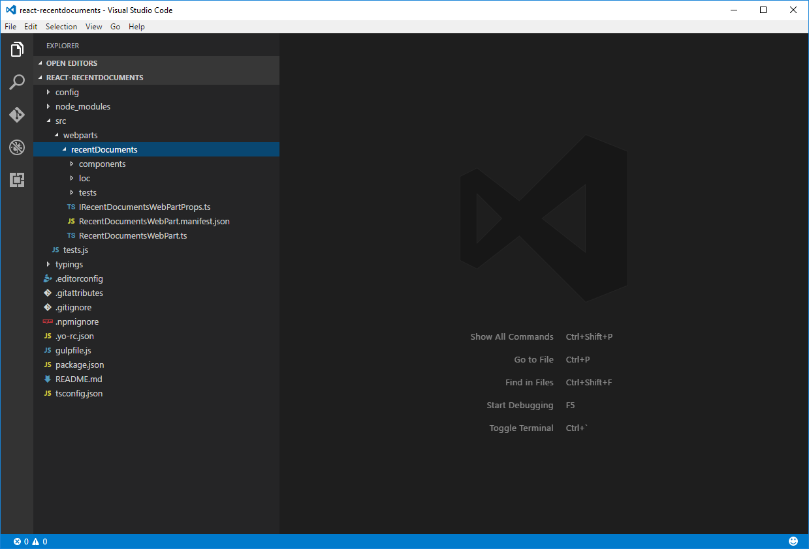

# Share data between web parts by using a global variable (tutorial)

When building client-side web parts, loading data once and reusing it across different web parts helps improve the performance of your pages and decrease the load on your network. 

> [!NOTE] 
> Before following the steps in this article, be sure to [set up your SharePoint client-side web part development environment](../../set-up-your-development-environment.md).

## Create a new project

1. Using a command prompt, create a new folder for your project:

  ```sh
  md react-recentdocuments
  ```

2. Go into the project folder:

  ```sh
  cd react-recentdocuments
  ```

3. In the project folder, run the SharePoint Framework Yeoman generator to scaffold a new SharePoint Framework project:

  ```sh
  yo @microsoft/sharepoint
  ```

4. When prompted, use the following values:

  - **WebPart** as the type of client-side component to create.
  - **react-recentdocuments** as your solution name.
  - **Use the current folder** for the location to place the files.
  - **Recent documents** as your web part name.
  - **Shows recently modified documents** as your web part description.
  - **React** as the framework to use.

  

5. After the scaffolding completes, lock down the version of the project dependencies by running the following command:

  ```sh
  npm shrinkwrap
  ```

6. Open your project folder in your code editor. This article uses Visual Studio Code in the steps and screenshots, but you can use any editor that you prefer.

  

  <br/>

## Show the recently modified documents

The Recent Documents web part shows information about the most recently modified documents displayed as cards by using Office UI Fabric.


<br/>

### Remove the standard _description_ property

1. Remove the standard `description` property from the `IRecentDocumentsWebPartProps` interface. In the code editor, open the **./src/webparts/recentDocuments/IRecentDocumentsWebPartProps.ts** file, and paste the following code:

  ```typescript
  export interface IRecentDocumentsWebPartProps {
  }
  ```

2. Remove the standard `description` property from the web part manifest. Open the **./src/webparts/recentDocuments/RecentDocumentsWebPart.manifest.json** file, and from the `properties` property, remove the `description` property:

  ```json
  {
    "$schema": "../../../node_modules/@microsoft/sp-module-interfaces/lib/manifestSchemas/jsonSchemas/clientSideComponentManifestSchema.json",

    "id": "7a7e3aa9-5d8a-4155-936b-0b0e06e9ca11",
    "alias": "RecentDocumentsWebPart",
    "componentType": "WebPart",
    "version": "0.0.1",
    "manifestVersion": 2,

    "preconfiguredEntries": [{
      "groupId": "7a7e3aa9-5d8a-4155-936b-0b0e06e9ca11",
      "group": { "default": "Under Development" },
      "title": { "default": "Recent documents" },
      "description": { "default": "Shows recently modified documents" },
      "officeFabricIconFontName": "Page",
      "properties": {
      }
    }]
  }
  ```

3. Remove the standard `description` property from the web part. In the code editor, open the **./src/webparts/recentDocuments/RecentDocumentsWebPart.ts** file, and replace its `render` method with the following code:

  ```typescript
  export default class RecentDocumentsWebPart extends BaseClientSideWebPart<IRecentDocumentsWebPartProps> {
    // ...
    public render(): void {
      const element: React.ReactElement<IRecentDocumentsProps > = React.createElement(
        RecentDocuments,
        {
        }
      );

      ReactDom.render(element, this.domElement);
    }
    // ...
  }
  ```

4. Replace its `getPropertyPaneConfiguration` method with the following code:

  ```typescript
  export default class RecentDocumentsWebPart extends BaseClientSideWebPart<IRecentDocumentsWebPartProps> {
    // ...

    protected getPropertyPaneConfiguration(): IPropertyPaneConfiguration {
      return {
        pages: [
          {
            header: {
              description: strings.PropertyPaneDescription
            },
            groups: [
              {
                groupName: strings.BasicGroupName,
                groupFields: []
              }
            ]
          }
        ]
      };
    }
  }
  ```

### Create the IDocumentActivity interface

Use this interface to display the activity information of a particular document on a card.

In the **./src/webparts/recentDocuments** folder, create a new file named **IDocumentActivity.ts**, and paste the following code:

```typescript
export interface IDocumentActivity {
    title: string;
    actorName: string;
    actorImageUrl: string;
}
```

### Create the IDocument interface

This interface represents a document with all the information necessary to display the document as a card.

In the **./src/webparts/recentDocuments** folder, create a new file named **IDocument.ts**, and paste the following code:

```typescript
import { IDocumentActivity } from './IDocumentActivity';

export interface IDocument {
    title: string;
    url: string;
    imageUrl: string;
    iconUrl: string;
    activity: IDocumentActivity;
}
```

### Show recent documents in the RecentDocuments React component

1. Add the **documents** property to the **IRecentDocumentsProps** interface. In the code editor, open the **./src/webparts/recentDocuments/components/IRecentDocumentsProps.ts** file, and paste the following code:

  ```typescript
  import { IDocument } from '../IDocument';

  export interface IRecentDocumentsProps {
    documents: IDocument[];
  }
  ```

2. In the code editor, open the **./src/webparts/recentDocuments/components/RecentDocuments.tsx** file, and paste the following code:

  ```tsx
  import * as React from 'react';
  import {
    DocumentCard,
    DocumentCardType,
    DocumentCardPreview,
    DocumentCardTitle,
    DocumentCardActivity
  } from 'office-ui-fabric-react';
  import { IDocument } from '../IDocument';
  import styles from './RecentDocuments.module.scss';
  import { IRecentDocumentsProps } from './IRecentDocumentsProps';

  export default class RecentDocuments extends React.Component<IRecentDocumentsProps, any> {
    public render(): React.ReactElement<IRecentDocumentsProps> {
      const documents: JSX.Element[] = this.props.documents.map((document: IDocument, index: number, array: IDocument[]): JSX.Element => {
        return (
          <DocumentCard type={DocumentCardType.compact} onClickHref={document.url} accentColor='#ce4b1f' key={index}>
            <DocumentCardPreview previewImages={[{
              name: document.title,
              url: document.url,
              previewImageSrc: document.imageUrl,
              iconSrc: document.iconUrl,
              width: 144
            }]} />
            <div className='ms-DocumentCard-details'>
              <DocumentCardTitle
                title={document.title}
                shouldTruncate={true} />
              <DocumentCardActivity
                activity={document.activity.title}
                people={
                  [
                    { name: document.activity.actorName, profileImageSrc: document.activity.actorImageUrl }
                  ]
                }
                />
            </div>
          </DocumentCard>
        );
      });
      return (
        <div className={styles.helloWorld}>
          {documents}
        </div>
      );
    }
  }
  ```

<br/>

First, the component iterates through the documents passed by using its `documents` property. For each document, it builds an [Office UI Fabric DocumentCard](https://developer.microsoft.com/en-us/fabric#/components/documentcard), filling its properties with the relevant information about that particular document. Finally, when cards for all documents have been built, the component adds them to its body and returns the complete markup.

### Load the information about the recent documents

In this example, the information about the recently modified documents is loaded from a static data set. You could, however, easily change this implementation to load the data from a SharePoint document library instead.

1. In the code editor, open the **./src/webparts/recentDocuments/RecentDocumentsWebPart.ts** file. Add an import statement for the `IDocument` interface under the other import statements at the top of the file by using the following code:

  ```typescript
  import { IDocument } from './IDocument';
  ```

2. In the `RecentDocumentsWebPart` class, add a new private variable named `documents` by using the following code:

  ```typescript
  export default class RecentDocumentsWebPart extends BaseClientSideWebPart<IRecentDocumentsWebPartProps> {
      private static documents: IDocument[] = [
          {
              title: 'Proposal for Jacksonville Expansion Ad Campaign',
              url: 'https://contoso-my.sharepoint.com/personal/miriamg_contoso_onmicrosoft_com/_layouts/15/WopiFrame.aspx?sourcedoc=%7BCBF65183-0378-485B-AB67-791E0FC81D72%7D&file=Jacksonville%20Ad%20Campaign%20(draft).docx&action=view&DefaultItemOpen=1',
              imageUrl: 'https://contoso-my.sharepoint.com/_layouts/15/getpreview.ashx?guidSite=ca6fa69c-347d-4c07-886c-67105dc5a357&guidWeb=237a3f3f-59a4-46e8-b0a8-6effd78bd327&guidFile=%7BCBF65183-0378-485B-AB67-791E0FC81D72%7D&docId=17592965474834&metadataToken=&clienttype=DelveWebHomeFeed',
              iconUrl: '',
              activity: {
                  title: 'Modified, January 25 2017',
                  actorName: 'Miriam Graham',
                  actorImageUrl: 'https://contoso-my.sharepoint.com/_vti_bin/DelveApi.ashx/people/profileimage?userId=miriamg@contoso.onmicrosoft.com&size=L'
              }
          },
          {
              title: 'Customer Feedback for ZT1000',
              url: 'https://contoso-my.sharepoint.com/personal/miriamg_contoso_onmicrosoft_com/_layouts/15/WopiFrame.aspx?sourcedoc=%7B5449CE24-BFB7-442E-843D-E0C86CEB71CC%7D&file=Customer%20Feedback%20for%20ZT1000.pptx&action=view&DefaultItemOpen=1',
              imageUrl: 'https://contoso-my.sharepoint.com/_layouts/15/getpreview.ashx?guidSite=ca6fa69c-347d-4c07-886c-67105dc5a357&guidWeb=237a3f3f-59a4-46e8-b0a8-6effd78bd327&guidFile=%7B5449CE24-BFB7-442E-843D-E0C86CEB71CC%7D&docId=17592968714930&metadataToken=&clienttype=DelveWebHomeFeed',
              iconUrl: '',
              activity: {
                  title: 'Modified, January 23 2017',
                  actorName: 'Miriam Graham',
                  actorImageUrl: 'https://contoso-my.sharepoint.com/_vti_bin/DelveApi.ashx/people/profileimage?userId=miriamg@contoso.onmicrosoft.com&size=L'
              }
          },
          {
              title: 'Asia Q3 Marketing Overview',
              url: 'https://contoso-my.sharepoint.com/personal/alexw_contoso_onmicrosoft_com/_layouts/15/WopiFrame.aspx?sourcedoc=%7BFD077A94-AB7D-45F9-A810-36229E518A94%7D&file=Asia%20Q3%20Marketing%20Overview%20Beta.pptx&action=view&DefaultItemOpen=1',
              imageUrl: 'https://contoso-my.sharepoint.com/_layouts/15/getpreview.ashx?guidSite=18231116-2bf0-474c-93ee-eb362681b293&guidWeb=237a3f3f-59a4-46e8-b0a8-6effd78bd327&guidFile=%7BFD077A94-AB7D-45F9-A810-36229E518A94%7D&docId=17592969984791&metadataToken=&clienttype=DelveWebHomeFeed',
              iconUrl: '',
              activity: {
                  title: 'Modified, January 23 2017',
                  actorName: 'Alex Wilber',
                  actorImageUrl: 'https://contoso-my.sharepoint.com/_vti_bin/DelveApi.ashx/people/profileimage?userId=alexw@contoso.onmicrosoft.com&size=L'
              }
          },
          {
              title: 'Trey Research Business Development Plan',
              url: 'https://contoso.sharepoint.com/sites/contoso/Resources/Document%20Center/_layouts/15/WopiFrame.aspx?sourcedoc=%7B743A6C44-D3F8-4ECC-A1B7-EA9844911314%7D&file=Trey%20Research%20Business%20Development%20Plan.pptx&action=view&DefaultItemOpen=1',
              imageUrl: 'https://contoso-my.sharepoint.com/_layouts/15/getpreview.ashx?guidSite=923a6ce1-7b67-4bd0-a59f-89d37f233804&guidWeb=c12486eb-661c-46c7-baba-073a8a45b610&guidFile=%7B743A6C44-D3F8-4ECC-A1B7-EA9844911314%7D&docId=265998788&metadataToken=&clienttype=DelveWebHomeFeed',
              iconUrl: '',
              activity: {
                  title: 'Modified, January 15 2017',
                  actorName: 'Alex Wilber',
                  actorImageUrl: 'https://contoso-my.sharepoint.com/_vti_bin/DelveApi.ashx/people/profileimage?userId=alexw@contoso.onmicrosoft.com&size=L'
              }
          },
          {
              title: 'XT1000 Marketing Analysis',
              url: 'https://contoso-my.sharepoint.com/personal/henriettam_contoso_onmicrosoft_com/_layouts/15/WopiFrame.aspx?sourcedoc=%7BA8B9F935-E5A1-47AD-B052-D5ED30E682AB%7D&file=XT1000%20Marketing%20Analysis.pptx&action=view&DefaultItemOpen=1',
              imageUrl: 'https://contoso-my.sharepoint.com/_layouts/15/getpreview.ashx?guidSite=b187e1dd-7687-49e0-87ff-6250e61e56ac&guidWeb=237a3f3f-59a4-46e8-b0a8-6effd78bd327&guidFile=%7BA8B9F935-E5A1-47AD-B052-D5ED30E682AB%7D&docId=17592963604695&metadataToken=&clienttype=DelveWebHomeFeed',
              iconUrl: '',
              activity: {
                  title: 'Modified, December 15 2016',
                  actorName: 'Henrietta Mueller',
                  actorImageUrl: 'https://contoso-my.sharepoint.com/_vti_bin/DelveApi.ashx/people/profileimage?userId=henriettam@contoso.onmicrosoft.com&size=L'
              }
          }
      ];

      // ...
  }
  ```

  <br/>

3. Change the `render` method to load and render the information about the recently modified documents:

  ```typescript
  export default class RecentDocumentsWebPart extends BaseClientSideWebPart<IRecentDocumentsWebPartProps> {
    // ...
    public render(): void {
      this.context.statusRenderer.displayLoadingIndicator(this.domElement, 'documents');

      window.setTimeout((): void => {
        const element: React.ReactElement<IRecentDocumentsProps> = React.createElement(
          RecentDocuments,
          {
            documents: RecentDocumentsWebPart.documents.slice(0, 3)
          }
        );

        this.context.statusRenderer.clearLoadingIndicator(this.domElement);
        ReactDom.render(element, this.domElement);
      }, 300);
    }
    // ...
  }
  ```

4. Verify that the web part is working correctly and shows information about the three most recently modified documents by running the following command from a command prompt in your project directory:

  ```sh
  gulp serve
  ```

5. In the SharePoint Workbench, add the Recent Documents web part to the canvas.

  

## Show the most recently modified document

The Recent Document web part shows information about the most recently modified document.


### Add the second web part

To illustrate sharing data between web parts, add a second web part to the project.

1. Using a command prompt in the project folder, run the SharePoint Framework Yeoman generator.

  ```sh
  yo @microsoft/sharepoint
  ```

2. When prompted, enter the following values:

  - **WebPart** as the type of client-side component to create.
  - **Recent document** as your web part name.
  - **Shows information about the most recently modified document** as your web part description.

  

### Remove the standard _description_ property

1. Remove the `description` property from the `IRecentDocumentWebPartProps` interface. In the code editor, open the **./src/webparts/recentDocument/IRecentDocumentWebPartProps.ts** file, and paste the following code:

  ```typescript
  export interface IRecentDocumentWebPartProps {
  }
  ```

2. Remove the standard `description` property from the web part manifest. Open the **./src/webparts/recentDocument/RecentDocumentWebPart.manifest.json** file, and from the `properties` property, remove the `description` property:

  ```json
  {
    "$schema": "../../../node_modules/@microsoft/sp-module-interfaces/lib/manifestSchemas/jsonSchemas/clientSideComponentManifestSchema.json",

    "id": "71a6f643-1ac1-47ee-a9f1-502ef52f26d4",
    "alias": "RecentDocumentWebPart",
    "componentType": "WebPart",
    "version": "0.0.1",
    "manifestVersion": 2,

    "preconfiguredEntries": [{
      "groupId": "71a6f643-1ac1-47ee-a9f1-502ef52f26d4",
      "group": { "default": "Under Development" },
      "title": { "default": "Recent document" },
      "description": { "default": "Shows information about the most recently modified document" },
      "officeFabricIconFontName": "Page",
      "properties": {
      }
    }]
  }
  ```

3. Remove the standard `description` property from the web part property pane. In the code editor, open the **./src/webparts/recentDocument/RecentDocumentWebPart.ts** file, and replace its `render` method with the following code:

  ```typescript
  export default class RecentDocumentWebPart extends BaseClientSideWebPart<IRecentDocumentWebPartProps> {
    // ...
    public render(): void {
      const element: React.ReactElement<IRecentDocumentProps> = React.createElement(
        RecentDocument,
        {
        }
      );

      ReactDom.render(element, this.domElement);
    }
    // ...
  }
  ```

4. Replace its `getPropertyPaneConfiguration` method with the following code:

  ```typescript
  export default class RecentDocumentWebPart extends BaseClientSideWebPart<IRecentDocumentWebPartProps> {
    // ...

    protected getPropertyPaneConfiguration(): IPropertyPaneConfiguration {
      return {
        pages: [
          {
            header: {
              description: strings.PropertyPaneDescription
            },
            groups: [
              {
                groupName: strings.BasicGroupName,
                groupFields: []
              }
            ]
          }
        ]
      };
    }
  }
  ```

### Reuse the _IDocument_ and _IDocumentActivity_ interfaces

The Recent Document web part displays information about the most recently modified document in a different way than the Recent Documents web part, but both web parts use the same data structure representing a document. Instead of duplicating the `IDocument` and `IDocumentActivity` interfaces, you can reuse them across both web parts.

1. In Visual Studio Code, activate the Explorer pane, and from the **./src/webparts/recentDocuments** folder, move the **IDocument.ts** and **IDocumentActivity.ts** files one level up, to the **./src/webparts** folder.

  

  <br/>

  Having moved the files to another location in your project, you need to update the paths where they're referenced.

2. In the code editor, open the **./src/webparts/recentDocuments/components/IRecentDocumentsProps.ts** file, and change its code to:

  ```typescript
  import { IDocument } from '../../IDocument';

  export interface IRecentDocumentsProps {
    documents: IDocument[];
  }
  ```

3. Open the **./src/webparts/recentDocuments/components/RecentDocuments.tsx** file, and update the `import` statement of the `IDocument` interface to:

  ```typescript
  import { IDocument } from '../../IDocument';
  ```

4. Open the **./src/webparts/recentDocuments/RecentDocumentsWebPart.ts** file, and update the `import` statement of the `IDocument` interface to:

  ```typescript
  import { IDocument } from '../IDocument';
  ```

### Show the most recent document in the RecentDocument React component

1. Add the `document` property to the `IRecentDocumentProps` interface. In the code editor, open the **./src/webparts/recentDocument/components/IRecentDocumentProps.ts** file, and paste the following code:

  ```typescript
  import { IDocument } from '../../IDocument';

  export interface IRecentDocumentProps {
    document: IDocument;
  }
  ```

2. In the code editor, open the **./src/webparts/recentDocument/components/RecentDocument.tsx** file, and paste the following code:

  ```tsx
  import * as React from 'react';
  import {
    DocumentCard,
    DocumentCardPreview,
    DocumentCardTitle,
    DocumentCardActivity,
    ImageFit
  } from 'office-ui-fabric-react';
  import { IDocument } from '../../IDocument';
  import styles from './RecentDocument.module.scss';
  import { IRecentDocumentProps } from './IRecentDocumentProps';

  export default class RecentDocument extends React.Component<IRecentDocumentProps, any> {
    public render(): React.ReactElement<IRecentDocumentProps> {
      const document: IDocument = this.props.document;

      return (
        <div className={styles.helloWorld}>
          <DocumentCard onClickHref={document.url}>
            <DocumentCardPreview previewImages={[{
              name: document.title,
              url: document.url,
              previewImageSrc: document.imageUrl,
              iconSrc: document.iconUrl,
              imageFit: ImageFit.cover,
              width: 318,
              height: 196,
              accentColor: '#ce4b1f'
            }]} />
            <DocumentCardTitle
              title={document.title}
              shouldTruncate={true} />
            <DocumentCardActivity
              activity={document.activity.title}
              people={
                [
                  { name: document.activity.actorName, profileImageSrc: document.activity.actorImageUrl }
                ]
              }
              />
          </DocumentCard>
        </div>
      );
    }
  }
  ```

  <br/>

The `RecentDocument` React component uses the information about the most recently modified document passed in the `document` property to render an Office UI Fabric DocumentCard.

### Load the information about the recent document

In this example, the information about the most recently modified document is loaded from a static data set. You could, however, easily change this implementation to load the data from a SharePoint document library instead.

1. In the code editor, open the **./src/webparts/recentDocument/RecentDocumentWebPart.ts** file. Add an import statement for the `IDocument` interface under the other import statements at the top of the file by using the following code:

  ```typescript
  import { IDocument } from '../IDocument';
  ```

2. In the `RecentDocumentWebPart` class, add a new private variable named `document` by using the following code:

  ```typescript
  export default class RecentDocumentWebPart extends BaseClientSideWebPart<IRecentDocumentWebPartProps> {
      private static document: IDocument = {
          title: 'Proposal for Jacksonville Expansion Ad Campaign',
          url: 'https://contoso-my.sharepoint.com/personal/miriamg_contoso_onmicrosoft_com/_layouts/15/WopiFrame.aspx?sourcedoc=%7BCBF65183-0378-485B-AB67-791E0FC81D72%7D&file=Jacksonville%20Ad%20Campaign%20(draft).docx&action=view&DefaultItemOpen=1',
          imageUrl: 'https://contoso-my.sharepoint.com/_layouts/15/getpreview.ashx?guidSite=ca6fa69c-347d-4c07-886c-67105dc5a357&guidWeb=237a3f3f-59a4-46e8-b0a8-6effd78bd327&guidFile=%7BCBF65183-0378-485B-AB67-791E0FC81D72%7D&docId=17592965474834&metadataToken=&clienttype=DelveWebHomeFeed',
          iconUrl: '',
          activity: {
              title: 'Modified, January 25 2017',
              actorName: 'Miriam Graham',
              actorImageUrl: 'https://contoso-my.sharepoint.com/_vti_bin/DelveApi.ashx/people/profileimage?userId=miriamg@contoso.onmicrosoft.com&size=L'
          }
      };

      // ...
  }
  ```

3. Change the `render` method to load and render the information about the most recently modified document:

  ```typescript
  export default class RecentDocumentsWebPart extends BaseClientSideWebPart<IRecentDocumentsWebPartProps> {
    // ...
    public render(): void {
      this.context.statusRenderer.displayLoadingIndicator(this.domElement, 'documents');

      window.setTimeout((): void => {
        const element: React.ReactElement<IRecentDocumentProps> = React.createElement(
          RecentDocument,
          {
            document: RecentDocumentWebPart.document
          }
        );

        this.context.statusRenderer.clearLoadingIndicator(this.domElement);
        ReactDom.render(element, this.domElement);
      }, 300);
    }
    // ...
  }
  ```

4. Verify that the web part is working correctly and shows information about the most recently modified document by running the following command from a command prompt in your project folder:

  ```sh
  gulp serve
  ```

5. In the SharePoint Workbench, add the Recent Document web part to the canvas.

  


<br/>

The current implementation is a typical example of two web parts being developed independently. If they were both placed on the same page and were loading data from SharePoint, they would execute two separate requests to retrieve similar information. If, at some point, you had to change where the information about the recently modified documents is loaded from, you would have to update both web parts. 

To improve the performance of loading the page and simplify maintaining the web part code, you can centralize the logic of retrieving the data and make the once retrieved data available to both web parts.

## Centralize loading data

To centralize loading the information about recently modified documents, build a service that is referenced by both web parts.

### Move the data model interfaces

1. In the project folder, create the **./src/services/documentsService** folder path. 

2. From the **./src/webparts** folder, move the **IDocument.ts** and **IDocumentActivity.ts** files to the **./src/services/documentsService** folder.

  

### Build the data access service

In the **./src/services/documentsService** folder, create a new file named **DocumentsService.ts**, and paste the following code:

```typescript
import { IDocument } from './IDocument';

export class DocumentsService {
    private static documents: IDocument[] = [
        {
            title: 'Proposal for Jacksonville Expansion Ad Campaign',
            url: 'https://contoso-my.sharepoint.com/personal/miriamg_contoso_onmicrosoft_com/_layouts/15/WopiFrame.aspx?sourcedoc=%7BCBF65183-0378-485B-AB67-791E0FC81D72%7D&file=Jacksonville%20Ad%20Campaign%20(draft).docx&action=view&DefaultItemOpen=1',
            imageUrl: 'https://contoso-my.sharepoint.com/_layouts/15/getpreview.ashx?guidSite=ca6fa69c-347d-4c07-886c-67105dc5a357&guidWeb=237a3f3f-59a4-46e8-b0a8-6effd78bd327&guidFile=%7BCBF65183-0378-485B-AB67-791E0FC81D72%7D&docId=17592965474834&metadataToken=&clienttype=DelveWebHomeFeed',
            iconUrl: '',
            activity: {
                title: 'Modified, January 25 2017',
                actorName: 'Miriam Graham',
                actorImageUrl: 'https://contoso-my.sharepoint.com/_vti_bin/DelveApi.ashx/people/profileimage?userId=miriamg@contoso.onmicrosoft.com&size=L'
            }
        },
        {
            title: 'Customer Feedback for ZT1000',
            url: 'https://contoso-my.sharepoint.com/personal/miriamg_contoso_onmicrosoft_com/_layouts/15/WopiFrame.aspx?sourcedoc=%7B5449CE24-BFB7-442E-843D-E0C86CEB71CC%7D&file=Customer%20Feedback%20for%20ZT1000.pptx&action=view&DefaultItemOpen=1',
            imageUrl: 'https://contoso-my.sharepoint.com/_layouts/15/getpreview.ashx?guidSite=ca6fa69c-347d-4c07-886c-67105dc5a357&guidWeb=237a3f3f-59a4-46e8-b0a8-6effd78bd327&guidFile=%7B5449CE24-BFB7-442E-843D-E0C86CEB71CC%7D&docId=17592968714930&metadataToken=&clienttype=DelveWebHomeFeed',
            iconUrl: '',
            activity: {
                title: 'Modified, January 23 2017',
                actorName: 'Miriam Graham',
                actorImageUrl: 'https://contoso-my.sharepoint.com/_vti_bin/DelveApi.ashx/people/profileimage?userId=miriamg@contoso.onmicrosoft.com&size=L'
            }
        },
        {
            title: 'Asia Q3 Marketing Overview',
            url: 'https://contoso-my.sharepoint.com/personal/alexw_contoso_onmicrosoft_com/_layouts/15/WopiFrame.aspx?sourcedoc=%7BFD077A94-AB7D-45F9-A810-36229E518A94%7D&file=Asia%20Q3%20Marketing%20Overview%20Beta.pptx&action=view&DefaultItemOpen=1',
            imageUrl: 'https://contoso-my.sharepoint.com/_layouts/15/getpreview.ashx?guidSite=18231116-2bf0-474c-93ee-eb362681b293&guidWeb=237a3f3f-59a4-46e8-b0a8-6effd78bd327&guidFile=%7BFD077A94-AB7D-45F9-A810-36229E518A94%7D&docId=17592969984791&metadataToken=&clienttype=DelveWebHomeFeed',
            iconUrl: '',
            activity: {
                title: 'Modified, January 23 2017',
                actorName: 'Alex Wilber',
                actorImageUrl: 'https://contoso-my.sharepoint.com/_vti_bin/DelveApi.ashx/people/profileimage?userId=alexw@contoso.onmicrosoft.com&size=L'
            }
        },
        {
            title: 'Trey Research Business Development Plan',
            url: 'https://contoso.sharepoint.com/sites/contoso/Resources/Document%20Center/_layouts/15/WopiFrame.aspx?sourcedoc=%7B743A6C44-D3F8-4ECC-A1B7-EA9844911314%7D&file=Trey%20Research%20Business%20Development%20Plan.pptx&action=view&DefaultItemOpen=1',
            imageUrl: 'https://contoso-my.sharepoint.com/_layouts/15/getpreview.ashx?guidSite=923a6ce1-7b67-4bd0-a59f-89d37f233804&guidWeb=c12486eb-661c-46c7-baba-073a8a45b610&guidFile=%7B743A6C44-D3F8-4ECC-A1B7-EA9844911314%7D&docId=265998788&metadataToken=&clienttype=DelveWebHomeFeed',
            iconUrl: '',
            activity: {
                title: 'Modified, January 15 2017',
                actorName: 'Alex Wilber',
                actorImageUrl: 'https://contoso-my.sharepoint.com/_vti_bin/DelveApi.ashx/people/profileimage?userId=alexw@contoso.onmicrosoft.com&size=L'
            }
        },
        {
            title: 'XT1000 Marketing Analysis',
            url: 'https://contoso-my.sharepoint.com/personal/henriettam_contoso_onmicrosoft_com/_layouts/15/WopiFrame.aspx?sourcedoc=%7BA8B9F935-E5A1-47AD-B052-D5ED30E682AB%7D&file=XT1000%20Marketing%20Analysis.pptx&action=view&DefaultItemOpen=1',
            imageUrl: 'https://contoso-my.sharepoint.com/_layouts/15/getpreview.ashx?guidSite=b187e1dd-7687-49e0-87ff-6250e61e56ac&guidWeb=237a3f3f-59a4-46e8-b0a8-6effd78bd327&guidFile=%7BA8B9F935-E5A1-47AD-B052-D5ED30E682AB%7D&docId=17592963604695&metadataToken=&clienttype=DelveWebHomeFeed',
            iconUrl: '',
            activity: {
                title: 'Modified, December 15 2016',
                actorName: 'Henrietta Mueller',
                actorImageUrl: 'https://contoso-my.sharepoint.com/_vti_bin/DelveApi.ashx/people/profileimage?userId=henriettam@contoso.onmicrosoft.com&size=L'
            }
        }
    ];

    public static getRecentDocument(): Promise<IDocument> {
        return new Promise<IDocument>((resolve: (document: IDocument) => void, reject: (error: any) => void): void => {
            window.setTimeout((): void => {
                resolve(DocumentsService.documents[0]);
            }, 300);
        });
    }

    public static getRecentDocuments(startFrom: number = 0): Promise<IDocument[]> {
        return new Promise<IDocument[]>((resolve: (documents: IDocument[]) => void, reject: (error: any) => void): void => {
            window.setTimeout((): void => {
                resolve(DocumentsService.documents.slice(startFrom, startFrom + 3));
            }, 300);
        });
    }
}
```

The `DocumentsService` class is a sample service that loads information about recent documents. In this example, it uses a static data set, but you could easily change its implementation to load its data from a SharePoint document library. At this stage, the `DocumentsService` class offers a centralized point for all web parts to access their data, but it doesn't store the previously loaded data. You will implement that later in this tutorial.

### Create a barrel for the service files

When referencing files in a project, you point to their relative path. Whenever that path changes, you have to update all references to the particular file. Such changes are very likely at the beginning of the project when the different elements are being added and the final project structure is unclear. To avoid frequent changes to file references in a project, you can use barrels.

A barrel is a container that combines a number of exported objects. By using barrels, you can abstract away the exact location of files from other elements in the project that are using them.

In the **./src/services/documentsService** folder, create a new file named **index.ts**, and paste the following code:

```typescript
export { IDocument } from './IDocument';
export { IDocumentActivity } from './IDocumentActivity';
export { DocumentsService } from './DocumentsService';
```

With this barrel defined, other elements in the project can reference any of the exported types by using the relative path to the **./src/services/documentsService** folder instead of the exact path to the individual files. For example, the `IDocument` interface can be referenced like this:

```typescript
import { IDocument } from '../services/documentsService';
```

instead of:

```typescript
import { IDocument } from '../services/documentsService/IDocument.ts';
```

If at some point you decided that it's better to move the **IDocument.ts** file to a subfolder or merge a few files together, the only thing that you would change is the path in the barrel definition (**./src/services/documentsService/index.ts**). All elements in the project could still use the exact same relative path to the **documentsService** folder to reference the `IDocument` interface.


### Update references to the moved files to use the barrel

Because you have moved the **IDocument.ts** and **IDocumentActivity.ts** files to another location, you have to update their references. Thanks to the barrel, this is the last time that you have to do this.

#### Update references in the Recent Documents web part

1. In the code editor, open the **./src/webparts/recentDocuments/components/IRecentDocumentsProps.ts** file, and change its code to:

  ```typescript
  import { IDocument } from '../../../services/documentsService';

  export interface IRecentDocumentsProps {
    documents: IDocument[];
  }
  ```

2. Open the **./src/webparts/recentDocuments/components/RecentDocuments.tsx** file, and change the `import` statement of the `IDocument` interface to:

  ```typescript
  import { IDocument } from '../../../services/documentsService';
  ```

3. Open the **./src/webparts/recentDocuments/RecentDocumentsWebPart.ts** file, and change the `import` statement of the `IDocument` interface to:

  ```typescript
  import { IDocument } from '../../services/documentsService';
  ```

#### Update references in the Recent Document web part

1. In the code editor, open the **./src/webparts/recentDocument/components/IRecentDocumentProps.ts** file, and change its code to:

  ```typescript
  import { IDocument } from '../../../services/documentsService';

  export interface IRecentDocumentProps {
    document: IDocument;
  }
  ```

2. Open the **./src/webparts/recentDocument/components/RecentDocument.tsx** file, and change the `import` statement of the `IDocument` interface to:

  ```typescript
  import { IDocument } from '../../../services/documentsService';
  ```

3. Open the **./src/webparts/recentDocument/RecentDocumentWebPart.ts** file, and change the `import` statement of the `IDocument` interface to:

  ```typescript
  import { IDocument } from '../../services/documentsService';
  ```

4. Verify that your changes work as expected, by running the following command from a command prompt in your project folder:

  ```sh
  gulp serve
  ```

  <br/>

  

### Load web part data by using the data service

With the data service ready, the next step is to refactor both web parts to use the data service to load their data.

#### Load information about the recently modified documents

1. In the code editor, open the **./src/webparts/recentDocuments/RecentDocumentsWebPart.ts** file. Expand the `import` statement referencing the `IDocument` interface to:

  ```typescript
  import { IDocument, DocumentsService } from '../../services/documentsService';
  ```

2. Update the `render` method by using the following code:

  ```typescript
  export default class RecentDocumentsWebPart extends BaseClientSideWebPart<IRecentDocumentsWebPartProps> {
    // ...
    public render(): void {
      this.context.statusRenderer.displayLoadingIndicator(this.domElement, 'documents');

      DocumentsService.getRecentDocuments()
        .then((documents: IDocument[]): void => {
          const element: React.ReactElement<IRecentDocumentsProps> = React.createElement(
            RecentDocuments,
            {
              documents: documents
            }
          );

          this.context.statusRenderer.clearLoadingIndicator(this.domElement);
          ReactDom.render(element, this.domElement);
        });
    }
    // ...
  }
  ```

#### Load information about the most recently modified document

1. In the code editor, open the **./src/webparts/recentDocument/RecentDocumentWebPart.ts** file. Expand the `import` statement referencing the `IDocument` interface to:

  ```typescript
  import { IDocument, DocumentsService } from '../../services/documentsService';
  ```

2. Update the `render` method by using the following code:

  ```typescript
  export default class RecentDocumentWebPart extends BaseClientSideWebPart<IRecentDocumentWebPartProps> {
    // ...
    public render(): void {
      this.context.statusRenderer.displayLoadingIndicator(this.domElement, 'document');

      DocumentsService.getRecentDocument()
        .then((document: IDocument): void => {
          const element: React.ReactElement<IRecentDocumentProps> = React.createElement(
            RecentDocument,
            {
              document: document
            }
          );

          this.context.statusRenderer.clearLoadingIndicator(this.domElement);
          ReactDom.render(element, this.domElement);
        });
    }
    // ...
  }
  ```

3. Confirm that both web parts are working correctly by running the following command from a command prompt in your project folder:

  ```sh
  gulp serve
  ```

  <br/>

  

### Share data between web parts

Now that both web parts use the data service to load their data, the next step is to extend the data service so that it loads the data only once and reuses it for both web parts.

1. In the code editor, open the **./src/services/documentsService/DocumentsService.ts** file, and paste the following code:

  ```typescript
  import { IDocument } from './IDocument';

  export class DocumentsService {
      private static documents: IDocument[] = [
          {
              title: 'Proposal for Jacksonville Expansion Ad Campaign',
              url: 'https://contoso-my.sharepoint.com/personal/miriamg_contoso_onmicrosoft_com/_layouts/15/WopiFrame.aspx?sourcedoc=%7BCBF65183-0378-485B-AB67-791E0FC81D72%7D&file=Jacksonville%20Ad%20Campaign%20(draft).docx&action=view&DefaultItemOpen=1',
              imageUrl: 'https://contoso-my.sharepoint.com/_layouts/15/getpreview.ashx?guidSite=ca6fa69c-347d-4c07-886c-67105dc5a357&guidWeb=237a3f3f-59a4-46e8-b0a8-6effd78bd327&guidFile=%7BCBF65183-0378-485B-AB67-791E0FC81D72%7D&docId=17592965474834&metadataToken=&clienttype=DelveWebHomeFeed',
              iconUrl: '',
              activity: {
                  title: 'Modified, January 25 2017',
                  actorName: 'Miriam Graham',
                  actorImageUrl: 'https://contoso-my.sharepoint.com/_vti_bin/DelveApi.ashx/people/profileimage?userId=miriamg@contoso.onmicrosoft.com&size=L'
              }
          },
          {
              title: 'Customer Feedback for ZT1000',
              url: 'https://contoso-my.sharepoint.com/personal/miriamg_contoso_onmicrosoft_com/_layouts/15/WopiFrame.aspx?sourcedoc=%7B5449CE24-BFB7-442E-843D-E0C86CEB71CC%7D&file=Customer%20Feedback%20for%20ZT1000.pptx&action=view&DefaultItemOpen=1',
              imageUrl: 'https://contoso-my.sharepoint.com/_layouts/15/getpreview.ashx?guidSite=ca6fa69c-347d-4c07-886c-67105dc5a357&guidWeb=237a3f3f-59a4-46e8-b0a8-6effd78bd327&guidFile=%7B5449CE24-BFB7-442E-843D-E0C86CEB71CC%7D&docId=17592968714930&metadataToken=&clienttype=DelveWebHomeFeed',
              iconUrl: '',
              activity: {
                  title: 'Modified, January 23 2017',
                  actorName: 'Miriam Graham',
                  actorImageUrl: 'https://contoso-my.sharepoint.com/_vti_bin/DelveApi.ashx/people/profileimage?userId=miriamg@contoso.onmicrosoft.com&size=L'
              }
          },
          {
              title: 'Asia Q3 Marketing Overview',
              url: 'https://contoso-my.sharepoint.com/personal/alexw_contoso_onmicrosoft_com/_layouts/15/WopiFrame.aspx?sourcedoc=%7BFD077A94-AB7D-45F9-A810-36229E518A94%7D&file=Asia%20Q3%20Marketing%20Overview%20Beta.pptx&action=view&DefaultItemOpen=1',
              imageUrl: 'https://contoso-my.sharepoint.com/_layouts/15/getpreview.ashx?guidSite=18231116-2bf0-474c-93ee-eb362681b293&guidWeb=237a3f3f-59a4-46e8-b0a8-6effd78bd327&guidFile=%7BFD077A94-AB7D-45F9-A810-36229E518A94%7D&docId=17592969984791&metadataToken=&clienttype=DelveWebHomeFeed',
              iconUrl: '',
              activity: {
                  title: 'Modified, January 23 2017',
                  actorName: 'Alex Wilber',
                  actorImageUrl: 'https://contoso-my.sharepoint.com/_vti_bin/DelveApi.ashx/people/profileimage?userId=alexw@contoso.onmicrosoft.com&size=L'
              }
          },
          {
              title: 'Trey Research Business Development Plan',
              url: 'https://contoso.sharepoint.com/sites/contoso/Resources/Document%20Center/_layouts/15/WopiFrame.aspx?sourcedoc=%7B743A6C44-D3F8-4ECC-A1B7-EA9844911314%7D&file=Trey%20Research%20Business%20Development%20Plan.pptx&action=view&DefaultItemOpen=1',
              imageUrl: 'https://contoso-my.sharepoint.com/_layouts/15/getpreview.ashx?guidSite=923a6ce1-7b67-4bd0-a59f-89d37f233804&guidWeb=c12486eb-661c-46c7-baba-073a8a45b610&guidFile=%7B743A6C44-D3F8-4ECC-A1B7-EA9844911314%7D&docId=265998788&metadataToken=&clienttype=DelveWebHomeFeed',
              iconUrl: '',
              activity: {
                  title: 'Modified, January 15 2017',
                  actorName: 'Alex Wilber',
                  actorImageUrl: 'https://contoso-my.sharepoint.com/_vti_bin/DelveApi.ashx/people/profileimage?userId=alexw@contoso.onmicrosoft.com&size=L'
              }
          },
          {
              title: 'XT1000 Marketing Analysis',
              url: 'https://contoso-my.sharepoint.com/personal/henriettam_contoso_onmicrosoft_com/_layouts/15/WopiFrame.aspx?sourcedoc=%7BA8B9F935-E5A1-47AD-B052-D5ED30E682AB%7D&file=XT1000%20Marketing%20Analysis.pptx&action=view&DefaultItemOpen=1',
              imageUrl: 'https://contoso-my.sharepoint.com/_layouts/15/getpreview.ashx?guidSite=b187e1dd-7687-49e0-87ff-6250e61e56ac&guidWeb=237a3f3f-59a4-46e8-b0a8-6effd78bd327&guidFile=%7BA8B9F935-E5A1-47AD-B052-D5ED30E682AB%7D&docId=17592963604695&metadataToken=&clienttype=DelveWebHomeFeed',
              iconUrl: '',
              activity: {
                  title: 'Modified, December 15 2016',
                  actorName: 'Henrietta Mueller',
                  actorImageUrl: 'https://contoso-my.sharepoint.com/_vti_bin/DelveApi.ashx/people/profileimage?userId=henriettam@contoso.onmicrosoft.com&size=L'
              }
          }
      ];

      public static getRecentDocument(): Promise<IDocument> {
          return new Promise<IDocument>((resolve: (document: IDocument) => void, reject: (error: any) => void): void => {
              DocumentsService.ensureRecentDocuments()
                  .then((recentDocuments: IDocument[]): void => {
                      resolve(recentDocuments[0]);
                  });
          });
      }

      public static getRecentDocuments(startFrom: number = 0): Promise<IDocument[]> {
          return new Promise<IDocument[]>((resolve: (documents: IDocument[]) => void, reject: (error: any) => void): void => {
              DocumentsService.ensureRecentDocuments()
                  .then((recentDocuments: IDocument[]): void => {
                      resolve(recentDocuments.slice(startFrom, startFrom + 3));
                  });
          });
      }

      private static ensureRecentDocuments(): Promise<IDocument[]> {
          return new Promise<IDocument[]>((resolve: (recentDocuments: IDocument[]) => void, reject: (error: any) => void): void => {
              if ((window as any).loadedData) {
                  // data already loaded. reuse
                  resolve((window as any).loadedData);
                  return;
              }

              if ((window as any).loadingData) {
                  // data is being loaded. wait a moment and try again
                  window.setTimeout((): void => {
                      DocumentsService.ensureRecentDocuments()
                          .then((recentDocuments: IDocument[]): void => {
                              resolve(recentDocuments);
                          });
                  }, 100);
              }
              else {
                  (window as any).loadingData = true;
                  window.setTimeout((): void => {
                      // store the data for subsequent requests and resolve the Promise
                      (window as any).loadedData = DocumentsService.documents;
                      (window as any).loadingData = false;
                      resolve((window as any).loadedData);
                  }, 300);
              }
          });
      }
  }
  ```

  <br/>

  The first time a web part calls the data service to load its data, the service sets the `loadingData` global variable to `true`. This indicates that data is currently being loaded. This is required to prevent data from being loaded multiple times should, for instance, another web part request loading its data while the initial request to load data has not yet completed. In this example, the data is loaded from a static data set, but you could easily change the implementation to load the data from a SharePoint document library.

  After the data is loaded, it is stored in the `loadedData` global variable. The value of the `loadingData` variable is set to `false` and the promise is resolved with the retrieved data. The next time a web part requests its data, the data service returns the data loaded previously, eliminating any additional requests to the remote APIs.

3. Confirm that both web parts are working correctly by running the following command from a command prompt in your project folder:

  ```sh
  gulp serve
  ```

  <br/>

  

4. If you were to add logging statements in the different parts of the `DocumentsService.ensureRecentDocuments` method, you would see that the data is loaded once and reused for the second web part.

  

## See also

- [Share data between client-side web parts](./share-data-between-web-parts.md)
