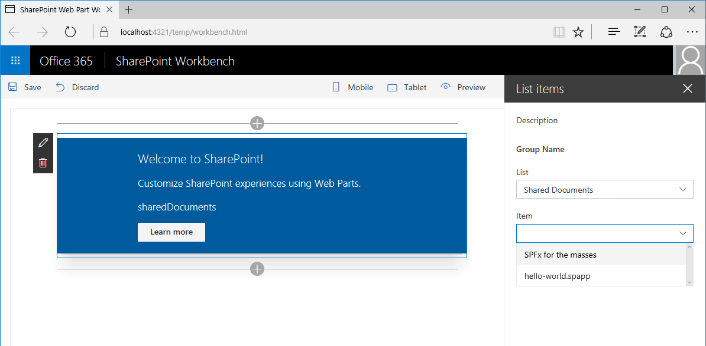
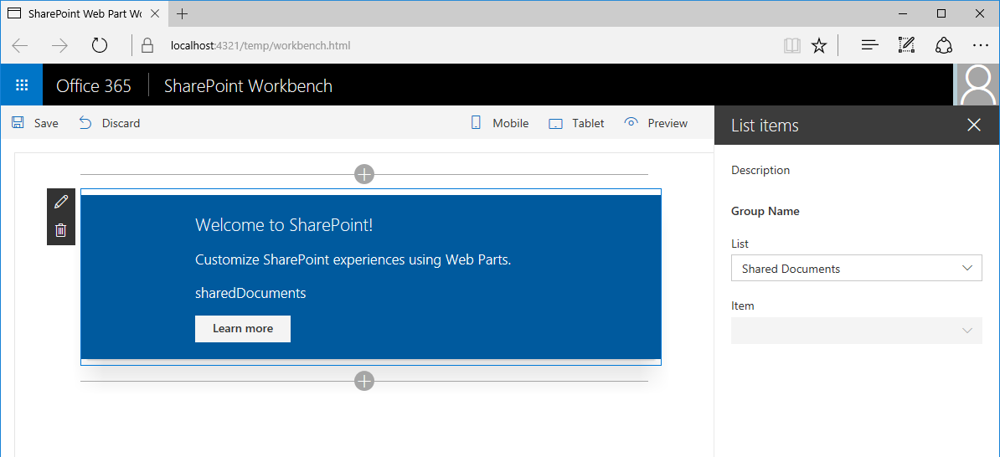

# Use cascading dropdowns in web part properties

> Note. This article has not yet been verified with SPFx GA version, so you might have challenges on making this work as such with the latest release.

When designing the property pane for your SharePoint client-side web parts, you may have one web part property that displays its options based on the  value selected in another property. This scenario typically occurs when implementing cascading dropdown controls. In this article, you will learn how to create cascading dropdown controls in the web part property pane without developing a custom property pane control.


The source of the working web part is available on GitHub at [https://github.com/SharePoint/sp-dev-fx-webparts/tree/master/samples/react-custompropertypanecontrols](https://github.com/SharePoint/sp-dev-fx-webparts/tree/master/samples/react-custompropertypanecontrols).

> **Note:** Before following the steps in this article, be sure to [set up your SharePoint client-side web part development environment](../../set-up-your-development-environment).

## Create new project

Start by creating a new folder for your project.

```sh
md react-cascadingdropdowns
```

Go to the project folder.

```sh
cd react-cascadingdropdowns
```

In the project folder run the SharePoint Framework Yeoman generator to scaffold a new SharePoint Framework project.

```sh
yo @microsoft/sharepoint
```

When prompted, enter the following values:

- **react-cascadingdropdowns** as your solution name
- **Use the current folder** for the location to place the files
- **List items** as your web part name
- **Shows list items from the selected list** as your web part description
- **React** as the starting point to build the web part


Once the scaffolding completes, open your project folder in your code editor. This article uses Visual Studio Code in the steps and screenshots but you can use any editor you prefer.


## Define a web part property to store the selected list

You will build a web part that displays list items from a selected SharePoint list. Users will be able to select a list in the web part property pane. To store the selected list create a new web part property named **listName**.

In the code editor, open the **src/webparts/listItems/ListItemsWebPartManifest.json** file. Replace the default **description** property with a new property named `listName`.


Next, open the **src/webparts/listItems/IListItemsWebPartProps.ts** file, and replace its contents with:

```ts
export interface IListItemsWebPartProps {
  listName: string;
}
```

In the **src/webparts/listItems/ListItemsWebPart.ts** file, change the **render** method to:

```ts
export default class ListItemsWebPart extends BaseClientSideWebPart<IListItemsWebPartProps> {
  // ...
  public render(): void {
    const element: React.ReactElement<IListItemsProps> = React.createElement(ListItems, {
      listName: this.properties.listName
    });

    ReactDom.render(element, this.domElement);
  }
  // ...
}
```

Update the **propertyPaneSettings** getter to:

```ts
export default class ListItemsWebPart extends BaseClientSideWebPart<IListItemsWebPartProps> {
  // ...
  protected get propertyPaneSettings(): IPropertyPaneSettings {
    return {
      pages: [
        {
          header: {
            description: strings.PropertyPaneDescription
          },
          groups: [
            {
              groupName: strings.BasicGroupName,
              groupFields: [
                PropertyPaneTextField('listName', {
                  label: strings.ListNameFieldLabel
                })
              ]
            }
          ]
        }
      ]
    };
  }
  // ...
}
```

In the **src/webparts/listItems/loc/mystrings.d.ts** file, change the **IListItemsStrings** interface to:

```ts
declare interface IListItemsStrings {
  PropertyPaneDescription: string;
  BasicGroupName: string;
  ListNameFieldLabel: string;
}
```

In the **src/webparts/listItems/loc/en-us.js** file, add the missing definition for the **ListNameFieldLabel** string.

```js
define([], function() {
  return {
    "PropertyPaneDescription": "Description",
    "BasicGroupName": "Group Name",
    "ListNameFieldLabel": "List"
  }
});
```

In the **src/webparts/listItems/components/ListItems.tsx** file, change the contents of the **render** method to:

```tsx
export default class ListItems extends React.Component<IListItemsProps, {}> {
  public render(): JSX.Element {
    return (
      <div className={styles.listItems}>
        <div className={styles.container}>
          <div className={css('ms-Grid-row ms-bgColor-themeDark ms-fontColor-white', styles.row)}>
            <div className='ms-Grid-col ms-u-lg10 ms-u-xl8 ms-u-xlPush2 ms-u-lgPush1'>
              <span className='ms-font-xl ms-fontColor-white'>
                Welcome to SharePoint!
              </span>
              <p className='ms-font-l ms-fontColor-white'>
                Customize SharePoint experiences using web parts.
              </p>
              <p className='ms-font-l ms-fontColor-white'>
                {this.props.listName}
              </p>
              <a
                className={css('ms-Button', styles.button)}
                href='https://github.com/SharePoint/sp-dev-docs/wiki'
              >
                <span className='ms-Button-label'>Learn more</span>
              </a>
            </div>
          </div>
        </div>
      </div>
    );
  }
}
```

Run the following command to verify that the project is running:

```sh
gulp serve
```

In the web browser, add the **List items** web part to the canvas and open its properties. Verify that the value set for the **List** property is displayed in the web part body.


## Populate the dropdown with SharePoint lists to choose from

At this point, a user specifies which list the web part should use by manually entering the list name. This is error-prone and ideally you want users to choose one of the lists existing in the current SharePoint site.

### Use dropdown control to render the listName property

In the **ListItemsWebPart** class add a reference to the **PropertyPaneDropdown** class in the top section of the web part. Replace the import clause that loads the **PropertyPaneTextField** class with:

```ts
import {
  BaseClientSideWebPart,
  IPropertyPaneSettings,
  IWebPartContext,
  PropertyPaneDropdown
} from '@microsoft/sp-webpart-base';
```

Right after this import statement, add a reference to the **IDropdownOption** interface.

```ts
import { IDropdownOption } from 'office-ui-fabric-react';
```

In the **ListItemsWebPart** class, add a new variable named **lists** to store information about all available lists in the current site.

```ts
export default class ListItemsWebPart extends BaseClientSideWebPart<IListItemsWebPartProps> {
  private lists: IDropdownOption[];
  // ...
}
```

Next, add a new class variable named **listsDropdownDisabled**. This variable determines whether the list dropdown is enabled or not. Until the web part retrieves the information about the lists available in the current site, the dropdown should be disabled.

```ts
export default class ListItemsWebPart extends BaseClientSideWebPart<IListItemsWebPartProps> {
  // ...
  private listsDropdownDisabled: boolean = true;
  // ...
}
```

Change the **propertyPaneSettings** getter to use the dropdown control to render the **listName** property.

```ts
export default class ListItemsWebPart extends BaseClientSideWebPart<IListItemsWebPartProps> {
  // ...
  protected get propertyPaneSettings(): IPropertyPaneSettings {
    return {
      pages: [
        {
          header: {
            description: strings.PropertyPaneDescription
          },
          groups: [
            {
              groupName: strings.BasicGroupName,
              groupFields: [
                PropertyPaneDropdown('listName', {
                  label: strings.ListNameFieldLabel,
                  options: this.lists,
                  isDisabled: this.listsDropdownDisabled
                })
              ]
            }
          ]
        }
      ]
    };
  }
}
```

Run the following command to verify that it's working as expected:

```sh
gulp serve
```


### Show available lists in the list dropdown

Previously, you associated the dropdown control of the **listName** property with the **lists** class property. Since you haven't loaded any values into it yet, the **List** dropdown in the web part property pane remains disabled. In this step, you will extend the web part to load the information about available lists.

#### Add a method to load available lists

In the **ListItemsWebPart** class, add a method to load available lists. In this article you will use mock data, but you could also call the SharePoint REST API to retrieve the list of available lists from the current web. To simulate loading options from an external service the method uses a two-second delay.

```ts
export default class ListItemsWebPart extends BaseClientSideWebPart<IListItemsWebPartProps> {
  // ...
  private loadLists(): Promise<IDropdownOption[]> {
    return new Promise<IDropdownOption[]>((resolve: (options: IDropdownOption[]) => void, reject: (error: any) => void) => {
      setTimeout((): void => {
        resolve([{
          key: 'sharedDocuments',
          text: 'Shared Documents'
        },
          {
            key: 'myDocuments',
            text: 'My Documents'
          }]);
      }, 2000);
    });
  }
}
```

#### Load information about available lists into the list dropdown

In the **ListItemsWebPart** class, override the **onPropertyPaneConfigurationStart** method using the following code:

```ts
export default class ListItemsWebPart extends BaseClientSideWebPart<IListItemsWebPartProps> {
  // ...
  protected onPropertyPaneConfigurationStart(): void {
    this.listsDropdownDisabled = !this.lists;

    if (this.lists) {
      return;
    }

    this.context.statusRenderer.displayLoadingIndicator(this.domElement, 'lists');

    this.loadLists()
      .then((listOptions: IDropdownOption[]): void => {
        this.lists = listOptions;
        this.listsDropdownDisabled = false;
        this.context.propertyPane.refresh();
        this.context.statusRenderer.clearLoadingIndicator(this.domElement);
        this.render();
      });
  }
  // ...
}
```

The **onPropertyPaneConfigurationStart** method is called by the SharePoint Framework after the web part property pane for the web part has been opened. First, the method checks if the information about the lists available in the current site has been loaded. If the list information is loaded, then the list dropdown will be enabled. If the list information about lists has not been loaded yet, the loading indicator is displayed which informs the user that the web part is loading information about lists.


After the information about available lists has been loaded the method assigns the retrieved data to the **lists** class variable, from which it can be used by the list dropdown. Next, the dropdown is enabled allowing the user to select a list. By calling  **this.context.propertyPane.refresh()** the web part property pane is refreshed and it reflects the latest changes to the list dropdown. Once list information is loaded, the loading indicator is removed by a call to the **clearLoadingIndicator** method. Since calling this method clears the web part user interface, the **render** method is called to force the web part to re-render.

Run the following command to confirm that everything is working as expected:

```sh
gulp serve
```

When you add a web part to the canvas and open its property pane, you should see the lists dropdown filled with available lists for the user to choose from.


## Allow users to select an item from the selected list

When building web parts you often need to allow users to choose an option from a set of values determined by a previously selected value, such as choosing a country based on the selected continent or choosing a list item from a selected list. This user experience is often referred to as cascading dropdowns. Using the standard SharePoint Framework client-side web parts capabilities you can build cascading dropdowns in the web part property pane. To learn how to do it you will extend the previously built web part with the ability to choose a list item based on the previously selected list.



### Add item web part property

In the code editor open the **src/webparts/listItems/ListItemsWebPart.manifest.json** file. To the **properties** section add a new property named **itemName** so that it appears as follows:

```json
{
  // ...
  "properties": {
    "listName": "",
    "itemName": ""
  }
  // ...
}
```


Change the code in the **src/webparts/listItems/IListItemsWebPartProps.ts** file to:

```ts
export interface IListItemsWebPartProps {
  listName: string;
  itemName: string;
}
```

In the **src/webparts/listItems/ListItemsWebPart.ts** file, change the code of the **render** method to:

```ts
export default class ListItemsWebPart extends BaseClientSideWebPart<IListItemsWebPartProps> {
  // ...
  public render(): void {
    const element: React.ReactElement<IListItemsProps> = React.createElement(ListItems, {
      listName: this.properties.listName,
      itemName: this.properties.itemName
    });

    ReactDom.render(element, this.domElement);
  }
  // ...
}
```

In the **src/webparts/listItems/loc/mystrings.d.ts** file, change the **IListItemsStrings** interface to:

```ts
declare interface IListItemsStrings {
  PropertyPaneDescription: string;
  BasicGroupName: string;
  ListNameFieldLabel: string;
  ItemNameFieldLabel: string;
}
```

In the **src/webparts/listItems/loc/en-us.js** file, add the missing definition for the **ItemNameFieldLabel** string.

```js
define([], function() {
  return {
    "PropertyPaneDescription": "Description",
    "BasicGroupName": "Group Name",
    "ListNameFieldLabel": "List",
    "ItemNameFieldLabel": "Item"
  }
});
```

### Render the value of the item web part property

In the **src/webparts/listItems/components/ListItems.tsx** file, change the **render** method to:

```tsx
export default class ListItems extends React.Component<IListItemsProps, {}> {
  public render(): JSX.Element {
    return (
      <div className={styles.listItems}>
        <div className={styles.container}>
          <div className={css('ms-Grid-row ms-bgColor-themeDark ms-fontColor-white', styles.row)}>
            <div className='ms-Grid-col ms-u-lg10 ms-u-xl8 ms-u-xlPush2 ms-u-lgPush1'>
              <span className='ms-font-xl ms-fontColor-white'>
                Welcome to SharePoint!
              </span>
              <p className='ms-font-l ms-fontColor-white'>
                Customize SharePoint experiences using web parts.
              </p>
              <p className='ms-font-l ms-fontColor-white'>
                {this.props.listName}
              </p>
              <p className='ms-font-l ms-fontColor-white'>
                {this.props.itemName}
              </p>
              <a
                className={css('ms-Button', styles.button)}
                href='https://github.com/SharePoint/sp-dev-docs/wiki'
              >
                <span className='ms-Button-label'>Learn more</span>
              </a>
            </div>
          </div>
        </div>
      </div>
    );
  }
}
```

### Allow users to choose the item from a list

Similar to how users can select a list using a dropdown, they should be able to select the item from the list of available items.

In the **ListItemsWebPart** class, add a new variable named **items** which you will use to store information about all available items in the currently selected list.

```ts
export default class ListItemsWebPart extends BaseClientSideWebPart<IListItemsWebPartProps> {
  // ...
  private items: IDropdownOption[];
  // ...
}
```

Next, add a new class variable named **itemsDropdownDisabled**. This variable determines whether the items dropdown should be enabled or not. Users should be able to select an item only after they selected a list.

```ts
export default class ListItemsWebPart extends BaseClientSideWebPart<IListItemsWebPartProps> {
  // ...
  private itemsDropdownDisabled: boolean = true;
  // ...
}
```

Change the **propertyPaneSettings** getter to use the dropdown control to render the **itemName** property.

```ts
export default class ListItemsWebPart extends BaseClientSideWebPart<IListItemsWebPartProps> {
  // ...
  protected get propertyPaneSettings(): IPropertyPaneSettings {
    return {
      pages: [
        {
          header: {
            description: strings.PropertyPaneDescription
          },
          groups: [
            {
              groupName: strings.BasicGroupName,
              groupFields: [
                PropertyPaneDropdown('listName', {
                  label: strings.ListNameFieldLabel,
                  options: this.lists,
                  isDisabled: this.listsDropdownDisabled
                }),
                PropertyPaneDropdown('itemName', {
                  label: strings.ItemNameFieldLabel,
                  options: this.items,
                  isDisabled: this.itemsDropdownDisabled
                })
              ]
            }
          ]
        }
      ]
    };
  }
}
```

Run the following command to verify that it's working as expected:

```sh
gulp serve
```


### Show items available in the selected list in the item dropdown

Previously, you defined a dropdown control to render the **itemName** property in the web part property pane. Next, you will extend the web part to load the information about items available in the selected list and show the items in the item dropdown.

#### Add method to load list items

In the **src/webparts/listItems/ListItemsWebPart.ts** file, in the **ListItemsWebPart** class add a new method to load available list items from the selected list. Like the method for loading available lists, you will use mock data.

```ts
export default class ListItemsWebPart extends BaseClientSideWebPart<IListItemsWebPartProps> {
  // ...
  private loadItems(): Promise<IDropdownOption[]> {
    if (!this.properties.listName) {
      // resolve to empty options since no list has been selected
      return Promise.resolve();
    }

    const wp: ListItemsWebPart = this;

    return new Promise<IDropdownOption[]>((resolve: (options: IDropdownOption[]) => void, reject: (error: any) => void) => {
      setTimeout(() => {
        const items = {
          sharedDocuments: [
            {
              key: 'spfx_presentation.pptx',
              text: 'SPFx for the masses'
            },
            {
              key: 'hello-world.spapp',
              text: 'hello-world.spapp'
            }
          ],
          myDocuments: [
            {
              key: 'isaiah_cv.docx',
              text: 'Isaiah CV'
            },
            {
              key: 'isaiah_expenses.xlsx',
              text: 'Isaiah Expenses'
            }
          ]
        };
        resolve(items[wp.properties.listName]);
      }, 2000);
    });
  }
}
```

The **loadItems** method returns mock list items for the previously selected list. When no list has been selected, the method resolves the promise without any data.

#### Load information about available items into the item dropdown

In the **ListItemsWebPart** class, extend the **onPropertyPaneConfigurationStart** method to load items for the selected list.

```ts
export default class ListItemsWebPart extends BaseClientSideWebPart<IListItemsWebPartProps> {
  // ...
  protected onPropertyPaneConfigurationStart(): void {
    this.listsDropdownDisabled = !this.lists;
    this.itemsDropdownDisabled = !this.properties.listName || !this.items;

    if (this.lists) {
      return;
    }

    this.context.statusRenderer.displayLoadingIndicator(this.domElement, 'options');

    this.loadLists()
      .then((listOptions: IDropdownOption[]): Promise<IDropdownOption[]> => {
        this.lists = listOptions;
        this.listsDropdownDisabled = false;
        this.context.propertyPane.refresh();
        return this.loadItems();
      })
      .then((itemOptions: IDropdownOption[]): void => {
        this.items = itemOptions;
        this.itemsDropdownDisabled = !this.properties.listName;
        this.context.propertyPane.refresh();
        this.context.statusRenderer.clearLoadingIndicator(this.domElement);
        this.render();
      });
  }
  // ...
}
```

When initializing, the web part will first determine if the items dropdown should be enabled or not. If the user previously selected a list, they can select an item from that list. If no list was selected, then the item dropdown is disabled.

You extended the previously defined code, which loads the information about available lists, to load the information about items available in the selected list. The code then assigns the retrieved information to the **items** class variable for use by the item dropdown. Finally, the code clears the loading indicator and allows the user to start working with the web part.

Run the following command to confirm that everything is working as expected:

```sh
gulp serve
```

As required, initially the item dropdown is disabled, requiring users to select a list first. But at this point, even after a list has been selected, the item dropdown remains disabled.



#### Update web part property pane after selecting a list

When a user selects a list in the property pane, the web part should update, enabling the item dropdown and showing the list of items available in the selected list.

In the **ListItemsWebPart.ts** file, in the **ListItemsWebPart** class override the **onPropertyPaneFieldChanged** method with the following code:

```ts
export default class ListItemsWebPart extends BaseClientSideWebPart<IListItemsWebPartProps> {
  // ...
  protected onPropertyPaneFieldChanged(propertyPath: string, oldValue: any, newValue: any): void {
    if (propertyPath === 'listName' &&
        newValue) {
      // push new list value
      super.onPropertyPaneFieldChanged(propertyPath, oldValue, newValue);
      // get previously selected item
      const previousItem: string = this.properties.itemName;
      // reset selected item
      this.properties.itemName = undefined;
      // push new item value
      this.onPropertyPaneFieldChanged('itemName', previousItem, this.properties.itemName);
      // disable item selector until new items are loaded
      this.itemsDropdownDisabled = true;
      // refresh the item selector control by repainting the property pane
      this.context.propertyPane.refresh();
      // communicate loading items
      this.context.statusRenderer.displayLoadingIndicator(this.domElement, 'items');

      this.loadItems()
        .then((itemOptions: IDropdownOption[]): void => {
          // store items
          this.items = itemOptions;
          // enable item selector
          this.itemsDropdownDisabled = false;
          // clear status indicator
          this.context.statusRenderer.clearLoadingIndicator(this.domElement);
          // re-render the web part as clearing the loading indicator removes the web part body
          this.render();
          // refresh the item selector control by repainting the property pane
          this.context.propertyPane.refresh();
        });
    }
    else {
      super.onPropertyPaneFieldChanged(propertyPath, oldValue, newValue);
    }
  }
  // ...
}
```

After the user selected a list, the web part persists the newly selected value. Because the selected list changed, the web part resets the previously selected list item. Now that a list is selected, the web part property pane loads list items for that particular list. While loading items, the user shouldn't be able to select an item.

Once the items for the selected list are loaded they are assigned to the **items** class variable from where they can be referenced by the item dropdown. Now that the information about available list items is available, the item dropdown is enabled allowing users to choose an item. The loading indicator is removed which clears the web part body which is why the web part should re-render. Finally the web part property pane refreshes to reflect the latest changes.

> **Note:** In drop 6 of the SharePoint Framework there is a bug in the Office UI Fabric React Dropdown component that causes the dropdown control to work incorrectly. A temporary workaround is to edit the **node_modules/@microsoft/office-ui-fabric-react-bundle/dist/office-ui-fabric-react.bundle.js** file and change line **12027** from:
> 
> ```js
> isDisabled: this.props.isDisabled !== undefined ? this.props.isDisabled : this.props.disabled
> ```
>
> to:
> 
> ```js
> isDisabled: newProps.isDisabled !== undefined ? newProps.isDisabled : newProps.disabled
> ```


