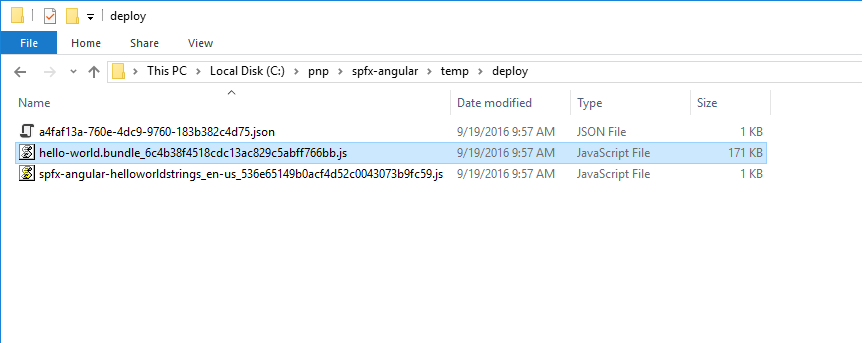
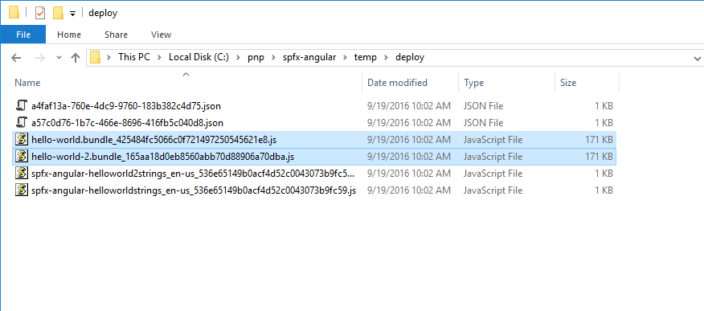
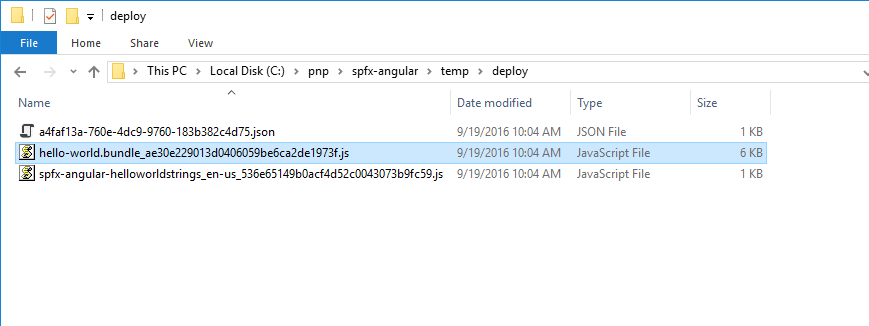
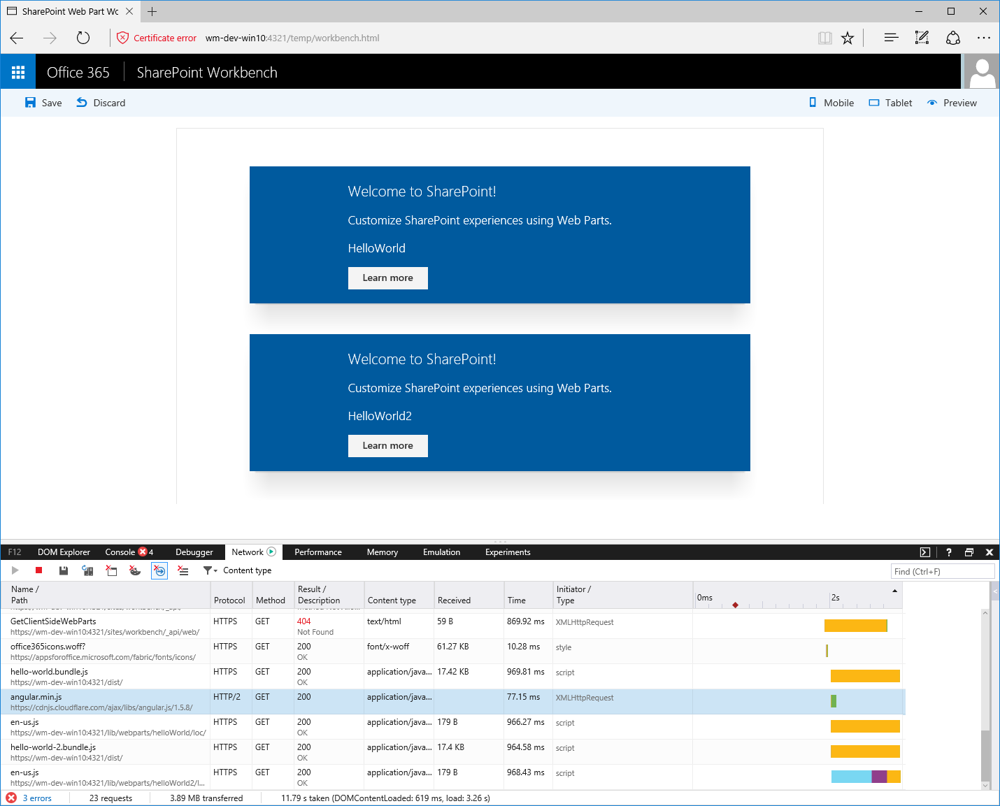

# Use existing JavaScript libraries in SharePoint Framework client-side web parts

When building client-side web parts on the SharePoint Framework, you can benefit from using existing JavaScript libraries to build powerful solutions. There are, however, some considerations that you should take into account to ensure that your web parts won't negatively impact the performance of SharePoint pages that they are being used on.

## Reference existing libraries as packages

The most common way of referencing existing JavaScript libraries in SharePoint Framework client-side web parts is by installing them as a package in the project. 

1. Taking Angular as an example, to use it in a client-side web part, you would first install Angular using **npm**:

  ```sh
  npm install angular --save
  ```

2. To use Angular with TypeScript, you would install typings using **npm**:

  ```sh
  npm install @types/angular --save
  ```

3. Reference Angular in your web part by using the `import` statement:

  ```typescript
  import { Version } from '@microsoft/sp-core-library';
  import {
    BaseClientSideWebPart,
    IPropertyPaneConfiguration,
    PropertyPaneTextField
  } from '@microsoft/sp-webpart-base';
  import { escape } from '@microsoft/sp-lodash-subset';

  import styles from './HelloWorld.module.scss';
  import * as strings from 'helloWorldStrings';
  import { IHelloWorldWebPartProps } from './IHelloWorldWebPartProps';

  import * as angular from 'angular';

  export default class HelloWorldWebPart extends BaseClientSideWebPart<IHelloWorldWebPartProps> {
    public render(): void {
      this.domElement.innerHTML = `
        <div class="${styles.helloWorld}">
          <!-- omitted for brevity -->
        </div>`;

        angular.module('helloworld', []);

        angular.bootstrap(this.domElement, ['helloworld']);
    }

    // omitted for brevity
  }
  ```

## Bundle web part resources

SharePoint Framework uses a build toolchain based on open-source tooling such as gulp and Webpack. When building SharePoint Framework projects, these build tools automatically combine all referenced resources into a single JavaScript file in a process called bundling.


Bundling offers you a number of benefits. First of all, **all resources required by your web part are available in one single JavaScript file**. This simplifies the deployment because the web part consists of a single file, and it's impossible to miss a dependency in the deployment process.

Because your web part uses different resources, it's important that they are loaded in the right order. Generated by Webpack during the build, **the web part bundle manages loading the different resources for you**, including resolving any dependencies between these resources.

Bundling web parts also has benefits for end-users: generally speaking, it's faster to download a single, bigger file than a number of small files. By combining a number of smaller files into one bigger bundle, **your web part loads faster on the page**. 

However, bundling existing JavaScript libraries with SharePoint Framework client-side web parts isn't without drawbacks.

When bundling existing JavaScript frameworks in the SharePoint Framework, all referenced scripts are included in the generated bundle file. Following the Angular example, an optimized web part bundle including Angular is over 170 KB.



<br/>

If you add another web part to your project that also uses Angular and you build the project, you get two bundle files, one for each web part, each of them being over 170 KB.



<br/>

If you add these web parts to a page, each user would download Angular multiple times, once with each web part on the page. This approach is inefficient and slows down page load time.

## Reference existing libraries as external resources

A better approach to leveraging existing libraries in SharePoint Framework client-side web parts is by referencing them as external resources. That way, the only information about the particular script that is included in the web part is the script's URL. When added to the page, the web part automatically tries to load all required resources from the specified URL.

Referencing existing JavaScript libraries in the SharePoint Framework is easy and doesn't require any specific changes in the code. Because the library is loaded on runtime from the specified URL, it doesn't need to be installed as a package in the project.

Using Angular as an example, to reference it as an external resource in your client-side web part, you start by installing its TypeScript typings using **npm**:

```sh
  npm install @types/angular --save
```

<br/>

In the **config/config.json** file, to the **externals** property you add the following entry:

```json
  "angular": {
    "path": "https://cdnjs.cloudflare.com/ajax/libs/angular.js/1.5.8/angular.min.js",
    "globalName": "angular"
  }
```

<br/>

The complete **config/config.json** file would then look similar to:

```json
  {
    "entries": [
      {
        "entry": "./lib/webparts/helloWorld/HelloWorldWebPart.js",
        "manifest": "./src/webparts/helloWorld/HelloWorldWebPart.manifest.json",
        "outputPath": "./dist/hello-world.bundle.js"
      }
    ],
    "externals": {
      "angular": {
        "path": "https://cdnjs.cloudflare.com/ajax/libs/angular.js/1.5.8/angular.min.js",
        "globalName": "angular"
      }
    },
    "localizedResources": {
      "helloWorldStrings": "webparts/helloWorld/loc/{locale}.js"
    }
  }
```

<br/>

Reference Angular in your web part, just like you did previously:

```typescript
  import { Version } from '@microsoft/sp-core-library';
  import {
    BaseClientSideWebPart,
    IPropertyPaneConfiguration,
    PropertyPaneTextField
  } from '@microsoft/sp-webpart-base';
  import { escape } from '@microsoft/sp-lodash-subset';

  import styles from './HelloWorld.module.scss';
  import * as strings from 'helloWorldStrings';
  import { IHelloWorldWebPartProps } from './IHelloWorldWebPartProps';

  import * as angular from 'angular';

  export default class HelloWorldWebPart extends BaseClientSideWebPart<IHelloWorldWebPartProps> {
    public render(): void {
      this.domElement.innerHTML = `
        <div class="${styles.helloWorld}">
          <!-- omitted for brevity -->
        </div>`;

        angular.module('helloworld', []);

        angular.bootstrap(this.domElement, ['helloworld']);
    }

    // omitted for brevity
  }
```

<br/>

If you build your project now and take a look at the size of the generated bundle file, you notice that it's only 6 KB.



<br/>

If you add another web part to your project that also uses Angular, and you build the project again, both bundles would be 6 KB each.


<br/>

It isn't correct to assume that you have just saved over 300 KB. Both web parts still need Angular and load it the first time the user visits the page where one of the web parts is placed.


<br/>

Even if you add both Angular web parts to the page, SharePoint Framework still downloads Angular only once.



<br/>

The real benefit of referencing existing JavaScript libraries as external resources is if your organization has a centralized location for all commonly-used scripts or you use a CDN. In such cases, there is a chance that the particular JavaScript library is already present in the user's browser cache. As a result, the only thing that needs to be loaded is the web part bundle which makes the page load significantly faster.


<br/>

The previous example shows how to load Angular from a CDN, but using a public CDN is not required. In the configuration, you can point any location from a public CDN, a privately-hosted repository, to a SharePoint Document Library. As long as users working with your web parts are able to access the specified URLs, your web parts will work as expected.

CDNs are optimized for fast resource delivery across the globe. The additional advantage of referencing scripts from public CDNs is that there is a chance that the same script has been used on some other website the user has visited in the past. Because the script is already present in the local browser's cache, it wouldn't need to be downloaded specifically for your web part, which would make the page with the web part on it load even faster.

Some organizations don't allow access to public CDNs from the corporate network. In such cases, using a privately-hosted storage location for commonly-used JavaScript frameworks is a great alternative. Because your organization hosts the libraries, it could also control the cache headers, which could help you optimize your resources for performance even further. 

## JavaScript libraries formats

Different JavaScript libraries are built and packaged in different ways. Some are packaged as modules, while others are plain scripts that run in the global scope (these scripts are often referred to as non-module scripts). When loading JavaScript libraries from a URL, how you register an external script in a SharePoint Framework project depends on the format of the script. There are multiple module formats, such as AMD, UMD, or CommonJS, but the only thing that you have to know is if the particular script is a module or not.

When registering scripts packaged as modules, the only thing that you have to specify is the URL where the particular script should be downloaded from. Dependencies to other scripts are handled inside the script's module construct.

On the other hand, non-module scripts require, at minimum, the URL from where the script should be downloaded and the name of the variable with which the script is registered in the global scope. If the non-module script depends on other scripts, they can be listed as dependencies. To illustrate this, let's have a look at a few examples.

Angular v1.x is a non-module script. You register it as an external resource in a SharePoint Framework project by specifying its URL and the name of the global variable it should register with:

```json
"angular": {
  "path": "https://cdnjs.cloudflare.com/ajax/libs/angular.js/1.5.8/angular.min.js",
  "globalName": "angular"
}
```

It's important that the name specified in the **globalName** property corresponds to the name used by the script. That way it can correctly expose itself to other scripts that might depend on it.

[ngOfficeUIFabric](http://ngofficeuifabric.com/), the Angular directives for Office UI Fabric, is a UMD module that depends on Angular. The dependency on Angular is already handled inside the module, so to register it, all you need to specify is its URL:

```json
"ng-office-ui-fabric": "https://cdnjs.cloudflare.com/ajax/libs/ngOfficeUiFabric/0.12.3/ngOfficeUiFabric.js"
```

jQuery is an AMD script. To register it, you could simply use:

```json
"jquery": "https://code.jquery.com/jquery-2.2.4.js"
```

Imagine now that you wanted to use jQuery with a jQuery plug-in that itself is distributed as a non-module script. 

If you registered both scripts by using the following code, loading the web part would very likely result in an error. There is a chance that both scripts would be loaded in parallel, and the plug-in wouldn't be able to register itself with jQuery.

```json
"jquery": "https://code.jquery.com/jquery-2.2.4.js",
"simpleWeather": {
  "path": "https://cdnjs.cloudflare.com/ajax/libs/jquery.simpleWeather/3.1.0/jquery.simpleWeather.min.js",
  "globalName": "jQuery"
}
```

<br/>


<br/>

As mentioned previously, SharePoint Framework allows you to specify dependencies for non-module plug-ins. These dependencies are specified using the **globalDependencies** property:

```json
"jquery": "https://code.jquery.com/jquery-2.2.4.js",
"simpleWeather": {
  "path": "https://cdnjs.cloudflare.com/ajax/libs/jquery.simpleWeather/3.1.0/jquery.simpleWeather.min.js",
  "globalName": "jQuery",
  "globalDependencies": [ "jquery" ]
}
```

<br/>

Each dependency specified in the **globalDependencies** property must point to another dependency in the **externals** section of the **config/config.json** file.

If you try to build the project now, you would get another error, this time stating that you can't specify a dependency to a non-module script.


<br/>

To solve this problem, all you need to do is to register jQuery as a non-module script:

```json
"jquery": {
  "path": "https://code.jquery.com/jquery-2.1.1.min.js",
  "globalName": "jQuery"
},
"simpleWeather": {
  "path": "https://cdnjs.cloudflare.com/ajax/libs/jquery.simpleWeather/3.1.0/jquery.simpleWeather.min.js",
  "globalName": "jQuery",
  "globalDependencies": [ "jquery" ]
}
```

This way you specify that the **simpleWeather** script should be loaded after jQuery, and that jQuery should be available under a globally available variable `jQuery`, which is required by the **simpleWeather** jQuery plug-in to register itself.

> [!NOTE] 
> Notice how the entry for registering jQuery uses **jquery** for the external resource name, but **jQuery** as the global variable name. The name of the external resource is the name that you use in the `import` statements in your code. This is also the name that must match TypeScript typings. The global variable name, specified by using the **globalName** property, is the name known to other scripts such as plug-ins built on top of the library. While for some libraries these names might be the same, it's not required, and you should carefully check that you are using correct names to avoid any problems.

It's difficult to determine manually whether the script that you're trying to load is a module or a non-module script. This is especially the case if the script that you're trying to load is minified. If your script is hosted on a publicly accessible URL, you can use the free [Rencore SharePoint Framework Script Check](https://rencore.com/sharepoint-framework/script-check/) tool to determine the type of script for you. Additionally, this tool lets you know whether the hosting location from which you're loading the script is properly configured.

## Non-module scripts considerations

Many JavaScript libraries and scripts developed in the past are distributed as non-module scripts. While the SharePoint Framework supports loading non-module scripts, you should strive to avoid using them whenever possible.

Non-module scripts are registered in the global scope of the page: a script loaded by one web part is available to all other web parts on the page. If you had two web parts using different versions of jQuery, both loaded as non-module scripts, the web part that loaded the last would overwrite all previously registered versions of jQuery. 

As you can imagine, this could lead to unpredictable results, and it would be very hard to debug issues that would occur only in certain scenarios, such as only with other web parts by using a different version of jQuery on the page and only when they load in a particular order. The module architecture solves this problem by isolating scripts and preventing them from affecting each other.

## When you should consider bundling

Bundling existing JavaScript libraries into your web part can lead to big web part files and can cause poor performance of pages using that web part. While you should generally avoid bundling JavaScript libraries with your web parts, there are scenarios where bundling could work to your advantage.

If you are building a standard solution that should work on every intranet, bundling all your resources with your web part can help you ensure that your web part works as expected. Because you don't know upfront where your solution will be installed, including all dependencies in your web part's bundle file allows it to work correctly, even if the organization doesn't allow downloading resources from a CDN or other external location.

If your solution consists of many web parts that share some functionality with each other, it would be better to build the shared functionality as a separate library and reference it as an external resource in all web parts. That way users need to download the common library only once and reuse it with all web parts.

## Summary

When building client-side web parts on the SharePoint Framework, you can benefit from existing JavaScript libraries to build powerful solutions. SharePoint Framework allows you to either bundle these libraries together with your web parts or load them as an external resource. While loading existing libraries from a URL is generally the recommended approach, there are scenarios where bundling might be beneficial, and it's essential that you evaluate your requirements carefully to choose the approach that best meets your needs.

## See also

- [SharePoint Framework Overview](../../sharepoint-framework-overview.md)