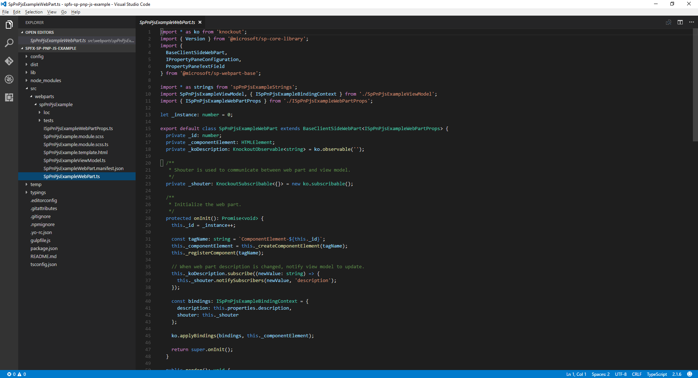

# Use sp-pnp-js with SharePoint Framework Web Parts

You may opt to use the [sp-pnp-js](https://www.npmjs.com/package/sp-pnp-js) library when building your SharePoint Framework web parts. This library 
provides a fluent API to make building your REST queries intuitive and supports batching and caching. You can learn more on the [project's homepage](https://github.com/SharePoint/PnP-JS-Core) 
which has links to documentation, samples, and other resources to help you get started.

You can download the full source for this article from the samples site.

## Setup your Environment

Before you can complete this guide you will need to ensure you have [setup your environment](https://dev.office.com/sharepoint/docs/spfx/set-up-your-development-environment) for development 
using SharePoint Framework.

## Create a New Project

Start by creating a new folder for the project using your console of choice:

```sh
md spfx-sp-pnp-js-example
```

And enter that folder

```sh
cd spfx-sp-pnp-js-example
```

The run the Yeoman generator for SPFx

```sh
yo @microsoft/sharepoint
```

Enter the following values when prompted during the setup of your new project:

- **spfx-sp-pnp-js-example** as solution name (keep default)
- **Current Folder** as the solution location
- **Kockout** as the framework
- **SPPnPJSExample** as the name of the web part
- **Example of using sp-pnp-js within SPFx** as the description


Once the scaffolding completes open the project in your code editor of choice, the screen shots here show [Visual Studio Code](https://code.visualstudio.com/).

```sh
code .
```



## Install And Setup sp-pnp-js

Once your project is created you will need to install and setup sp-pnp-js, starting with installing the package. This section is common for any project type (React, etc).

```sh
npm install sp-pnp-js --save
```

Because the sp-pnp-js library constructs REST requests it needs to know the URL to send these requests. When operating within classic sites and pages 
we can make use of the global _spPageContextInfo variable. Within SPFx this is not available, or if it is may not be correct. So we need to rely on the 
[context](https://dev.office.com/sharepoint/reference/spfx/sp-webpart-base/iwebpartcontext) object 
supplied by the framework. There are [two ways](https://github.com/SharePoint/PnP-JS-Core/wiki/Using-sp-pnp-js-in-SharePoint-Framework#establish-context) to ensure you have correctly setup your requests, 
we'll use the onInit method in this example.

### Update onInit in SpPnPjsExampleWebPart.ts

Open the src\webparts\spPnPjsExample\SpPnPjsExampleWebPart.ts file and add the import for the pnp setup function.

```TypeScript
import pnp from "sp-pnp-js";
```

In the onInit method update the code to appear as below. We are adding the block after the super.onInit() call. We do this after the super.onInit to ensure that the framework has a chance to initialize anything 
required and that we are setting up the library after those steps are complete.

```TypeScript
/**
 * Initialize the web part.
 */
protected onInit(): Promise<void> {
  this._id = _instance++;

  const tagName: string = `ComponentElement-${this._id}`;
  this._componentElement = this._createComponentElement(tagName);
  this._registerComponent(tagName);

  // When web part description is changed, notify view model to update.
  this._koDescription.subscribe((newValue: string) => {
    this._shouter.notifySubscribers(newValue, 'description');
  });

  const bindings: ISpPnPjsExampleBindingContext = {
    description: this.properties.description,
    shouter: this._shouter
  };

  ko.applyBindings(bindings, this._componentElement);

  return super.onInit()**.then(_ => {
    pnp.setup({
      spfxContext: this.context
    });
  });**
}
```

## Update the ViewModel

Next you will want to replace the contents of the SpPnPjsExampleViewModel.ts file with the below. We are adding an import for the pnp items, an interface to define our list item's fields, 
some observables to track both out list of items and our new item form, and methods to support the functionality 

```TypeScript
import * as ko from 'knockout';
import styles from './SpPnPjsExample.module.scss';
import { ISpPnPjsExampleWebPartProps } from './ISpPnPjsExampleWebPartProps';
**import pnp, { List, ListEnsureResult, ItemAddResult } from "sp-pnp-js";**

export interface ISpPnPjsExampleBindingContext extends ISpPnPjsExampleWebPartProps {
  shouter: KnockoutSubscribable<{}>;
}

/**
 * Interface which defines the fields in our list items
 */
**export interface OrderListItem {
  Id: number;
  Title: string;
  OrderNumber: string;
}**

export default class SpPnPjsExampleViewModel {

  **public newItemTitle: KnockoutObservable<string> = ko.observable('');**
  **public newItemNumber: KnockoutObservable<string> = ko.observable('');**
  public description: KnockoutObservable<string> = ko.observable('');
  **public items: KnockoutObservableArray<OrderListItem> = ko.observableArray([]);**

  public labelClass: string = styles.label;
  public helloWorldClass: string = styles.helloWorld;
  public containerClass: string = styles.container;
  public rowClass: string = `ms-Grid-row ms-bgColor-themeDark ms-fontColor-white ${styles.row}`;
  public buttonClass: string = `ms-Button ${styles.button}`;

  constructor(bindings: ISpPnPjsExampleBindingContext) {
    this.description(bindings.description);

    // When web part description is updated, change this view model's description.
    bindings.shouter.subscribe((value: string) => {
      this.description(value);
    }, this, 'description');

    // call the load the items
    **this.getItems().then(items => {

      this.items(items);
    });**
  }

  /**
   * Gets the items from the list
   */
  **private getItems(): Promise<OrderListItem[]> {

    return this.ensureList().then(list => {

      // here we are using the getAs operator so that our returned value will be typed
      return list.items.select("Id", "Title", "OrderNumber").getAs<OrderListItem[]>();
    });
  }

  /**
   * Adds an item to the list
   */
  public addItem(): void {

    if (this.newItemTitle() !== "" && this.newItemNumber() !== "") {

      this.ensureList().then(list => {

        // add the new item to the SharePoint list
        list.items.add({
          Title: this.newItemTitle(),
          OrderNumber: this.newItemNumber(),
        }).then((iar: ItemAddResult) => {

          // add the new item to the display
          this.items.push({
            Id: iar.data.Id,
            OrderNumber: iar.data.OrderNumber,
            Title: iar.data.Title,
          });

          // clear the form
          this.newItemTitle("");
          this.newItemNumber("");
        });
      });
    }
  }

  /**
   * Deletes an item from the list
   */
  public deleteItem(data): void {

    if (confirm("Are you sure you want to delete this item?")) {
      this.ensureList().then(list => {
        list.items.getById(data.Id).delete().then(_ => {
          this.items.remove(data);
        });
      }).catch((e: Error) => {
        alert(`There was an error deleting the item ${e.message}`);
      });
    }
  }

  /**
   * Ensures the list exists and if it creates it adds some default example data
   */
  private ensureList(): Promise<List> {

    return new Promise<List>((resolve, reject) => {

      // use lists.ensure to always have the list available
      pnp.sp.web.lists.ensure("SPPnPJSExampleList").then((ler: ListEnsureResult) => {

        if (ler.created) {

          // we created the list on this call so let's add a column
          ler.list.fields.addText("OrderNumber").then(_ => {

            // and we will also add a few items so we can see some example data
            // here we use batching

            // create a batch
            let batch = pnp.sp.web.createBatch();

            ler.list.getListItemEntityTypeFullName().then(typeName => {

              ler.list.items.inBatch(batch).add({
                Title: "Title 1",
                OrderNumber: "4826492"
              }, typeName);

              ler.list.items.inBatch(batch).add({
                Title: "Title 2",
                OrderNumber: "828475"
              }, typeName);

              ler.list.items.inBatch(batch).add({
                Title: "Title 3",
                OrderNumber: "75638923"
              }, typeName);

              // excute the batched operations
              batch.execute().then(_ => {
                // all of the items have been added within the batch

                resolve(ler.list);

              }).catch(e => reject(e));

            }).catch(e => reject(e));

          }).catch(e => reject(e));

        } else {

          resolve(ler.list);
        }

      }).catch(e => reject(e));
    });
  }**
}
```


## Development

Please check out the [developer guide](https://github.com/SharePoint/PnP-JS-Core/wiki/Developer-Guide) for samples, guidance, and hints on using and configuring the library.

## Production Deployment

When you are ready to deploy your solution and want to build using the --ship flag you need to mark sp-pnp-js as an external in 
the configuration. This is done by updating the SPFx config/config.js to include this line in the externals section:

```
"sp-pnp-js": "https://cdnjs.cloudflare.com/ajax/libs/sp-pnp-js/2.0.1/pnp.min.js"
```

Here we are using the public CDN but the URL can be internal or any location you would like to use. Be sure to update the 
version number in the url to match the version you want.

## Provide Feedback / Report Issues

If you have any feedback or need to report as issue with sp-pnp-js please use the [issues list](https://github.com/SharePoint/PnP-JS-Core/issues) in that repo, not the 
main SPFx repo.
