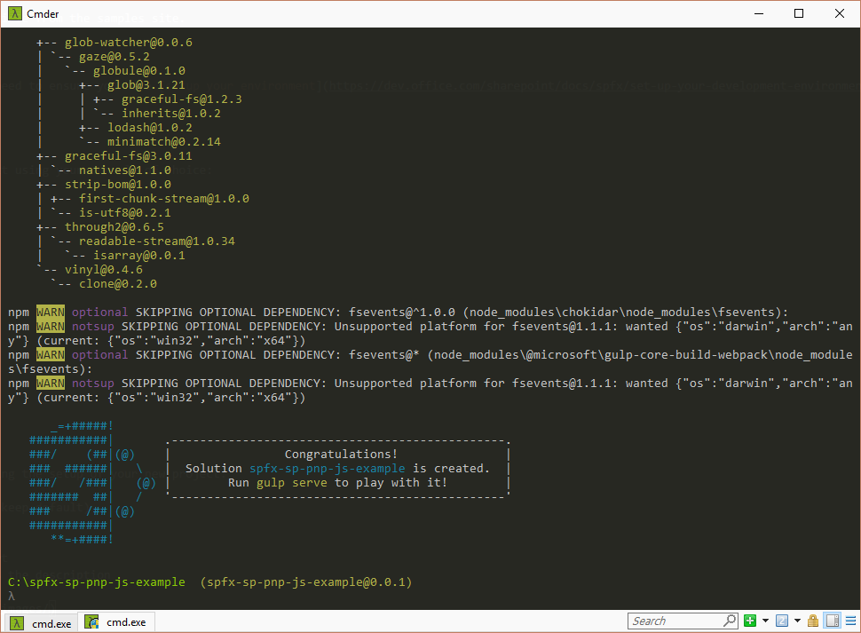
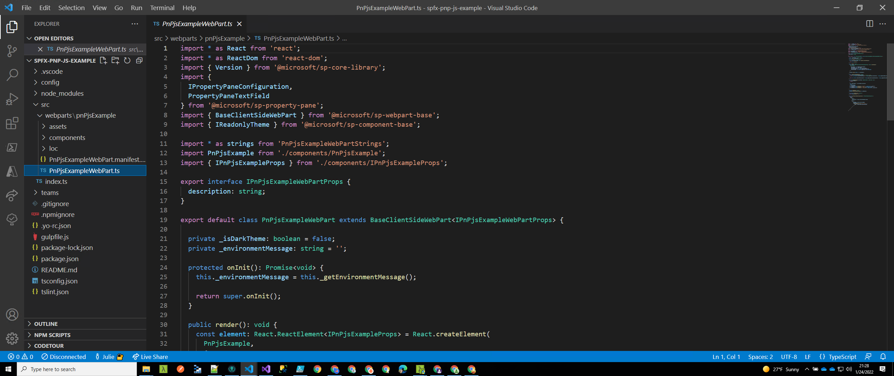
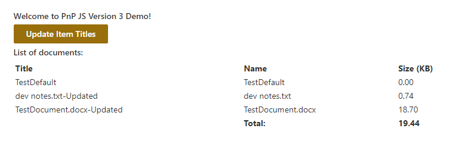
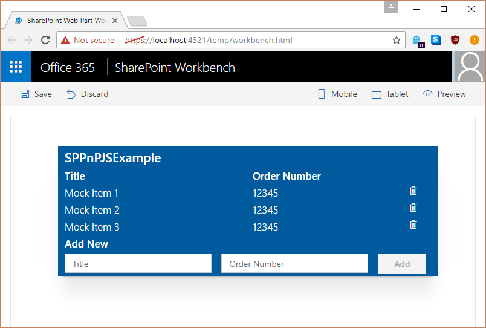

# Use @pnp/sp with SharePoint Framework web parts

You may choose to use the [@pnp/sp](https://www.npmjs.com/package/@pnp/sp) library when building your SharePoint Framework (SPFx) web parts. This library provides a fluent API to make building your REST queries intuitive and supports batching and caching. For more information, see the [project's homepage](https://github.com/pnp/pnpjs/), which has links to documentation, samples, and other resources to help you get started.

You can download the [full source](https://github.com/SharePoint/sp-dev-fx-webparts/tree/master/samples/knockout-sp-pnp-js) for this article from the samples site.

> [!NOTE] 
> Before following the steps in this article, be sure to [set up your SharePoint client-side web part development environment](../../set-up-your-development-environment.md).

## Create a new project

1. Create a new folder for the project by using your console of choice:

  ```sh
  md spfx-pnp-js-example
  ```

2. Enter that folder:

  ```sh
  cd spfx-pnp-js-example
  ```

3. Run the Yeoman generator for SPFx:

  ```sh
  yo @microsoft/sharepoint
  ```

4. Enter the following values when prompted during the setup of the new project:

  - **spfx-pnp-js-example** as the solution name (keep default)
  - **SharePoint Online only (latest)** as the baseline packages version
  - **Current Folder** as the solution location
  - **Y** as allow tenant admin to deploy solution to all sites
  - **WebPart** as the component to create
  - **PnPJSExample** as the name of the web part
  - **Example of using pnp-js within SPFx** as the description
  - **Knockout** as the framework

  

5. After the scaffolding completes, lock down the version of the project dependencies by running the following command:

  ```sh
  npm shrinkwrap
  ```

6. Open the project in the code editor of your choosing. The screenshots shown here demonstrate [Visual Studio Code](https://code.visualstudio.com/). To open the directory within Visual Studio Code, enter the following in the console:

  ```sh
  code .
  ```

  

## Install and set up @pnp/sp

After your project is created, you must install and set up @pnp/sp , starting with installing the package. These steps are common for any project type (React, etc).

```sh
npm install @pnp/logging @pnp/common @pnp/odata @pnp/sp --save
```

Because the @pnp/sp library constructs REST requests, it needs to know the URL to send these requests. When operating within classic sites and pages, we can make use of the global `_spPageContextInfo` variable. Within SPFx, this is not available, or if it is, it may not be correct. So we need to rely on the [context](https://docs.microsoft.com/en-us/javascript/api/sp-webpart-base/webpartcontext) object 
supplied by the framework. 

There are [two ways](https://pnp.github.io/pnpjs/sp/docs/#getting-started-sharepoint-framework) to ensure that you have correctly set up your requests; we use the `onInit` method in this example.

### Update onInit in PnPjsExampleWebPart.ts

1. Open the **src\webparts\spPnPjsExample\SpPnPjsExampleWebPart.ts** file, and add an import statement for the pnp root object:

  ```TypeScript
  import { sp } from "@pnp/sp";
  ```

2. In the `onInit` method, update the code to appear as follows. Add the block after the `super.onInit()` call. We do this after the `super.onInit` to ensure that the framework has a chance to initialize anything required, and that we are setting up the library after those steps are completed.

  ```TypeScript
  /**
  * Initialize the web part.
  */
  protected onInit(): Promise<void> {
    this._id = _instance++;

    const tagName: string = `ComponentElement-${this._id}`;
    this._componentElement = this._createComponentElement(tagName);
    this._registerComponent(tagName);

    // When web part description is changed, notify view model to update.
    this._koDescription.subscribe((newValue: string) => {
      this._shouter.notifySubscribers(newValue, 'description');
    });

    const bindings: IPnPjsExampleBindingContext = {
      description: this.properties.description,
      shouter: this._shouter
    };

    ko.applyBindings(bindings, this._componentElement);

    sp.setup({
      spfxContext: this.context
    });

    // optional, we are setting up the @pnp/logging for debugging
    Logger.activeLogLevel = LogLevel.Info;
    Logger.subscribe(new ConsoleListener());

    return super.onInit();
  }
  ```

## Update the ViewModel

Next, replace the contents of the **PnPjsExampleViewModel.ts** file with the following code. We added an import statement for the pnp items, an interface to define our list item's fields, some observables to track both our list of items and the new item form, and methods to support getting, adding, and deleting items. 

We also added an `ensureList` method, which uses the @pnp/sp `lists.ensure` method to always ensure that we have the list (and to create it if necessary). There are many ways to provision resources, but this method was chosen to demonstrate creating a list, field, and items by using batching within a single method.

The takeaway is that by using @pnp/sp, we write much less code to handle requests and can focus on our business logic.

```TypeScript
import * as ko from 'knockout';
import styles from './PnPjsExample.module.scss';
import { IPnPjsExampleWebPartProps } from './PnPjsExampleWebPart';
require("tslib");
require("@pnp/logging");
require("@pnp/common");
require("@pnp/odata");
import { sp, List, ListEnsureResult, ItemAddResult, FieldAddResult } from "@pnp/sp";

export interface IPnPjsExampleBindingContext extends IPnPjsExampleWebPartProps {
  shouter: KnockoutSubscribable<{}>;
}

/**
 * Interface which defines the fields in our list items
 */
export interface OrderListItem {
  Id: number;
  Title: string;
  OrderNumber: string;
}

export default class PnPjsExampleViewModel {
  public description: KnockoutObservable<string> = ko.observable('');
  public newItemTitle: KnockoutObservable<string> = ko.observable('');
  public newItemNumber: KnockoutObservable<string> = ko.observable('');
  public items: KnockoutObservableArray<OrderListItem> = ko.observableArray([]);

  public labelClass: string = styles.label;
  public helloWorldClass: string = styles.pnPjsExample;
  public containerClass: string = styles.container;
  public rowClass: string = `ms-Grid-row ms-bgColor-themeDark ms-fontColor-white ${styles.row}`;
  public buttonClass: string = `ms-Button ${styles.button}`;

  constructor(bindings: IPnPjsExampleBindingContext) {
    this.description(bindings.description);

    // When web part description is updated, change this view model's description.
    bindings.shouter.subscribe((value: string) => {
      this.description(value);
    }, this, 'description');

    // call the load the items
    this.getItems().then(items => {

      this.items(items);
    });
  }

  /**
   * Gets the items from the list
   */
  private getItems(): Promise<OrderListItem[]> {

    return this.ensureList().then(list => {

      // here we are using the getAs operator so that our returned value will be typed
      return list.items.select("Id", "Title", "OrderNumber").get<OrderListItem[]>();
    });
  }

  /**
   * Adds an item to the list
   */
  public addItem(): void {

    if (this.newItemTitle() !== "" && this.newItemNumber() !== "") {

      this.ensureList().then(list => {

        // add the new item to the SharePoint list
        list.items.add({
          Title: this.newItemTitle(),
          OrderNumber: this.newItemNumber(),
        }).then((iar: ItemAddResult) => {

          // add the new item to the display
          this.items.push({
            Id: iar.data.Id,
            OrderNumber: iar.data.OrderNumber,
            Title: iar.data.Title,
          });

          // clear the form
          this.newItemTitle("");
          this.newItemNumber("");
        });
      });
    }
  }

  /**
   * Deletes an item from the list
   */
  public deleteItem(data): void {

    if (confirm("Are you sure you want to delete this item?")) {
      this.ensureList().then(list => {
        list.items.getById(data.Id).delete().then(_ => {
          this.items.remove(data);
        });
      }).catch((e: Error) => {
        alert(`There was an error deleting the item ${e.message}`);
      });
    }
  }

  /**
   * Ensures the list exists and if it creates it adds some default example data
   */
  private ensureList(): Promise<List> {

    return new Promise<List>((resolve, reject) => {

      // use lists.ensure to always have the list available
      sp.web.lists.ensure("SPPnPJSExampleList").then((ler: ListEnsureResult) => {

        if (ler.created) {

          // we created the list on this call so let's add a column
          ler.list.fields.addText("OrderNumber").then(_ => {

            // and we will also add a few items so we can see some example data
            // here we use batching

            // create a batch
            let batch = sp.web.createBatch();

            ler.list.getListItemEntityTypeFullName().then(typeName => {

              ler.list.items.inBatch(batch).add({
                Title: "Title 1",
                OrderNumber: "4826492"
              }, typeName);

              ler.list.items.inBatch(batch).add({
                Title: "Title 2",
                OrderNumber: "828475"
              }, typeName);

              ler.list.items.inBatch(batch).add({
                Title: "Title 3",
                OrderNumber: "75638923"
              }, typeName);

              // excute the batched operations
              batch.execute().then(_ => {
                // all of the items have been added within the batch

                resolve(ler.list);

              }).catch(e => reject(e));

            }).catch(e => reject(e));

          }).catch(e => reject(e));

        } else {

          resolve(ler.list);
        }

      }).catch(e => reject(e));
    });
  }
}

```

## Update the template

Finally, we need to update the template to match the functionality that we added into the ViewModel. Copy the following code into the **PnPjsExample.template.html** file. We added a title row, a `foreach` repeater 
for the items collection, and a form allowing you to add new items to the list.

```html
<div data-bind="attr: {class:spPnPjsExampleClass}">
  <div data-bind="attr: {class:containerClass}">

    <div data-bind="attr: {class:rowClass}">
      <div class="ms-Grid-col ms-u-sm12">
        <span class="ms-font-xl ms-fontColor-white ms-fontWeight-semibold" data-bind="text: description"></span>
      </div>
    </div>

    <div data-bind="attr: {class:rowClass}">
      <div class="ms-Grid-col ms-u-sm6">
        <span class="ms-font-l ms-fontColor-white ms-fontWeight-semibold">Title</span>
      </div>
      <div class="ms-Grid-col  ms-u-sm6">
        <span class="ms-font-l ms-fontColor-white ms-fontWeight-semibold">Order Number</span>
      </div>
    </div>

    <!-- ko foreach: items -->
    <div data-bind="attr: {class:$parent.rowClass}">
      <div class="ms-Grid-col ms-u-sm6">
        <span class="ms-font-l ms-fontColor-white" data-bind="text: Title"></span>
      </div>
      <div class="ms-Grid-col  ms-u-sm5">
        <span class="ms-font-l ms-fontColor-white" data-bind="text: OrderNumber"></span>
      </div>
      <div class="ms-Grid-col  ms-u-sm1">
        <i class="ms-Icon ms-Icon--Delete" aria-hidden="true" data-bind="click: $parent.deleteItem.bind($parent, $data)"></i>
      </div>
    </div>
    <!-- /ko -->

    <div data-bind="attr: {class:rowClass}">
      <div class="ms-Grid-col  ms-u-sm12">
        <span class="ms-font-l ms-fontColor-white ms-fontWeight-semibold">Add New</span>
      </div>
    </div>

    <div data-bind="attr: {class:rowClass}">
      <form data-bind="submit: addItem">
        <div class="ms-Grid-col ms-u-sm5">
          <input class="ms-TextField-field" placeholder="Title" data-bind='value: newItemTitle, valueUpdate: "afterkeydown"' />
        </div>
        <div class="ms-Grid-col ms-u-sm5">
          <input class="ms-TextField-field" placeholder="Order Number" data-bind='value: newItemNumber, valueUpdate: "afterkeydown"'
          />
        </div>
        <div class="ms-Grid-col ms-u-sm2">
          <button class="ms-Button--default ms-Button" type="submit" data-bind="enable: newItemTitle().length > 0 && newItemNumber().length > 0"><span class="ms-Button-label">Add</span></button>
        </div>
      </form>
    </div>

  </div>
</div>
```

## Run the example

Start the sample, and add the web part to your SharePoint-hosted Workbench (/_layouts/workbench.aspx) to see it in action.

```sh
gulp serve --nobrowser
```

<br/>

You can delete existing items by selecting the trashcan icon, or you can add new items by putting values in both fields and selecting **Add**.




### Next steps

The @pnp/sp library contains a great range of functionality and extensibility. For samples, guidance, and hints about using and configuring the library, see the [Developer Guide](https://pnp.github.io/pnpjs/documentation/getting-started/). 

## Deploy to production

When you are ready to deploy your solution and want to build by using the `--ship` flag, you need to mark @pnp/sp as an external library in the configuration. This is done by updating the SPFx **config/config.js** file to include these lines in the externals section:

```json
"externals": {
    "tslib": {
      "path": "https://cdnjs.cloudflare.com/ajax/libs/tslib/1.9.3/tslib.min.js",
      "globalName": "tslib"
    },
    "@pnp/common": {
      "path": "https://cdnjs.cloudflare.com/ajax/libs/pnp-common/1.2.5/common.es5.umd.bundle.min.js",
      "globalName": "pnp.common"
    },
    "@pnp/logging": {
      "path": "https://cdnjs.cloudflare.com/ajax/libs/pnp-logging/1.2.5/logging.es5.umd.min.js",
      "globalName": "pnp.logging",
      "globalDependencies": [
        "tslib"
      ]
    },
    "@pnp/odata": {
      "path": "https://cdnjs.cloudflare.com/ajax/libs/pnp-odata/1.2.5/odata.es5.umd.min.js",
      "globalName": "pnp.odata",
      "globalDependencies": [
        "@pnp/common",
        "@pnp/logging",
        "tslib"
      ]
    },
    "@pnp/sp": {
      "path": "https://cdnjs.cloudflare.com/ajax/libs/pnp-sp/1.2.5/sp.es5.umd.min.js",
      "globalName": "pnp.sp",
      "globalDependencies": [
        "@pnp/logging",
        "@pnp/common",
        "@pnp/odata",
        "tslib"
      ]
    }
  },
```

In this configuration, we use the public CDN, but the URL can be an internal path or any other location you would like to use. Be sure, however, to update the version number in the URL to match the version you are targeting.

## Improve the mock data example

Ideally, the sample should work within both the local Workbench as well as the SharePoint-hosted Workbench. To enable this, we need to mock our ViewModel and make an update to the web part code as outlined in the following sections.

### Add mock ViewModel file

Add a new file named **MockPnPjsExampleViewModel.ts** alongside the other web part files. Update the content of this file using the following code. This provides the same set of functionality and works in the local environment, but does not rely on SharePoint being available.

```TypeScript
import * as ko from 'knockout';
import styles from './PnPjsExample.module.scss';
import { IPnPjsExampleBindingContext, OrderListItem } from './PnPjsExampleViewModel';

export default class MockPnPjsExampleViewModel {

    public description: KnockoutObservable<string> = ko.observable('');
    public newItemTitle: KnockoutObservable<string> = ko.observable('');
    public newItemNumber: KnockoutObservable<string> = ko.observable('');
    public items: KnockoutObservableArray<OrderListItem> = ko.observableArray([]);

    public labelClass: string = styles.label;
    public helloWorldClass: string = styles.pnPjsExample;
    public containerClass: string = styles.container;
    public rowClass: string = `ms-Grid-row ms-bgColor-themeDark ms-fontColor-white ${styles.row}`;
    public buttonClass: string = `ms-Button ${styles.button}`;

    constructor(bindings: IPnPjsExampleBindingContext) {
        this.description(bindings.description);

        // When web part description is updated, change this view model's description.
        bindings.shouter.subscribe((value: string) => {
            this.description(value);
        }, this, 'description');

        // call the load the items
        this.getItems().then(items => {

            this.items(items);
        });
    }

    /**
     * Gets the items from the list
     */
    private getItems(): Promise<OrderListItem[]> {
        return Promise.resolve([{
            Id: 1,
            Title: "Mock Item 1",
            OrderNumber: "12345"
        },
        {
            Id: 2,
            Title: "Mock Item 2",
            OrderNumber: "12345"
        },
        {
            Id: 3,
            Title: "Mock Item 3",
            OrderNumber: "12345"
        }]);
    }

    /**
     * Adds an item to the list
     */
    public addItem(): void {

        if (this.newItemTitle() !== "" && this.newItemNumber() !== "") {

            // add the new item to the display
            this.items.push({
                Id: this.items.length,
                OrderNumber: this.newItemNumber(),
                Title: this.newItemTitle(),
            });

            // clear the form
            this.newItemTitle("");
            this.newItemNumber("");
        }
    }

    /**
     * Deletes an item from the list
     */
    public deleteItem(data): void {

        if (confirm("Are you sure you want to delete this item?")) {
            this.items.remove(data);
        }
    }
}

```

### Update web part

Finally, we need to update the web part to use the mock data when appropriate. 

1. Open the **PnPjsExampleWebPart.ts** file, and import the mock ViewModel web just created:

  ```TypeScript
  import MockSpPnPjsExampleViewModel from './MockPnPjsExampleViewModel';
  ```

2. Import the `Environment` and `EnvironmentType` types that you use to detect the type of
environment the web part is running in:

  ```TypeScript
  import { Version, Environment, EnvironmentType } from '@microsoft/sp-core-library';
  ```

3. Locate the `_registerComponent` method and update it as shown:

  ```TypeScript
  private _registerComponent(tagName: string): void {

    if (Environment.type === EnvironmentType.Local) {
      console.log("here I am.")
      ko.components.register(
        tagName,
        {
          viewModel: MockSpPnPjsExampleViewModel,
          template: require('./PnPjsExample.template.html'),
          synchronous: false
        }
      );
    } else {
      ko.components.register(
        tagName,
        {
          viewModel: PnPjsExampleViewModel,
          template: require('./PnPjsExample.template.html'),
          synchronous: false
        }
      );
    }    
  }
  ```

4. Type `gulp serve` in the console to bring up the local Workbench, which now works with the mock data. (If you already have the server running, stop it by selecting Ctrl+C, and then restart it):

  ```sh
  gulp serve
  ```

  <br/>

  


## See also

- [Download the full sample](https://github.com/SharePoint/sp-dev-fx-webparts/tree/master/samples/knockout-sp-pnp-js)
- [Provide feedback or report issues](https://github.com/SharePoint/PnP-JS-Core/issues)
- [SharePoint Framework Overview](../../sharepoint-framework-overview.md)
