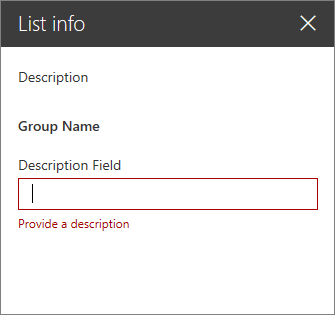
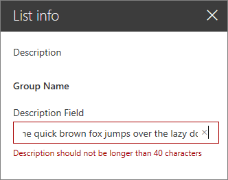
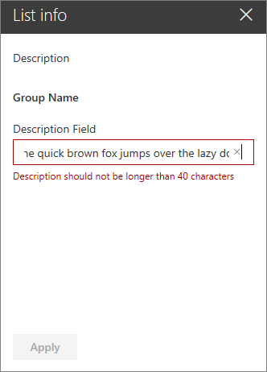
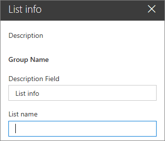
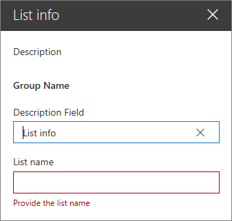
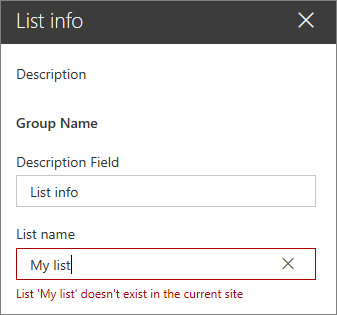
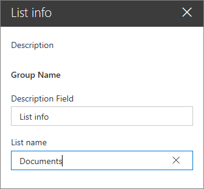
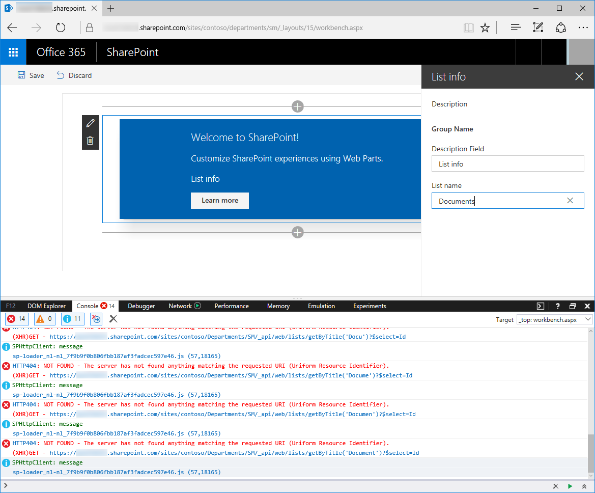

# Validate web part property values

When working with SharePoint Framework client-side web parts, users can configure them to meet their needs by using their properties. By validating the provided configuration values, you can make it easier for users to configure the web part and improve the overall user experience of working with your web part.

> [!NOTE]
> Before following the steps in this article, be sure to [set up your development environment](../../set-up-your-development-environment.md) for building SharePoint Framework solutions.

## Create a new web part project

1. Start by creating a new folder for your project:

    ```console
    md react-listinfo
    ```

1. Go to the project folder:

    ```console
    cd react-listinfo
    ```

1. In the project folder, run the SharePoint Framework Yeoman generator to scaffold a new project:

    ```console
    yo @microsoft/sharepoint
    ```

1. When prompted, enter the following values (*select the default option for all prompts omitted below*):

    - **What is your solution name?**: react-listinfo
    - **Where do you want to place the files?**: Use the current folder
    - **What is your Web part name?**: List info
    - **What is your Web part description?**: Shows information about the selected list
    - **Which framework would you like to use?**: No JavaScript framework

1. Open your project folder in your code editor. This article uses Visual Studio Code in the steps and screenshots, but you can use any editor that you prefer.

## Options for validating web part properties

SharePoint Framework offers developers two ways to validate values of web part properties. You can validate the value directly, inside a web part's code, or you can call an external API to do the validation there.

Validating values inline is useful for doing simple validations such as minimal/maximum length, required properties, or simple pattern recognition, like a zip code. Whenever the validation is based on business logic, such as checking a social security number or a security group membership, calling external APIs is a better approach.

To validate the value of a web part property, you have to implement the event handler for the `onGetErrorMessage` event of that particular property. For inline validation, the event handler should return a string with the validation error or an empty string if the provided value is valid.

For validation using remote APIs, the event handler returns a promise of string. If the provided value is invalid, the promise resolves with the error message. If the provided value is valid, the promise resolves with an empty string.

## Validate web part property values inline

In this step, you verify that the description web part property is specified and its value isn't longer than 40 characters. You do this by using the inline validation process.

1. In the code editor, open the **./src/webparts/listInfo/ListInfoWebPart.ts** file. In the `ListInfoWebPart` class, add the `validateDescription()` method with the following code:

    ```typescript
    export default class ListInfoWebPart extends BaseClientSideWebPart<IListInfoWebPartProps> {
      // ...

      private validateDescription(value: string): string {
        if (value === null ||
          value.trim().length === 0) {
          return 'Provide a description';
        }

        if (value.length > 40) {
          return 'Description should not be longer than 40 characters';
        }

        return '';
      }
    }
    ```

    The `validateDescription()` method checks if the description is provided, and if it isn't longer than 40 characters. If the provided description is invalid, the method returns an error message corresponding to the validation error. If the provided value is correct, it returns an empty string.

1. Associate the `validateDescription()` method with the `description` web part property. In the `ListInfoWebPart` class, change the implementation of the `getPropertyPaneConfiguration()` method to:

    ```typescript
    export default class ListInfoWebPart extends BaseClientSideWebPart<IListInfoWebPartProps> {
      // ...

      protected getPropertyPaneConfiguration(): IPropertyPaneConfiguration {
        return {
          pages: [
            {
              header: {
                description: strings.PropertyPaneDescription
              },
              groups: [
                {
                  groupName: strings.BasicGroupName,
                  groupFields: [
                    PropertyPaneTextField('description', {
                      label: strings.DescriptionFieldLabel,
                      onGetErrorMessage: this.validateDescription.bind(this)
                    })
                  ]
                }
              ]
            }
          ]
        };
      }

      // ...
    }
    ```

    You've extended the definition of the `description` web part by defining the `validateDescription()` method as the event handler for the `onGetErrorMessage` event.

1. Run the following command to see the result of the validation:

    ```console
    gulp serve
    ```

1. In the workbench, add the web part to the canvas and open its properties. If you remove the description, you should see the first validation error.

    

1. Provide a value that's longer than 40 characters. You should see another validation error displayed under the text field.

    

1. Notice that when providing an invalid value, the web part is rendered showing the last valid value. Additionally, in the non-reactive property pane mode, if one of the web part properties is invalid, the **Apply** button is disabled, preventing the user from applying the invalid configuration.

    

1. Stop the local webserver by pressing <kbd>CTRL</kbd>+<kbd>C</kbd> in the console.

## Validate web part property values using remote APIs

In some scenarios, validating web part property values can be more complex and may require specific business logic. In such cases, it might be more efficient for you to validate the value by using an existing API rather than implementing and maintaining the business logic in the web part.

In this step, you implement validation logic that checks if the list with the name specified in the web part properties exists in the current SharePoint site.

### Add the listName web part property

1. In the code editor, open the **./src/webparts/listInfo/ListInfoWebPart.manifest.json** file. In the `properties` property, add a new property named `listName` with the default value set to an empty string:

    ```json
    {
      "$schema": "https://developer.microsoft.com/json-schemas/spfx/client-side-web-part-manifest.schema.json",
      "id": "1ec8f92d-ea55-4584-bf50-bac435c916bf",
      "alias": "ListInfoWebPart",
      "componentType": "WebPart",

      "version": "*",
      "manifestVersion": 2,

      "requiresCustomScript": false,

      "preconfiguredEntries": [{
        "groupId": "1ec8f92d-ea55-4584-bf50-bac435c916bf",
        "group": { "default": "Under Development" },
        "title": { "default": "List info" },
        "description": { "default": "Shows information about the selected list" },
        "officeFabricIconFontName": "Page",
        "properties": {
          "description": "List info",
          "listName": ""
        }
      }]
    }
    ```

1. In the code editor, open the **./src/webparts/listInfo/ListInfoWebPart.ts** file, and extend the interface definition with the `listName` property of type string.

    ```typescript
    export interface IListInfoWebPartProps {
      description: string;
      listName: string;
    }
    ```

1. Finish adding the new web part property by opening the **./src/webparts/listInfo/ListInfoWebPart.ts** file in the code editor, and changing the implementation of the `getPropertyPaneConfiguration()` method to:

    ```typescript
    export default class ListInfoWebPart extends BaseClientSideWebPart<IListInfoWebPartProps> {
      // ...

      protected getPropertyPaneConfiguration(): IPropertyPaneConfiguration {
        return {
          pages: [
            {
              header: {
                description: strings.PropertyPaneDescription
              },
              groups: [
                {
                  groupName: strings.BasicGroupName,
                  groupFields: [
                    PropertyPaneTextField('description', {
                      label: strings.DescriptionFieldLabel,
                      onGetErrorMessage: this.validateDescription.bind(this)
                    }),
                    PropertyPaneTextField('listName', {
                      label: strings.ListNameFieldLabel
                    })
                  ]
                }
              ]
            }
          ]
        };
      }

      // ...
    }
    ```

1. Add the missing `ListNameFieldLabel` resource string by changing the code of the **./src/webparts/listInfo/loc/mystrings.d.ts** file to:

    ```typescript
    declare interface IListInfoWebPartStrings {
      PropertyPaneDescription: string;
      BasicGroupName: string;
      DescriptionFieldLabel: string;
      ListNameFieldLabel: string;
    }

    declare module 'listInfoStrings' {
      const strings: IListInfoWebPartStrings;
      export = strings;
    }
    ```

1. Change the code of the **./src/webparts/listInfo/loc/en-us.js** file to:

    ```javascript
    define([], function() {
      return {
        "PropertyPaneDescription": "Description",
        "BasicGroupName": "Group Name",
        "DescriptionFieldLabel": "Description Field",
        "ListNameFieldLabel": "List name"
      }
    });
    ```

1. Run the following command to verify that the project is running and that the newly added list name property is displayed in the web part property pane:

    ```console
    gulp serve
    ```

    

1. Stop the local webserver by pressing <kbd>CTRL</kbd>+<kbd>C</kbd> in the console.

### Validate the name of the list by with the SharePoint REST API

In this step, you validate the provided list name and check if it corresponds to an existing list on the current SharePoint site.

1. In the code editor, open the **./src/webparts/listInfo/ListInfoWebPart.ts** file, and add the following references:

    ```typescript
    import { SPHttpClient, SPHttpClientResponse } from '@microsoft/sp-http';
    import { escape } from '@microsoft/sp-lodash-subset';
    ```

1. In the `ListInfoWebPart` class, add the `validateListName()` method with the following code:

    ```typescript
    export default class ListInfoWebPart extends BaseClientSideWebPart<IListInfoWebPartProps> {
      // ...

      private async validateListName(value: string): Promise<string> {
        if (value === null || value.length === 0) {
          return "Provide the list name";
        }

        try {
          let response = await this.context.spHttpClient.get(
            this.context.pageContext.web.absoluteUrl +
              `/_api/web/lists/getByTitle('${escape(value)}')?$select=Id`,
            SPHttpClient.configurations.v1
          );

          if (response.ok) {
            return "";
          } else if (response.status === 404) {
            return `List '${escape(value)}' doesn't exist in the current site`;
          } else {
            return `Error: ${response.statusText}. Please try again`;
          }
        } catch (error) {
          return error.message;
        }
      }

      // ...
    }
    ```

    First, the `validateListName()` method checks if a list name has been provided. If not, it resolves the promise with a relevant validation error. If the user has provided a list name, the `validateListName()` method uses the `SPHttpClient` to call the SharePoint REST API and check if the list with the specified name exists.

    If the list with the specified name exists on the current site, the response returns a 200 OK status code, and the `validateListName()` method resolves the promise with an empty string, confirming that the provided value represents a valid list.

    If the list with the specified name doesn't exist, the response returns a different code. Typically, it's a 404 Not Found response, but if the request failed in some other way, a different status code can be returned. In both cases, the `validateListName()` method displays a relevant error message to the user.

    With the list name validation method defined, the next step is to configure it as the validation handler for the `listName` web part property.

1. In the `ListInfoWebPart` class, replace the code of the `getPropertyPaneConfiguration` method with:

    ```typescript
    export default class ListInfoWebPart extends BaseClientSideWebPart<IListInfoWebPartProps> {
      // ...

      protected getPropertyPaneConfiguration(): IPropertyPaneConfiguration {
        return {
          pages: [
            {
              header: {
                description: strings.PropertyPaneDescription
              },
              groups: [
                {
                  groupName: strings.BasicGroupName,
                  groupFields: [
                    PropertyPaneTextField('description', {
                      label: strings.DescriptionFieldLabel,
                      onGetErrorMessage: this.validateDescription.bind(this)
                    }),
                    PropertyPaneTextField('listName', {
                      label: strings.ListNameFieldLabel,
                      onGetErrorMessage: this.validateListName.bind(this)
                    })
                  ]
                }
              ]
            }
          ]
        };
      }

      // ...
    }
    ```

1. Run the following command to see the result of the validation:

    ```console
    gulp serve --nobrowser
    ```

    Because the list name validation method communicates with the SharePoint REST API, you have to test the web part in the hosted version of the SharePoint workbench.

1. Add the web part to the canvas and open its properties. Because you haven't specified a default value for the list name, which is a required property, you see a validation error.

    

    If you provide the name of a list that doesn't exist, the web part displays a validation error stating that the list you specified doesn't exist in the current site.

    

    If you specify the name of an existing list, the validation error disappears.

    

### Optimize validation using remote APIs

When validating web part properties using remote APIs, SharePoint Framework monitors changes in the property pane controls and sends updated values for validation to the specified validation handler. By default, the SharePoint Framework waits 200 ms before triggering the validation process. If the user hasn't changed the particular value for 200 ms, the SharePoint Framework starts the validation process. When the validation handler uses a remote API, each time the validation process starts, that method issues a web request to the API to validate the specified value. If users don't type fast enough, this results in partially completed values being sent over for validation, unnecessarily stressing the network and the API. In such cases, you should consider increasing the validation delay.



You can configure the validation delay for each property separately, depending on the type of value that users need to provide.

#### Increase the validation delay for the `listName` property

1. In the code editor, open the **./src/webparts/listInfo/ListInfoWebPart.ts** file. Change the code of the `getPropertyPaneConfiguration()` method to:

    ```typescript
    export default class ListInfoWebPart extends BaseClientSideWebPart<IListInfoWebPartProps> {
      // ...

      protected getPropertyPaneConfiguration(): IPropertyPaneConfiguration {
        return {
          pages: [
            {
              header: {
                description: strings.PropertyPaneDescription
              },
              groups: [
                {
                  groupName: strings.BasicGroupName,
                  groupFields: [
                    PropertyPaneTextField('description', {
                      label: strings.DescriptionFieldLabel,
                      onGetErrorMessage: this.validateDescription.bind(this)
                    }),
                    PropertyPaneTextField('listName', {
                      label: strings.ListNameFieldLabel,
                      onGetErrorMessage: this.validateListName.bind(this),
                      deferredValidationTime: 500
                    })
                  ]
                }
              ]
            }
          ]
        };
      }

      // ...
    }

    ```

1. The `deferredValidationTime` property specifies the number of milliseconds that the SharePoint Framework waits before starting the validation process.
1. Run the following command to see that the applied delay is working as expected:

    ```console
    gulp serve --nobrowser
    ```

1. After validating the delay is working as expected, stop the local webserver by pressing <kbd>CTRL</kbd>+<kbd>C</kbd> in the console.
