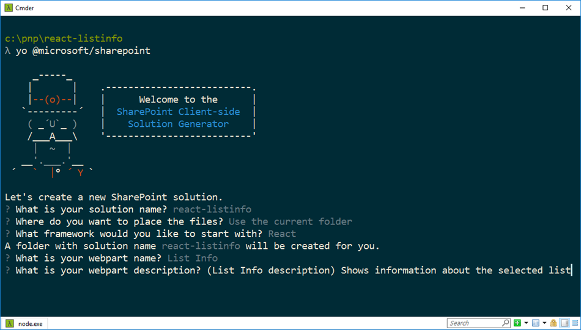

# Validate web part property values

When working with web parts, users can configure them to meet their needs using their properties. By validating the provided configuration values you can make it easier for users to configure the web part and improve the overall user experience of working with your web part. In this article you will learn how to validate web part property values in SharePoint Framework client-side web parts.

> **Note:** Before following the steps in this article, be sure to [set up your development environment](../../set-up-your-development-environment) for building SharePoint Framework solutions.

## Create new project

Start by creating a new folder for your project.

```sh
md react-listinfo
```

Go to the project folder.

```sh
cd react-listinfo
```

In the project folder run the SharePoint Framework Yeoman generator to scaffold a new SharePoint Framework project.

```sh
yo @microsoft/sharepoint
```

When prompted, enter the following values:

- **react-listinfo** as your solution name
- **Use the current folder** for the location to place the files
- **React** as the starting point to build the web part
- **List info** as your web part name
- **Shows information about the selected list** as your web part description



Once the scaffolding completes, open your project folder in your code editor. This article uses Visual Studio Code in the steps and screenshots but you can use any editor you prefer.


## Validate web part property values in the SharePoint Framework

SharePoint Framework offers developers two ways for validating values of web part properties. You can validate the value directly, inside web part's code, or you can call an external API to perform the validation there. Validating values inline is useful for performing simple validations such as minimal/maximum length, required properties or simple pattern recognition, like a ZIP code. Whenever the validation is based on business logic, such as checking a social security number or a security group membership, calling external APIs is a better approach.

In order to validate the value of a web part property, you have to implement the event handler for the **onGetErrorMessage** event of that particular property. For inline validation the event handler should return a string with the validation error or an empty string if the provided value is valid. For validation using remote APIs the event handler returns a promise of string. If the provided value is invalid the promise resolves with the error message. If the provided value is valid then the promise resolves with an empty string.

### Validate web part property values inline

In this step you will verify that the description web part property is specified and its value is not longer than 40 characters. You will do this using the inline validation process.

In the code editor open the **./src/webparts/listInfo/ListInfoWebPart.ts** file. In the **ListInfoWebPart** class, add the **validateDescription** method with the following code:

```ts
export default class ListInfoWebPart extends BaseClientSideWebPart<IListInfoWebPartProps> {
  // ...

  private validateDescription(value: string): string {
    if (value === null ||
      value.trim().length === 0) {
      return 'Provide a description';
    }

    if (value.length > 40) {
      return 'Description should not be longer than 40 characters';
    }

    return '';
  }
}
```

The **validateDescription** method checks if the description is provided and if it isn't longer than 40 characters. If the provided description is invalid, the method returns an error message corresponding to the validation error. If the provided value is correct it returns an empty string.

Next, you have to associate the **validateDescription** method with the **description** web part property. In the **ListInfoWebPart** class change the implementation of the **getPropertyPaneConfiguration** method to:

```ts
export default class ListInfoWebPart extends BaseClientSideWebPart<IListInfoWebPartProps> {
  // ...

  protected getPropertyPaneConfiguration(): IPropertyPaneConfiguration {
    return {
      pages: [
        {
          header: {
            description: strings.PropertyPaneDescription
          },
          groups: [
            {
              groupName: strings.BasicGroupName,
              groupFields: [
                PropertyPaneTextField('description', {
                  label: strings.DescriptionFieldLabel,
                  onGetErrorMessage: this.validateDescription.bind(this)
                })
              ]
            }
          ]
        }
      ]
    };
  }

  // ...
}
```

You have extended the definition of the **description** web part with defining the **validateDescription** method as the event handler for the **onGetErrorMessage** event.

Run the following command to see the result of the validation:

```sh
gulp serve
```

In the workbench, add the web part to canvas and open its properties. If you remove the description you should see the first validation error.


Next, try providing a value that's longer than 40 characters. You should see another validation error displayed below the text field.


Notice, that when providing an invalid value, the web part is rendered showing the last valid value. Additionally, in the non-reactive property pane mode, if one of the web part properties is invalid, the **Apply** button is disabled, preventing the user from applying the invalid configuration.


### Validate web part property values using remote APIs

In some scenarios, validating web part property values can be more complex and require specific business logic. In such cases it might be more efficient for you to validate the value using an existing API rather than implementing and maintaining the business logic in the web part.

In this step you will implement validation logic that checks if the list with the name specified in the web part properties exists in the current SharePoint site.

#### Add the listName web part property

In the code editor open the **./src/webparts/listInfo/ListInfoWebPart.manifest.json** file. In the **properties** property add a new property named **listName** with the default value set to an empty string:

```json
{
  "$schema": "https://dev.office.com/json-schemas/spfx/client-side-web-part-manifest.schema.json",
  "id": "1ec8f92d-ea55-4584-bf50-bac435c916bf",
  "alias": "ListInfoWebPart",
  "componentType": "WebPart",

  // The "*" signifies that the version should be taken from the package.json
  "version": "*",
  "manifestVersion": 2,

  // If true, the component can only be installed on sites where Custom Script is allowed.
  // Components that allow authors to embed arbitrary script code should set this to true.
  // https://support.office.com/en-us/article/Turn-scripting-capabilities-on-or-off-1f2c515f-5d7e-448a-9fd7-835da935584f
  "requiresCustomScript": false,

  "preconfiguredEntries": [{
    "groupId": "1ec8f92d-ea55-4584-bf50-bac435c916bf",
    "group": { "default": "Under Development" },
    "title": { "default": "List info" },
    "description": { "default": "Shows information about the selected list" },
    "officeFabricIconFontName": "Page",
    "properties": {
      "description": "List info"
    }
  }]
}
```

Next, in the code editor open the **./src/webparts/listInfo/IListInfoWebPartProps.ts** file and extend the interface definition with the **listName** property of type string.

```ts
export interface IListInfoWebPartProps {
  description: string;
  listName: string;
}
```

Finish adding the new web part property, by opening in the code editor the **./src/webparts/listInfo/ListInfoWebPart.ts** file and changing the implementation of the **getPropertyPaneConfiguration** method to:

```ts
export default class ListInfoWebPart extends BaseClientSideWebPart<IListInfoWebPartProps> {
  // ...

  protected getPropertyPaneConfiguration(): IPropertyPaneConfiguration {
    return {
      pages: [
        {
          header: {
            description: strings.PropertyPaneDescription
          },
          groups: [
            {
              groupName: strings.BasicGroupName,
              groupFields: [
                PropertyPaneTextField('description', {
                  label: strings.DescriptionFieldLabel,
                  onGetErrorMessage: this.validateDescription.bind(this)
                }),
                PropertyPaneTextField('listName', {
                  label: strings.ListNameFieldLabel
                })
              ]
            }
          ]
        }
      ]
    };
  }

  // ...
}
```

Add the missing **ListNameFieldLabel** resource string by changing the code of the **./src/webparts/listInfo/loc/mystrings.d.ts** file to:

```ts
declare interface IListInfoStrings {
  PropertyPaneDescription: string;
  BasicGroupName: string;
  DescriptionFieldLabel: string;
  ListNameFieldLabel: string;
}

declare module 'listInfoStrings' {
  const strings: IListInfoStrings;
  export = strings;
}
```

and the code of the **./src/webparts/listInfo/loc/en-us.js** to:

```js
define([], function() {
  return {
    "PropertyPaneDescription": "Description",
    "BasicGroupName": "Group Name",
    "DescriptionFieldLabel": "Description Field",
    "ListNameFieldLabel": "List name"
  }
});
```

Run the following command to verify that the project is running and that the newly added list name property is displayed in the web part property pane:

```sh
gulp serve
```


#### Validate the name of the list using the SharePoint REST API

In this step you will validate the provided list name and check if it corresponds to an existing list in the current SharePoint site.

In the code editor open the **./src/webparts/listInfo/ListInfoWebPart.ts** file and add the following references:

```ts
import { SPHttpClient, SPHttpClientResponse } from '@microsoft/sp-http';
import { escape } from '@microsoft/sp-lodash-subset';
```

Next, to the **ListInfoWebPart** class add the **validateListName** method with the following code:

```ts
export default class ListInfoWebPart extends BaseClientSideWebPart<IListInfoWebPartProps> {
  // ...

  private validateListName(value: string): Promise<string> {
    return new Promise<string>((resolve: (validationErrorMessage: string) => void, reject: (error: any) => void): void => {
      if (value === null ||
        value.length === 0) {
        resolve('Provide the list name');
        return;
      }

      this.context.spHttpClient.get(this.context.pageContext.web.absoluteUrl + `/_api/web/lists/getByTitle('${escape(value)}')?$select=Id`, SPHttpClient.configurations.v1)
        .then((response: SPHttpClientResponse): void => {
          if (response.ok) {
            resolve('');
            return;
          }
          else if (response.status === 404) {
            resolve(`List '${escape(value)}' doesn't exist in the current site`);
            return;
          }
          else {
            resolve(`Error: ${response.statusText}. Please try again`);
            return;
          }
        })
        .catch((error: any): void => {
          resolve(error);
        });
    });
  }
}
```

First, the **validateListName** method checks if a list name has been provided. If not, it resolves the promise with a relevant validation error. If the user has provided a list name, the **validateListName** method uses the **SPHttpClient** to call the SharePoint REST API and check if the list with the specified name exists.

If the list with the specified name exists in the current site, the response will return a 200 OK status code and the **validateListName** method will resolve the promise with an empty string, confirming that the provided value represents a valid list. If the list with the specified name doesn't exist, the response will return a different code. Typically it will be a 404 Not Found response, but if the request failed in some other way a different status code can be returned. In both cases the **validateListName** method will display a relevant error message to the user.

With the list name validation method defined, the next step is to configure it as the validation handler for the **listName** web part property. In the **ListInfoWebPart** class replace the code of the **getPropertyPaneConfiguration** method with:

```ts
export default class ListInfoWebPart extends BaseClientSideWebPart<IListInfoWebPartProps> {
  // ...

  protected getPropertyPaneConfiguration(): IPropertyPaneConfiguration {
    return {
      pages: [
        {
          header: {
            description: strings.PropertyPaneDescription
          },
          groups: [
            {
              groupName: strings.BasicGroupName,
              groupFields: [
                PropertyPaneTextField('description', {
                  label: strings.DescriptionFieldLabel,
                  onGetErrorMessage: this.validateDescription.bind(this)
                }),
                PropertyPaneTextField('listName', {
                  label: strings.ListNameFieldLabel,
                  onGetErrorMessage: this.validateListName.bind(this)
                })
              ]
            }
          ]
        }
      ]
    };
  }

  // ...
}
```

Run the following command to see the result of the validation:

```sh
gulp serve --nobrowser
```

Because the list name validation method communicates with the SharePoint REST API, you have to test the web part in the hosted version of the SharePoint workbench.

Add the web part to the canvas and open its properties. Because you haven't specified a default value for the list name, which is a required property, you will see a validation error.


If you provide a name of a list that doesn't exist, the web part will display a validation error stating that the list you specified doesn't exist in the current site.


If you specify a name of an existing list, the validation error will disappear.


#### Optimize validation using remote APIs

When validating web part properties using remote APIs, SharePoint Framework monitors changes in the property pane controls and sends updated values for validation to the specified validation handler. By default, the SharePoint Framework waits 200ms before triggering the validation process. If the user hasn't changed the particular value for 200ms, the SharePoint Framework will start the validation process. When the validation handler uses a remote API, each time the validation process starts, that method will issue a web request to the API to validate the specified value. If users don't type fast enough, this will result in partially completed values being sent over for validation unnecessarily stressing the network and the API. In such cases you should consider increasing the validation delay.


You can configure the validation delay for each property separately, depending on the type of value that users need to provide. Following steps illustrate how to increase the validation delay for the **listName** property.

In the code editor open the **./src/webparts/listInfo/ListInfoWebPart.ts** file. Change the code of the **getPropertyPaneConfiguration** method to:

```ts
export default class ListInfoWebPart extends BaseClientSideWebPart<IListInfoWebPartProps> {
  // ...

  protected getPropertyPaneConfiguration(): IPropertyPaneConfiguration {
    return {
      pages: [
        {
          header: {
            description: strings.PropertyPaneDescription
          },
          groups: [
            {
              groupName: strings.BasicGroupName,
              groupFields: [
                PropertyPaneTextField('description', {
                  label: strings.DescriptionFieldLabel,
                  onGetErrorMessage: this.validateDescription.bind(this)
                }),
                PropertyPaneTextField('listName', {
                  label: strings.ListNameFieldLabel,
                  onGetErrorMessage: this.validateListName.bind(this),
                  deferredValidationTime: 500
                })
              ]
            }
          ]
        }
      ]
    };
  }

  // ...
}

```

The **deferredValidationTime** property specifies the number of milliseconds that the SharePoint Framework will wait before starting the validation process.

Run the following command to see that the applied delay is working as expected:

```sh
gulp serve --nobrowser
```