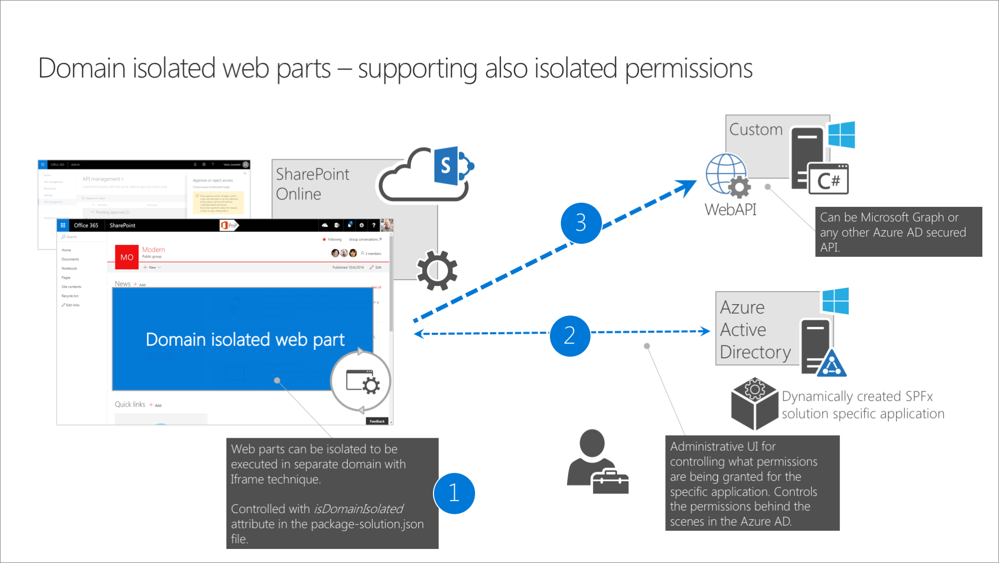
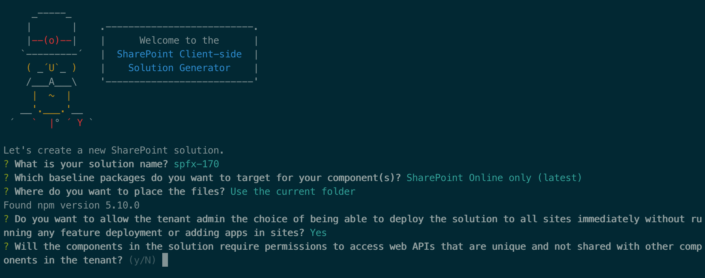
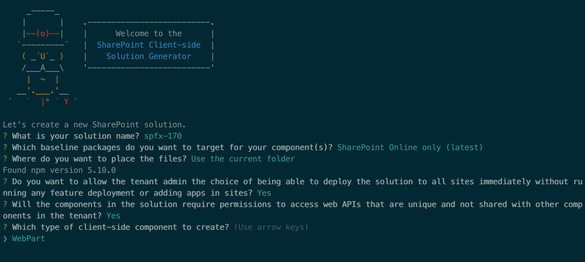

# Isolated web parts

Using this capability you can build web parts that securely communicate with APIs secured with Azure AD without exposing the access token to other components on the page or even scripts in the tenant.

> [!IMPORTANT]
> This feature is currently in preview and is subject to change. It is not currently supported for use in production environments. Your feedback and input around this capability is welcome using the [SharePoint Dev Docs issue list](https://github.com/SharePoint/sp-dev-docs/issues).

## Why isolated web parts

To allow your SharePoint Framework solutions to securely access APIs secured with Azure AD, you can use the API management to specify which APIs can be accessed by scripts in your tenant and with which permissions. Next, using the SharePoint Framework, you can easily retrieve an access token for the specific API. While it significantly simplifies communicating with APIs secured with Azure AD, it allows all scripts, not just specific SharePoint Framework solutions, to obtain an access token for any of the approved APIs. If one of the scripts you use in your tenant was exploited, then it could access any of the approved APIs on behalf of the current user.

Isolated web parts introduce a new way to isolate access to APIs secured with Azure AD and ensure that only specific SharePoint Framework web parts are allowed to obtain an access token for the particular API.

## How isolated web parts work

> [!IMPORTANT]
> The isolated web parts capability is available only in SharePoint Framework v1.7.0 and later.

Solutions using the isolated web parts capability, have a specific flag set in the project metadata in the .sppkg file. When deploying these solutions to the app catalog, all API permission requests are specified as isolated. After approving an isolated API permission request, SharePoint will create a separate Azure AD application in the Azure AD linked to the Office 365 tenant. This Azure AD application is specific to the SharePoint Framework solution that requested API permissions and will have set OAuth permissions as requested by that solution. The return URL of that Azure AD application, which is used by the OAuth implicit flow, will be set to a unique domain that is tied to that specific SharePoint Framework application. All web parts from solutions using isolated permissions, when added to a page, will be displayed using an iframe pointing to a unique domain tied to the particular SharePoint Framework solution. This way, SharePoint Framework is able to enforce unique API permissions and ensure that no other solution or script in the tenant can obtain an access token to these APIs.

### Scaffolding a project that uses isolated permissions

When you scaffold a new SharePoint Framework project, the SharePoint Framework Yeoman generator will prompt you, if the solution requires API permissions that should be isolated and not available to other components.

If you answer _Yes_, then the generator will add a flag to your project's configuration in the `config/package-solution.json` file, by setting the `isDomainIsolated` property to `true`. Because the isolated web parts capability applies only to web parts, the generator will only allow you to create web parts in your project.

> [!IMPORTANT]
> Theoretically, you could manually create a SharePoint Framework extension in a project that uses isolated permissions. This is however a bad idea and something you should never do. If the extension you have added communicated with APIs secured with Azure AD, it wouldn't be able to retrieve the access token in an isolated way and would fail on runtime.

### Communicating with APIs

Despite the web part using isolated permissions, there is nothing specific to how you obtain an access token to an API secured with Azure AD in your code. Additionally, even though on runtime isolated web parts will be loaded inside an iframe pointing to a unique domain, you can communicate with SharePoint REST API, the same way as you would in non-isolated web parts.

### Deploying solutions with isolated web parts

Solutions with isolated web parts are deployed the same way as regular SharePoint Framework solutions. The only difference is, that the API permission requests are deployed as isolated. This is clearly visible on the API management page, where the API permission requests are grouped per solution to which they apply.

API permissions granted on the tenant-level can be used by any SharePoint Framework solution or piece of script on the tenant. Isolated permissions on the other hand, can only be used by the solution that requested them.

### Using isolated web parts

When added to the page, isolated web parts are displayed using an iframe. This iframe points to a unique domain assigned to the SharePoint Framework solution where the web part is located. This domain is also referenced in the return URL of the Azure AD application created to host the isolated permissions for the particular SharePoint Framework solution. Using the unique domain allows to ensure, that only web parts from the particular SharePoint Framework solution are able to obtain an access token for the isolated set of permissions.

### Upgrading existing project to use isolated permissions

If you're upgrading an existing SharePoint Framework project to v1.7.0 and want to use the isolated permissions capability, you can do it, by setting in the `config/package-solution.json` file, the `isDomainIsolated` property to `true`. You should ensure, that your project contains only web parts.

After changing the project to use isolated permissions, you should redeploy your project. This will issue new API permission requests, isolated to your solution, which will need to be approved by the tenant admin.

### Removing solutions with isolated permissions

When approving isolated API permissions, SharePoint creates a dedicated Azure AD application specific for the SharePoint Framework solution that requested permissions. When the SharePoint Framework solution is removed from the app catalog, the API permissions as well as the Azure AD application are not removed.