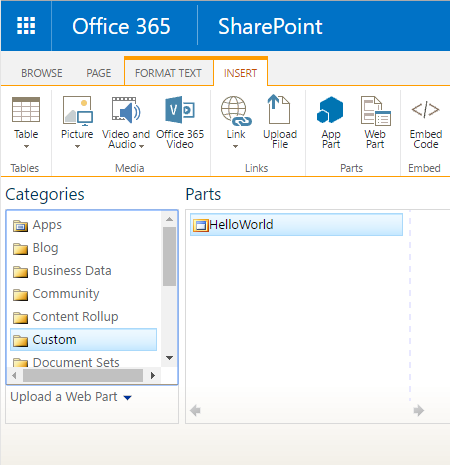
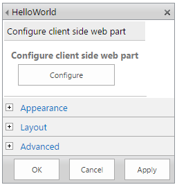
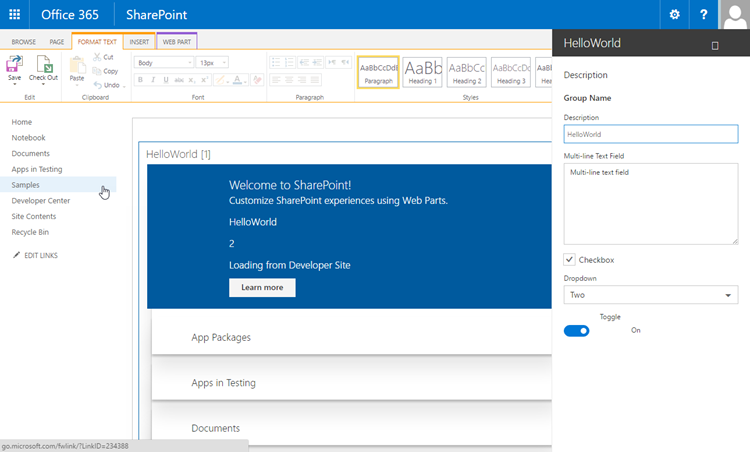

#Serve your client-side web part in a SharePoint page

>**Note:** The SharePoint Framework is currently in Preview, and is subject to change based on customer feedback.  While we’re in preview, SharePoint Framework web parts are not supported for use in production environments.

## Tutorial 3 Overview
In this tutorial, we will deploy the client-side web part to SharePoint and see it working on a classic SharePoint server-side page.

## Tutorial pre-requisites
As a pre-requisite, you should have completed the following tutorials before you start this tutorial:
* [Tutorial 1 - HelloWorld Web Part](./build-a-hello-world-web-part)
* [Tutorial 2 - HelloWorld, Talking to SharePoint](./connect-to-sharepoint) 

Each step below will build on the previous so you will need to go through each step one by one to successfully complete this lab.

## Step 1: Project directory
Switch to console and make sure you are still in the project directory used in Tutorial 1 and 2. 

Else, navigate to your project directory:

```
cd helloworld-webpart
```

If you still have `gulp serve` running, terminate the ask by pressing `Ctrl+C`

## Step 2: Package the HelloWorld web part
Unlike in the workbench, in order to support client-side web parts in classic SharePoint server-side pages, we will need to deploy and register the web part with SharePoint.

To do so, we will first need to package the web part.

Switch to Visual Studio Code. Make sure you have the `HelloWorldWebPart` web part project open. If not, open the project.

Open `package-solution.json` from `config` folder.

The `package-solution.json` defines the package metadata:

```json
{
  "solution": {
    "name": "helloworld-webpart-client-side-solution",
    "id": "ed83e452-2286-4ea0-8f98-c79d257acea5",
    "version": "1.0.0.0"
  },
  "paths": {
    "zippedPackage": "helloworld-webpart.spapp"
  }
}
```

Switch to the console window, and type the following to package your client-side solution that contains the web part:

>If you still have `gulp serve` running, terminate the ask by pressing `Ctrl+C`

```
gulp package-solution
```

This will create the package in the `sharepoint` folder:

```
helloworld-webpart.spapp
```

### Package contents
The package uses SharePoint Feature to package your web part. By default, the gulp task creates the following:
* Feature for your web part
* .webpart file for your web part, which is an XML file that describes the Web Part

You can view the raw package contents in the `sharepoint` folder. 

This is then packaged into an `.spapp` file. The package format is very similar to SharePoint add-ins package and uses Microsoft Open Packaging Conventions to package your solution. 

As you can see, the JavaScript files, CSS and other assets are not packaged as you will have to deploy them to an external location such as CDNs. In order to test the web part during development, you can load all the assets from your local machine. 

## Step 3: Deploy HelloWorld package to app catalog
We now need to deploy the package we generated in the previous step to the App Catalog.

Navigate to your site's App Catalog.

Upload or drag & drop the `helloworld-webpart.spapp` to the App Catalog.

 

This will deploy the client-side solution package. 

Since this is a full trust client-side solution, SharePoint will display a dialog and ask you to trust the client-side solition to deploy.

 

Click `Deploy`

## Step 4: Install the client-side solution in your site
Navigate to your developer site collection.

Click on the `gears` icon on the top bar on the right and click `Add an app` to navigate to your Your Apps page.

In the Search box, type `helloworld` and press `Enter` to filter your apps.

 

Click on the `helloworld-webpart-client-side-solution` app to install the app in the site.

 

This will install the client-side solution and the web part in your developer site.

Site Contents page will show you the installation status of your client-side solution. Make sure the installation is  complete before going to the next step. 

## Step 5: Preview web part in a classic SharePoint page
Now that we have deployed and installed the client-side solution, lets add the web part to a classic SharePoint page.

Remember that our resources such as JavaScripts, CSS etc., are available in the local machine.  

Switch to Visual Studio Code and open `<your-webpart-guid>.manifest.json` in `\dist` folder.

Notice the `internalModuleBaseUrls` property in the `loaderConfig` entry:

```json
"internalModuleBaseUrls": [
  "http://`your-local-machine-name`:4321/"
]
```

It still refers to your local machine.

So, before we add the web part to a SharePoint server-side page, lets run the local server.

Switch to the console window that has the `helloworld-webpart` project directory.

Execute the gulp task to start serving from localhost:

```
gulp serve --nobrowser
```

> `--nobrowser` will not automatically launch the Web Part Workbench.

### Add HelloWorld web part to classic page
Switch to your browser and navigate to your site collection.

To create a classic page, navigate to `SitePages` library in your site.
* Click on the `gears` icon on the top bar on the right and click `Site Contents`.
* Click on `SitePages` library icon to navigate to `SitePages` library.
* Click `New` to create a classic SharePoint page.
* Enter `HelloWorld` as the page name.
* Click `Create` button to create the web part page.

SharePoint will create your page.

In the Ribbon, click `Insert`, then `Web Part` to open the Web Part Gallery.

In the Web Part Gallery, click on the category `Custom`.

>For this preview, client-side web parts will be available under the `Custom` category in the web part gallery. 

You should see your Hello World web part.



Select the Hello World web part and click `Add` to add it to the page.

Since we are loading the web part assets from local environment, in order to load the scripts hosted in your local machine, we need to enable the browser to load unsafe scripts. Depending on the browser you are using, make sure you enable loading unsafe scripts for this session. 

You should now see the `HelloWorld` web part we built in Tutorial 2 that retrieves lists from the current site. 


### Edit web part properties
Click the web part edit menu and click on `Edit Web Part' to open the web part Property Pane.


As you can see, this is a server-side web part property pane.

However, notice you have an option to configure the properties for your client-side web part.



Click `Configure` button to reveal the new client-side Property Pane for your client-side web part.

This is the same property pane we built and previewed in the workbench. 

Edit the `Description` property and type `Client-side web parts are awesome!`



Notice you still have the same behaviors such as a reactive pane where the web part is updated as you type.

Click the `x` icon to close the client-side property pane.

>NOTE: You will need to click the `x` icon several times to close the property pane. This is a known issue. 

Click `Ok' button in the server-side property pane to save and close the web part property pane.

Since this is running in a classic SharePoint page, clicking the `Ok` or `Apply` button will save the web part properties.

In the Ribbon, click `Save` to save the page.

Congratulations! You now have added a client-side web part to a classic SharePoint page. 

## Next steps

In the next [tutorial](./deploy-web-part-to-cdn), we will deploy and load the web part assets from CDN instead of localhost.


