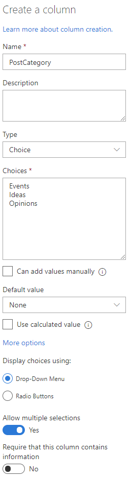

# Modernize Delve blogs and classic blogs

> [!IMPORTANT]
> Modernization tooling and all other PnP components are open-source tools backed by an active community providing support for them. There is no SLA for open-source tool support from official Microsoft support channels.

SharePoint started supporting classic blogging via a blog site template as of SharePoint 2010 and today these blog sites with their blog pages do work in SharePoint Online. The whole blog creation and publishing experience however is, compared to modern pages in modern communication sites, very outdated. We therefore recommend to use modern communication sites for your future blogging needs. If you today have blog sites with blog pages that you want to "upgrade" to modern pages in a modern communication site then follow the steps outlined in this article.

Next to the above mentioned classic blog pages SharePoint Online users can also use Delve blogs. Delve blogs are being deprecated and therefore it's highly recommended that you transform your business relevant Delve blog pages to modern pages in a modern communication site.

> [!IMPORTANT]
> Delve blogs are retired.  

## Step 1: Understand where there are actively used blogs in your tenant

Before you can start modernizing your blog sites it's important to answer these questions:

- Where are the blog sites in my tenant? Getting insight in the blog sites will help you assess the possible modernization impact
- Which blog sites are still actively used? It makes sense to (initially) only modernize actively maintained blog sites

The best approach to get an answer to the above questions in running the [SharePoint Modernization Scanner](./modernize-scanner.md): when you run this scanner you'll get a [report detailing the classic blog sites](./modernize-scanner-reports-blogs.md).

## Step 2: Prepare a target communication site to receive the modernized blog pages

Classic and Delve blog posts live in a list in either a classic blog site or a Delve blog, when you modernize these blog posts they'll be modern pages living in a modern site which typically is a communication site. So before you can start the modernization of a blog you'll first need to have a communication site available. Depending on your desire to copy blog metadata (e.g. blog post categories) you'll need to configure the SitePages library accordingly.

### Step 2.1: Creating the communication site

To create a communication site you can either use the SharePoint user interface or use [PnP PowerShell](https://aka.ms/sppnp-powershell). Using the SharePoint user interface you:

- Navigate to the SharePoint Home (waffle icon top left --> SharePoint)
- Click on **Create site**
- Click on **Communication site**
- Give the site a name and click on **Finish**

When you're using [PnP PowerShell](https://aka.ms/sppnp-powershell) follow these steps:

```PowerShell
# Connect to a site in your tentant
Connect-PnPOnline -Url https://contoso.sharepoint.com

# Create a new communication site based upon an English template
New-PnPSite -Type CommunicationSite -SiteDesign Topic -Url https://contoso.sharepoint.com/sites/modernblog -Title "Blog site" -Lcid 1033
```

### Step 2.2: Configuring the communication site

> [!NOTE]
> You can skip this step if you're modernizing Delve blogs.

A classic blog post can have one or more metadata fields that you want to take over on the modern blog pages. If that's the case then you'll need to define the needed metadata fields on the SitePages library in the modern communication site. This can be done using the SharePoint user interface by:

- Clicking on **Pages** in the top navigation
- Clicking on the **+ Add Column** and then define the needed column(s)

The most commonly used metadata field is the `PostCategory` field that's used to categorize the created blog posts. In a classic blog this is a lookup column, but in the modern blog site this should be create as a **multi-value choice field**:



When you're using [PnP PowerShell](https://aka.ms/sppnp-powershell) follow these steps:

```PowerShell
# Connect to the communication site you created in the previous step
Connect-PnPOnline -Url https://contoso.sharepoint.com/sites/modernblog

# Add the field to the SitePages library
Add-PnPField -List "SitePages" -DisplayName "PostCategory" -InternalName "PostCategory" -Type MultiChoice -AddToDefaultView -Choices "Events","Ideas","Opinions"
```

## Step 3a: Transform the classic blog pages into modern pages

> [!NOTE]
> See step 3b if you're modernizing Delve blogs.

Final step in the blog modernization process is transforming the classic blog posts into modern pages. This can be done using [SharePoint Page Transformation](./modernize-userinterface-site-pages.md), which allows you to read **any** classic page (wiki, webpart, blog or publishing page) in SharePoint 2010, SharePoint 2013, SharePoint 2016, SharePoint 2019 or SharePoint Online and create the page as a modern page in SharePoint Online. In our guidance we're showing how to convert classic blog pages living in SharePoint Online to modern pages in SharePoint Online, but you could apply the same logic to transform classic on-premises blogs to modern communication sites in SharePoint Online.

To run blog page transformation you do need to use [PnP PowerShell](https://aka.ms/sppnp-powershell). Below snippet shows how to convert one classic blog post in a modern page.

```PowerShell
# Connect to the classic blog site
Connect-PnPOnline -Url https://contoso.sharepoint.com/sites/classicblog

# Convert the blog post with title 'Financial results Q1 2019'
ConvertTo-PnPClientSidePage -BlogPage -Identity "Financial results Q1 2019" -Overwrite -TargetWebUrl https://contoso.sharepoint.com/sites/modernblog -LogType File -LogVerbose -LogFolder "c:\temp" -KeepPageCreationModificationInformation -PostAsNews -SetAuthorInPageHeader -CopyPageMetadata
```

Above `ConvertTo-PnPClientSidePage` cmdlet will read the classic blog page with title "Financial results Q1 2019" and create this as a modern page in the previously created modern blog site (https://contoso.sharepoint.com/sites/modernblog). The blog page transformation will:

- Retain the classic blog page author, editor, create and modified information (`-KeepPageCreationModificationInformation`)
- Set the classic blog page author as author in the modern blog page header (`-SetAuthorInPageHeader`)
- Copy the classic blog page metadata if the same fields exist in the modern blog (`-CopyPageMetadata`)
- Publish the created blog as news on the site (`-PostAsNews`)

Above script snippet showed how to modernize a single blog page, but often you would want to modernize all the posts in your blog site. If that's needed then below script can be used.

[!code-powershell[blogmodernization](../../sp-dev-modernization/Scripts/PageTransformation/Convert-BlogPages.ps1 "Convert blog pages into modern pages")]

## Step 3b: Transform Delve blog pages into modern pages

Final step in the Delve blog modernization process is transforming the Delve blog posts into modern pages. This can be done using [SharePoint Page Transformation](./modernize-userinterface-site-pages.md), which allows you to read **any** classic page (wiki, webpart, blog or publishing page) in SharePoint 2010, SharePoint 2013, SharePoint 2016, SharePoint 2019 or SharePoint Online and create the page as a modern page in SharePoint Online.

> [!IMPORTANT]
> To run Delve blog page transformation you do need to use December 2019 (3.16.1912.*) or higher version of [PnP PowerShell](https://aka.ms/sppnp-powershell).

Below snippet shows how to convert a Delve blog post in a modern page.

```PowerShell
# Connect to the Delve blog site
Connect-PnPOnline -Url https://contoso.sharepoint.com/portals/personal/joedoe

# Convert the Delve blog post with title 'Financial results Q1 2019'
ConvertTo-PnPClientSidePage -DelveBlogPage -Identity "Financial results Q1 2019" -Overwrite -TargetWebUrl https://contoso.sharepoint.com/sites/modernblog -LogType File -LogVerbose -LogFolder "c:\temp" -KeepPageCreationModificationInformation -PostAsNews -SetAuthorInPageHeader -DelveKeepSubTitle
```

Above `ConvertTo-PnPClientSidePage` cmdlet will read the Delve blog page with title "Financial results Q1 2019" and create this as a modern page in the previously created modern blog site (https://contoso.sharepoint.com/sites/modernblog). The blog page transformation will:

- Retain the Delve blog page author, editor, create and modified information (`-KeepPageCreationModificationInformation`)
- Set the Delve blog page author as author in the modern blog page header (`-SetAuthorInPageHeader`)
- Publish the created blog as news on the site (`-PostAsNews`)
- Transform the Delve blog sub title as topic header of the modern page (`-DelveKeepSubTitle`)

Above script snippet showed how to modernize a single Delve blog page, but often you would want to modernize all the posts in your Delve blog site. If that's needed then below script can be used.

[!code-powershell[delveblogmodernization](../../sp-dev-modernization/Scripts/PageTransformation/Convert-DelveBlogPages.ps1 "Convert Delve blog pages into modern pages")]
