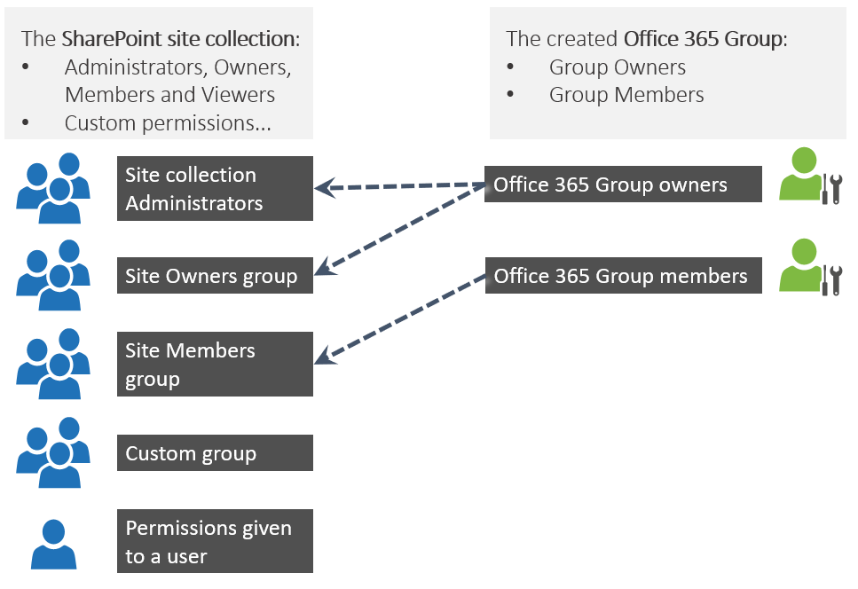

# Site permissions after Office 365 group connection

As part of the connection to an Office 365 Group the site's permissions will also be connected to the Office 365 group's permissions. This process **will not take away any granted permission on the SharePoint site**, but will allow the Office 365 group owners and members to have access to the connected SharePoint site.

- The Office 365 Group Owners get connected to both the site collection administrators as the site owners group: everyone who’s Office 365 group owner also has site collection admin permissions on the SharePoint site
- The Office 365 Group members get connected to the site members group: everyone who’s Office 365 group member is has the permissions which are granted to the SharePoint site’s Members group
- Any other permissions granted on the SharePoint site stay as is (so for example viewers will still have view access, broken permission inheritance stays working as is,…)
- Permissions “flow” from the Office 365 group to SharePoint: adding a person to the Office 365 Owners group will also make that person an Owner (even Administrator) of the SharePoint site
- There a no permissions “flowing back” to the Office 365 Group: if you add a person to the SharePoint Owners group then that person is not an Owner of the group

## Technical implementation

Each Office 365 Group has an unique id represented as a guid (e.g e79452da-a8cf-47c5-afbf-83c8704867c2). This guid is used to construct 2 claims:

- e79452da-a8cf-47c5-afbf-83c8704867c2_o: this claim represents the Office 365 Group owners
- e79452da-a8cf-47c5-afbf-83c8704867c2: this claim represents the Office 365 Group members

These claims are added to the SharePoint site according to below logic:

- The e79452da-a8cf-47c5-afbf-83c8704867c2 claim (so the Office 365 Group members) is added as a **visible** principal to the site's members group having as title your site's name
- The e79452da-a8cf-47c5-afbf-83c8704867c2_o claim (so the Office 365 Group owners) is added as **hidden** principal to the site's owners group and site collection administrators

## See also

- [Modernize your classic SharePoint sites](modernize-classic-sites.md)
- [Connect to an Office 365 group](modernize-connect-to-office365-group.md)
- [Connect a classic experience SharePoint team site to a new Office 365 Group](https://support.office.com/en-us/article/connect-a-classic-experience-sharepoint-team-site-to-a-new-office-365-group-469c6ee0-2139-4496-9914-7e39d07ac49d?ui=en-US&rs=en-US&ad=US)
