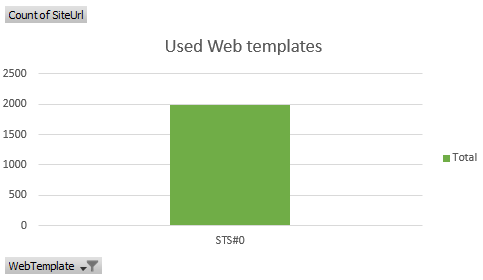
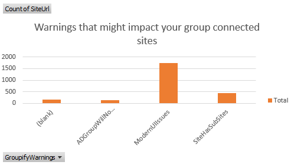
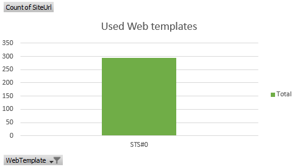

# Understand and process the scanner results

To help you understand which sites are ready to be group-connected, you can use the [SharePoint Modernization Scanner](https://github.com/SharePoint/PnP-Tools/tree/master/Solutions/SharePoint.Modernization) to analyze your environment. Use this article to understand how you can use the scanner output to prepare your sites for being connected to an Office 365 group. The scanner as of version 1.5 will generate an Excel report plus several CSV files. It's recommended to use the Excel based dashboard to review the scanner data and when needed use the CSV data for more in depth data.

## Using the "Office 365 Group Connection Readiness" report

The "Office 365 Group Connection Readiness" report is an Excel based dashboard that allows you to make informed decisions on which sites are ready for Office 365 group connection. For the sites that are not ready the dashboard will help you understand why a site is not ready. The dashboard has a number of slicers on top that you can use to filter the data:

The filtered data is then presented in a number of charts:

## Understand which sites are ready for Office 365 Group connection

Apply the following filter and confirm the "Sites ready for Office 365 Group connection" shows only TRUE:

Filter | Validation
---------|----------
 | 

To obtain the actual list of sites (e.g. for input towards the "bulk Office 365 Group connection" scripts) you can follow these steps:

- Right click the **Dashboard** tab in Excel, click **Unhide** and select the **ReadyForGroupify** sheet
- Set the table filter of column B (ReadyForGroupify) to TRUE and you've the list of sites

At this point you have a list of all sites which can be connected to an Office 365 Group, but you still might want to filter out some sites based upon the site template and possible warnings found. Let's start with the site template: the key site to connect to an Office 365 group is the "classic" team site, so let's filter on those first:

Filter | Validation
---------|----------
 | 

With that filter applied let's have a look at the typical warnings:

### Office 365 Group Connection Warnings

- **SiteHasSubSites**: A group is connected to the root site of the site collection and not to individual sub sites. Having sub sites is fully supported but you can't use group connected services on your sub sites
- **ModernUIIssues**: Since connecting to a group brings a modern home page this might result in existing customizations being "ignored" on that modern home page. You can optionally stick with your "current" home page if you run Office 365 Group connection using the API's or using the "bulk Office 365 Group connection" scripts.
- **DefaultHomePageImpacted**: The default home page based upon this site's web template differs a lot from the new home page you get by connecting to a group. You can optionally stick with your "current" home page if you run Office 365 Group connection using the API's or using the "bulk Office 365 Group connection" scripts.
- **ADGroupWillNotBeExpanded**: The site uses AD groups to grant access and the permissions granted via AD groups are not taken over by the Office 365 group. You can optionally "expand" the AD group and add the individual members to the respective Office 365 Group Owners and Members.

### Modern UI Warnings

- **MasterPageUsed** or **AlternateCSSUsed**: These settings are ignored on any modern page. If your site is not using any classic pages anymore it's recommended to move away from custom master pages and alternate CSS. Checkout the [Modernize branding](modernize-branding.md) article to learn more.
- **UserCustomActionUsed**: If you need to functionality offered by these user custom actions then you need to redesign those using SharePoint Framework extensions and deploy them. See the ModernizationUserCustomActionScanResults.csv for more details and checkout the [Modernize customizations](modernize-customizations.md) article for more details.
- **PublishingFeatureEnabled**: Publishing features are not supported in combination with modern pages.
- **ModernPageFeatureDisabled**: Modern pages have been disabled at web level and since by default your site will get a modern home page after being connected to an Office 365 Group it's highly recommended to enable the modern page feature.
- **ModernListsBlockedAtSiteLevel** or **ModernListsBlockedAtWebLevel**: Modern list and library user interface was disabled at site or web level. Given your site by default will get a modern home page it's recommended to not block the modern user interface for lists and libraries.

### Permission Warnings

- **SharingDisabledForSiteButGroupWillAllowExternalSharing**: The default configuration for Office 365 group-connected sites is to allow sharing with externals, but you might have disabled sharing with externals for your site. It's recommended to sync the SharePoint site external sharing settings with the settings of the connected Office 365 group.
- **SubSiteWithBrokenPermissionInheritance**: If you have subsites with unique permissions, these do not inherit the permissions defined on the connected Office 365 group. Since Office 365 services that come via the group do not apply to sub sites this typically is not an issue.
- **PrivateGroupButEveryoneUsedOutsideOfAdminOwnerMemberGroups**: The scanner proposes to create the group either as private or public, and it does this based on the existence of the everyone claims inside the SharePoint site's administrators, owners, or members groups. However, you may have used the everyone claims outside of these groups, which is indicated by this warning.

## Understand which sites are not ready for Office 365 Group connection

Apply the following filter and confirm the "Sites ready for Office 365 Group connection" shows only FALSE:

Filter | Validation
---------|----------
 | 

At this point you have a list of all sites which are not ready to be connected to an Office 365 Group, so let's analyze why they're not. The key site to connect to an Office 365 group is the "classic" team site, so let's filter on those first:

Filter | Validation
---------|----------
 | 

With that filter applied let's have a look at why a site is not ready.

### Office 365 Group Connection blockers

- **PublishingFeatureEnabled**: Sites that have publishing enabled do not support modern pages and by default connecting to a group will result in switching the site home page to a modern page.
- **SiteHasOffice365Group**: This site already has an Office 365 group connected and a site can only by connected to one Office 365 group.
- **IncompatibleWebTemplate**: The used web template is not supported to be connected.
