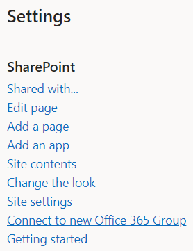
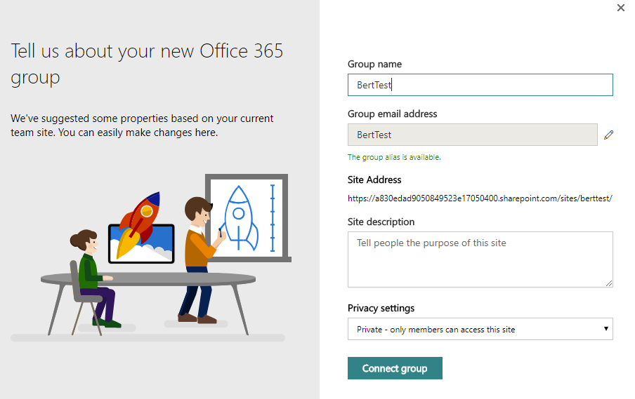

# Connect to an Office 365 Group

Being able to connect an Office 365 Group to an existing SharePoint site is important if you want to modernize that site. After your site is connected to an Office 365 Group, it can benefit from all other group-connected services such as Microsoft Teams and Planner. This connection also brings your classic site a step closer to being like the current modern team site, which by default is connected to an Office 365 Group. 

The process to connect an existing site to a new Office 365 Group is called **groupifying**. You can **groupify** your site from the user interface site-by-site, which might be good for smaller environments. However, larger customers often want to offer a consistent experience to their users, and therefore want to perform a bulk **groupify** of their sites. 

In this article, you'll learn how to prepare for such a bulk **groupify** and how to actually make it happen.

> [!IMPORTANT]
> The option to connect an Office 365 Group to an existing site is not yet available and will be released sometime in 2018.

## What groupify does to your site

When you **groupify** your site, a number of things happen:

- A new Office 365 Group is created, and that group is connected to your site collection
- A new modern home page is created on your site and set as the site's home page
- The group's Owners are now the site collection administrators
- The group's Owners are added to your site's Owners group
- The group's Members are added to your site's Members group

After your site is connected to an Office 365 Group, it behaves like a modern group-connected team site, so granting people permission to the connected Office 365 Group now also grants them access to the SharePoint site, a Microsoft Team can be created on top of the site, Planner can be integrated, and so on.

## Connect an Office 365 Group using the SharePoint user interface

One approach to connect an Office 365 Group to your site is to use the option available in the user interface. By selecting the **gear** icon in the navigation bar, you can select the **Connect to new Office 365 Group** option, which launches a wizard that walks you through the **groupify** process as shown in the following screenshots.

**Site actions menu (gear icon)** 



<br/>

**Wizard**



## Programmatically connect an Office 365 Group

To programmatically connect an Office 365 Group, we recommend that you follow a three-step process:

- Learn
- Analyze
- Modernize

### Step 1: Learn what groupify does to your site

Getting familiar with what **groupify** does to your site is important, and therefore we recommend that you do a manual **groupify** for some test sites by using the user interface option. An important aspect to evaluate is whether you want to keep the newly created modern home page. As part of the modernization script, you'll be able to create a tailored home page, but if the default one serves your needs, that's the preferred option.

### Step 2: Analyze your site environment

The user interface option shown in the previous section is not suitable if you want to **groupify** hundreds of site collections. At that point, using an API to programmatically do this makes a lot of sense. But before doing that, it's best to verify which sites are ready to be **groupified**, because not all sites are suitable for this. 

To help you understand which sites are ready to be **groupified**, you can use the [SharePoint Modernization Scanner](https://github.com/SharePoint/PnP-Tools/tree/master/Solutions/SharePoint.Modernization) to analyze your environment. This link contains all the details needed to use the scanner and information about what gets output by the scanner. 

Following are the key items to verify before you **groupify** a site:

#### Check for groupify blockers

Certain configurations on a site can prevent it from successfully being **groupified**:

- `IncompatibleWebTemplate` - Site is based on a web template that's not supported by **groupify**.
- `PublishingFeatureEnabled` - Site has publishing features enabled.
- `SiteHasOffice365Group` - Site was already connected to an Office 365 Group.

In the scanner, sites with **groupify** blockers have the column `ReadyForGroupify` set to `False`.

#### Check for groupify warnings

Sites can have other configurations that are not optimal when that site gets **groupified**. In the scanner, these are flagged as warnings because they're not necessarily causing issues after **groupifying**, but you should be aware of them, and if needed take corrective steps before or after **groupifying** the site. 

In the scanner, you can see the warnings in the column `GroupifyWarnings`, but depending on the warning, more details can be found in the columns `PermissionWarnings` and `ModernUIWarnings`. Before spending time on a site, it's wise to evaluate whether the site is still business-relevant; to help you with that decision, the report contains columns showing the recent and lifetime views and unique users for a site collection.

Following are the possible **groupify** warnings:

- `ModernUIIssues` - The default **groupify** process gives your site a new modern home page. However, if your site is blocking modern UI or has customizations that are not compatible, you might want to first ensure that the site is ready for modern UI before **groupifying** it. The details of which modern UI issues were found by the scanner can be found in the column `ModernUIWarnings`
- `ADGroupWillNotBeExpanded` - When you **groupify** via the user interface, you have an option to define the Office 365 Group's owners and members; when you bulk **groupify**, the sample script explained later does the same. However, because an Office 365 Group can only contain persons as Owners or Members, this means that if today you granted access to your SharePoint site by using an Azure Active Directory (Azure AD) security group, you can't add that Azure AD security group as an Office 365 Group owner or member. If you want to only rely on the permissions defined on the Office 365 Group, you must add all individual Azure AD group members as part of the **groupify** process, but having identical access defined on both the SharePoint site and the Office 365 Group is not needed, making this not a blocking issue.
- `SiteHasSubSites` - In the modern team and communication sites, the use of subsites is de-emphasized; you can **groupify** a site collection with subsites, although the scanner raises this as a warning for awareness.
- `DefaultHomePageImpacted` - Because **groupify** by default creates and sets a new home page for the site, this might impact your site's functionality if the site was based on a web template different from the classic team site template. You might have a tailored home page and want to create a new tailored, modern home page (see later in this article), which makes this a non-issue, but it's important to verify this.

If you see a `ModernUIIssues` warning, you can get a better understanding of the issues via the `ModernUIWarnings` column:

- `ModernPageFeatureDisabled` - Because the site gets a modern home page after **groupifying**, it's important that the modern homepage feature is enabled.
- `ModernListsBlockedAtSiteLevel` and `ModernListsBlockedAtWebLevel` - Preventing the modern user interface for lists and libraries is not blocking **groupify**, but because **groupify** is typically part of a site modernization, it makes no sense to prevent lists and libraries to use the modern user interface on an Office 365 Group-connected site.
- `MasterPageUsed` and `AlternateCSSUsed` - Custom master pages or alternate CSS is not used on modern pages. If your site depends on these, you might want to verify that, because your custom master pages and CSS will not work on the modern home page that the site gets.
- `UserCustomActionUsed` - Using user custom actions that embed JavaScript is common for customizing sites, but this does not work for modern pages. If you have user custom actions, you can build alternatives by using SharePoint Framework Extensions and install those to your site (see later in this article).
- `PublishingFeatureEnabled` - The publishing features are not compatible with the modern page feature, which is a requirement due to the modern home page being set.

The last warnings column is `PermissionWarnings`:

- `SharingDisabledForSiteButGroupWillAllowExternalSharing` - The default configuration for Office 365 Group-connected sites is to allow sharing with externals, but you might have disabled sharing with externals for your site.
- `SubSiteWithBrokenPermissionInheritance`: Previously we mentioned subsites are not optimal, but not a blocker. If you have subsites with unique permissions, these do not _inherit_ the permissions defined on the connected Office 365 Group.
- `PrivateGroupButEveryoneUsedOutsideOfAdminOwnerMemberGroups` - The scanner proposes to create the group either as private or public, and it does this based on the existence of the **everyone** claims inside the SharePoint site's administrators, owners, or members groups. However, you may have used the **everyone** claims outside of these groups, which is indicated by this warning.

### Step 3: Modernize your sites

The bulk **groupify** process consists of two steps:

- Prepare and validate an input file that you'll use to drive the bulk **groupify** process.
- Run the bulk **groupify** process.

#### Create an input file for bulk groupify and validate it

After running the scanner and processing the results, you have identified which sites are ready to **groupify**.The next step is to prepare a CSV file to drive the bulk **groupify** process. The CSV file format is simple:

- **URL** column contains the URL to the site collection to **groupify**.
- **Alias** contains the Office 365 Group alias that you want to use. Note that this alias cannot contain spaces, and it should not have been used before.
- **IsPublic** indicates whether you want the site to be a public or private site.
- **Classification** contains the site classification that you want to set to the site after you **groupify**. This is needed because after being connected to a group, this classification is maintained at the Office 365 Group level.

Following is a short sample:

```Text
Url,Alias,IsPublic,Classification
https://contoso.sharepoint.com/sites/hrteam,hrteam,false,Medium Impact
https://contoso.sharepoint.com/sites/engineering,engineeringteam,true,Low Impact
```

To help you verify this file before using it, you can use the PowerShell script at the end of this section. This script checks for valid site URLs and aliases. Update this script with your tenant admin center URL and run it. The script asks for the CSV file name and generates a report for you. 

During the validation script execution, the following errors can appear:

- **[ERROR] AzureAD Naming policy : _PrefixSuffix_ does contain AD attributes that are resolved based on the user running the groupify**

    In Azure AD, you can define a [naming policy for Office 365 Groups](https://support.office.com/en-us/article/office-365-groups-naming-policy-6ceca4d3-cad1-4532-9f0f-d469dfbbb552?ui=en-US&rs=en-001&ad=US). If this policy contains user Active Directory attributes, this might be an issue because bulk **groupify** handles all sites using the _current_ user.

- **[ERROR] AzureAD Creation policy : _adminUPN_ is not part of group _CanCreateGroupsId_ which controls Office 365 Group creation** 

    If [Azure AD Group creation is restricted to certain accounts](https://support.office.com/en-us/article/manage-who-can-create-office-365-groups-4c46c8cb-17d0-44b5-9776-005fced8e618?ui=en-US&rs=en-001&ad=US) and the _current_ account is not among those, the Office 365 Group creation fails.

- **[ERROR] _siteUrl_ : Alias [_siteAlias_] contains a space, which not allowed**

    The alias of an Office 365 Group cannot contain a space.

- **[ERROR] _siteUrl_ : Classification [_siteClassification_] does not comply with available AzureAD classifications [_ClassificationListString_]**

    The provided site classification is not defined as [one of the allowed site classifications for Office 365 Groups](https://support.office.com/en-us/article/Manage-Office-365-Groups-with-PowerShell-aeb669aa-1770-4537-9de2-a82ac11b0540).

- **[ERROR] _siteUrl_ : Alias [_siteAlias_] is in the AzureAD blocked word list [_CustomBlockedWordsListString_]**

    If a [blocked words list is set up in Azure AD](https://support.office.com/en-us/article/office-365-groups-naming-policy-6ceca4d3-cad1-4532-9f0f-d469dfbbb552?ui=en-US&rs=en-001&ad=US) and the provided Office 365 Group name uses such a word, this error is generated.

- **[ERROR] _siteUrl_ : Site is already connected a group**

    A site can only be connected to a single Office 365 Group, so after a site is connected, it cannot be **groupified** anymore.

- **[ERROR] _siteUrl_ : Alias [_siteAlias_] is already in use**

    Each Office 365 Group needs a unique alias; an error is generated when the proposed alias was already used by another Office 365 Group.

- **[ERROR] _siteUrl_ : Alias [_siteAlias_] was already marked as approved alias for another site in this file**

    The proposed site alias was already defined for another site in earlier input lines of the bulk **groupify** CSV file.

- **[ERROR] _siteUrl_ : Site does not exist or is not available (status = _site.Status_)**

    The provided site URL does not represent a reachable site collection.

> [!NOTE]
> Please update the `$tenantAdminUrl` variable in the following script to contain your tenant admin center URL (for example, `https://contoso-admin.sharepoint.com`). 

During script execution, a log file is generated, combined with an error file that contains a subset of the log file (only the errors).

[!code-powershell[validategroupifyinput](../../PnP-Tools/Solutions/SharePoint.Modernization/Scripts/Groupify/ValidateInput.ps1 "Validate groupify input file")]

#### Run the bulk groupify process

Now that we have an input file that's defining the sites that need to be **groupified**, we can finally make it happen. The following PowerShell script is a sample script that you can tweak to your needs because you might want more or fewer things as part of **groupify**. 

The shared sample version of the script implements the following steps:

- Adds current tenant admin as site admin when needed: **groupify** requires a user account (so no app-only).
- Verifies site template / publishing feature use and prevent **groupify**; aligns with the logic in the scanner.
- Ensures that no modern blocking features are enabled, and if so, fixes them.
- Ensures that the modern page feature is enabled.
- **Optional**: Deploys applications (for example, application customizer).
- **Optional**: Adds your own modern home page.
- Calls the **groupify** API.
- Defines site admins and site owners as group owners.
- Defines site members as group members.
- Removes added tenant admin and site owners from SharePoint admins.
- Removes added tenant admin from the Office 365 Group.

Running the following PowerShell script requires that you update the tenant admin center URL and at run time provide credentials and the CSV input file.

> [!NOTE]
> This is a sample script that you need to address to your needs by updating/dropping the **optional** parts or by adding additional modernization tasks (such as setting a SharePoint site theme). Please update the `$tenantAdminUrl` variable in the script to contain your tenant admin center URL (for example, `https://contoso-admin.sharepoint.com`). 

During script execution, a log file is generated, combined with an error file that contains a subset of the log file (only the errors).

[!code-powershell[bulkgroupify](../../PnP-Tools/Solutions/SharePoint.Modernization/Scripts/Groupify/GroupifySite.ps1 "Bulk groupify sites")]

## See also

- [Modernize your classic SharePoint sites](modernize-classic-sites.md)