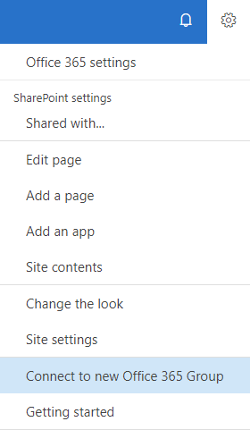

# Connect to an Office 365 group

Being able to connect an Office 365 group to an existing SharePoint site is important if you want to modernize that site. After your site is connected to an Office 365 group, it can benefit from all other group-connected services such as Microsoft Teams and Planner. This connection also brings your classic site a step closer to being like the current modern team site, which by default is connected to an Office 365 group.

You can connect your site to a new Office 365 group from the user interface site-by-site, which might be good for smaller environments. However, larger customers often want to offer a consistent experience to their users, and therefore want to perform a bulk operation of their sites.

In this article, you'll learn how to prepare for such a bulk operation for associating sites to new Office 365 groups and how to actually make it happen.

> [!IMPORTANT]
> For publishing portals (sites based upon BLANKINTERNET#0, ENTERWIKI#0, SRCHCEN#0, SRCHCENTERLITE#0, BICENTERSITE#0, POINTPUBLISHINGHUB#0, POINTPUBLISHINGTOPIC#0 or sites using the “Pages” library) it's not currently supported to connect these to an Office 365 group or to use modern pages. If you want to modernize your publishing portal it's recommended to start from a new communication site and configure that one accordingly.

## What connecting to a new Office 365 group does to your site

When you connect your site to a new Office 365 group, a number of things happen:

- A new Office 365 group is created, and that group is connected to your site collection
- A new modern home page is created on your site and set as the site's home page
- The group's Owners are now the site collection administrators
- The group's Owners are added to your site's Owners group
- The group's Members are added to your site's Members group

After your site is connected to an Office 365 group, it behaves like a modern group-connected team site, so granting people permission to the connected Office 365 group now also grants them access to the SharePoint site, a Microsoft Team can be created on top of the site, Planner can be integrated, and so on.

## Connect an Office 365 group using the SharePoint user interface

One approach to connect an Office 365 group to your site is to use the option available in the user interface. By selecting the **gear** icon in the navigation bar, you can select the **Connect to new Office 365 Group** option, which launches a wizard that walks you through the group-connection process as shown in the following screenshots.

**Site actions menu (gear icon)** 



<br/>

**Wizard**


## Programmatically connect an Office 365 group

To programmatically connect an Office 365 group, we recommend that you follow a three-step process:

- Learn
- Analyze
- Modernize

### Step 1: Learn what group-connection does to your site

Getting familiar with what group-connection does to your site is important, and therefore we recommend that you do a manual group-connection for some test sites by using the user interface option. An important aspect to evaluate is whether you want to keep the newly created modern home page. As part of the modernization script, you'll be able to create a tailored home page, but if the default one serves your needs, that's the preferred option.

### Step 2: Analyze your sites

The user interface option shown in the previous section is not suitable if you want to group-connect hundreds of site collections. At that point, using an API to programmatically do this makes a lot of sense. But before doing that, it's best to verify which sites are ready to be group-connected because not all sites are suitable for this.

To help you understand which sites are ready to be group-connected, you can use the [SharePoint Modernization Scanner](https://aka.ms/sppnp-modernizationscanner) to analyze your environment. This link contains all the details needed to run the scanner. After you've run the scanner go the [Understand and process the scanner results](modernize-connect-to-office365-group-scanner.md) article to analyze the scan results.

### Step 3: Modernize your sites

The bulk group-connect process consists of two steps:

- Prepare and validate an input file that you'll use to drive the bulk group-connect process.
- Run the bulk group-connect process.

#### Create an input file for bulk group-connection and validate it

After running the scanner and processing the results, you have identified which sites are ready to group-connect.The next step is to prepare a CSV file to drive the bulk group-connection process. The CSV file format is simple:

- **URL** column contains the URL to the site collection to group-connect.
- **Alias** contains the Office 365 group alias that you want to use. Note that this alias cannot contain spaces, and it should not have been used before.
- **IsPublic** indicates whether you want the site to be a public or private site.
- **Classification** contains the site classification that you want to set to the site after you group-connect. This is needed because after being connected to a group, this classification is maintained at the Office 365 group level.

Following is a short sample:

```Text
Url,Alias,IsPublic,Classification
https://contoso.sharepoint.com/sites/hrteam,hrteam,false,Medium Impact
https://contoso.sharepoint.com/sites/engineering,engineeringteam,true,Low Impact
```

To help you verify this file before using it, you can use the PowerShell script at the end of this section. This script checks for valid site URLs and aliases. Update this script with your tenant admin center URL and run it. The script asks for the CSV file name and generates a report for you.

During the validation script execution, the following errors can appear:

Error | Description
---------|----------
**AzureAD Naming policy : _PrefixSuffix_ does contain AD attributes that are resolved based on the user running the group-connection** | In Azure AD, you can define a [naming policy for Office 365 groups](https://support.office.com/en-us/article/office-365-groups-naming-policy-6ceca4d3-cad1-4532-9f0f-d469dfbbb552?ui=en-US&rs=en-001&ad=US). If this policy contains user Active Directory attributes, this might be an issue because bulk group-connect handles all sites using the _current_ user.
**AzureAD Creation policy : _adminUPN_ is not part of group _CanCreateGroupsId_ that controls Office 365 group creation** | If [Azure AD group creation is restricted to certain accounts](https://support.office.com/en-us/article/manage-who-can-create-office-365-groups-4c46c8cb-17d0-44b5-9776-005fced8e618?ui=en-US&rs=en-001&ad=US) and the _current_ account is not among those, the Office 365 group creation fails.
**_siteUrl_ : Alias [_siteAlias_] contains a space, which is not allowed** | The alias of an Office 365 group cannot contain a space.
**_siteUrl_ : Classification [_siteClassification_] does not comply with available Azure AD classifications [_ClassificationListString_]** | The provided site classification is not defined as [one of the allowed site classifications for Office 365 groups](https://support.office.com/en-us/article/Manage-Office-365-Groups-with-PowerShell-aeb669aa-1770-4537-9de2-a82ac11b0540).
**_siteUrl_ : Alias [_siteAlias_] is in the Azure AD blocked word list [_CustomBlockedWordsListString_]** | If a [blocked words list is set up in Azure AD](https://support.office.com/en-us/article/office-365-groups-naming-policy-6ceca4d3-cad1-4532-9f0f-d469dfbbb552?ui=en-US&rs=en-001&ad=US) and the provided Office 365 group name uses such a word, this error is generated.
**_siteUrl_ : Site is already connected to a group** | A site can only be connected to a single Office 365 group, so after a site is connected, it cannot be group-connected anymore.
**_siteUrl_ : Alias [_siteAlias_] is already in use** | Each Office 365 group needs a unique alias; an error is generated when the proposed alias was already used by another Office 365 group.
**_siteUrl_ : Alias [_siteAlias_] was already marked as approved alias for another site in this file** | The proposed site alias was already defined for another site in earlier input lines of the bulk group-connect CSV file.
**_siteUrl_ : Site does not exist or is not available (status = _site.Status_)** | The provided site URL does not represent a reachable site collection.

> [!NOTE]
> Please update the `$tenantAdminUrl` variable in the following script to contain your tenant admin center URL (for example, `https://contoso-admin.sharepoint.com`).

During script execution, a log file is generated, combined with an error file that contains a subset of the log file (only the errors).

[!code-powershell[validategroupifyinput](../../PnP-Tools/Solutions/SharePoint.Modernization/Scripts/Groupify/ValidateInput.ps1 "Validate group-connect input file")]

#### Run the bulk group-connect process

Now that we have an input file that's defining the sites that need to be group-connected, we can finally make it happen. The following PowerShell script is a sample script that you can tweak to your needs because you might want more or fewer things as part of the group-connection.

The shared sample version of the script implements the following steps:

- Adds current tenant admin as site admin when needed; group-connection requires a user account (so no app-only).
- Verifies site template / publishing feature use and prevents group-connection; aligns with the logic in the scanner.
- Ensures that no modern blocking features are enabled, and if so, fixes them.
- Ensures that the modern page feature is enabled.
- **Optional**: Deploys applications (for example, Application Customizer).
- **Optional**: Adds your own modern home page.
- Calls the group-connect API.
- Defines site admins and site owners as group owners.
- Defines site members as group members.
- Removes added tenant admin and site owners from SharePoint admins.
- Removes added tenant admin from the Office 365 group.

Running the following PowerShell script requires that you update the tenant admin center URL and at run time provide credentials and the CSV input file.

> [!NOTE]
> This is a sample script that you need to address to your needs by updating/dropping the **optional** parts or by adding additional modernization tasks (such as setting a SharePoint site theme). Please update the `$tenantAdminUrl` variable in the script to contain your tenant admin center URL (for example, `https://contoso-admin.sharepoint.com`).

During script execution, a log file is generated, combined with an error file that contains a subset of the log file (only the errors).

[!code-powershell[bulkgroupify](../../PnP-Tools/Solutions/SharePoint.Modernization/Scripts/Groupify/GroupifySite.ps1 "Bulk group-connect sites")]

## See also

- [Modernize your classic SharePoint sites](modernize-classic-sites.md)
- [Understand and process the scanner results](modernize-connect-to-office365-group-scanner.md)
- [Connect a classic experience SharePoint team site to a new Office 365 Group](https://support.office.com/en-us/article/connect-a-classic-experience-sharepoint-team-site-to-a-new-office-365-group-469c6ee0-2139-4496-9914-7e39d07ac49d?ui=en-US&rs=en-US&ad=US)