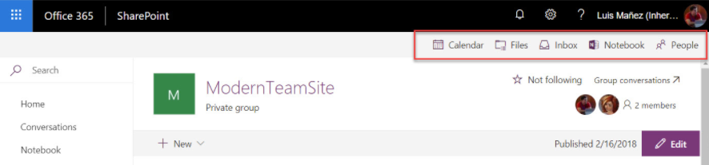

# Modernize customizations

An important aspect when modernizing a site is understanding the customizations used on that site because not all existing customizations continue to work after the site is modernized. A classic example that occurs frequently is a site banner that shows some type of company information (such as a legal notice). 

This typically is realized via a user custom action that embeds JavaScript on the page, which in turn is responsible for showing the banner. This banner is visible on all classic pages, but will not be visible on modern pages. To work around this problem, you can implement the banner as a SharePoint Framework application customizer extension and deploy that to the tenant/site. 

This article gives an overview of the customizations that are not compatible with the modern user interface and guidelines on how to remediate them.

## Customizations used in lists and libraries

This section focuses on customizations that you might have implemented in your lists and libraries. SharePoint automatically falls back to the classic list and library user interface when it detects an incompatible customization. Therefore, it's important to address these customizations if you want to get a 100% modern experience. 

To get an understanding of the modern user interface compatibility of your lists and libraries, use the [SharePoint "Modern" user interface experience scanner](https://github.com/SharePoint/PnP-Tools/tree/master/Solutions/SharePoint.UIExperience.Scanner).

### JSLink

A very common model to control how a field is represented in the SharePoint user interface is by using JSLink. Essentially, JSLink allows you to plug in JavaScript, which then takes over the rendering of the field. In the modern user interface, similar customization capabilities are available for the list view pages, although customizing the list edit pane currently is not possible. 

If you're replacing JSLink, you can consider two alternative approaches; which one works best depends on the complexity of the existing solution: 
- If it's merely about how to display the data, using column formatting is often the best choice.
- If more behavior is needed, using a SharePoint Framework Field Customizer extension is often the best choice.

#### Use column formatting

You can use column formatting to customize how fields in SharePoint lists and libraries are displayed. To do this, you construct a JSON object that describes the elements that are displayed when a field is included in a list view, and the styles to be applied to those elements. The column formatting does not change the data in the list item or file; it only changes how it’s displayed to users who browse the list. Anyone who can create and manage views in a list can use column formatting to configure how view fields are displayed.

For example, a list with the fields **Title**, **Effort**, **Assigned To**, and **Status** with no customizations applied might look like this:

 

 

A list with the appearance of the **Effort**, **Assigned To**, and **Status** fields customized via column formatting might look like this:

 

 

To learn more about column formatting, see:

- [Use column formatting to customize SharePoint](../declarative-customization/column-formatting.md)
- [SharePoint column formatting samples](https://github.com/SharePoint/sp-dev-column-formatting)

#### Use SharePoint Framework Field Customizer extension

SharePoint Framework Extensions enable you to extend the SharePoint user experience within modern pages and document libraries, while using the familiar SharePoint Framework tools and libraries for client-side development. Specifically, Field Customizers allow you to fully control how field data is presented in your list or library views. 

Following is an example of a percent column.

To learn more about SharePoint Framework Field Customizer extensions, see:

- [Build your first Field Customizer extension](../spfx/extensions/get-started/building-simple-field-customizer.md)
- [Migrating JSLink customizations to SharePoint Framework Field Customizers](../spfx/extensions/guidance/migrate-jslink-to-spfx-extensions.md)
- [Migrating from JSLink to SharePoint Framework Extensions tutorial](../spfx/extensions/guidance/migrate-from-jslink-to-spfx-extensions.md)

### List-scoped user custom actions that add custom menu options or embed JavaScript

Using a list-scoped user custom action that adds custom menu options in the list ribbon or context menu or embeds JavaScript is, next to JSLink, a very common customization pattern that does not work anymore for the modern list and library experience. Fortunately, by using SharePoint Framework Extensions, you can realize similar customizations, in particular via command set extensions that allow you to add custom ECB menu items or custom buttons to the command bar of a list or library. You can associate any JavaScript (TypeScript) action to these commands.

 

To learn more about SharePoint Framework ListView Command Set extensions, see:

- [Build your first ListView Command Set extension](../spfx/extensions/get-started/building-simple-cmdset-with-dialog-api.md)
- [Migrating user custom actions and ECB menu items to SharePoint Framework Extensions](../spfx/extensions/guidance/migrate-user-customactions-to-spfx-extensions.md)
- [Migrating from Edit Control Block (ECB) menu item to SharePoint Framework Extensions](../spfx/extensions/guidance/migrate-from-ecb-to-spfx-extensions.md)
- [Migrating from UserCustomAction to SharePoint Framework Extensions tutorial](../spfx/extensions/guidance/migrate-from-usercustomactions-to-spfx-extensions.md)

## Customizations used on pages

SharePoint has multiple flavors of classic site pages such as wiki pages, web part pages, and publishing pages. Each of these pages allow the user to customize them by adding web parts and (formatted) text or by embedding JavaScript via user custom actions. This section gives an overview of the existing customization models and how these can be replaced by modern compatible options.

### The use of out-of-the-box classic web parts

SharePoint has many out-of-the-box web parts (including the script editor web part) that work on classic pages but not on modern pages (that is, there's no out-of-the-box modern equivalent). There's also a nice set of modern, first-party, client-side web parts available that offer similar functionality for some of the classic web parts; however, there's no feature parity. 

If you need the functionality of a classic web part as a modern client-side equivalent, you must either roll your own version based on the SharePoint Framework or alternatively consume a web part from the large list of open source SharePoint Framework web parts, which you can find in the [sp-dev-fx-webparts](https://github.com/SharePoint/sp-dev-fx-webparts) GitHub repository. Following is a diagram showing a sample web part.

To learn more about SharePoint Framework client-side web parts, see:

- [Overview of SharePoint client-side web parts](../spfx/web-parts/overview-client-side-web-parts.md)
- [Migrate existing Script Editor Web Part customizations to the SharePoint Framework](../spfx/web-parts/guidance/migrate-script-editor-web-part-customizations.md)
- [SharePoint Framework client-side web part samples and tutorial materials](https://github.com/SharePoint/sp-dev-fx-webparts)

### Site or web-scoped user custom actions that embed JavaScript

In the introduction, we mentioned the common pattern of adding a site banner by embedding JavaScript via a site/web-scoped user custom action. Because this pattern is not compatible with the modern user interface, you must rework this type of customization based upon the SharePoint Framework Application Customizer extensions. By using application customizers, you can insert custom script that can be used to embed HTML into the SharePoint modern user interface at predefined extension points at the top or bottom of the page.

To learn more about SharePoint Framework Application Customizer extensions, see:

- [Build your first SharePoint Framework Application Customizer Extension](https://docs.microsoft.com/en-us/sharepoint/dev/spfx/extensions/get-started/build-a-hello-world-extension)
- [Migrating user custom actions and ECB menu items to SharePoint Framework Extensions](https://docs.microsoft.com/en-us/sharepoint/dev/spfx/extensions/guidance/migrate-user-customactions-to-spfx-extensions)
- [Migrating from UserCustomAction to SharePoint Framework Extensions tutorial](https://docs.microsoft.com/en-us/sharepoint/dev/spfx/extensions/guidance/migrate-from-usercustomactions-to-spfx-extensions)

### The addition of custom menu items in the site actions

Currently it's not possible to add your own custom menu items to the site actions menu (the **gear icon**) on modern pages. Alternative strategies you can follow are adding the needed links into the site's navigation or by adding the needed links on the site's home page.

## See also

- [Overview of the SharePoint Framework](../spfx/sharepoint-framework-overview.md)
- [Overview of SharePoint Framework Extensions](../spfx/extensions/overview-extensions.md)
- [SharePoint Framework Extensions samples and tutorial materials](https://github.com/SharePoint/sp-dev-fx-extensions)