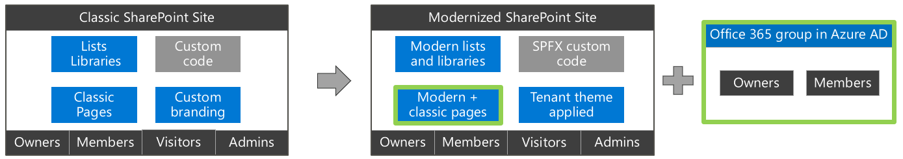

# Strategy

This step provides a detailed explanation of how a classic SharePoint site will be transformed to a modern SharePoint site. Next to that it will touch upon key topics like Microsoft 365 group naming strategy, setting up tenant themes and configuring [Office 365 Learning Pathways](https://aka.ms/learningpathways).

## What's the impact of Modernization on my sites

### Starting point

The classic SharePoint sites you’re transforming today contain:

- **Lists and Libraries:** Each site has multiple lists and libraries. Typically these are presented using a modern UI, although there can be certain lists and libraries that are still showing using the classic UI.
- **Classic pages:** Classic sites mainly have wiki pages but also web part pages are commonly used.
- **Custom branding:** Sites can have a custom theme, even custom master pages and alternate CSS settings.
- **Custom code:** Custom code can be present. Redesigning custom code is out of scope for this program, but [Modernize customizations](modernize-customizations.md) can get you started.
- **Access:** Typically users get access to the site by being member of out of the box groups like Owners, Members,…

### Lists and libraries impact

Lists and libraries are for the most part already showing using the modern UI and when a list can’t be shown using modern SharePoint will automatically switch back the classic list UI. During modernization you’ll remove possible modernization blockers:

- **Script:** A site can be ‘forced’ to be a classic site at either site collection or web scope, the modernization script will fix this by turning off the site/web scoped blocks.
- **Script:** A list/library can be ‘forced’ to be shown in classic UI, the modernization script will fix this by setting the library back to the default ‘automatic’ state.
- **Optional:** there can be more fine-grained reasons: see [Maximize use of modern lists and libraries](modernize-userinterface-lists-and-libraries.md) for more details if required.

### Pages impact

The wiki and web part pages in a SharePoint site will not automatically display as modern pages. In contrast with lists and libraries SharePoint can’t simply show a classic page as modern because the page models are too different. This will result in a continues switching between classic and modern UI when users navigate in the site.

- **Script:** The modernization script will use the open source page transformation framework to create modern versions of the existing classic pages. During this process, the newly created modern pages will take the name of the classic pages while the classic pages are renamed to previous_. No classic pages will be deleted, and you can make the classic page the default again via renaming it. Learn more about page transformation via https://aka.ms/sppnp-pagetransformation.

### Branding impact

The classic SharePoint site can use a custom theme to show the company brand and it might also be using a custom master page or alternate CSS to further customize the branding of the site. Classic themes are hard to manage and using a modern tenant-controlled theme is much better. Modern UI does not use custom master page definitions or alternate CSS anymore, modern pages are responsive by design and work great on any device.

- **Script:** The modernization script will allow you to set a pre-defined modern tenant theme + it will switch back to the default master page and alternate CSS settings. You can learn more via [Modernize site branding](modernize-branding.md).

### Microsoft 365 group connect impact

A site collection needs to be connected with a Microsoft 365 group before this site collection can use or be used by other group connected services like Microsoft Teams, Yammer, Planner, … A common question is about sub sites: there’s only one Microsoft 365 group per site collection, see [How are subsites impacted after Microsoft 365 group connection](modernize-connect-to-office365-group-subsites.md) for the sub site impact.

- **Script:** The script will perform the Microsoft 365 group connection. This will trigger the creation of a new Microsoft 365 group which will be connected to SharePoint site. Existing Microsoft 365 groups cannot be connected to a SharePoint site because each Microsoft 365 group already has a SharePoint site connected.
- **Script:** The group connection process will create a new standard modern home page. Optionally the script can be configured to keep using the modernized classic home page.

### Microsoft 365 group connect security impact

After Microsoft 365 group connection the default setup will be that Microsoft 365 group owners will be part of the site’s Owners SharePoint group and the site collection administrators group. Group owners as such will be able to see all site collection content. The Microsoft 365 group members will be part of the site’s Members SharePoint group. By default the Microsoft 365 group owners will contain the account running the Microsoft 365 group connect. See [Site permissions after Microsoft 365 group connection](modernize-connect-to-office365-group-permissions.md) to learn more.

- **Script:** The script will, besides running the Microsoft 365 group connect, also copy over the user accounts from the current SharePoint site administrators and owners to the Microsoft 365 group owners and the current SharePoint site members to the Microsoft 365 group members.

### Teams team provisioning impact

A key reason to group connected a site is using that existing site linked to Microsoft Teams. A Microsoft Teams team is a collaboration hub that unites team related work. After you’ve connected a Microsoft Teams team (“teamify”) you have a Teams team that has a “General” channel which uses the SharePoint site’s default document library to store documents.

- **Script:** You can manually do the “teamify” step from the SharePoint UI, but this can also be handled by the modernization script.
- **Optional:** Optionally you can apply a PnP Tenant template that allows you to further pre-populate the Teams team by adding additional channels, by adding messages in the chat, by adding SharePoint modern pages as tabs or by adding additional SharePoint lists and libraries as tab.

## Microsoft 365 group naming strategy

The Microsoft 365 group names you’ll be using during the Microsoft 365 group Connect step will have to be unique across your Azure AD environment. Therefore it’s important that you think about a group naming convention.

- **Task:** Define a group naming convention that you can apply to the sites that will be modernized.
- **Task:** Consider configuring Microsoft 365 group naming policies in Azure AD to help enforce group naming. See [Enforce a naming policy on Microsoft 365 groups in Azure Active Directory](/azure/active-directory/users-groups-roles/groups-naming-policy) and [Microsoft 365 groups naming policy](/office365/admin/create-groups/groups-naming-policy) to learn more.

### Frequently Asked Questions

#### How can verify that the groups I propose are valid?

Check the execution step of this guide, group name (=alias) verification is part of the modernization scripts.

## Office 365 Tenant themes

During the Modernization you’ll be (optionally) setting the site’s theme to a tenant theme. For this to work you’ll need to first ensure the needed tenant themes are available.

- **Task:** Create the needed tenant themes. Use the online theme generator (https://aka.ms/themedesigner) to create the themes, use the **Export theme** option and copy the PowerShell formatting.
- **Task:** Add the new theme to the tenant via:
  - Assigning the copied PowerShell to a variable: `$ContosoTheme = @{“themePrimary”=…`
  - Adding the theme: `Add-PnPTenantTheme -Palette $ContosoTheme -Identity “Contoso Corporate theme" -IsInverted:$false`
  - See [add-pnptenanttheme](https://pnp.github.io/powershell/cmdlets/Add-PnPTenantTheme.html) for more details

### Frequently Asked Questions

#### How can I get a list of available tenant themes using PnP PowerShell?

You can use the Get-PnPTenantTheme cmdlet to get a list of available tenant themes.

## Training your end users for Microsoft Teams

Microsoft 365 learning pathways (https://aka.ms/learningpathways) is a customizable, on-demand training solution designed to increase usage and adoption for all of Microsoft 365 in your organization.

- **Task:** Deploy this solution inside your organization and configure it to your needs. See [Microsoft announces general availability for Microsoft 365 learning pathways](https://techcommunity.microsoft.com/t5/Driving-Adoption-Blog/Microsoft-announces-general-availability-for-Microsoft-365/ba-p/978440) for more details.
