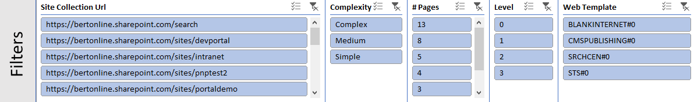
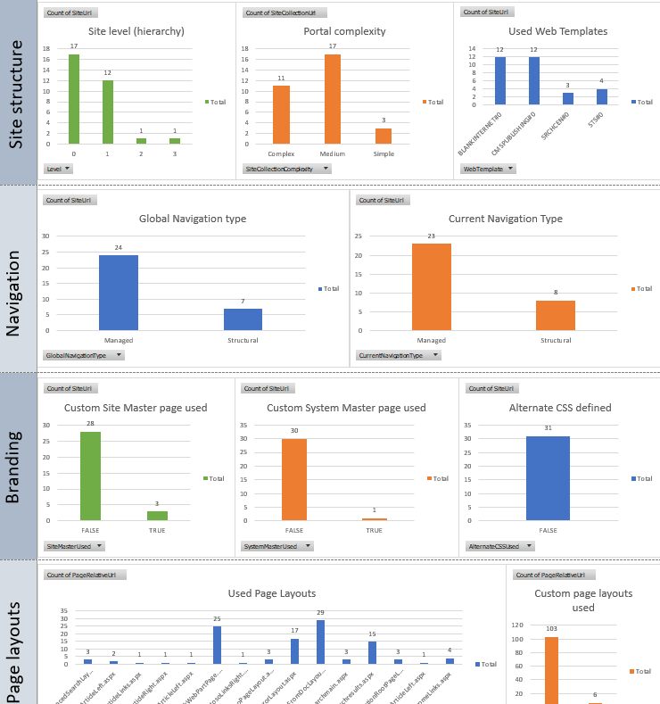
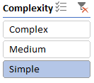
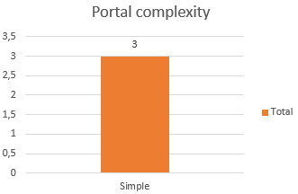

# Analyze and use the scanner data

To help you with the modernization of your classic publishing portals, you can use the [SharePoint Modernization Scanner](https://aka.ms/sppnp-modernizationscanner) to analyze your environment. Use this article to understand how you can use the scanner output to help with the modernization of your publishing portals. The scanner, as of version 1.6, will generate an Excel report plus several CSV files containing classic publishing portal information. It's recommended to use the Excel based dashboard to review the scanner data and when needed use the CSV data for more in depth data.

## Using the "Office 365 Publishing Portal Transformation Readiness" report

The "Office 365 Publishing Portal Transformation Readiness" report is an Excel based dashboard that provides facts about the in use classic publishing features. Using this "inventory" you can select portals to modernize based upon their feature usage. The dashboard has a number of slicers on top that you can use to filter the data:

The filtered data is then presented in a number of charts:

## Use the report to select portals to modernize

The main field to select portals for modernization is the `Complexity` field. Apply the following filter and confirm the "Portal Complexity" shows only `Simple`:

Filter | Validation
---------|----------
 | 

Use below chapter per complexity category as guideline for transforming your classic publishing portals.

### Modernize portals with a "Simple" complexity

#### Site structure and navigation

Publishing portals in this category do only have one sub site level or no sub sites at all, which allows their structure to be transformed into a model of a "root" communication site collection which will act as a hub combined with a communication site per sub site in the classic publishing portal. These "sub site replacing communication sites" will need to be joined to the hub "root" site collection.

All the portals in this category also use structural navigation, recommended way forward here is to ensure the needed global navigation elements appear in the hub site navigation and the current navigation entries are defined in the respective communication sites (the ones replacing the sub sites).

See [Planning Navigation for the modern SharePoint experience](https://docs.microsoft.com/en-us/sharepoint/plan-navigation-modern-experience) for more information.

#### Page layouts and publishing features

All the portals in the  `Simple` complexity category only use out-of-the-box publishing portals layouts. Due to this out-of-the-box usage the future page transformation for publishing portals will be able to help with the transformation of pages based upon these page layouts.

Portals having more advanced publishing features like scheduled publishing or approval workflows are not listed in this category which means that with the basic configuration you get from a communication site you should be set.

See [Moving from Publishing sites to Communication sites](https://docs.microsoft.com/en-us/sharepoint/publishing-sites-classic-to-modern-experience) for more information.

#### Portal branding

The publishing portal categorization is not taking in account possible branding done via customer master pages and alternate CSS. Branding in a modern portal is fundamentally different which means that it requires work regardless of the portal complexity.

See [Branding your SharePoint Online site](https://docs.microsoft.com/en-us/sharepoint/branding-sharepoint-online-sites-modern-experience) for more information.

#### Multi-lingual features

Portals are only in the `Simple` complexity category if they're not using multi-lingual aspects like variations or having webs in multiple languages inside the same site collection.

### Modernize portals with a "Medium" complexity

#### Site structure and navigation

Publishing portals in this category do only have up to three levels of sub sites. Given that the current hub site model allows for only one level you can't fully rely on the hub site model to replace the current portal structure. If you modernize a portal with more then one level of sub sites it's recommended to either flatten the portal and consolidate the sub sites levels or alternatively you can setup multiple hubs and connect them via the hub navigation. If you do require news rolling up from within all hubs in this model then this approach is not suitable for you, flattening and consolidation is then the recommended way forward.

Portals in this category can have managed navigation defined for either their global or current navigation. Configuring navigation based upon a termset is currently not supported in communication sites, hence you'll need to use the foreseen navigation options (hub navigation, regular communication site navigation) to reimplement your desired navigation.

See [Planning Navigation for the modern SharePoint experience](https://docs.microsoft.com/en-us/sharepoint/plan-navigation-modern-experience) for more information.

#### Page layouts and publishing features

Portals in the `Medium` complexity category can have customized page layouts, which is something that you should take over in your new modern page templates.

These portals can also use more advanced publishing capabilities like an approval workflow or scheduled publishing. For the first you do have the option to configure page approval using Microsoft Flow, for the latter there's currently no out-of-the-box equivalent available.

See [Moving from Publishing sites to Communication sites](https://docs.microsoft.com/en-us/sharepoint/publishing-sites-classic-to-modern-experience) for more information.

#### Portal branding

The publishing portal categorization is not taking in account possible branding done via customer master pages and alternate CSS. Branding in a modern portal is fundamentally different which means that it requires work regardless of the portal complexity.

See [Branding your SharePoint Online site](https://docs.microsoft.com/en-us/sharepoint/branding-sharepoint-online-sites-modern-experience) for more information.

#### Multi-lingual features

Portals are only in the `Medium` complexity category if they're not using multi-lingual aspects like variations or having webs in multiple languages inside the same site collection.

## See also

- [Modernize your classic SharePoint sites](modernize-classic-sites.md)
- [Planning Navigation for the modern SharePoint experience](https://docs.microsoft.com/en-us/sharepoint/plan-navigation-modern-experience)
- [Moving from Publishing sites to Communication sites](https://docs.microsoft.com/en-us/sharepoint/publishing-sites-classic-to-modern-experience)
- [Branding your SharePoint Online site](https://docs.microsoft.com/en-us/sharepoint/branding-sharepoint-online-sites-modern-experience)
