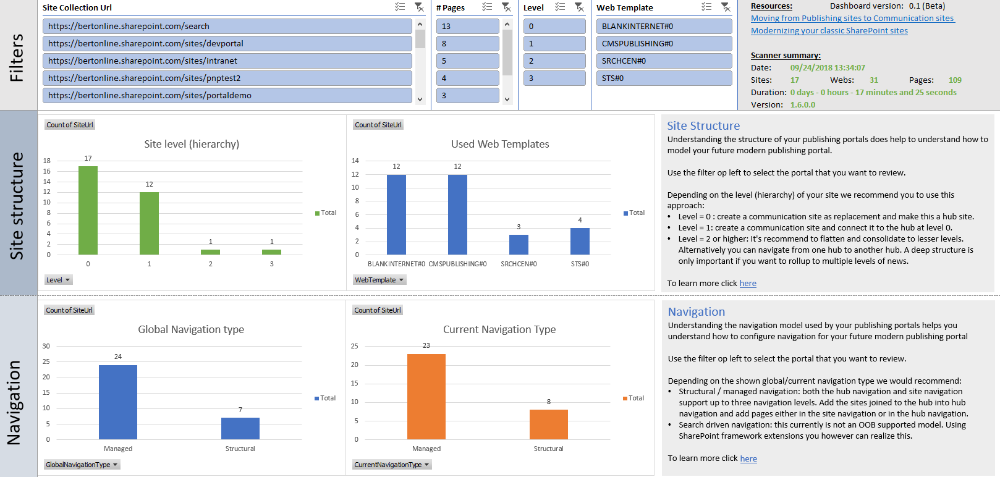

# Modernize classic publishing portals

A classic publishing portal uses publishing functionalities like page layouts, custom branding, page approvals, audience targeting and many more. For most classic publishing portal functionalities there's a modern equivalent enabling you to build a similar modern publishing portal. This modern publishing portal will then take advantage of all the modern capabilities like beautiful pages that work on any device, flexible page approval using Microsoft Flow etc as described in the [Guide to to Modern experience in SharePoint](https://docs.microsoft.com/en-us/sharepoint/guide-to-sharepoint-modern-experience).

## Modernization approach

Modernizing publishing portals is not fully automated although the bulk of the content transformation can be automated using the [PnP Page Transformation technology](https://aka.ms/sppnp-pagetransformation). The main manual effort is rethinking and redesigning the needed information architecture. Below table describes the high level steps needed when modernizing a classic portal.

Activity | Approach
---------|---------
Information architecture | Designing and building the information architecture for your new portal is a manual effort. This includes building a new site structure and defining the future metadata model that will be used. The modern portal will start with new site collections and this new start is an opportunity to start "clean" as well.
Document and list item migration | If your classic portal has document libraries and lists with information that you still want to retain, then these need to be copied over to the new libraries and lists in the newly created site collections. For this you can either use the built-in SharePoint Online copy features or use third party migration tooling.
Branding and Customizations | Classic portals often used a heavily customized user interface and lot's of customizations. For modern portals there's less need for this, but if you need customizations you'll have to recreate the needed customizations using techniques that allow them to work on modern portal pages. See the [Modernize customizations](modernize-customizations.md) article to learn more.
Transformation of the page content | If you've a large volume of pages to migrate it makes sense to automate this using the [PnP Page Transformation technology](https://aka.ms/sppnp-pagetransformation). You will have fine grained control on what page content ends up on the new page, what content becomes metadata and much more via page layout templates.
Home pages | Home pages typically do not lent themselves very well for an automated transformation given the underlaying information architecture differences between the classic and modern portal, hence it's recommended to manually create the new home pages.

### Information architecture

Classic portals typically are using deeply nested site structures as shown below. In each site there's Pages library holding pages that are associated with a given content type (page metadata) and page layout (page wire frame).

In modern intranets we recommend using individual communication sites instead of sub sites (you potentially can consolidate/deprecate certain of the sub sites) and then where need create a flexible hub-spoke model by designating some site collections to be a hub and joining other site collections to that hub. Note that in these individual site collections you can still create content types (based on the modern site page) for you page meta data (e.g. using site designs one can get these content types applied to each site joining the hub). Next to content types you can also have modern page templates as a lightweight alternative for the classic page layouts.

As preparation for designing your new information architecture it's useful to understand which publishing features are used and for that you can use the [SharePoint Modernization scanner](https://aka.ms/sppnp-modernizationscanner). Using this scanner you can scan your complete tenant or a subset of site collections for their readiness in three categories: "Office 365 Group connection", "Page transformation" and "Publishing Portal Modernization". You can have the scanner collect all three categories but you can also scope the scan to only get the "Publishing Portal Modernization" information by using the `-m PublishingOnly` option. The result of the scan will be an Excel based dashboard which will allow you to analyze the publishing feature usage of all your portals.

## See also

- [Guide to to Modern experience in SharePoint](https://docs.microsoft.com/en-us/sharepoint/guide-to-sharepoint-modern-experience)
- [SharePoint Modernization scanner](https://aka.ms/sppnp-modernizationscanner)
