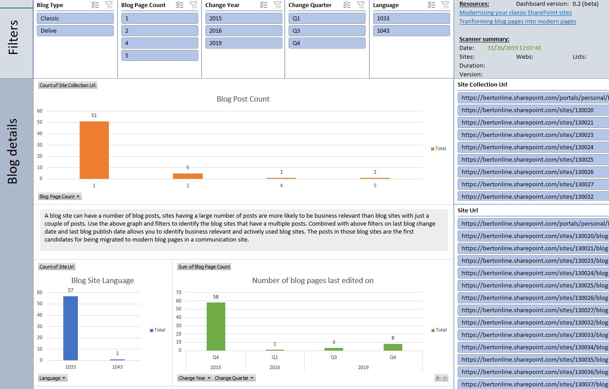

# SharePoint Modernization scanner reports: Blog reports

## Excel dashboard

## Understanding the ModernizationBlogWebScanResults.csv file

This report contains the following columns:

Column | Description
---------|----------
**Site Collection Url** | Url of the scanned site collection.
**SiteUrl** | Url of the scanned web.
**Web Relative Url** | Relative Url of the scanned web.
**Web Template** | Used web template (should all be BLOG#0).
**Language** | Language used to create the blog site.
**Blog Page Count** | Number of blog posts in this site.
**Last blog change date** | Last blog post change date for this site.
**Last blog publish date** | Last blog post publish date for this site.
**Change Year** | Year of the last blog post change.
**Change Quarter** | Quarter of the last blog post change.
**Change Month** | Month of the last blog post change.

### Key takeaways from this report ###

Load the ModernizationBlogWebScanResults.csv into Microsoft Excel and use below filters to analyze the received data

Filter | Takeaway
---------|----------
**No filter** | Lists all the blog sites found in your tenant.
**Blog Page Count > 10 AND Change Year = this year** | A good filter to identify the actively used blog sites in your tenant. These sites are good candidates for modernization.

## Understanding the ModernizationBlogPageScanResults.csv file

This report contains the following columns:

Column | Description
---------|----------
**Site Collection Url** | Url of the scanned site collection.
**SiteUrl** | Url of the scanned web.
**Web Relative Url** | Relative Url of the scanned web.
**Page Title** | Title of this blog post.
**Modified At** | Last modified date of this blog post.
**Modified By** | This blog post was last modified by.
**Published At** | This blog post was published at.

### Key takeaways from this report ###

Load the ModernizationBlogPageScanResults.csv into Microsoft Excel and use below filters to analyze the received data

Filter | Takeaway
---------|----------
**No filter** | Lists all the blog posts found in your tenant.
**Modified At in this year** | Gets you all the blog posts which have been edited in the current year.
