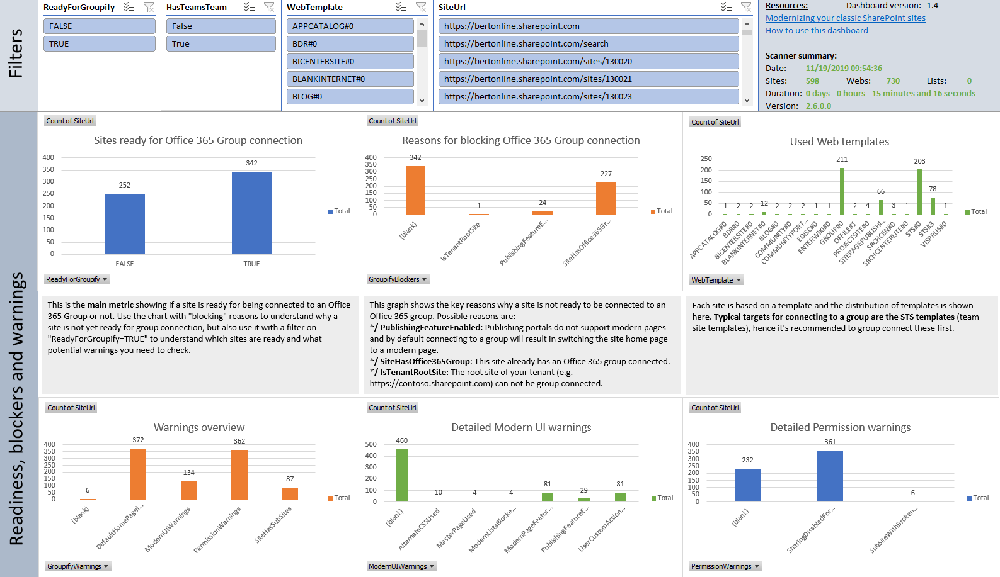

# SharePoint Modernization scanner reports: Office 365 Group Connect reports

The Office 365 Group connect (mode `GroupifyOnly`) is always run as this mode is responsible for creating the main Site and Web reports. 

## Excel dashboard

## Understanding the ModernizationSiteScanResults.csv file ##

This report contains the following columns:

Column | Description
---------|----------
**Site Collection Url** | Url of the scanned site collection.
**Site Url** | Url of the scanned web.
**ReadyForGroupify** | Can this site be "Office 365 group connected"? If value is FALSE then it's strongly discouraged to "Office 365 group connect" this site collection.
**GroupifyBlockers** | Lists the found blocking issues which is either `SiteHasOffice365Group` (site is already "Office 365 group connected"), `PublishingFeatureEnabled` (publishing features are enabled) or `IsTenantRootSite` (Site is tenant root site collection).
**GroupifyWarnings** | List of the found warnings: these indicate non optimal conditions for "Office 365 group connection" the site but these are not considered a blocker for "Office 365 group connection". Following can be potential warnings: `PermissionWarnings` (There's one or more permission related warning), `SiteHasSubSites` (sub sites are discouraged in modern sites), `ModernUIIssues` (parts of the modern UI capability has been disabled or we've incompatible customizations) or `DefaultHomePageImpacted` ("Office 365 group connection" will add a new modern home page which is too different from the default home page of the used web template).
**GroupMode** | Proposed group mode (private/public) based on the found security setup (presence of EveryOne claims).
**PermissionWarnings** | Consolidates permission related warnings. Following values can be shown: `ADGroupWillNotBeExpanded` (site uses AD groups which do not expand inside an Office 365 group), `SharingDisabledForSiteButGroupWillAllowExternalSharing` (External sharing was disabled for the SharePoint site, but an Office 365 group will by default allow external sharing) or `SubSiteWithBrokenPermissionInheritance` (site has sub sites with unique permissions).
**ModernHomePage** | Does the site have a modern home page or not: if not "Office 365 group connection" will create a default modern home page. Use this indicator to assess which sites you still want to give your customized modern home page before running "Office 365 group connection"
**ModernUIWarnings** | This is a collection of warnings indicating either some modern UI component was turned off or incompatible features/customizations have been detected. Possible values are `ModernPageFeatureDisabled` (modern pages are disabled for this site), `ModernListsBlockedAtSiteLevel` (modern UI for lists has been purposely been blocked at site collection level), `ModernListsBlockedAtWebLevel` (modern UI for lists has been purposely been blocked at web collection level), `MasterPageUsed` (a custom master page has been used), `AlternateCSSUsed` (alternate CSS was defined), `UserCustomActionUsed` (incompatible user custom actions have been found) and `PublishingFeatureEnabled` (publishing features are enabled).
**WebTemplate** | The web template used by the site.
**Office365GroupId** | If this site is already connected to an Office 365 group is shows the id if that group.
**MasterPage** | Was a custom master page used?
**AlternateCSS** | Was alternate CSS defined?
**UserCustomActions** | Are there incompatible user custom actions used?
**SubSites** | Does the site have sub sites?
**SubSitesWithBrokenPermissionInheritance** | Does the site have sub sites with unique permissions?
**ModernPageWebFeatureDisabled** | Was the modern page feature disabled for this site?
**ModernPageFeatureWasEnabledBySPO** | Was the modern page feature ever enabled by SPO (it was not enabled on all sites ,this allows you to check where it really was turned off versus never enabled in the first place)?
**ModernListSiteBlockingFeatureEnabled** | Was the modern UI for lists purposely blocked at site collection level?
**ModernListWebBlockingFeatureEnabled** | Was the modern UI for lists purposely blocked at web level?
**SitePublishingFeatureEnabled** | Is site scoped publishing feature enabled?
**WebPublishingFeatureEnabled** | Is web scoped publishing feature enabled?
**ViewsRecent** | Number of views this site received in the last 14 days. If the -c or skipusageinformation parameter was used this column is always 0.
**ViewsRecentUniqueUsers** | Number of unique visitors for this site in the last 14 days. If the -c or skipusageinformation parameter was used this column is always 0.
**ViewsLifeTime** | Number of views this site received during it's lifetime. If the -c or skipusageinformation parameter was used this column is always 0.
**ViewsLifeTimeUniqueUsers** | Number of unique visitors for this site during it's lifetime. If the -c or skipusageinformation parameter was used this column is always 0.
**Everyone(ExceptExternalUsers)Claim** | Is the `everyone` or `everyone except external users` claim used at site level?
**UsesADGroups** | Are there AD groups used to grant permissions?
**ExternalSharing** | Lists the external sharing status of the site
**Admins** | A comma delimited list of site administrators.
**AdminContainsEveryone(ExceptExternalUsers)Claim** | Is the `everyone` or `everyone except external users` claim used in the site administrators?
**AdminContainsADGroups** | Are there AD groups used in the site administrators?
**Owners** | A comma delimited list of site owners.
**OwnersContainsEveryone(ExceptExternalUsers)Claim** | Is the `everyone` or `everyone except external users` claim used in the site owners?
**OwnersContainsADGroups** | Are there AD groups used in the site owners?
**Members** | A comma delimited list of site members.
**MembersContainsEveryone(ExceptExternalUsers)Claim** | Is the `everyone` or `everyone except external users` claim used in the site members?
**MembersContainsADGroups** | Are there AD groups used in the site members?
**Visitors** | A comma delimited list of site visitors.
**VisitorsContainsEveryone(ExceptExternalUsers)Claim** | Is the `everyone` or `everyone except external users` claim used in the site viewers?
**VisitorsContainsADGroups** | Are there AD groups used in the site visitors?

### Key takeaways from this report ##

Load the ModernizationSiteScanResults.csv into Microsoft Excel and use below filters to analyze the received data

Filter | Takeaway
---------|----------
**No filter** | Will give you one row per site collection in your tenant
**ReadyForGroupify = TRUE** | Will give you all the site collections that can be "Office 365 group connected". There might still be warnings to check, but we did not find any blocking issues
**ReadyForGroupify = FALSE AND Office365GroupId = ""** | Will give you all the sites which do not yet have an Office 365 group connected and which can't be "Office 365 group connected"
**ReadyForGroupify = TRUE AND GroupMode = PUBLIC** | Will give you all the site collections that can be "Office 365 group connected" and for which we'll default to a public group (based on the presence of the `everyone` or `everyone except external users` in the site members or site owners

## Understanding the ModernizationWebScanResults.csv file ##

This report contains the following columns:

Column | Description
---------|----------
**Site Collection Url** | Url of the scanned site collection.
**Site Url** | Url of the scanned web.
**WebTemplate** | The web template used by this web.
**BrokenPermissionInheritance** | Does this site have unique permissions defined?
**ModernPageWebFeatureDisabled** | Was the modern page feature disabled for this web?
**ModernPageFeatureWasEnabledBySPO** | Was the modern page feature ever enabled by SPO (it was not enabled on all sites ,this allows you to check where it really was turned off versus never enabled in the first place)?
**WebPublishingFeatureEnabled** | Is web scoped publishing feature enabled?
**MasterPage** | Value of the master page if customized
**CustomMasterPage** | Value of the custom master page if customized
**AlternateCSS** | Value of the alternate CSS if set
**UserCustomActions** | Are there incompatible user custom actions used in this web?
**Everyone(ExceptExternalUsers)Claim** | Is the `everyone` or `everyone except external users` claim used at web level?
**UniqueOwners** | Comma delimited list of owners if this web has unique permissions defined.
**UniqueMembers** | Comma delimited list of members if this web has unique permissions defined.
**UniqueVisitors** | Comma delimited list of visitors if this web has unique permissions defined.

### Key takeaways from this report ###

Load the ModernizationWebScanResults.csv into Microsoft Excel and use below filters to analyze the received data

Filter | Takeaway
---------|----------
**No filter** | Will give you one row per scanned web
**MasterPage <> "" OR CustomMasterPage <> ""** | Will give you the webs having a custom master page set and name of that custom master page
**AlternateCSS <> ""** | Will give you the webs having alternate CSS defined and the name of the configured alternate CSS file

## Understanding the ModernizationUserCustomActionScanResults.csv file ##

This report contains the following columns:

Column | Description
---------|----------
**Site Collection Url** | Url of the scanned site collection.
**Site Url** | Url of the scanned web.
**Title** | User custom action title.
**Name** | Name of the user custom action.
**Location** | Location of the user custom action.
**RegistrationType** | Registration type of the user custom action.
**RegistrationId** | ID of the registration.
**Reason** | Reasons why this user custom action is ignored in "modern".
**ScriptBlock** | Value of the ScriptBlock user custom action value.
**ScriptSrc** | Value of the ScriptSrc user custom action value.

### Key takeaways from this report ###

Load the ModernizationUserCustomActionScanResults.csv into Microsoft Excel and use below filters to analyze the received data

Filter | Takeaway
---------|----------
**No filter** | Will give you one row per found incompatible user custom action. You need to assess how important these user custom actions are: if they are business critical it's better to either build an alternative [SharePoint Framework extension](https://docs.microsoft.com/sharepoint/dev/spfx/extensions/overview-extensions) or move the site back to "classic"