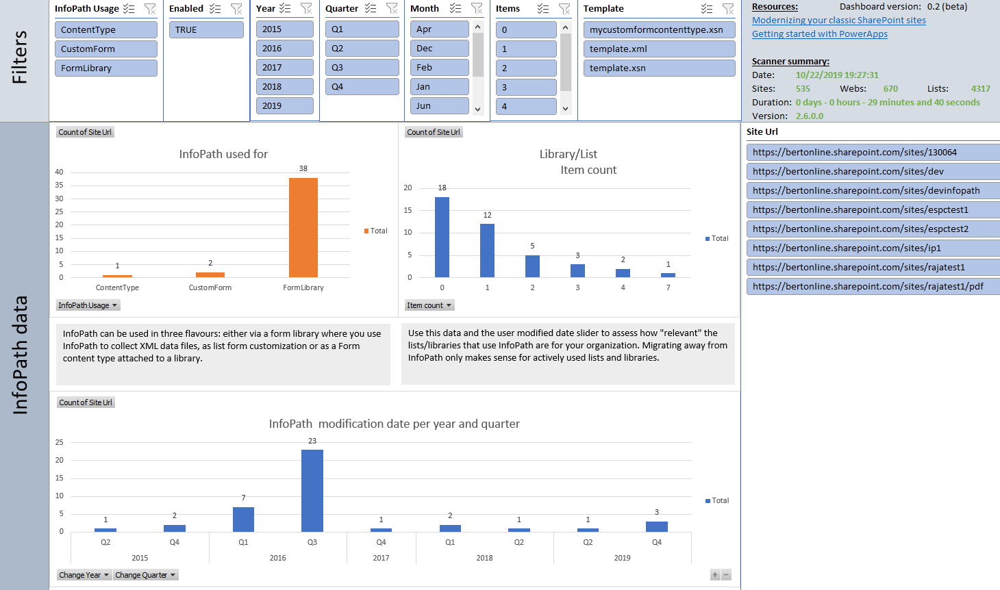

# SharePoint Modernization scanner reports: InfoPath reports

> [!Note]
> Assessing your InfoPath usage should be done using the [Microsoft 365 Assessment tool](https://aka.ms/microsoft365assessmenttool)

## Excel dashboard

## Understanding the ModernizationInfoPathScanResults.csv file

This report contains the following columns:

Column | Description
---------|----------
**Site Collection Url** | Url of the scanned site collection.
**SiteUrl** | Url of the scanned web
**InfoPath Usage** | Indicates how InfoPath is used: in a `FormLibrary` an InfoPath form is used to collect data which is stored as InfoPath XML in the form library. When `CustomForm` an InfoPath form is used to customize the list forms
**Enabled** | Is the InfoPath form enabled
**Last user modified date** | When was the last user triggered change for the list/library that uses this InfoPath form
**Item count** | How many items are there in the list/library that uses InfoPath
**List Title** | The title of the list/library that's using InfoPath
**List Url** | The url of the list/library that's using InfoPath
**List Id** | The id of the list/library that's using InfoPath
**Template** | The name of the InfoPath form template (the .xsn file being used)
**Change Year** | Year of last change for the list/library that uses this InfoPath form
**Change Quarter** | Quarter of last change for the list/library that uses this InfoPath form
**Change Month** | Month of last change for the list/library that uses this InfoPath form

### Key takeaways from this report ###

Load the ModernizationInfoPathScanResults.csv into Microsoft Excel and use below filters to analyze the received data

Filter | Takeaway
---------|----------
**No filter** | Understand used InfoPath forms (form libraries and list form customizations)
**Change Year < this year - 2** | The lists being used by these InfoPath forms did not see any activity for a long time, verify if these forms are still relevant
