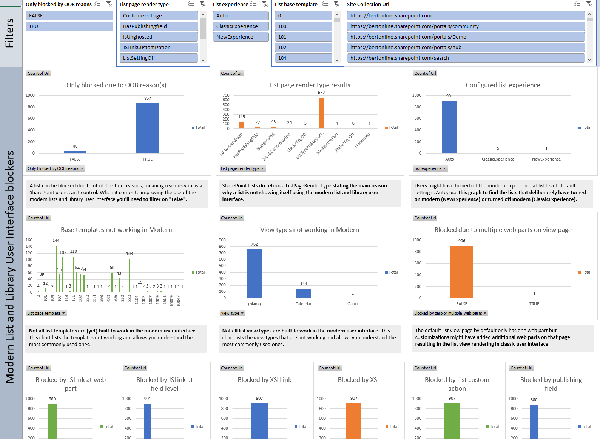

# SharePoint Modernization scanner reports: List reports

## Excel dashboard

## Understanding the ModernizationListScanResults.csv file ##

This report contains the following columns:

Column | Description
---------|----------
**List Url** | Url of the scanned object (list form page url in this case).
**Site Url** | Url of the scanned site.
**Site Collection Url** | Url of the scanned site collection.
**List Title** | Title of the list.
**Only blocked by OOB reaons** | TRUE if the list is **only** blocked due to reasons which you as customer cannot influence, being blocked due to unsupported list base template, unsupported list view type or unsupported field type being shown. Note that you can use the the **-k (-skiplistsonlyblockedbyoobreaons) parameter** to skip logging lists which are only blocked due to these reasons
**Blocked at site level** | TRUE if the list is blocked because the **site** scoped feature (E3540C7D-6BEA-403C-A224-1A12EAFEE4C4) was enabled.
**Blocked at web level** | TRUE if the list is blocked because the **web** scoped feature (52E14B6F-B1BB-4969-B89B-C4FAA56745EF) was enabled.
**Blocked at list level** | TRUE if the user changed the list experience setting to "classic experience".
**List page render type** | The value of the PageRenderType property as explained in [docs.microsoft.com](/sharepoint/dev/solution-guidance/modern-experience-customizations-customize-lists-and-libraries#programmatically-detect-if-your-librarylist-will-be-shown-using-modern-or-classic).
**List experience** | The set list experience setting: auto (default), modern or classic. 
**Blocked by not being able to load page** | TRUE if the page associated with the list default view could not be loaded.
**Blocked by not being able to load page exception** | The error that was triggered when the page could not be loaded.
**Blocked by managed metadata navigation** | TRUE if the list is blocked because the web scoped metadata navigation (7201d6a4-a5d3-49a1-8c19-19c4bac6e668) feature was enabled. **Note:** Microsoft started rolling out support for managed metadata navigation in the "modern" list and library experience. See https://techcommunity.microsoft.com/t5/SharePoint-Blog/SharePoint-filters-pane-updates-filtering-and-metadata/ba-p/74162 for more details.
**Blocked by view type** | TRUE if the list default view is using a view type which cannot be shown in "modern".
**View type** | The used view type that is not working in "modern".
**Blocked by list base template** | TRUE if the list is blocked because it's based upon a list type which can't be shown in "modern".
**List base template** | Base template of the list. This base template can't be shown in "modern".
**Blocked by zero or multiple web parts** | TRUE if the the list default view page is having more than 1 web part.
**Blocked by JSLink** | TRUE if the the XSLT List View web part, which is showing the list data, has the JSLink property set.
**JSLink** | The JSLink property set on the XSLT List View web part.
**Blocked by XslLink** | TRUE if the XSLT List View web part, which is showing the list data, has the XslLink property set.
**XslLink** | The XslLink property set on the XSLT List View web part. 
**Blocked by Xsl** | TRUE if the XSLT List View web part, which is showing the list data, has the Xsl property set.
**Blocked by JSLink field** | TRUE if a list view field has the JSLink property set.
**JSLink fields** | Collection of fields with JSLink set.
**Blocked by business data field** | TRUE if a list view field is of the type "business data".
**Business data fields** | Collection of fields of type "business data".
**Blocked by task outcome field** | TRUE if a list view field is of the type "task outcome".
**Task outcome fields** | Collection of fields of type "task outcome".
**Blocked by publishingField** | TRUE if a list view field is of the type "publishing".
**Publishing fields** | Collection of fields of type "publishing".
**Blocked by geo location field** | TRUE if a list view field is of the type "geo location".
**Geo location fields** | Collection of fields of type "geo location".
**Blocked by list custom action** | TRUE if the list is having incompatible list scoped user custom actions. Incompatible user custom actions are having ScriptLink as location.
**List custom actions** | Collection of offending list custom action names.

### Key takeaways from this report
Load the ModernListBlocked.csv into Microsoft Excel and use below filters to analyze the received data

Filter | Takeaway
---------|----------
**No filter** | Will give you **all** the lists for which the default view page will not present itself using the "modern" UI. The number of lists can be very high because not all lists are designed to use the "modern" user interface. This data is however useful to assess the impact of upcoming "modern" changes: e.g. this report will tell you that x lists are not showing in modern because feature y is not available...if you know that feature y will become available in the future you can assess how many additional lists will then be able to present themselves using the "modern" user interface.
**Blocked at site level = TRUE or Blocked at web level = TRUE** | Using this filter you'll get all the sites where the "modern" ui blocking site/web scoped feature was enabled. It might be that this was done because certain sites were not yet ready for "modern", using this data you can disable the "modern" ui blocking feature again.
**Blocked at list level = TRUE** | End users do have the option to turn on/off the "modern" experience per list and using this filter you'll learn where that happened. The column "list experience" will show which setting was applied.
**Only blocked by OOB reaons = FALSE** | Will give you all the lists which are not rendering in "modern" because of a reason you can influence. If you want to improve the "modern" user interface compatibility of your SharePoint Online lists then these are the lists you can work with. 
**Only blocked by OOB reaons = FALSE and (Blocked by JSLink = TRUE or Blocked by XslLink = TRUE or Blocked by Xsl = TRUE or Blocked by JSLink field = TRUE)** | These are all the lists which are not showing in modern because their rendering is impacted by the existence of custom JavaScript or XSL. You could remove the references to these JavaScript and XSL files and go back to the out of the box way of list rendering or alternatively you can use column/view formatters or custom SharePoint Framework development.
**Only blocked by OOB reaons = FALSE and Blocked by list custom action = TRUE** | If a list custom action is embedding JavaScript then that will prevent rendering of the "modern" user interface. You can remove this list custom action or alternatively you can use column/view formatters or custom SharePoint Framework development.
**Business data fields = true or Blocked by task outcome field = true or Blocked by geo location field = true or Blocked by publishingField = true** | Although you can't fix the rendering of these fields you do have the option to remove them from the list default view which will fix the list "modern" rendering.
