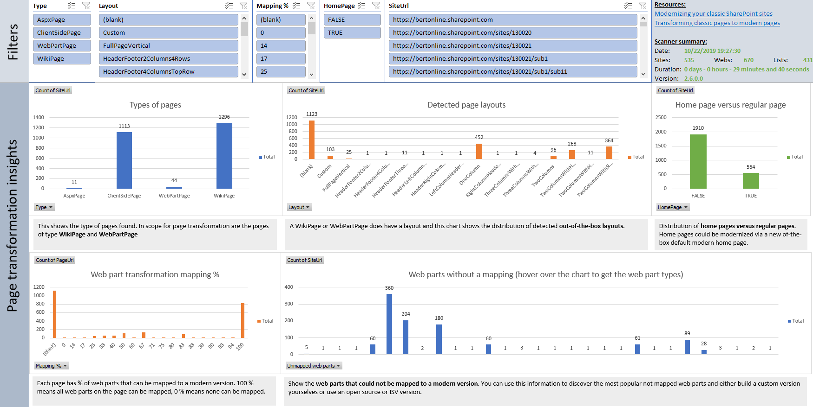

# SharePoint Modernization scanner reports: Pages reports

## Excel dashboard



## Understanding the PageScanResults.csv file ##

This report contains the following columns:

Column | Description
---------|----------
**Site Collection Url** | Url of the scanned site collection.
**Site Url** | Url of the scanned web.
**PageUrl** | Server relative URL of the scanned page.
**Library** | Server relative URL of the pages library holding the scanned page.
**HomePage** | Is this a site's home page?
**Uncustomized STS#0 home page** | Is this an "uncustomized", default team site home page?
**Type** | Type of the page (`WikiPage`, `WebPartPage`, `ClientSidePage` or `AspxPage`).
**Layout** | Standard layout of the found WikiPage or WebPartPage.
**Mapping %** | Percentage of web parts on the page that have a mapping in the provided mapping file.
**Unmapped web parts** | Web part types which were not mapped via the provided web part mapping file.
**ModifiedBy** | Last person that modified this page.
**ModifiedAt** | Last modification date and time for this page.
**ViewsRecent** | Number of views this page received in the last 14 days. If the -c or skipusageinformation parameter was used this column is always 0.
**ViewsRecentUniqueUsers** | Number of unique visitors for this page in the last 14 days. If the -c or skipusageinformation parameter was used this column is always 0.
**ViewsLifeTime** | Number of views this page received during it's lifetime. If the -c or skipusageinformation parameter was used this column is always 0.
**ViewsLifeTimeUniqueUsers** | Number of unique visitors for this page during it's lifetime. If the -c or skipusageinformation parameter was used this column is always 0.
**WPType1-30** | Up to 30 columns indicating the web part type.
**WPTitle1-30** | Up to 30 columns indicating the web part title.
**WPData1-30** | Up to 30 columns holding the exported web part data (see upcoming chapter for details), only if the -b or exportwebpartproperties parameter was specified.

### Key takeaways from this report ###

Load the PageScanResults.csv into Microsoft Excel and use below filters to analyze the received data

Filter | Takeaway
---------|----------
**No filter** | Will give you one row per scanned page
**HomePage = TRUE** | Gives you all the site home pages
**Type = "WebPartPage"** | Gives you all the web part pages
**ViewsRecent > 0** | Pages which have been recently accessed

### WPData details (if the -b or exportwebpartproperties parameter was specified) ###

For each exported web part the same base JSON structure is used as shown below. Important to note are:

- The "Row" property indicates the row (=section) this web part should be added into in a new modern page (assuming the layout of the original page was detected)
- The "Column" property indicates the column this web part should be added into in a new modern page (assuming the layout of the original page was detected)
- The "Properties" property holds the web part specific properties

```JSON
{
	"Type":"<fully qualified web part type>",
	"Id":"6f930c6f-b7d5-44db-b6e7-55d375e4667d",
	"ServerControlId":"6f930c6f-b7d5-44db-b6e7-55d375e4667d",
	"ZoneId":"FullPage",
	"Hidden":false,
	"IsClosed":false,
	"Title":"<web part title>",
	"Row":1,
	"Column":1,
	"Order":0,
	"ZoneIndex":0,
	"Properties":{"<web part specific properties>"}
}
```

Since each web part has different **relevant** properties the properties that are exported for a web part are defined in the `webpartmapping.xml` file: this allows you to add/remove properties based on your needs. Each defined property is exported and stored underneath the "Properties" property as shown in below complete example:

```JSON
{
	"Type":"Microsoft.Office.Visio.Server.WebControls.VisioWebAccess, Microsoft.Office.Visio.Server, Version=16.0.0.0, Culture=neutral, PublicKeyToken=71e9bce111e9429c",
	"Id":"6f930c6f-b7d5-44db-b6e7-55d375e4667d",
	"ServerControlId":"6f930c6f-b7d5-44db-b6e7-55d375e4667d",
	"ZoneId":"FullPage",
	"Hidden":false,
	"IsClosed":false,
	"Title":"Visio Web Access",
	"Row":1,
	"Column":1,
	"Order":0,
	"ZoneIndex":0,
	"Properties":
	{
		"Title":"Visio Web Access",
		"Description":"Enables viewing and refreshing of Visio Web Drawings.", 
		"Width":"", 
		"Height":"400px", 
		"ShapeDataNames":"", 
		"ShowBackground":"True", 
		"ShowShapeInfoButton":"True", 
		"ShowPageNavigation":"True", 
		"DisableSelection":"False", 
		"FitViewToShapes":"False", 
		"AlwaysRaster":"False", 
		"AutoRefreshInterval":"0", 
		"ShowRefresh":"True", 
		"DiagramPath":"/sites/espctest1/Shared Documents/Drawing1.vsdx", 
		"OverrideViewSettings":"True", 
		"ShowZoomControl":"True", 
		"ViewSettings":"", 
		"DisableZoom":"False", 
		"DefaultPageShown":"1", 
		"ShowOpenInVisio":"True", 
		"DisableHyperlink":"False"
	}
}
```

## Understanding the UniqueWebParts.csv file ##

This report contains the following columns:

Column | Description
---------|----------
**Type** | Fully qualified name of the web part.
**InMappingFile** | Indicates if this web part is listed in the webpartmapping file.

### Key takeaways from this report ###

Load the UniqueWebParts.csv into Microsoft Excel and use below filters to analyze the received data

Filter | Takeaway
---------|----------
**No filter** | Will give you one row per uniquely detected web part
**InMappingFile = FALSE** | Gives you all the web parts which are not part of the webpartmapping.xml file. If these are important for you it's best to define these web parts with the properties you want to retrieve

## Understanding the SitesWithUncustomizedHomePages.csv file ##

This report contains a list of all the site's which have an uncustomized home page. This output can be used to configure opting out of upgrade of uncustomized home pages to a modern home page. See https://github.com/SharePoint/sp-dev-modernization/tree/dev/Scripts/HomePageModernizationOptOut to learn more.
