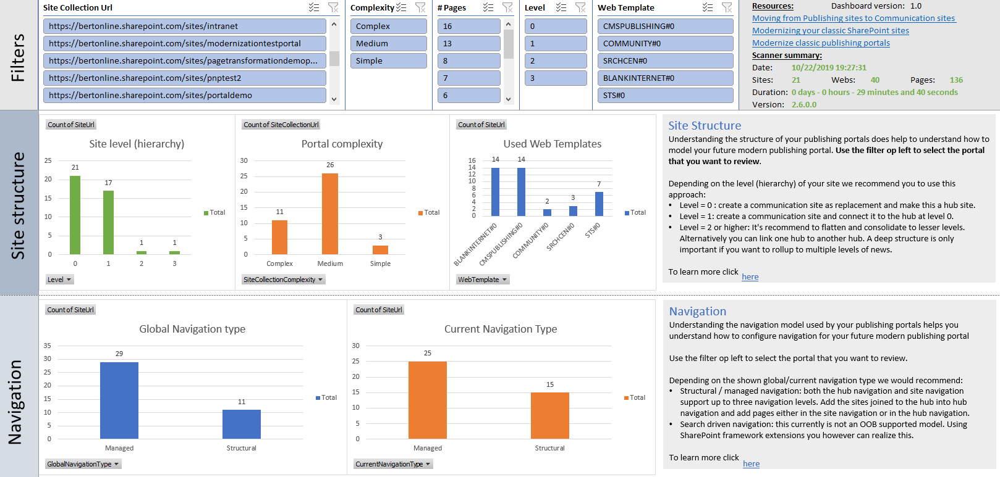

# SharePoint Modernization scanner reports: Publishing Portal reports

## Excel dashboard

## Understanding the ModernizationPublishingSiteScanResults.csv file ##

This report contains the following columns:

Column | Description
---------|----------
**Site Collection Url** | Url of the scanned site collection.
**Number Of Webs** | Number of webs counted in this publishing portal site collection
**Number of Pages** | Total count of the publishing pages in this portal site collection
**UsedSiteMasterPages** |  Delimited list of custom site master pages used in the site collection
**UsedSystemMasterPages** | Delimited list of custom system master pages used in the site collection
**UsedPageLayouts** | Delimited list of page layouts used in the site collection
**LastPageUpdateDate** | Most recent page modification date

### Key takeaways from this report ###

Load the ModernizationPublishingSiteScanResults.csv into Microsoft Excel and use below filters to analyze the received data

Filter | Takeaway
---------|----------
**No filter** | Helps you identify the bigger (and often more complex) portals in your environment
**LastPageUpdate < TODAY -365** | Helps you identify stale publishing portals, which probably don't require modernization

## Understanding the ModernizationPublishingWebScanResults.csv file ##

This report contains the following columns:

Column | Description
---------|----------
**Site Collection Url** | Url of the scanned site collection.
**SiteUrl** | Url of the scanned web
**WebRelativeUrl** | Relative url of the web
**SiteCollectionComplexity** | Complexity level of all the sites in this publishing portal site collection
**WebTemplate** | Template used to create this web
**Level** | Level of depth of the web, 0 is top level
**PageCount** | Number of publishing pages that exist in this web
**Language** | The language this web was created in
**VariationLabels** | The variation labels assigned to this site collection (if any)
**VariationSourceLabel** | The variation label assigned to this web (if any)
**SiteMasterPage** | The site master page in case it was a custom one
**SystemMasterPage** | The system master page in case it was a custom one
**AlternateCSS** | The alternate CSS value
**AllowedPageLayouts** | A list of allowed page layouts in case only a subset of page layouts was allowed for this site
**PageLayoutsConfiguration** | Configuration of how page layouts are setup (`Any`, `Inherit from parent` or `Define list`)
**DefaultPageLayout** | The default page layout that will be used for a new article in this site
**GlobalNavigationType** | Global navigation configuration (`Structural` or `Managed`)
**GlobalStructuralNavigationShowSubSites** | Show sub sites in global navigation if structural navigation was configured
**GlobalStructuralNavigationShowPages** | Show pages in global navigation if structural navigation was configured
**GlobalStructuralNavigationShowSiblings** | Show siblings in global navigation if structural navigation was configured
**GlobalStructuralNavigationMaxCount** | Maximum number of menu items in global navigation if structural navigation was configured
**GlobalManagedNavigationTermSetId** | ID of the term set holding the navigation nodes if global managed navigation was configured
**CurrentNavigationType** | Current navigation configuration (`Structural` or `Managed`)
**CurrentStructuralNavigationShowSubSites** | Show sub sites in current navigation if structural navigation was configured
**CurrentStructuralNavigationShowPages** | Show pages in current navigation if structural navigation was configured
**CurrentStructuralNavigationShowSiblings** | Show siblings in current navigation if structural navigation was configured
**CurrentStructuralNavigationMaxCount** | Maximum number of menu items in current navigation if structural navigation was configured
**CurrentManagedNavigationTermSetId** | ID of the term set holding the navigation nodes if current managed navigation was configured
**ManagedNavigationAddNewPages** | Add pages to navigation if managed navigation was chosen
**ManagedNavigationCreateFriendlyUrls** | Create friendly urls if managed navigation was chosen
**LibraryItemScheduling** | Has the pages library scheduled item publishing setup?
**LibraryEnableModeration** | Has the pages library moderation (=basic approval) setup?
**LibraryEnableVersioning** | Has the pages library major version versioning setup?
**LibraryEnableMinorVersions** | Has the pages library minor version versioning setup?
**LibraryApprovalWorkflowDefined** | Has the pages library an approval workflow setup?
**BrokenPermissionInheritance** | Has this site broken permission inheritance?
**Admins** | The list of admins for this web
**Owners** | The list of owners for this web

### Key takeaways from this report ###

Load the ModernizationPublishingWebScanResults.csv into Microsoft Excel and use below filters to analyze the received data

Filter | Takeaway
---------|----------
**No filter** | Gives you a quick overview of the webs in this publishing portal and their key statistics like page count and level
**Level >= 2** | Webs at a level of 2 or higher do not fit in the current hub model

## Understanding the ModernizationPublishingPageScanResults.csv file ##

This report contains the following columns:

Column | Description
---------|----------
**Site Collection Url** | Url of the scanned site collection.
**SiteUrl** | Url of the scanned web
**WebRelativeUrl** | Relative url of the web
**PageRelativeUrl** | Relative url of the page
**PageName** | Name of the page
**ContentType**  | Name of the used content type
**ContentTypeId** | ID of the used content type
**PageLayout** | Name of the used page layout
**PageLayoutFile** | Filename of the used page layout
**PageLayoutWasCustomized** | Was this page layout customized (changed an OOB one or just a newly added one)
**GlobalAudiences** | Delimited list of global audiences defined on this page
**SecurityGroupAudiences** | Delimited list of security group audiences defined on this page
**SharePointGroupAudiences** | Delimited list of SharePoint group audiences defined on this page
**ModifiedAt** | Page was last modified at
**ModifiedBy** | Page was last modified by
**Mapping %** | If the page contains web parts this will list how good the web parts could be transformed to modern web parts
**WPType1-20** | Type of the found web part for up to 20 web parts
**WPTitle1-20** | Title of the found web part for up to 20 web parts

### Key takeaways from this report ###

Load the ModernizationPublishingPageScanResults.csv into Microsoft Excel and use below filters to analyze the received data

Filter | Takeaway
---------|----------
**No filter** | Understand used content types, page layouts and audiences
**ModifiedAt < TODAY-365** | These pages are stale and possibly can be 'skipped' during page modernization