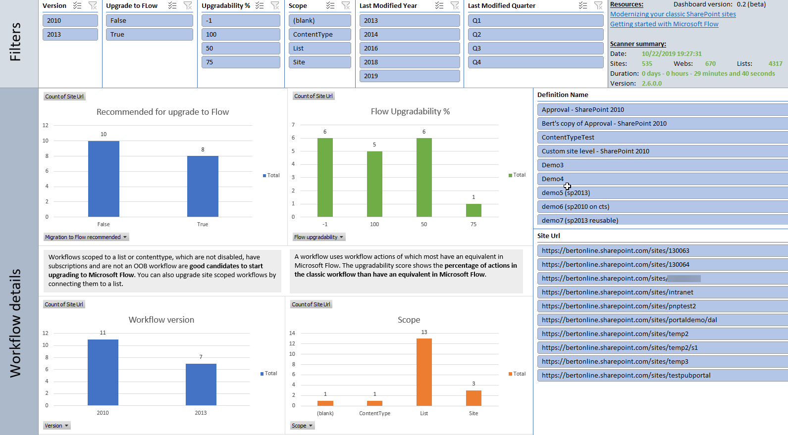

# SharePoint Modernization scanner reports: Workflow reports

## Excel dashboard

## Understanding the ModernizationWorkflowScanResults.csv file

This report contains the following columns:

Column | Description
---------|----------
**Site Collection Url** | Url of the scanned site collection.
**SiteUrl** | Url of the scanned web.
**Definition Name** | The name of the workflow definition.
**Migration to Flow recommended** | Indicates whether this workflow is a good candidate for Microsoft Flow migration. The used criteria are: it's not an OOB workflow, it has subscriptions and it's enabled.
**Version** | The workflow version (2010 or 2013).
**Scope** | Workflows are either connected to a site, list or content type.
**Has subscriptions** | Is this workflow being used or is it just defined.
**Enabled** | Is the workflow enabled.
**Is OOB** | Is this one of the OOB workflows that SharePoint Online has.
**List Title** | If the workflow is scoped to a list this contains the title of that list.
**List Url** | If the workflow is scoped to a list this contains the url of that list.
**List Id** | If the workflow is scoped to a list this contains the id of that list.
**ContentType Name** | If the workflow is scoped to a content type this contains the name of that content type.
**ContentType Id** | If the workflow is scoped to a content type this contains the id of that content type.
**Restricted To** | 2013 workflows can be restricted to be used exclusively for lists or sites, which is indicated in tis column.
**Definition description** | Workflow definition description.
**Definition Id** | Workflow definition id.
**Subscription Name** | Name of the subscription created for this workflow.
**Subscription Id** | Id of the subscription created for this workflow.
**Definition Changed On** | When was this workflow definition last changed.
**Subscription Changed On** | When was the workflow subscription last changed.
**Action Count** | Number of actions detected in this workflow.
**Used Actions** | List of the unique actions used in this workflow.
**Used Triggers** | List of the workflow triggers that trigger this workflow to start.
**Flow upgradability** | % indicating how well the detected actions are upgradable to Microsoft Flow.
**Incompatible Action Count** |  Number of actions that are not compatible with Microsoft Flow.
**Incompatible Actions** | List of unique actions which are not compatible with Microsoft Flow.
**Change Year** | Year of last workflow definition change.
**Change Quarter** | Quarter of last workflow definition change.
**Change Month** | Month of last workflow definition change.

### Key takeaways from this report ###

Load the ModernizationWorkflowScanResults.csv into Microsoft Excel and use below filters to analyze the received data

Filter | Takeaway
---------|----------
**No filter** | Understand used workflows.
**Migration to Flow recommended = TRUE** | Filter on "Migration to Flow recommended" workflows as these are good candidates to migrate to Microsoft Flow.
**Change Year < this year - 2** | These workflows have not been touched for a long time...evaluate whether they're still business relevant.
**Flow upgradability < 100** | Workflows which are using actions that are not 100% compatible with Microsoft Flow
