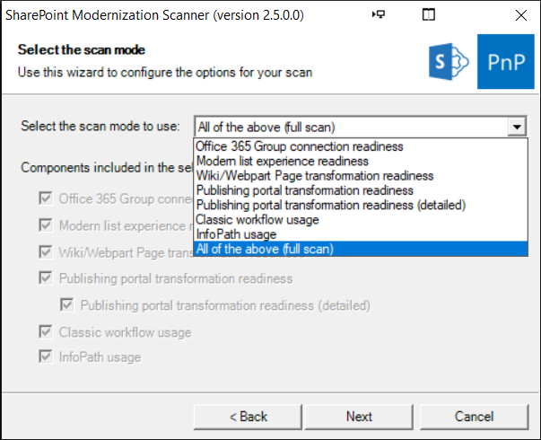

# Getting started with the SharePoint modernization scanner

Using the SharePoint Modernization scanner you can prepare your classic sites for modernization. The scanner will help you prepare for the following modernization efforts:

- Optimizing the usage of modern list and libraries
- Connecting these sites to an Office 365 group
- Modernizing the wiki and web part pages by creating modern site pages
- Rebuilding classic publishing portals as modern publishing portals

This scanner is a key tool to use if you want to prepare for modernizing your classic sites as it will give you factual data about how easy it is to modernize your sites. Using the dashboards generated by the scanner you'll be able to drill down on the "modernization readiness" of your sites and plan the needed remediation work where needed.

## Step 1: Get the latest version of the SharePoint modernization scanner

Since SharePoint Online continuously evolves and more and more modern capabilities are added it's important to always download the latest version of the scanner. Downloading is as simple as:

- Going the [scanner download page](https://aka.ms/sppnp-modernizationscanner)
- Download the zip file mentioned in the "Quick start guide" section
- **Unpacking the zip file to folder on your computer**. Once you've downloaded the tool, unzip it to a local folder which will contain the SharePoint.Modernization.Scanner.exe and webpartmapping.xml files

## Step 2: Preparing for a scan

Since a typical scan needs to be able to scan all site collections it's recommended to use an app-only principal with tenant scoped permissions for the scan. This approach will ensure the scanner always has access, if you use an account (e.g. your SharePoint tenant admin account) then the scanner can only access the sites where this user also has access. You can either use a an Azure AD application or a SharePoint app principal for app-only access:

- [Granting access via Azure AD App-Only](../solution-guidance/security-apponly-azuread.md)
- [Granting access via SharePoint App-Only](../solution-guidance/security-apponly-azureacs.md)

Once the preparation work is done, let's continue with doing a scan.

## Step 3: Launch a scan using the user interface option

The easiest approach is to simply launch SharePoint.Modernization.Scanner.exe as the scanner does have a UI. Alternatively you can start a (PowerShell) command prompt and navigate to that folder so that you can use the scanner via command line. This chapter will walk you through the UI option taking a typical **full** scan. Start by launching the the SharePoint.Modernization.Scanner.exe.

### Page 1: Scanner authentication configuration

The first page of the modernization scanner wizard asks you for authentication information. The scanner supports three options, select the one you need and fill in the needed information as described below. Note that ideally you use an app-only model as that will ensure the scanner has access to all sites it needs to scan.


If you've [setup access via Azure AD App-Only](../solution-guidance/security-apponly-azuread.md) you do have created an Azure App and configured a certificate for accessing it. This information needs to be provided to the tool:

- **Azure AD Application ID**: ID of the created application in your Azure AD environment
- **Azure AD Domain name**: the default domain of your Azure AD environment. You can find this from the overview page of the Azure AD management portal
- **Certificate file**: the certificate that you granted app-only access to the Azure AD app, this needs to be presented as a password protected PFX file
- **Password for the PFX file**: the password used to secure the previously provided PFX file


In case you used the "classic" [SharePoint App-Only](../solution-guidance/security-apponly-azureacs.md) approach then you need to specify:

- **Azure ACS Client ID**: the ID of the created app-only principal
- **Azure ACS Client Secret**: the secret that you got when you created the app principal


Using a regular user/password combo works fine as well, assuming the provided user does have the needed permissions

### Page 2: Scanner site scope configuration

This page allows you to define which sites are being scanned. The scanner supports scanning the full tenant up to individually selected site collections.


Scanning the complete tenant is often the recommended approach as that will give you modernization reports for all. If that's your choice then simply fill your tenant name. Note that this approach does not work if you're tenant is **using URL's that do not end on sharepoint.com**, if that's the case you need to use one of the two below options.


This option makes it possible to select one or more site collections by either providing

- **The fully qualified URL** of the site collection(s) that need need(s) to be scanned
- **A wildcard URL**: by adding an URL that ends on an star you'll include all sites that match that filter. Only ending on an star is a supported wildcard

If you're using URL's that do not end on sharepoint.com (so called vanity URL's) you'll also need to specify the URL of your tenant admin center site (e.g. https://admin-sharepoint.contoso.com).


As a third option you can provide the scanner with a CSV file listing the site collections to scan.

### Page 3: Scanner mode configuration

The SharePoint modernization scanner does support multiple modes, depending on your modernization mode you might want to scope the scan to a certain area or alternatively simply do a full scan.



Select the option you want in the dropdown and then the checkboxes will show which components will be included in the scan. Note that the "Office 365 Group connection readiness" component is the main component which will be included all scan modes.

### Page 4: Scanner options

As a last step you can tweak the scanner options. Depending on the earlier chosen scanner mode some options might be disabled.


Following scan options are available:

- **Number of threads**: the scan is multi-threaded, default is 10 but for larger scans 20-30 threads delivers a better scan performance (your mileage might vary)
- **Don't use search**: if you're not interested in page/site usage information then you can select this option. As this removes one search query per site collection it will make the scan slightly faster
- **Don't include user information**: check this box if you're not interested in seeing user information (user names) as part of the produced data
- **Exclude lists**: For the "Modern list and library experience" scan you can exclude lists which are only blocked due to an OOB reason
- **Export page details**: By default the scan is not exporting detailed web part information (web part properties) as that dataset can be huge. Check this box if you would like to have the full web part option data
- **Don't generate reports**: by default you get Excel based dashboards as scan output, but you can skip these if you're only interested in the raw CSV files
- **Disable feedback**: the scanner will send anonymous feedback to Microsoft to help improve the scanner. If you don't like that then feel free to check this box
- **Separator**: the default separator for the generated CSV files is a comma, but you can change this to semi-colon if you would prefer that

## Step 4: Launch a scan using command line

Below option is the default usage of the tool for most customers: you specify the mode, your tenant name and the created client id and secret:

```console
SharePoint.Modernization.Scanner.exe -t <tenant> -i <clientid> -s <clientsecret>
```

A real life sample:

```console
SharePoint.Modernization.Scanner.exe -t contoso -i 7a5c1615-997a-4059-a784-db2245ec7cc1 -s eOb6h+s805O/V3DOpd0dalec33Q6ShrHlSKkSra1FFw=
```

The above use will run all scanning options, but you can also target the scan via the `Mode` parameter (-m):

```console
SharePoint.Modernization.Scanner.exe -m <mode> -t <tenant> -i <clientid> -s <clientsecret>
```

A real life sample:

```console
SharePoint.Modernization.Scanner.exe -m GroupifyOnly -t contoso -i 7a5c1615-997a-4059-a784-db2245ec7cc1 -s eOb6h+s805O/V3DOpd0dalec33Q6ShrHlSKkSra1FFw=
```

### Supported scanner modes

Mode | Description
-----|------------
`Full` | All components will be included, omitting -m has the same result
`GroupifyOnly` | Only use the Office 365 group connection readiness component, this component is part of each scan
`ListOnly` | Includes a deep list scan + includes the Office 365 group connection readiness component
`PageOnly` | Includes a scan from wiki and web part pages + includes the Office 365 group connection readiness component
`PublishingOnly` | Includes a classic publishing portal scan at site and web level + includes the Office 365 group connection readiness component
`PublishingWithPagesOnly` | Includes a classic publishing portal scan at site,web and page level + includes the Office 365 group connection readiness component

### Command line parameter overview

```Console
SharePoint PnP Modernization scanner 2.2.0.0
Copyright (C) 2018 SharePoint PnP
==========================================================

See the PnP-Tools repo for more information at:
https://github.com/SharePoint/PnP-Tools/tree/master/Solutions/SharePoint.Modernization.Scanner

Let the tool figure out your urls (works only for SPO MT):
==========================================================
Using Azure AD app-only:
SharePoint.Modernization.Scanner.exe -t <tenant> -i <your client id> -z <Azure AD domain> -f <PFX file> -x <PFX file
password>
e.g. SharePoint.Modernization.Scanner.exe -t contoso -i e5808e8b-6119-44a9-b9d8-9003db04a882 -z conto.onmicrosoft.com
-f apponlycert.pfx -x pwd

Using app-only:
SharePoint.Modernization.Scanner.exe -t <tenant> -i <your client id> -s <your client secret>
e.g. SharePoint.Modernization.Scanner.exe -t contoso -i 7a5c1615-997a-4059-a784-db2245ec7cc1 -s
eOb6h+s805O/V3DOpd0dalec33Q6ShrHlSKkSra1FFw=

Using credentials:
SharePoint.Modernization.Scanner.exe -t <tenant> -u <your user id> -p <your user password>

e.g. SharePoint.Modernization.Scanner.exe -t contoso -u spadmin@contoso.onmicrosoft.com -p pwd

Specifying url to your sites and tenant admin (needed for SPO with vanity urls):
================================================================================
Using Azure AD app-only:
SharePoint.Modernization.Scanner.exe -r <wildcard urls> -a <tenant admin site>  -i <your client id> -z <Azure AD
domain> -f <PFX file> -x <PFX file password>
e.g. SharePoint.Modernization.Scanner.exe -r "https://teams.contoso.com/sites/*,https://my.contoso.com/personal/*" -a
https://contoso-admin.contoso.com -i e5808e8b-6119-44a9-b9d8-9003db04a882 -z conto.onmicrosoft.com  -f apponlycert.pfx
-x pwd

Using app-only:
SharePoint.Modernization.Scanner.exe -r <wildcard urls> -a <tenant admin site> -i <your client id> -s <your client
secret>
e.g. SharePoint.Modernization.Scanner.exe -r "https://teams.contoso.com/sites/*,https://my.contoso.com/personal/*" -a
https://contoso-admin.contoso.com -i 7a5c1615-997a-4059-a784-db2245ec7cc1 -s
eOb6h+s805O/V3DOpd0dalec33Q6ShrHlSKkSra1FFw=

Using credentials:
SharePoint.Modernization.Scanner.exe -r <wildcard urls> -a <tenant admin site> -u <your user id> -p <your user
password>
e.g. SharePoint.Modernization.Scanner.exe -r "https://teams.contoso.com/sites/*,https://my.contoso.com/personal/*" -a
https://contoso-admin.contoso.com -u spadmin@contoso.com -p pwd


  -m, --mode                               (Default: Full) Execution mode. Use following modes: full, GroupifyOnly,
                                           ListOnly, PageOnly, PublishingOnly, PublishingWithPagesOnly. Omit or use
                                           full for a full scan

  -b, --exportwebpartproperties            (Default: False) Export the web part property data

  -c, --skipusageinformation               (Default: False) Don't use search to get the site/page usage information and
                                           don't export that data

  -j, --skipuserinformation                (Default: False) Don't include user information in the exported data

  -k, --skiplistsonlyblockedbyoobreaons    (Default: False) Exclude lists which are blocked due to out of the box
                                           reasons: base template, view type of field type

  -d, --skipreport                         (Default: False) Don't generate an Excel report for the found data

  -g, --exportpaths                        List of paths (e.g. c:\temp\636529695601669598,c:\temp\636529695601656430)
                                           containing scan results you want to add to the report

  -n, --disabletelemetry                   (Default: False) We use telemetry to make this a better tool...but you're
                                           free to disable that

  -i, --clientid                           Client ID of the app-only principal used to scan your site collections

  -s, --clientsecret                       Client Secret of the app-only principal used to scan your site collections

  -u, --user                               User id used to scan/enumerate your site collections

  -p, --password                           Password of the user used to scan/enumerate your site collections

  -z, --azuretenant                        Azure tenant (e.g. contoso.microsoftonline.com)

  -f, --certificatepfx                     Path + name of the pfx file holding the certificate to authenticate

  -x, --certificatepfxpassword             Password of the pfx file holding the certificate to authenticate

  -a, --tenantadminsite                    Url to your tenant admin site (e.g. https://contoso-admin.contoso.com): only
                                           needed when your not using SPO MT

  -t, --tenant                             Tenant name, e.g. contoso when your sites are under
                                           https://contoso.sharepoint.com/sites. This is the recommended model for
                                           SharePoint Online MT as this way all site collections will be scanned

  -r, --urls                               List of (wildcard) urls (e.g.
                                           https://contoso.sharepoint.com/*,https://contoso-my.sharepoint.com,https://co
                                           ntoso-my.sharepoint.com/personal/*) that you want to get scanned

  -o, --includeod4b                        (Default: False) Include OD4B sites in the scan

  -v, --csvfile                            CSV file name (e.g. input.csv) which contains the list of site collection
                                           urls that you want to scan

  -h, --threads                            (Default: 10) Number of parallel threads, maximum = 100

  -e, --separator                          (Default: ,) Separator used in output CSV files (e.g. ";")

  --help                                   Display this help screen.

```