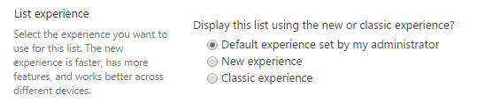

# Opting out of the modern list and library experience

In 2016, we introduced a new “modern” experience for SharePoint, bringing extensibility, accessibility, and responsive design to a complete overhaul of the user experience. Since then, modern has been the basis for innovation throughout SharePoint and OneDrive, although classic mode remains supported and available. The majority of lists and libraries work perfect in the modern experience, but there are also lists which don't work as expected or miss functionality when used in modern. Often this is due to customizations on the list (e.g. JSLink) or on the list form page (e.g. multiple web parts used). SharePoint will detect most incompatible customizations and will show the impacted lists and libraries using the classic experience, while the other lists and libraries in the site will be shown using the modern experience. If switching between the modern and classic experiences is not acceptable, then you do have the option to opt out lists and libraries from the modern experience. In this article you'll learn about the available opt out options, how to detect lists and libraries that could benefit from opting out of modern and finally how to best handle the opt out.

## Options to opt out lists and libraries from the modern experience

### Opting out at site collection level

You can opt out a site collection from using the "modern" experience by enabling a feature with ID **E3540C7D-6BEA-403C-A224-1A12EAFEE4C4**. Use the following [PnP PowerShell](http://aka.ms/sppnp-powershell) to enable/disable the needed feature:

```powershell
# Connect to a site
$cred = Get-Credential
Connect-PnPOnline -Url https://[tenant].sharepoint.com/sites/siteurl -Credentials $cred

# Opt out from modern lists and libraries at site collection level
Enable-PnPFeature -Identity E3540C7D-6BEA-403C-A224-1A12EAFEE4C4 -Scope Site
# And again enable modern lists and libraries at site collection level
#Disable-PnPFeature -Identity E3540C7D-6BEA-403C-A224-1A12EAFEE4C4 -Scope Site
```

### Opting out at web level

You can opt out a web from using the "modern" experience by enabling a feature with ID **52E14B6F-B1BB-4969-B89B-C4FAA56745EF**. Use the following [PnP PowerShell](http://aka.ms/sppnp-powershell) to enable/disable the needed feature:

```powershell
# Connect to a site
$cred = Get-Credential
Connect-PnPOnline -Url https://[tenant].sharepoint.com/sites/siteurl -Credentials $cred

# Opt out from modern lists and libraries at web level
Enable-PnPFeature -Identity 52E14B6F-B1BB-4969-B89B-C4FAA56745EF  -Scope Web
# And again enable modern lists and libraries at web level
#Disable-PnPFeature -Identity 52E14B6F-B1BB-4969-B89B-C4FAA56745EF  -Scope Web
```

### Opting out at list level

To control the experience at the library level, you can go to **List settings** > **Advanced settings**, and change the behavior.

**List experience configuration in the SharePoint tenant level settings in Admin UI**



The same can also be done by using [PnP PowerShell](http://aka.ms/sppnp-powershell) as shown in this snippet:

```powershell
# Connect to a site
$cred = Get-Credential
Connect-PnPOnline -Url https://[tenant].sharepoint.com/sites/siteurl -Credentials $cred

# Get the list to update
$list = Get-PnPList -Identity "Shared Documents" -Includes ListExperienceOptions

# Set the list experience (0 = Auto, 1 = modern, 2 = classic)
$list.ListExperienceOptions = 2
$list.Update()
Invoke-PnPQuery
```

> [!NOTE]
> - The settings at the library level *override* the settings at the web or site collection level.

## How to detect lists and libraries that are candidates for being opted out of the modern experience

Opting out of the modern experience is only needed in certain cases, as described in this article's introduction. Previous chapter showed you how to perform an opt out, but how do know which lists and libraries are candidates to be opted out from the modern experience?

The [SharePoint Modernization scanner](https://aka.ms/sppnp-modernizationscanner) will give you the needed answers: if you run the scanner in "Full scan" or in "Modern list experience readiness" mode the scanner will collect all the data about your lists. Using the generated **Modern UI List Readiness** Excel report you can find the lists having customizations as explained in the [Analyze and use the scanner data](modernize-userinterface-lists-and-libraries-scanner.md) article.

The found lists will already present themselves in classic, due to SharePoint's classic fallback mechanism. If you however want to offer a full classic user experience, than you might want to opt out the complete site collection from modern lists and libraries. To make that easy, the scanner generates a CSV file named **SitesWithCustomizations.csv** listing all site collections that contain one or more lists that could be opted out.

This CSV file is a simple list of site collection URL's without a header as shown in below sample:

```CSV
"https://contoso.sharepoint.com/sites/siteA"
"https://contoso.sharepoint.com/sites/siteB"
"https://contoso.sharepoint.com/sites/siteC"
```

## How to best handle the opt out of the selected site collections

You can use the earlier described options to opt out a list, web or site collection from modern lists and libraries. If you've used the scanner to generate a list of site collections that are candidates for being opted out of modern, you then can use below [PnP PowerShell script](https://github.com/SharePoint/sp-dev-modernization/tree/master/Scripts/ListsAndLibraries) to perform a "bulk" opt out.

[!code-powershell[bulklistoptout](../../sp-dev-modernization/Scripts/ListsAndLibraries/SetModernListUsage.ps1 "Bulk site opt out of modern lists and libraries")]