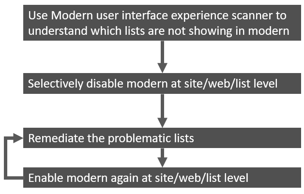
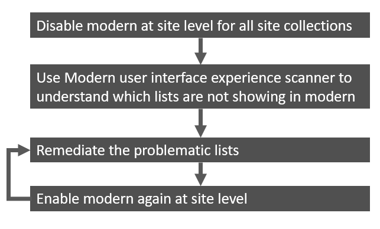

# Rollout approaches for the modern list and library experience

The modern list and library experience is enabled by default and for most customers this is a good model as that immediately brings the benefits of the modern list and library user interface. If you however want to more control of the rollout you can adopt one of the below described approaches.

## Approach 1: recommended, the default approach

In this approach we do run the [SharePoint Modernization scanner](https://aka.ms/sppnp-modernizationscanner) to understand which lists are not yet ready for the modern experience. If a site contains multiple of these lists or if the users of a given site are not yet ready for modern you can selectively disable the modern experience for that site. This gives you the needed time to remediate the lists or to educate the users so that later on you can enable the modern experience again.

## Approach 2: the "full control" approach

If you want to only enable the modern list and library experience after you've ensured the lists and your users are ready for it you can opt for this "full control" approach. You start with disabling the modern list experience at site collection level by enabling the modern experience site level blocking feature. At this point all sites will still use the classic list experience but it does allow you to run the [SharePoint Modernization scanner](https://aka.ms/sppnp-modernizationscanner) and remediate the needed lists. Once the lists and your users are ready you can selectively again disable the modern experience site level blocking feature. Recommended is to do this work in a number of waves until all sites are using the modern list and library experience.

