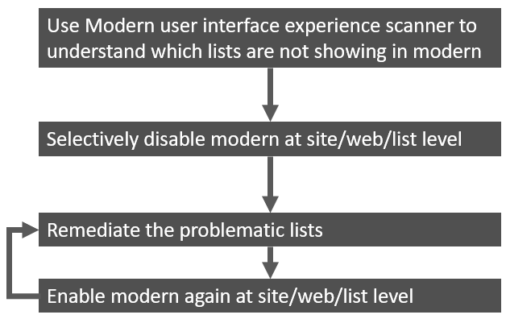
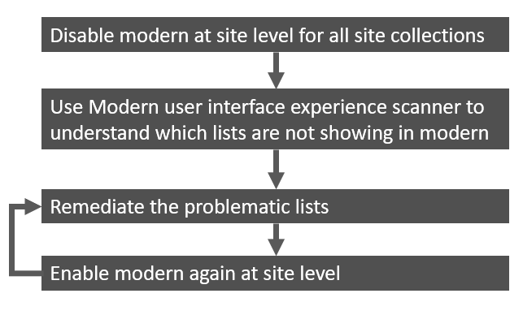

# Rollout approaches for the modern list and library experience

The modern list and library experience is enabled by default and for most customers this is a good model as that immediately brings the benefits of the modern list and library user interface. If you however want to more control of the rollout you can adopt one of the below described approaches.

## Approach 1: recommended, the default approach

In this approach, run the [Microsoft 365 Assessment tool](assess-sharepoint-modernization.md) Classic assessment with the Lists component to understand which lists aren't ready for the modern experience. If a site contains multiple of these lists or if the users of a given site aren't yet ready for modern, you can selectively disable the modern experience for that site. This gives you time to remediate the lists or educate users before enabling the modern experience again.

## Approach 2: the "full control" approach

If you want to enable the modern list and library experience only after you've ensured that the lists and users are ready, you can opt for this "full control" approach. Start by disabling the modern list experience at the site collection level with the modern experience site-level blocking feature. While sites continue to use the classic list experience, run the [Microsoft 365 Assessment tool](assess-sharepoint-modernization.md) and remediate the affected lists. When the lists and users are ready, selectively disable the blocking feature in waves until all sites use the modern list and library experience.

