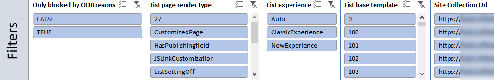
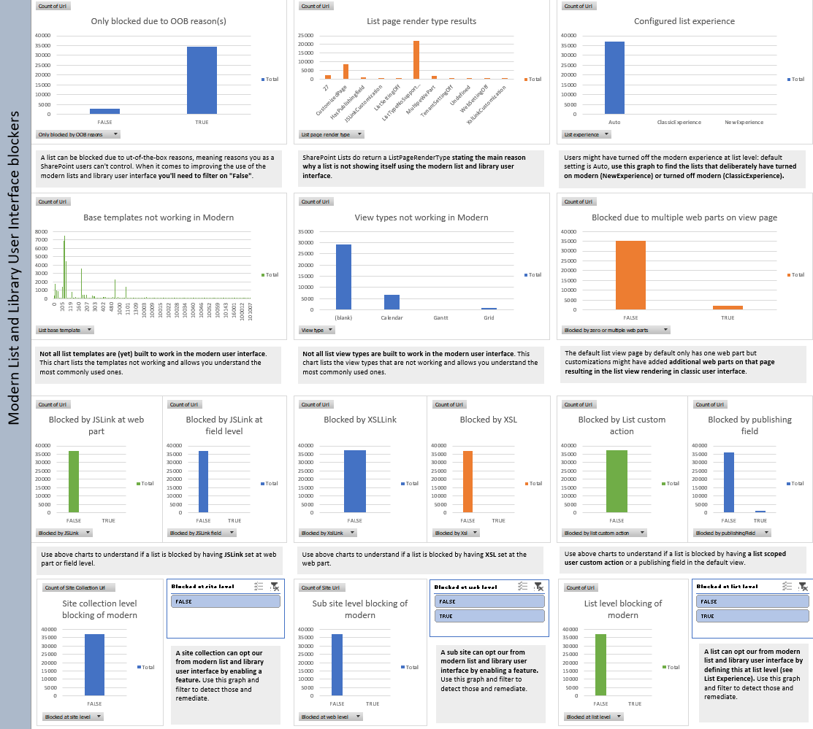
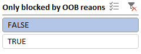
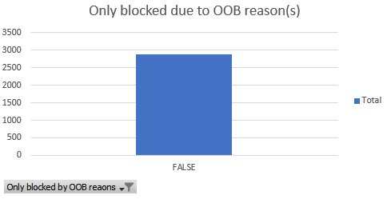
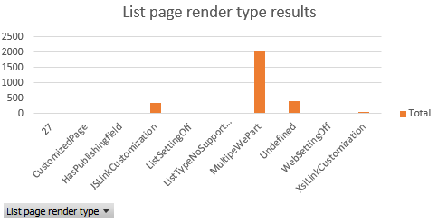

# Analyze and use the scanner data

To help you understand which lists are not ready to use the modern list and library user interface, you can use the  [SharePoint "Modern" user interface experience scanner](https://github.com/SharePoint/PnP-Tools/tree/master/Solutions/SharePoint.UIExperience.Scanner) to analyze your environment. Use this article to understand how you can use the scanner output to prepare your lists for getting the most out of the modern list and library experience. The scanner, as of version 1.6, will generate an Excel report plus several CSV files. It's recommended to use the Excel based dashboard to review the scanner data and when needed use the CSV data for more in depth data.

## Using the "Modern UI List readiness" report

The "Modern UI List readiness" report is an Excel based dashboard that allows you to make informed decisions on which lists are not yet rendering using the modern list and library user interface. For the lists that are not ready the dashboard will help you understand why a list is not ready. The dashboard has a number of slicers on top that you can use to filter the data:

The filtered data is then presented in a number of charts:

## Understand which sites you can "fix" to make them work using the modern list and library user interface

Apply the following filter and confirm the "Only blocked due OOB reason(s)" shows only FALSE. Lists are marked as blocked by OOB reason if their list template is not yet built to present itself using the modern user interface. See [List templates available in the modern user interface](https://docs.microsoft.com/en-us/sharepoint/dev/transform/modernize-userinterface-lists-and-libraries#list-templates-available-in-the-modern-user-interface) to get a complete list of list templates that are supported.

Filter | Validation
---------|----------
 | 

At this point you've filtered out all the lists which are **not only** blocked due to an OOB reason, meaning a list can be blocked by multiple reasons. For example a list can be blocked due to JSLink usage and due to an not supported list template.

With this filter applied the next step is reviewing the "List page render type results":

The render type results indicate the **key** reason why a list is not rendering in modern. Common reasons and their remediation are:

List page render type | Remediation steps
---------|----------
**MultipeWebPart** | Lists are not showing up in modern because on their default view page there’s more than one web part. By default a list view page has only one XSLTListView web part. To remediate this you need to ensure there’s only the default XSLTListView web part on the list default view page (AllItems.aspx). You can programmatically do this using the LimitedWebPartManager API’s.
**JSLinkCustomization** | List are not showing up in modern because they’re using JSLink to customize the list rendering. To remediate this you need to remove the JSLink customization at web part level. JSLink at field level is not blocking the list be is ignored in the modern experience. See the [Modernize customizations](https://docs.microsoft.com/en-us/sharepoint/dev/transform/modernize-customizations) article for guidance on how to build modern alternatives. Also note that you can use the additional data like the base template chart to get a view on which list templates use JSLink and use the JSLink graphs to understand whether it's JSLink defined at web part or field level.
**XslLinkCustomization** | Lists are not showing up in modern because they’re using XslLink to customize the list rendering. To remediate this you need to remove the XslLink customizations. See the [Modernize customizations](https://docs.microsoft.com/en-us/sharepoint/dev/transform/modernize-customizations) article for guidance on how to build modern alternatives.
**WebSettingsOff** or **SiteSettingsOff** | Lists are not showing up in modern because at web or site level modern list rendering has been disabled. To remediate this you need to disable the site or web level modern list and library blocking feature. See the [Maximize use of modern lists and libraries](https://docs.microsoft.com/en-us/sharepoint/dev/transform/modernize-userinterface-lists-and-libraries) article to learn more.
**ListSettingsOff** | Lists are not showing up in modern because modern was disabled at list level. To remediate this you need to set the list experience to Auto or NewExperience. See the [Maximize use of modern lists and libraries](https://docs.microsoft.com/en-us/sharepoint/dev/transform/modernize-userinterface-lists-and-libraries) article to learn more.
