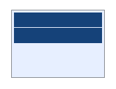
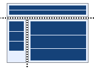
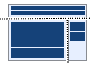
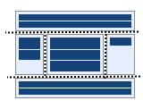
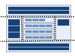
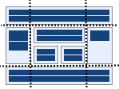
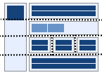
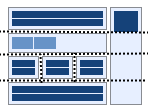

# Understanding the layout transformation

Each source page that gets transformed does have a certain layout, typically one of the predefined layouts offered out-of-the-box by SharePoint. When a page is transformed to a modern page the modern page will take over the layout of the source page. The target modern pages do have different layout capabilities, hence it's important to understand how the source page layout is mapped to the target page layout.

## Web Part page layout mapping

Source page layout|Target page layout
:-----|:----------
|1 column row
|1 column row + 2 column row left
|1 column row + 2 column row right
|1 column row + 3 column row + 1 column row
|1 column row + 3 column row + 1 column row
|1 column row + 3 column row + 1 column row
|1 column row + 1 column row + 3 column row + 1 column row
|1 column row + 1 column row + 3 column row + 1 column row

## Wiki page layout mapping

Source page layout|Target page layout
:-----|:----------
|1 column row
|2 column row
|2 column row left
|1 column row + 2 column row
|1 column row + 2 column row + 1 column row
|3 column row
|1 column row + 3 column row
|1 column row + 3 column row + 1 column row

## Overriding the default layout transformation

If for some reason you want to transform layouts differently then you can plug in your own layout transformation component as is shown in below snippet:

```Csharp
public class MyLayout : ILayoutTransformator
{
  private ClientSidePage page;

  public MyLayout(ClientSidePage page)
  {
    this.page = page;
  }

  public void Transform(PageLayout layout)
  {
    // custom layout transformation...add sections to the target page based upon the recieved page layout
    switch (layout)
    {
        case PageLayout.Wiki_OneColumn:
        case PageLayout.WebPart_FullPageVertical:
        case PageLayout.Wiki_Custom:
        case PageLayout.WebPart_Custom:
            {
                page.AddSection(CanvasSectionTemplate.OneColumn, 1);
                return;
            }
        // add more incoming layouts...
        default:
            {
                page.AddSection(CanvasSectionTemplate.OneColumn, 1);
                return;
            }
    }
  }
}

ILayoutTransformator layoutOverride(ClientSidePage cp)
{
    return new MyLayout();
}

// Now use the custom layout transformator
PageTransformationInformation pti = new PageTransformationInformation(page)
{
    // If target page exists, then overwrite it
    Overwrite = true,
    // Callout to your custom layout handler
    LayoutTransformatorOverride = layoutOverride,
};

// Transform the page using the custom layout handled hooked up
pageTransformator.Transform(pti);

```
