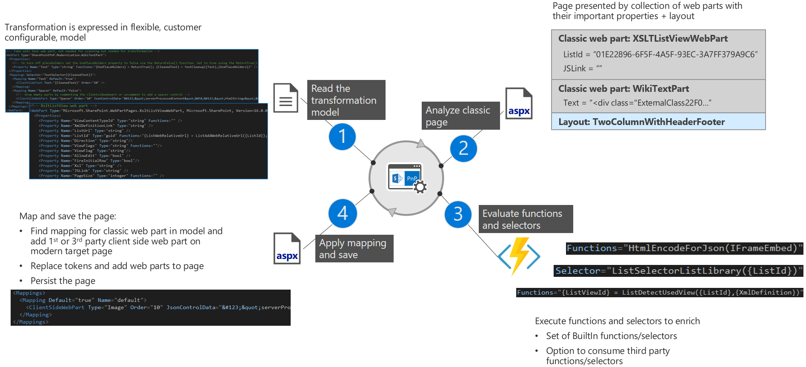

# Transform classic pages to modern client-side pages

Classic SharePoint sites typically have classic pages being wiki pages or web part pages and these pages cannot present themselves using a modern user interface. A classic site however can host modern client side pages and this is the solution here. After you've maximized the use of the modern list and library user interface and connected your site to an Office 365 Group transforming the pages to modern client side pages is the last task to fully transform your classic site into a modern group connected site.

The SharePoint PnP Modernization framework ([Nuget](https://www.nuget.org/packages/SharePointPnPModernizationOnline), [source code](https://github.com/SharePoint/PnP-Tools/tree/master/Solutions/SharePoint.Modernization/SharePointPnP.Modernization.Framework)) does bring page transformation capabilities which will be explained in the upcoming chapters.

> [!IMPORTANT]
> The SharePoint PnP Modernization framework is currently in preview. If you encounter problems please file an issue in the [PnP Tools GitHub issue list](https://github.com/SharePoint/PnP-Tools/issues).

## Overview of the page transformation solution

Below picture explains the page transformation in 4 steps:

1. At the start you need to tell the transformation engine how you want to transform pages and that's done by providing a page transformation model. This model is an XML file which describes how each classic web part needs to be mapped to a modern equivalent. Per classic web part the model contains a list of relevant properties and mapping information. See the [Understanding and configuring the page transformation model](modernize-userinterface-site-pages-model.md) article to learn more.
2. Next step is analyzing the page you want to transform: the transformation engine will break down the page in a collection of web parts (wiki text is broken down in one or more wiki text web parts) and it will try to detect the used layout.
3. The information retrieved from the analysis in step 2 is often not sufficient to map the web part to a modern equivalent and therefor in step 3 we'll enhance the information by calling functions: these functions take properties retrieved in step 2 and generate new properties based upon the inputted properties from step 2. After step 3 we have all the needed information to map the web part...except we optionally need to call the defined selector to understand which mapping we'll need in case one classic web part can be mapped to multiple client side configurations.
4. The final step is creating and configuring the client side page followed by adding the mapped modern client side web parts to it.



## Quick start to page transformation for .Net developers

The page transformation engine is built using .Net and is distributed as a [nuget](https://www.nuget.org/packages/SharePointPnPModernizationOnline) package. Once you've added the nuget package you'll see that 2 additional files are added to your solution:


The `webpartmapping.xml` and `webpartmapping_latestfrompackage.xml` represent the transformation model that describes how the transformation will happen. You typically will tweak the `webpartmapping.xml` file to your needs by for example adding additional mappings to your own web parts. If you later on install an updated version of the nuget package your `webpartmapping.xml` will not be overwritten by default but the `webpartmapping_latestfrompackage.xml` will be. You can use this latter file to compare the latest out-the-box mapping with your mapping and take over the changes you need.

With the mapping file in place you now can use below snippet (coming from the [Modernization.PageTransformation sample on GitHub](https://github.com/SharePoint/PnP/tree/dev/Samples/Modernization.PageTransformation)) to transform all the pages in a given site:

```csharp
string siteUrl = "https://contoso.sharepoint.com/sites/mytestsite";
string userName = "joe@contoso.onmicrosoft.com";
AuthenticationManager am = new AuthenticationManager();
using (var cc = am.GetSharePointOnlineAuthenticatedContextTenant(siteUrl, userName, GetSecureString("Password")))
{
    var pageTransformator = new PageTransformator(cc);
    var pages = cc.Web.GetPages();
    foreach (var page in pages)
    {
        PageTransformationInformation pti = new PageTransformationInformation(page)
        {
            // If target page exists, then overwrite it
            Overwrite = true,
        };

        try
        {
            Console.WriteLine($"Transforming page {page.FieldValues["FileLeafRef"]}");
            pageTransformator.Transform(pti);
        }
        catch(ArgumentException ex)
        {
            Console.WriteLine($"Page {page.FieldValues["FileLeafRef"]} could not be transformed: {ex.Message}");
        }
    }
}
```

## See also

- [Modernize your classic SharePoint sites](modernize-classic-sites.md)
- [Modernization.PageTransformation sample on GitHub](https://github.com/SharePoint/PnP/tree/dev/Samples/Modernization.PageTransformation)
- [YouTube recording from May 3rd SIG call containing a page transformation demo](https://youtu.be/Uf2f8ISBpVg?t=15m31s)
- [Understanding and configuring the page transformation model](modernize-userinterface-site-pages-model.md)
