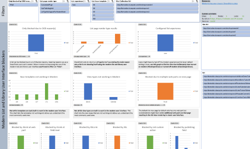
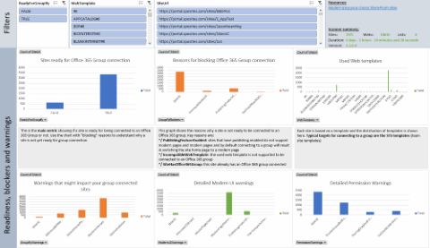

# Modernize the user interface

One of the immediately visible elements of a modern team site or communication site is its modern user interface, as evidenced on its home page and lists and libraries pages. 

But what if your site today still has lists and libraries, wiki pages, or web part pages that use the classic user interface?

To make the switch to a modern user interface, you need to focus on the following:
 
- Transitioning your **lists and libraries** to use the modern user interface (also referred to as the modern list and library experience)
- Transforming your **site pages** from classic wiki and web part pages into modern client-side pages

> [!IMPORTANT]
> The "classic" experience is not being deprecated; both "classic" and "modern" will coexist.

Where do you start when you want to modernize the user interface of your sites? What sites should be modernized first? These are very relevant questions, and are addressed in the following steps.

## Step 1: Identify and educate stakeholders

Before embarking on this modernization journey, it's important that the following stakeholders become familiar with the SharePoint modern user interface.

- **Key business stakeholders** - The modern user interface must meet the needs of the business user, and the key business stakeholders should be advocates of this change. Granting them access to a playground environment and closely working with them will help them understand what works well and what doesn't. Later on, these key business stakeholders will play a crucial role in helping your end users adopt the modern user interface.
- **Customization team and developers** - Because customizations built in the past may no longer work in the modern user interface, this team needs to be available to redesign those customizations.
- **SharePoint administrators** -  The admins will be the ones that enable the modern user interface across your tenant and its sites.
- **Change management and governance teams** - If these teams exist in your organization, they should be looped in as well because switching from the classic user interface to the modern user interface impacts change for users, and might require an update of internal training materials.

With the right teams looped in and educated, you can continue to the next step.

## Step 2: Analyze your site collections

Your tenant might contain thousands of site collections, so which of these site collections are good candidates to modernize and which aren't? To help you understand the readiness of your existing sites, Microsoft has built the following scanners:

- **SharePoint "Modern" user interface experience scanner** - The [SharePoint "Modern" user interface experience scanner](https://github.com/SharePoint/PnP-Tools/tree/master/Solutions/SharePoint.UIExperience.Scanner) helps you get a deep understanding of the modern user interface compatibility of your lists and libraries. If your focus is to **transform your lists and libraries** to use the modern user interface, use this scanner.

  Certain lists and libraries cannot be shown when using a modern user interface due to reasons such as:

  - A list has columns that are not compatible with the modern user interface.
  - A list uses customizations (for example, JSLink) that are not compatible.
  - A list template (for example, an events list) is not yet built to work in the modern user interface.

- **SharePoint Modernization scanner** - The [SharePoint Modernization scanner](https://github.com/SharePoint/PnP-Tools/tree/master/Solutions/SharePoint.Modernization) provides a detailed analysis of your site's readiness for connecting to an Office 365 group combined with a detailed analysis of the wiki and web part pages in your environment to prepare you for a page modernization. These outcomes can be used initially to drive remediation work, followed later on by migration work. If your focus is to **transform your site pages**, to **connect your sites to an Office 365 group** then use this scanner.

Office 365 Group connection readiness | Page transformation readiness
---------|----------
 | 

## Step 3: Modernize your site collections

After you analyze the sites that you want to modernize, you can continue with the actual modernization, which contains one or more of the following components:

- **Replace incompatible customizations with equivalents that work in a modern user interface**. Following are some samples. For more information, see [Modernize customizations](modernize-customizations.md).

  - Replace JSLink with a [column formatter](../declarative-customization/column-formatting.md) or with a [SharePoint Framework Field Customizer extension](../spfx/extensions/get-started/building-simple-field-customizer.md).
  - Replace existing first-party web parts with [SharePoint Framework client-side web parts](../spfx/web-parts/overview-client-side-web-parts.md) in case there's no out-of-the-box client-side web part available that provides similar capabilities.
  - Replace JavaScript embedding via user custom actions with a [SharePoint Framework Application Customizer extension](../spfx/extensions/get-started/build-a-hello-world-extension.md).
  - Replace list commands (user custom actions) with [SharePoint Framework ListView Command Set extensions](../spfx/extensions/get-started/building-simple-cmdset-with-dialog-api.md).

- Modernize your user experience by:

  - **[Enabling lists and libraries to show in the modern user interface](modernize-userinterface-lists-and-libraries.md)** by replacing customizations, removing incompatible columns from the used views, or (as a last resort) moving data into a modern user interface-compatible list type.
  - **[Connecting your site to an Office 365 group](modernize-connect-to-office365-group.md)**, which gives your site a modern home page and enables your site to use, for example, a mailbox or Microsoft Planner, which then enables you to use a modern version of a calendar and task list.
  - **[Creating modern client-side pages](modernize-classic-sites.md)** and configuring these to be "similar" to your key classic wiki and web part pages. Programmatic page transformation should be done for the key pages of your sites; transforming all pages is resource-intensive and often not needed. To assist in this triage, the SharePoint Modernization scanner can give you usage information about the current wiki and web part pages.

- **Communicate to your end users about the completed changes**; the site will work differently in a modern version, so your users need to be aware of that.

## See also

- [Modernize your classic SharePoint sites](modernize-classic-sites.md)
- [Maximize use of modern lists and libraries](modernize-userinterface-lists-and-libraries.md)
- [Transform classic pages to modern client-side pages](modernize-userinterface-site-pages.md)
- [Connecting your site to an Office 365 group](modernize-connect-to-office365-group.md)
